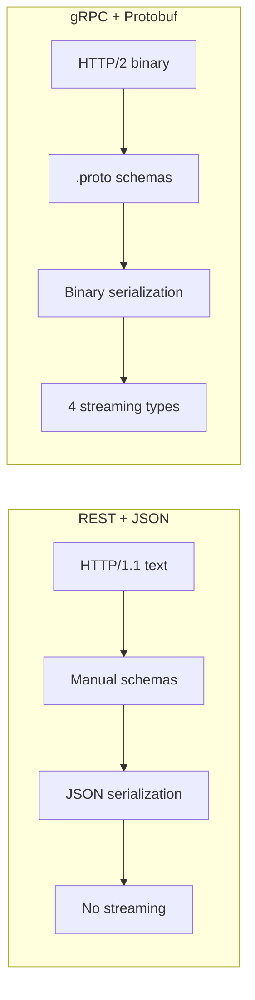
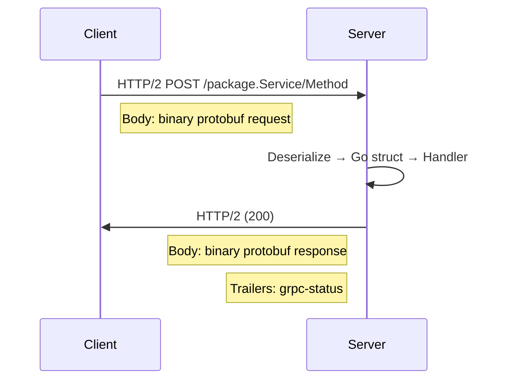

# gRPC and Protocol Buffers: Introduction

When your backend has a single service talking to one database, `net/http` does the job. But the moment you need Service A to talk to Service B, and Service B to talk to Service C, HTTP+JSON starts showing its age: you are manually writing clients, parsing ambiguous error codes, and debating whether `"status": "active"` means `"1"` or `"true"` on the other end.

gRPC solves this with two core ideas:

1. **Protocol Buffers** -- a binary serialization format that gives you strongly-typed messages with schema enforcement.
2. **gRPC** -- a high-performance RPC framework that runs on HTTP/2 and uses those messages.

Together, they give you what REST+JSON cannot: compile-time type safety between services, efficient binary transport, first-class streaming, and auto-generated client/server code from a single schema definition.

---

> 💡 **Pro tip:** The single most important takeaway here: the `.proto` file is the *source of truth*. Both services generate code from it, so a breaking schema change surfaces at compile time on the other service -- not at 3 AM in production.

---

## What Problem Does This Solve?

## What Problem Does This Solve?

Consider two Go services sharing user data over HTTP+JSON:

```go
// Service A (the user service)
type User struct {
    ID    int    `json:"id"`
    Name  string `json:"name"`
    Email string `json:"email"`
}

func getUser(w http.ResponseWriter, r *http.Request) {
    user := User{ID: 42, Name: "Alice", Email: "alice@example.com"}
    json.NewEncoder(w).Encode(user)
}
```

```go
// Service B (the order service)
type OrderUser struct {
    ID       int    `json:"id"`
    Username string `json:"name"` // different field name!
    Email    string `json:"email"`
}

func fetchUser(id int) (*OrderUser, error) {
    resp, _ := http.Get(fmt.Sprintf("http://users:8080/users/%d", id))
    var user OrderUser
    json.NewDecoder(resp.Body).Decode(&user)
    // Username is empty because the JSON key was "name", not "username"
    return &user, nil
}
```

There is no compile-time check that the struct definitions match. A field rename in one service silently breaks the other. With 20 microservices, this turns into a coordination nightmare.

With Protocol Buffers, you define the schema once:

```protobuf
syntax = "proto3";
package users;

message User {
    int32 id = 1;
    string name = 2;
    string email = 3;
}
```

Both services generate code from this single definition. If Service A renames `name` to `username`, Service B fails to compile -- not at 3 AM in production.

---

## gRPC vs REST: A Practical Comparison



| Aspect | REST + JSON | gRPC + Protobuf |
|---|---|---|
| Transport | HTTP/1.1 (text) | HTTP/2 (binary) |
| Schema | Implicit (docs, structs) | Explicit (.proto files) |
| Code generation | Manual or tool-based | Automatic from .proto |
| Serialization | Text (JSON) | Binary (Protobuf) |
| Streaming | Not built-in | First-class (4 types) |
| Browser support | Native | Via gRPC-Web proxy |
| Debugging | curl, browser | Requires tools (grpcurl) |
| Complexity | Low to start | Higher initial setup |

gRPC is **not** a replacement for REST. Use gRPC for internal service-to-service communication where performance, type safety, and streaming matter. Use REST (or GraphQL) for public APIs where browser clients, curl debugging, and simplicity matter.

---

> 🧠 **Think of it as:** gRPC for the machine-to-machine backbone of your system, REST/GraphQL for the human-facing front door. Different tools, different jobs -- they complement rather than replace each other.

---

## How gRPC Works Under the Hood

When you make a gRPC call, here is what happens:



Step by step:

1. The client serializes the request message to protobuf binary.
2. It sends an HTTP/2 POST to `/{package}.{Service}/{Method}`.
3. The server deserializes the binary into a strongly-typed Go struct.
4. The handler runs and serializes the response to binary.
5. The response travels back over HTTP/2 with gRPC status in trailers.

Everything runs over HTTP/2, which means multiplexed streams, header compression, and binary framing -- all things that make gRPC fast.

> 🔑 **Key idea:** gRPC's speed is not just "binary is smaller than JSON." It is HTTP/2 multiplexing multiple RPC streams over one connection, HPACK header compression, and a binary-wire format that needs no parsing overhead.

---

## Your First gRPC Call (Conceptual)

Here is a stripped-down view of what a complete gRPC interaction looks like in Go. We build this step by step in later articles.

**Proto definition** -- the source of truth:
```protobuf
syntax = "proto3";
package greeter;

service Greeter {
    rpc SayHello (HelloRequest) returns (HelloReply);
}

message HelloRequest {
    string name = 1;
}

message HelloReply {
    string message = 1;
}
```

**Generated Go code** (from `protoc` + plugins):
- `greeter.pb.go` -- message types (`HelloRequest`, `HelloReply`)
- `greeter_grpc.pb.go` -- client and server interfaces

**Server** -- implements the generated interface:
```go
type server struct {
    pb.UnimplementedGreeterServer
}

func (s *server) SayHello(ctx context.Context, req *pb.HelloRequest) (*pb.HelloReply, error) {
    return &pb.HelloReply{Message: "Hello " + req.GetName()}, nil
}
```

**Client** -- uses the generated client:
```go
conn, _ := grpc.NewClient("localhost:50051", grpc.WithTransportCredentials(insecure.NewCredentials()))
defer conn.Close()

client := pb.NewGreeterClient(conn)
resp, _ := client.SayHello(context.Background(), &pb.HelloRequest{Name: "World"})
fmt.Println(resp.Message) // "Hello World"
```

No HTTP handlers. No JSON marshaling. No manual client code. You define the interface once, and both sides get compile-time guarantees.

---

## When to Use gRPC

**Use gRPC when:**
- Services need to communicate frequently with low latency
- You need streaming (real-time data, large file transfers)
- You want strict contract enforcement between teams
- You are building a polyglot system (gRPC supports 10+ languages)

**Do not use gRPC when:**
- Your API must be consumed by browsers directly
- You need simple debugging with curl or browser devtools
- Your team is small and the overhead of protobuf tooling is not justified
- You are building a simple CRUD API with no inter-service communication

---

## Modern Practices

- **Start with `buf`**, not raw `protoc`. It handles linting, breaking change detection, and dependency management out of the box (see [Code Generation](03-code-generation.md)).
- **Use `grpc.NewClient`** (not the deprecated `grpc.Dial`) for creating client connections in modern Go gRPC.
- **Adopt a mesh gradually**. Start with DNS-based discovery; add a service mesh (Istio, Linkerd) only when the operational complexity is justified.
- **Combine gRPC with gRPC-Gateway** to serve REST/JSON to external clients while keeping gRPC for internal service-to-service communication.
- **Always use `go_package`** in `.proto` files and commit generated code so consumers do not need `protoc` installed.

---

## Common Mistakes

| Mistake | Why It Hurts | Fix |
|---|---|---|
| Using gRPC for public browser APIs | No native browser support; requires gRPC-Web proxy | Use REST/GraphQL for public APIs |
| Adopting gRPC for a small team project | Tooling overhead not justified | Start with REST; migrate when needed |
| Ignoring the learning curve | Teams waste time debugging protobuf encoding issues | Invest in training before adoption |
| Treating gRPC as a drop-in REST replacement | Different mental model (contracts, streaming, error codes) | Adopt intentionally with clear use cases |
| Not using an API gateway | External clients cannot consume gRPC directly | Use gRPC-Gateway or Envoy for translation |

---

## Exercises

1. Write a `.proto` file defining a `Greeter` service with a single `SayHello` RPC. Include `HelloRequest` (name) and `HelloReply` (message). Then hand-write the equivalent Go server and client code without code generation -- compare the effort.

2. Create a benchmark: time 1,000 HTTP+JSON calls vs 1,000 gRPC+protobuf calls between two local services. Measure latency and throughput. (You will need the gRPC service running -- we build this in later articles.)

3. Design a microservice architecture for an e-commerce system. Identify which services should communicate via gRPC (internal, high-throughput) and which should expose REST (public, browser-facing). Draw the dependency graph.

---

## Key Takeaways

- gRPC uses Protocol Buffers for binary serialization and HTTP/2 for transport
- The `.proto` file is your single source of truth for service contracts
- Code generation produces type-safe clients and servers in multiple languages
- gRPC excels at internal service-to-service communication
- REST remains the right choice for public, browser-facing APIs
- gRPC is not a universal replacement -- use it where performance, type safety, and streaming matter

---

## Next

[Protocol Buffers in Depth](02-protocol-buffers.md) -- `.proto` syntax, field numbers, wire types, enums, oneofs, maps, and schema evolution.
