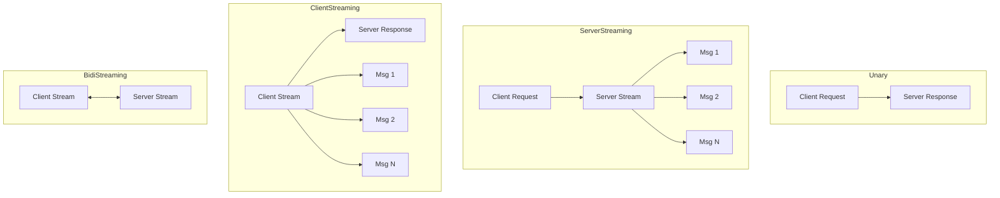

# gRPC Streaming

Unary RPCs are request-response: one message in, one message out. Streaming RPCs break this model -- a client can send a stream of messages, a server can send a stream of messages, or both can stream simultaneously. This is gRPC's most powerful feature over REST.

---

## Four Streaming Patterns



```protobuf
service FileService {
    // Unary: one request, one response
    rpc GetFile (GetFileRequest) returns (FileContent);

    // Server streaming: one request, many responses
    rpc WatchFiles (WatchRequest) returns (stream FileEvent);

    // Client streaming: many requests, one response
    rpc UploadFile (stream FileChunk) returns (UploadResponse);

    // Bidirectional streaming: many requests, many responses
    rpc Chat (stream ChatMessage) returns (stream ChatMessage);
}
```

Each pattern solves a different problem. Let us build all four.

> 🔑 **Key idea:** Match the stream shape to the data flow: unary for simple request/reply, server-streaming when one question has many answers, client-streaming when many parts assemble into one result (uploads, batch jobs), bidi when both sides interact continuously (chat, live collaboration).

---

## Server Streaming: Real-Time Event Feed

Server streaming is the most common pattern. The client sends one request; the server sends back a stream of updates. Use cases: live feeds, log tailing, progress updates, change notifications.

### Proto Definition

```protobuf
syntax = "proto3";
package events.v1;

service EventService {
    rpc WatchEvents (WatchEventsRequest) returns (stream Event);
}

message WatchEventsRequest {
    string topic = 1;
}

message Event {
    int64 id = 1;
    string type = 2;
    string data = 3;
    int64 timestamp = 4;
}
```

### Server Implementation

```go
type eventServer struct {
    pb.UnimplementedEventServiceServer
}

func (s *eventServer) WatchEvents(req *pb.WatchEventsRequest, stream pb.EventService_WatchEventsServer) error {
    ctx := stream.Context()

    // Simulate a live event feed
    ticker := time.NewTicker(1 * time.Second)
    defer ticker.Stop()

    var eventID int64
    for {
        select {
        case <-ctx.Done():
            // Client disconnected -- stop sending
            return nil

        case <-ticker.C:
            eventID++
            event := &pb.Event{
                Id:        eventID,
                Type:      "data_point",
                Data:      fmt.Sprintf("measurement %d", eventID),
                Timestamp: time.Now().Unix(),
            }

            if err := stream.Send(event); err != nil {
                // Client disconnected or send failed
                log.Printf("send error: %v", err)
                return err
            }
        }
    }
}
```

Key details:

1. **`stream.Context()`** -- use this to detect client disconnection. The context is canceled when the client disconnects.
2. **`stream.Send()`** -- sends one message at a time on the stream.
3. **Return `nil`** for clean disconnection; return an error to send a specific gRPC status code.

### Client Implementation

```go
func watchEvents(client pb.EventServiceClient) {
    ctx, cancel := context.WithTimeout(context.Background(), 30*time.Second)
    defer cancel()

    stream, err := client.WatchEvents(ctx, &pb.WatchEventsRequest{Topic: "orders"})
    if err != nil {
        log.Fatalf("failed to open stream: %v", err)
    }

    for {
        event, err := stream.Recv()
        if err == io.EOF {
            // Stream closed cleanly by server
            log.Println("stream ended")
            return
        }
        if err != nil {
            // Error -- could be canceled, deadline exceeded, or server error
            st, _ := status.FromError(err)
            log.Printf("stream error: code=%s message=%s", st.Code(), st.Message())
            return
        }

        log.Printf("Event #%d: %s -- %s", event.GetId(), event.GetType(), event.GetData())
    }
}
```

> ⚠️ **Gotcha:** `io.EOF` from `stream.Recv()` is not a failure -- it is the polite signal that the sender closed the stream. A client that treats it as an error logs false positives on every clean shutdown; always check `err == io.EOF` first.

### Client Cancellation

```go
ctx, cancel := context.WithCancel(context.Background())

stream, _ := client.WatchEvents(ctx, &pb.WatchEventsRequest{Topic: "orders"})

go func() {
    // Stop after receiving 10 events
    for i := 0; i < 10; i++ {
        event, _ := stream.Recv()
        log.Printf("Event: %s", event.GetData())
    }
    cancel()  // triggers server-side context cancellation
}()

// Or cancel on a signal
sigCh := make(chan os.Signal, 1)
signal.Notify(sigCh, syscall.SIGINT)
<-sigCh
cancel()
```

---

## Client Streaming: File Upload

Client streaming lets the client send a stream of messages and the server responds once when the stream ends. Use cases: file uploads, batch processing, log ingestion.

### Proto Definition

```protobuf
service UploadService {
    rpc UploadFile (stream FileChunk) returns (UploadResponse);
}

message FileChunk {
    bytes data = 1;
    string filename = 2;
    int64 chunk_number = 3;
}

message UploadResponse {
    int64 total_bytes = 1;
    string checksum = 2;
}
```

### Server Implementation

```go
func (s *uploadServer) UploadFile(stream pb.UploadService_UploadFileServer) error {
    var totalBytes int64
    var filename string
    hasher := sha256.New()

    for {
        chunk, err := stream.Recv()
        if err == io.EOF {
            // Client finished sending -- send the response
            return stream.SendAndClose(&pb.UploadResponse{
                TotalBytes: totalBytes,
                Checksum:   hex.EncodeToString(hasher.Sum(nil)),
            })
        }
        if err != nil {
            return err
        }

        filename = chunk.GetFilename()
        totalBytes += int64(len(chunk.GetData()))
        hasher.Write(chunk.GetData())

        log.Printf("received chunk %d: %d bytes", chunk.GetChunkNumber(), len(chunk.GetData()))
    }
}
```

### Client Implementation

```go
func uploadFile(client pb.UploadServiceClient, filePath string) error {
    file, err := os.Open(filePath)
    if err != nil {
        return err
    }
    defer file.Close()

    stream, err := client.UploadFile(context.Background())
    if err != nil {
        return err
    }

    buf := make([]byte, 64*1024) // 64 KB chunks
    var chunkNum int64

    for {
        n, readErr := file.Read(buf)
        if n > 0 {
            err = stream.Send(&pb.FileChunk{
                Data:        buf[:n],
                Filename:    filepath.Base(filePath),
                ChunkNumber: chunkNum,
            })
            if err != nil {
                return err
            }
            chunkNum++
        }
        if readErr == io.EOF {
            break
        }
        if readErr != nil {
            return readErr
        }
    }

    resp, err := stream.CloseAndRecv()
    if err != nil {
        return err
    }

    log.Printf("uploaded %d bytes, checksum: %s", resp.GetTotalBytes(), resp.GetChecksum())
    return nil
}
```

### Flow Control

gRPC's HTTP/2 transport provides built-in flow control. If the client sends faster than the server can process, the client's `Send()` will block until the server's buffer has room. You do not need to implement this yourself.

However, if you have very large chunks, consider the buffer size. The default max message size is 4 MB. To increase it:

```go
// Server
grpcServer := grpc.NewServer(
    grpc.MaxRecvMsgSize(50 * 1024 * 1024), // 50 MB
)

// Client
conn, _ := grpc.NewClient("localhost:50051",
    grpc.WithDefaultCallOptions(
        grpc.MaxCallRecvMsgSize(50 * 1024*1024),
    ),
)
```

> ⚠️ **Watch out:** The default max message size is a hard **4 MB** on both sides. Exceed it and the call fails with `ResourceExhausted` -- so configure `MaxRecvMsgSize`/`MaxSendMsgSize` symmetrically on server and client whenever payloads can grow past that.

---

## Bidirectional Streaming: Real-Time Chat

Bidirectional streaming lets both sides send and receive independently. Neither side needs to wait for the other. Use cases: chat, collaborative editing, real-time games.

### Proto Definition

```protobuf
service ChatService {
    rpc Chat (stream ChatMessage) returns (stream ChatMessage);
}

message ChatMessage {
    string user = 1;
    string text = 2;
    int64 timestamp = 3;
}
```

### Server Implementation

```go
type chatServer struct {
    pb.UnimplementedChatServiceServer
    rooms map[string][]pb.ChatService_ChatServer
    mu    sync.Mutex
}

func (s *chatServer) Chat(stream pb.ChatService_ChatServer) error {
    ctx := stream.Context()

    // Receive the first message to get the room
    firstMsg, err := stream.Recv()
    if err != nil {
        return err
    }

    room := firstMsg.GetUser()  // use username as "room" for simplicity

    // Register this stream
    s.mu.Lock()
    s.rooms[room] = append(s.rooms[room], stream)
    s.mu.Unlock()

    // Cleanup on disconnect
    defer func() {
        s.mu.Lock()
        defer s.mu.Unlock()
        streams := s.rooms[room]
        for i, s2 := range streams {
            if s2 == stream {
                s.rooms[room] = append(streams[:i], streams[i+1:]...)
                break
            }
        }
    }()

    // Broadcast incoming messages to all streams in the room
    for {
        msg, err := stream.Recv()
        if err == io.EOF {
            return nil
        }
        if err != nil {
            return err
        }

        msg.Timestamp = time.Now().Unix()

        s.mu.Lock()
        recipients := make([]pb.ChatService_ChatServer, len(s.rooms[room]))
        copy(recipients, s.rooms[room])
        s.mu.Unlock()

        for _, recipient := range recipients {
            if sendErr := recipient.Send(msg); sendErr != nil {
                log.Printf("send error: %v", sendErr)
            }
        }
    }
}
```

### Client Implementation

```go
func chatWithServer(client pb.ChatServiceClient, username string) error {
    ctx := context.Background()
    stream, err := client.Chat(ctx)
    if err != nil {
        return err
    }

    // Send a join message
    stream.Send(&pb.ChatMessage{User: username, Text: username + " joined"})

    // Read from server in a goroutine
    go func() {
        for {
            msg, err := stream.Recv()
            if err != nil {
                log.Printf("recv error: %v", err)
                return
            }
            log.Printf("[%s] %s", msg.GetUser(), msg.GetText())
        }
    }()

    // Read from stdin and send to server
    scanner := bufio.NewScanner(os.Stdin)
    for scanner.Scan() {
        text := scanner.Text()
        if text == "/quit" {
            break
        }
        err := stream.Send(&pb.ChatMessage{
            User: username,
            Text: text,
        })
        if err != nil {
            return err
        }
    }

    return stream.CloseSend()
}
```

> 🧠 **Memory aid:** `CloseSend()` is a "half-close" -- the client hangs up its own microphone but keeps its speaker on. The server's `Recv()` returns `io.EOF`, yet it can keep sending until it decides to end the stream.

---

## Stream Lifecycle

Understanding when streams start and end is critical:

```
Server Streaming:
  Client sends: [Request]
  Server sends: [Msg1] [Msg2] [Msg3] ... [EOF]
  Client calls: stream.Recv() -> io.EOF

Client Streaming:
  Client sends: [Msg1] [Msg2] [Msg3] [CloseSend]
  Server calls: stream.Recv() -> io.EOF
  Server sends: [Response]
  Client calls: stream.CloseAndRecv() -> [Response]

Bidirectional:
  Both sides send independently
  Client calls stream.CloseSend() -> server's Recv() returns io.EOF
  Server returns -> client's Recv() returns io.EOF
```

### CloseSend

`CloseSend()` signals to the server that the client will not send any more messages. After calling it:

```go
// Client
stream.Send(&pb.ChatMessage{User: "alice", Text: "hello"})
stream.CloseSend()  // signals end of client stream

// Server's stream.Recv() will eventually return io.EOF
```

The server can still send messages after `CloseSend()`. This is useful for server streaming where the client knows it will not send more data.

### Graceful Stream Termination

```go
// Server: clean shutdown with active streams
func (s *server) GracefulStop() {
    // Signal all active streams to stop
    close(s.stopCh)

    // Wait for streams to finish (with timeout)
    ctx, cancel := context.WithTimeout(context.Background(), 10*time.Second)
    defer cancel()

    done := make(chan struct{})
    go func() {
        s.grpcServer.GracefulStop()
        close(done)
    }()

    select {
    case <-done:
        log.Println("stopped gracefully")
    case <-ctx.Done():
        log.Println("forcing stop")
        s.grpcServer.Stop()
    }
}
```

---

## Stream Error Handling

Errors on streams are different from unary RPCs. Once a stream is established, errors can happen at any point during message exchange.

```go
// Server-side stream with error handling
func (s *server) WatchData(req *pb.WatchRequest, stream pb.Service_WatchDataServer) error {
    // Validate the request first
    if req.GetTopic() == "" {
        return status.Error(codes.InvalidArgument, "topic is required")
    }

    // Set up the stream
    ch, err := s.subscribe(req.GetTopic())
    if err != nil {
        return status.Errorf(codes.Internal, "failed to subscribe: %v", err)
    }

    // Stream data
    for data := range ch {
        if err := stream.Send(data); err != nil {
            // Determine if this is a client disconnect or a real error
            if stream.Context().Err() != nil {
                // Client disconnected
                return nil
            }
            return status.Errorf(codes.Internal, "send failed: %v", err)
        }
    }

    return nil
}
```

> 🔑 **Remember:** A failing `Send()` in a stream is ambiguous -- it could be a network fault *or* the client hanging up. Check `stream.Context().Err()` to tell the difference; a canceled context means "client left, stop quietly," not "server error."

---

## Modern Practices

- **Always check `stream.Context().Done()`** in server streaming loops to detect client disconnection promptly and avoid wasted work.
- **Handle `io.EOF` as a clean stream end**, not an error. It is the expected signal that the sender is done.
- **Use `CloseSend()` on client streaming and bidi streams** to signal end-of-input to the server. Without it, the server waits indefinitely.
- **Set `MaxRecvMsgSize` / `MaxSendMsgSize`** on both server and client when dealing with large payloads (default is 4 MB).
- **Use `stream.SendAndClose()`** on client streaming servers -- it sends the response and closes the send side atomically.
- **Prefer server streaming over polling** for real-time data delivery. It is more efficient and lower latency than periodic HTTP requests.

---

## Common Mistakes

| Mistake | Why It Hurts | Fix |
|---|---|---|
| Treating `io.EOF` as an error | Logs false positives, confuses monitoring | Check `err == io.EOF` separately |
| Not calling `CloseSend()` | Server waits forever for more messages | Always call when client is done sending |
| Blocking on `Send()` without context check | Hangs if client is slow/disconnected | Check `stream.Context().Done()` before send |
| Forgetting `stream.Context()` cancellation | Server keeps working after client disconnects | Always respect context cancellation |
| Not setting max message size | Large payloads silently fail | Configure `MaxRecvMsgSize` explicitly |
| Not cleaning up goroutines on stream end | Goroutine leaks accumulate | Use `defer` and context cancellation |

---

## Exercises

1. Build a server-sent events system: the server streams random temperature readings every second. The client prints them and disconnects after 10 readings. The server should detect the disconnection and log it.

2. Implement a file upload service using client streaming. The client reads a file in 64 KB chunks and sends them. The server computes a SHA-256 checksum and returns it. Test with a 10 MB file.

3. Build a simple chat server using bidirectional streaming. Multiple clients can connect to different "rooms." Messages sent to a room are broadcast to all clients in that room.

---

## Key Takeaways

- Server streaming: one request, stream of responses -- use for live feeds and notifications
- Client streaming: stream of requests, one response -- use for uploads and batch processing
- Bidirectional: both sides stream independently -- use for chat and real-time interaction
- Always check `stream.Context().Done()` to detect client disconnection
- `io.EOF` on `Recv()` means clean end of stream, not an error
- `CloseSend()` tells the server the client is done sending
- gRPC handles HTTP/2 flow control automatically

---

## Next

[gRPC Interceptors, Middleware, and Production Patterns](06-grpc-interceptors-production.md) -- interceptors, auth, logging, metrics, retries, health checks, TLS, graceful shutdown, testing, and microservices patterns.
