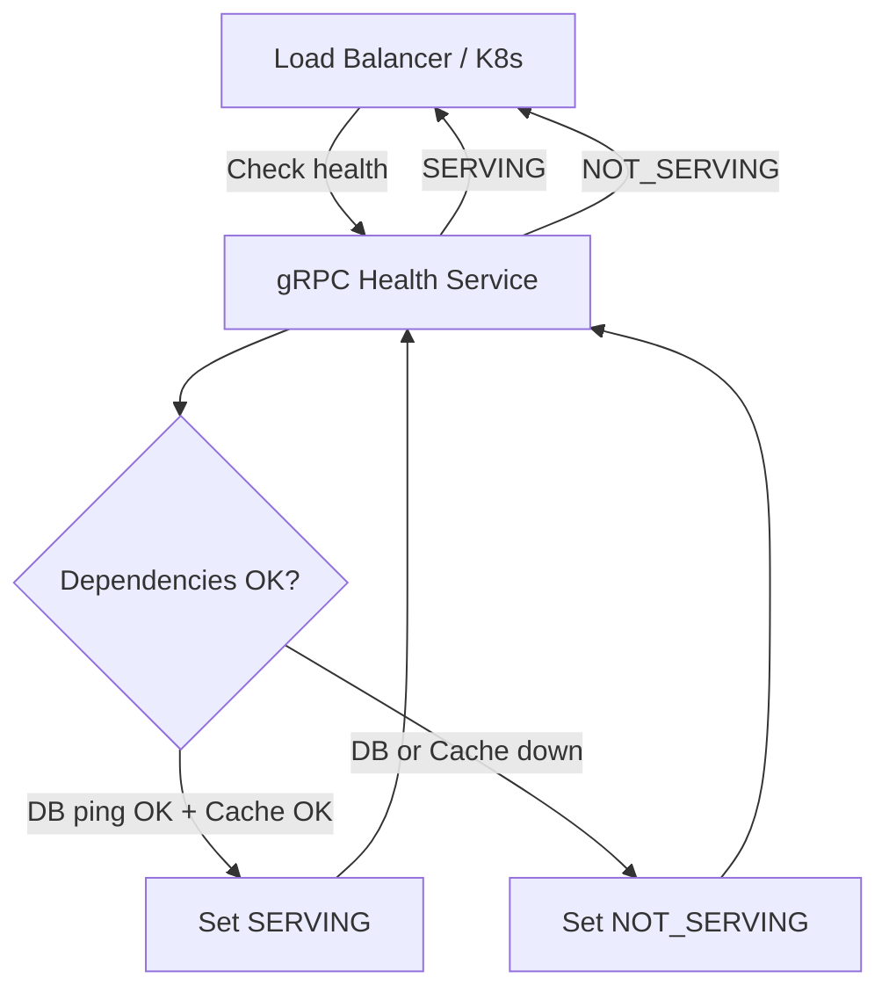
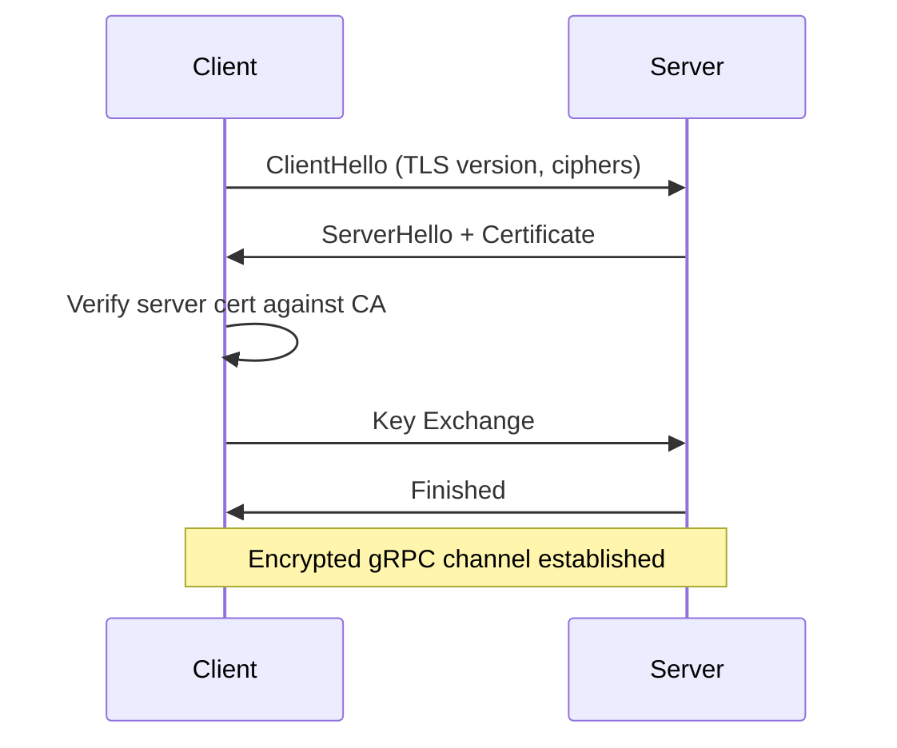
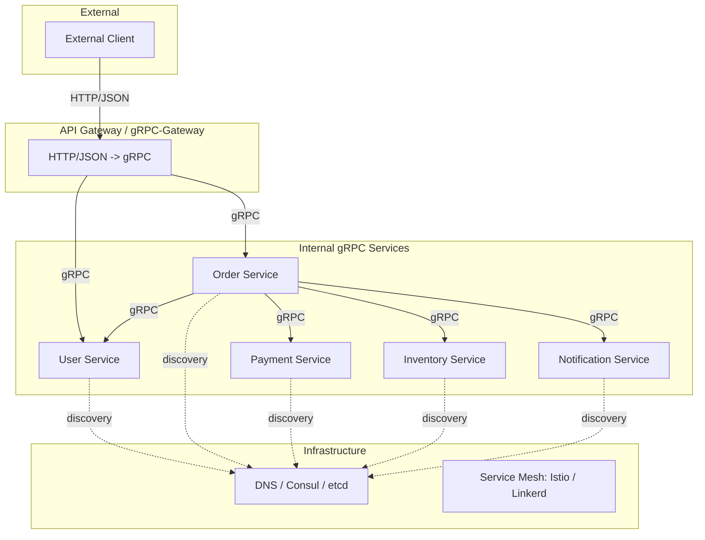

# gRPC Interceptors, Middleware, and Production Patterns

Interceptors are gRPC's middleware. They wrap every RPC call -- unary and streaming -- letting you add logging, authentication, metrics, retries, and more without touching your service logic. This article covers building interceptors, chaining them, health checks, TLS, graceful shutdown, testing, and the architectural patterns that keep a distributed system running reliably.

---

## What Interceptors Do


Interceptors run in order on the client side and in order on the server side. They can modify requests, responses, short-circuit calls, or run side effects.

> 🔑 **Key idea:** Interceptors are gRPC's middleware -- the one choke point every RPC passes through. Cross-cutting concerns (auth, logging, metrics, retries) live here so your business handlers stay pure and focused.

---

## Unary Interceptors

### Server-Side: Logging Interceptor

```go
import (
    "log"
    "time"

    "google.golang.org/grpc"
    "google.golang.org/grpc/metadata"
)

func loggingInterceptor(
    ctx context.Context,
    req interface{},
    info *grpc.UnaryServerInfo,
    handler grpc.UnaryHandler,
) (interface{}, error) {
    start := time.Now()

    // Extract metadata for request ID
    md, _ := metadata.FromIncomingContext(ctx)
    requestID := ""
    if ids := md.Get("x-request-id"); len(ids) > 0 {
        requestID = ids[0]
    }

    // Call the actual handler
    resp, err := handler(ctx, req)

    // Log the result
    duration := time.Since(start)
    statusCode := status.Code(err)
    log.Printf(
        "method=%s duration=%s status=%s request_id=%s",
        info.FullMethod,
        duration,
        statusCode,
        requestID,
    )

    return resp, err
}

// Register the interceptor
grpcServer := grpc.NewServer(
    grpc.UnaryInterceptor(loggingInterceptor),
)
```

### Server-Side: Authentication Interceptor

```go
func authInterceptor(
    ctx context.Context,
    req interface{},
    info *grpc.UnaryServerInfo,
    handler grpc.UnaryHandler,
) (interface{}, error) {
    // Skip auth for health checks
    if info.FullMethod == "/grpc.health.v1.Health/Check" {
        return handler(ctx, req)
    }

    md, ok := metadata.FromIncomingContext(ctx)
    if !ok {
        return nil, status.Error(codes.Unauthenticated, "missing metadata")
    }

    tokens := md.Get("authorization")
    if len(tokens) == 0 {
        return nil, status.Error(codes.Unauthenticated, "missing authorization token")
    }

    // Validate the token (simplified)
    userID, err := validateToken(tokens[0])
    if err != nil {
        return nil, status.Error(codes.Unauthenticated, "invalid token")
    }

    // Add user ID to context for handlers to use
    ctx = context.WithValue(ctx, userIDKey, userID)

    return handler(ctx, req)
}
```

> 🧠 **Think of it as:** an interceptor is a bouncer at a club door -- it can let the RPC through (`handler(ctx, req)`), turn it away (return a status error), skip the line entirely (short-circuit), or stamp the guest's hand (attach values to `ctx` for downstream handlers).

### Client-Side: Retry Interceptor

```go
func retryInterceptor(
    ctx context.Context,
    method string,
    req, reply interface{},
    cc *grpc.ClientConn,
    invoker grpc.UnaryInvoker,
    opts ...grpc.CallOption,
) error {
    var lastErr error

    for attempt := 0; attempt < 3; attempt++ {
        err := invoker(ctx, method, req, reply, cc, opts...)
        if err == nil {
            return nil
        }

        st, ok := status.FromError(err)
        if !ok || !isRetryable(st.Code()) {
            return err  // not retryable
        }

        lastErr = err

        // Exponential backoff
        backoff := time.Duration(1<<uint(attempt)) * 100 * time.Millisecond
        select {
        case <-ctx.Done():
            return ctx.Err()
        case <-time.After(backoff):
        }
    }

    return lastErr
}

func isRetryable(code codes.Code) bool {
    switch code {
    case codes.Unavailable, codes.DeadlineExceeded, codes.ResourceExhausted:
        return true
    default:
        return false
    }
}

// Register
conn, _ := grpc.NewClient("localhost:50051",
    grpc.WithTransportCredentials(insecure.NewCredentials()),
    grpc.WithChainUnaryInterceptor(retryInterceptor, loggingInterceptor),
)
```

> ⚠️ **Gotcha:** Only retry codes that mean "the call never landed" -- `Unavailable`, `DeadlineExceeded`, `ResourceExhausted`. Retrying failures like `InvalidArgument` or `Internal` re-runs requests that may already have executed server-side.

---

## Streaming Interceptors

Streaming interceptors have a different signature because streaming RPCs involve a stream object:

### Server-Side Streaming Interceptor

```go
func streamLoggingInterceptor(
    srv interface{},
    ss grpc.ServerStream,
    info *grpc.StreamServerInfo,
    handler grpc.StreamHandler,
) error {
    start := time.Now()
    err := handler(srv, ss)
    duration := time.Since(start)

    log.Printf("stream method=%s duration=%s status=%s",
        info.FullMethod, duration, status.Code(err))

    return err
}

grpcServer := grpc.NewServer(
    grpc.ChainUnaryInterceptor(loggingInterceptor, authInterceptor),
    grpc.ChainStreamInterceptor(streamLoggingInterceptor),
)
```

### Client-Side Streaming Interceptor

```go
func streamRetryInterceptor(
    ctx context.Context,
    desc *grpc.StreamDesc,
    cc *grpc.ClientConn,
    method string,
    streamer grpc.Streamer,
    opts ...grpc.CallOption,
) (grpc.ClientStream, error) {
    stream, err := streamer(ctx, desc, cc, method, opts...)
    if err != nil {
        return nil, err
    }
    return &retryClientStream{stream, desc}, nil
}

type retryClientStream struct {
    grpc.ClientStream
    desc *grpc.StreamDesc
}

func (s *retryClientStream) RecvMsg(m interface{}) error {
    err := s.ClientStream.RecvMsg(m)
    if err == io.EOF {
        return err
    }
    // Could add retry logic here for specific error types
    return err
}
```

> ⚠️ **Watch out:** Unary interceptors do **not** cover streaming RPCs. If your auth and logging live only in `UnaryInterceptor`, every streaming call sails past them unprotected. Register streaming equivalents with `ChainStreamInterceptor`.

---

## Chaining Interceptors

Interceptors are composed in a chain. Order matters -- the first interceptor in the chain runs first on the way in, last on the way out.

### Server-Side Chain

```go
grpcServer := grpc.NewServer(
    grpc.ChainUnaryInterceptor(
        recoveryInterceptor,  // 1st: catch panics
        loggingInterceptor,   // 2nd: log everything
        authInterceptor,      // 3rd: authenticate
        rateLimitInterceptor, // 4th: check rate limits
    ),
    grpc.ChainStreamInterceptor(
        streamRecoveryInterceptor,
        streamLoggingInterceptor,
    ),
)
```

> 🧠 **Memory aid:** Think of the chain as an onion. On the way in, the first-listed interceptor wraps everything after it; on the way out, execution unwinds in reverse. Recovery should be listed first so it wraps all the others.

### Client-Side Chain

```go
conn, _ := grpc.NewClient("localhost:50051",
    grpc.WithTransportCredentials(insecure.NewCredentials()),
    grpc.WithChainUnaryInterceptor(
        retryInterceptor,       // 1st: retry on failure
        clientLoggingInterceptor, // 2nd: log outgoing calls
    ),
)
```

### Middleware Pattern with Interceptor Options

For reusable interceptors with configuration:

```go
type AuthInterceptorConfig struct {
    SkipMethods map[string]bool
    TokenFunc   func(ctx context.Context) (string, error)
}

func NewAuthInterceptor(cfg AuthInterceptorConfig) grpc.UnaryServerInterceptor {
    return func(
        ctx context.Context,
        req interface{},
        info *grpc.UnaryServerInfo,
        handler grpc.UnaryHandler,
    ) (interface{}, error) {
        if cfg.SkipMethods[info.FullMethod] {
            return handler(ctx, req)
        }

        token, err := cfg.TokenFunc(ctx)
        if err != nil {
            return nil, status.Error(codes.Unauthenticated, err.Error())
        }

        userID, err := validateToken(token)
        if err != nil {
            return nil, status.Error(codes.Unauthenticated, "invalid token")
        }

        ctx = context.WithValue(ctx, userIDKey, userID)
        return handler(ctx, req)
    }
}

// Usage
grpcServer := grpc.NewServer(
    grpc.ChainUnaryInterceptor(
        NewAuthInterceptor(AuthInterceptorConfig{
            SkipMethods: map[string]bool{
                "/grpc.health.v1.Health/Check": true,
            },
            TokenFunc: func(ctx context.Context) (string, error) {
                md, _ := metadata.FromIncomingContext(ctx)
                tokens := md.Get("authorization")
                if len(tokens) == 0 {
                    return "", fmt.Errorf("missing token")
                }
                return tokens[0], nil
            },
        }),
    ),
)
```

---

## Panic Recovery

Unhandled panics in handlers crash the server. Add a recovery interceptor:

```go
func recoveryInterceptor(
    ctx context.Context,
    req interface{},
    info *grpc.UnaryServerInfo,
    handler grpc.UnaryHandler,
) (resp interface{}, err error) {
    defer func() {
        if r := recover(); r != nil {
            buf := make([]byte, 2048)
            n := runtime.Stack(buf, false)
            log.Printf("PANIC in %s: %v\nStack trace:\n%s", info.FullMethod, r, buf[:n])
            err = status.Errorf(codes.Internal, "internal server error")
        }
    }()
    return handler(ctx, req)
}

func streamRecoveryInterceptor(
    srv interface{},
    ss grpc.ServerStream,
    info *grpc.StreamServerInfo,
    handler grpc.StreamHandler,
) (err error) {
    defer func() {
        if r := recover(); r != nil {
            buf := make([]byte, 2048)
            n := runtime.Stack(buf, false)
            log.Printf("PANIC in %s: %v\nStack trace:\n%s", info.FullMethod, r, buf[:n])
            err = status.Errorf(codes.Internal, "internal server error")
        }
    }()
    return handler(srv, ss)
}
```

> ⚠️ **Gotcha:** An uncaught panic in a gRPC handler doesn't just fail one call -- depending on how the server is configured, it can take down the whole process. Wrap every handler path (unary *and* stream) in recovery and report a clean `codes.Internal`.

---

## Rate Limiting with Interceptors

```go
type rateLimiter struct {
    tokens   chan struct{}
    interval time.Duration
}

func newRateLimiter(rps int) *rateLimiter {
    rl := &rateLimiter{
        tokens:   make(chan struct{}, rps),
        interval: time.Second / time.Duration(rps),
    }
    go rl.refill()
    return rl
}

func (rl *rateLimiter) refill() {
    ticker := time.NewTicker(rl.interval)
    defer ticker.Stop()
    for range ticker.C {
        select {
        case rl.tokens <- struct{}{}:
        default:
        }
    }
}

func (rl *rateLimiter) allow() bool {
    select {
    case <-rl.tokens:
        return true
    default:
        return false
    }
}

func rateLimitInterceptor(limiter *rateLimiter) grpc.UnaryServerInterceptor {
    return func(
        ctx context.Context,
        req interface{},
        info *grpc.UnaryServerInfo,
        handler grpc.UnaryHandler,
    ) (interface{}, error) {
        if !limiter.allow() {
            return nil, status.Errorf(codes.ResourceExhausted, "rate limit exceeded")
        }
        return handler(ctx, req)
    }
}

// Usage
limiter := newRateLimiter(100) // 100 requests per second
grpcServer := grpc.NewServer(
    grpc.ChainUnaryInterceptor(
        recoveryInterceptor,
        rateLimitInterceptor(limiter),
    ),
)
```

> 🧠 **Think of it as:** a token bucket -- the limiter keeps a small bucket of tokens, refilled at a steady rate, and each RPC must grab one before entering. When the bucket is empty, the bouncer says "come back later" with `ResourceExhausted`.

---

## Metrics with Interceptors

```go
func metricsInterceptor(
    metrics *prometheus.HistogramVec,
) grpc.UnaryServerInterceptor {
    return func(
        ctx context.Context,
        req interface{},
        info *grpc.UnaryServerInfo,
        handler grpc.UnaryHandler,
    ) (interface{}, error) {
        start := time.Now()
        resp, err := handler(ctx, req)
        duration := time.Since(start).Seconds()

        metrics.With(prometheus.Labels{
            "method": info.FullMethod,
            "status": status.Code(err).String(),
        }).Observe(duration)

        return resp, err
    }
}

// Registration with Prometheus
histogram := prometheus.NewHistogramVec(
    prometheus.HistogramOpts{
        Name:    "grpc_server_handling_seconds",
        Help:    "Histogram of response latency",
        Buckets: []float64{.005, .01, .025, .05, .1, .25, .5, 1, 2.5, 5, 10},
    },
    []string{"method", "status"},
)
prometheus.MustRegister(histogram)

grpcServer := grpc.NewServer(
    grpc.ChainUnaryInterceptor(
        metricsInterceptor(histogram),
    ),
)
```

> 💡 **Pro tip:** Label every metric with both `method` and `status`. Latency bucketed by outcome lets you spot "slow but successful" vs "slow and failing" -- two very different problems that a single unlabeled histogram hides.

---

## Deadlines and Context Propagation

Interceptors often need to set or modify deadlines:

```go
func deadlineInterceptor(maxDuration time.Duration) grpc.UnaryClientInterceptor {
    return func(
        ctx context.Context,
        method string,
        req, reply interface{},
        cc *grpc.ClientConn,
        invoker grpc.UnaryInvoker,
        opts ...grpc.CallOption,
    ) error {
        // Add a deadline if none exists
        if _, ok := ctx.Deadline(); !ok {
            var cancel context.CancelFunc
            ctx, cancel = context.WithTimeout(ctx, maxDuration)
            defer cancel()
        }

        return invoker(ctx, method, req, reply, cc, opts...)
    }
}
```

---

## Tracing with OpenTelemetry

```go
import (
    "go.opentelemetry.io/contrib/instrumentation/google.golang.org/grpc/otelgrpc"
)

// Server
grpcServer := grpc.NewServer(
    grpc.StatsHandler(otelgrpc.NewServerHandler()),
)

// Client
conn, _ := grpc.NewClient("localhost:50051",
    grpc.WithTransportCredentials(insecure.NewCredentials()),
    grpc.WithStatsHandler(otelgrpc.NewClientHandler()),
)
```

This automatically creates spans for every RPC call and propagates trace context via gRPC metadata.

---

## Health Checks

Kubernetes, load balancers, and orchestrators need to know if your service is healthy. gRPC has a standard health checking protocol defined in `grpc.health.v1`.

### Implementation

```go
import (
    "google.golang.org/grpc/health"
    healthpb "google.golang.org/grpc/health/grpc_health_v1"
)

func main() {
    grpcServer := grpc.NewServer()

    // Register the health service
    healthServer := health.NewServer()
    healthpb.RegisterHealthServer(grpcServer, healthServer)

    // Register your own services
    pb.RegisterUserServiceServer(grpcServer, userSvc)

    // Set overall serving status
    healthServer.SetServingStatus("", healthpb.HealthCheckResponse_SERVING)
    healthServer.SetServingStatus("users.v1.UserService", healthpb.HealthCheckResponse_SERVING)

    // Start a goroutine to update status when dependencies change
    go watchDependencies(healthServer)

    // ...
}

func watchDependencies(healthServer *health.Server) {
    ticker := time.NewTicker(5 * time.Second)
    for range ticker.C {
        if db.Ping() == nil {
            healthServer.SetServingStatus("users.v1.UserService", healthpb.HealthCheckResponse_SERVING)
        } else {
            healthServer.SetServingStatus("users.v1.UserService", healthpb.HealthCheckResponse_NOT_SERVING)
        }
    }
}
```

### Health Check Flow



> ⚠️ **Watch out:** Liveness ("process is alive") and readiness ("process can serve traffic") are different signals. If a dependency flakes out but you keep reporting SERVING, load balancers happily route traffic into a service that is about to fail every request.

### Liveness vs Readiness

```go
func setupHealthChecks(grpcServer *grpc.Server, deps *Dependencies) {
    healthServer := health.NewServer()
    healthpb.RegisterHealthServer(grpcServer, healthServer)

    // Overall process health (liveness)
    healthServer.SetServingStatus("", healthpb.HealthCheckResponse_SERVING)

    // Individual service readiness
    for _, svc := range []string{
        "users.v1.UserService",
        "orders.v1.OrderService",
    } {
        healthServer.SetServingStatus(svc, healthpb.HealthCheckResponse_NOT_SERVING)
    }

    // Update readiness based on dependency checks
    go func() {
        for {
            ready := deps.Database.Ping() == nil && deps.Redis.Ping() == nil
            status := healthpb.HealthCheckResponse_NOT_SERVING
            if ready {
                status = healthpb.HealthCheckResponse_SERVING
            }
            for _, svc := range []string{
                "users.v1.UserService",
                "orders.v1.OrderService",
            } {
                healthServer.SetServingStatus(svc, status)
            }
            time.Sleep(5 * time.Second)
        }
    }()
}
```

### Health Check from Client

```go
import healthpb "google.golang.org/grpc/health/grpc_health_v1"

func checkHealth(conn *grpc.ClientConn) error {
    client := healthpb.NewHealthClient(conn)
    resp, err := client.Check(context.Background(), &healthpb.HealthCheckRequest{
        Service: "users.v1.UserService",
    })
    if err != nil {
        return err
    }
    if resp.GetStatus() != healthpb.HealthCheckResponse_SERVING {
        return fmt.Errorf("service not serving: %s", resp.GetStatus())
    }
    return nil
}
```

### Health Check from grpcurl

```bash
# Check overall health
grpcurl -plaintext localhost:50051 grpc.health.v1.Health/Check

# Check specific service
grpcurl -plaintext -d '{"service": "users.v1.UserService"}' \
    localhost:50051 grpc.health.v1.Health/Check
```

---

## Server Reflection

Reflection lets tools like `grpcurl` inspect your running gRPC server without having the `.proto` files. Enable it in development; disable it in production.

```go
import (
    "google.golang.org/grpc/reflection"
)

func main() {
    grpcServer := grpc.NewServer()

    // Register your services
    pb.RegisterUserServiceServer(grpcServer, userSvc)

    // Enable reflection (for development)
    reflection.Register(grpcServer)

    // ...
}
```

### Using grpcurl

```bash
# Install grpcurl
go install github.com/fullstorydev/grpcurl/cmd/grpcurl@latest

# List all services
grpcurl -plaintext localhost:50051 list

# List methods on a service
grpcurl -plaintext localhost:50051 list users.v1.UserService

# Describe a message type
grpcurl -plaintext localhost:50051 describe users.v1.User

# Call a method
grpcurl -plaintext -d '{"id": 1}' localhost:50051 users.v1.UserService/GetUser
```

> ⚠️ **Gotcha:** Reflection exposes your entire API surface -- every service, method, and message -- to anyone who can reach the port. Treat it like `pprof`: invaluable in dev/CI, a security hole in production unless gated behind an interceptor.

### Reflection Interceptor for Production

Do not expose reflection in production. Use an interceptor to restrict it:

```go
func reflectionInterceptor(
    ctx context.Context,
    req interface{},
    info *grpc.UnaryServerInfo,
    handler grpc.UnaryHandler,
) (interface{}, error) {
    if isReflectionMethod(info.FullMethod) && !isInternalRequest(ctx) {
        return nil, status.Error(codes.PermissionDenied, "reflection not available")
    }
    return handler(ctx, req)
}

func isReflectionMethod(method string) bool {
    return strings.HasPrefix(method, "/grpc.reflection") ||
        strings.HasPrefix(method, "/grpc.health")
}

func isInternalRequest(ctx context.Context) bool {
    md, _ := metadata.FromIncomingContext(ctx)
    // Only allow reflection from internal network
    return len(md.Get("x-internal-token")) > 0
}
```

---

## TLS

Production gRPC should use TLS.

### Server-Side TLS

```go
import "google.golang.org/grpc/credentials"

func main() {
    // Load certificate and key
    creds, err := credentials.NewServerTLSFromFile("server.crt", "server.key")
    if err != nil {
        log.Fatalf("failed to load TLS credentials: %v", err)
    }

    grpcServer := grpc.NewServer(
        grpc.Creds(creds),
    )

    // ...
}
```

### Client-Side TLS

```go
func main() {
    // Load CA certificate
    creds, err := credentials.NewClientTLSFromFile("ca.crt", "server.example.com")
    if err != nil {
        log.Fatalf("failed to load CA: %v", err)
    }

    conn, err := grpc.NewClient("server.example.com:50051",
        grpc.WithTransportCredentials(creds),
    )
    // ...
}
```

### TLS Handshake Flow



> 🧠 **Think of it as:** TLS proves the server's identity to the client (one driver's license shown). mTLS turns it into both parties showing ID -- the server verifies the client's certificate and the client verifies the server's, which is why service meshes use it for zero-trust service-to-service traffic.

### Mutual TLS (mTLS)

Both client and server verify each other's identity:

```go
// Server: require client certificates
func createMTLSServer() *grpc.Server {
    cert, _ := tls.LoadX509KeyPair("server.crt", "server.key")
    caCert, _ := os.ReadFile("ca.crt")
    caPool := x509.NewCertPool()
    caPool.AppendCertsFromPEM(caCert)

    tlsConfig := &tls.Config{
        Certificates: []tls.Certificate{cert},
        ClientAuth:   tls.RequireAndVerifyClientCert,
        ClientCAs:    caPool,
    }

    return grpc.NewServer(grpc.Creds(credentials.NewTLS(tlsConfig)))
}

// Client: present client certificate
func createMTLSClient() *grpc.ClientConn {
    cert, _ := tls.LoadX509KeyPair("client.crt", "client.key")
    caCert, _ := os.ReadFile("ca.crt")
    caPool := x509.NewCertPool()
    caPool.AppendCertsFromPEM(caCert)

    tlsConfig := &tls.Config{
        Certificates: []tls.Certificate{cert},
        RootCAs:      caPool,
    }

    conn, _ := grpc.NewClient("server.example.com:50051",
        grpc.WithTransportCredentials(credentials.NewTLS(tlsConfig)),
    )
    return conn
}
```

### TLS in Kubernetes

```go
// Server: load certs from Kubernetes secrets
func createK8sTLSServer() *grpc.Server {
    cert, _ := tls.LoadX509KeyPair(
        "/etc/tls/tls.crt",
        "/etc/tls/tls.key",
    )

    tlsConfig := &tls.Config{
        Certificates: []tls.Certificate{cert},
        MinVersion:   tls.VersionTLS13,
    }

    return grpc.NewServer(grpc.Creds(credentials.NewTLS(tlsConfig)))
}
```

---

## Graceful Shutdown

### Basic Graceful Shutdown

```go
func main() {
    grpcServer := grpc.NewServer()

    // Register services
    pb.RegisterUserServiceServer(grpcServer, userSvc)

    // Start in a goroutine
    lis, _ := net.Listen("tcp", ":50051")
    go func() {
        if err := grpcServer.Serve(lis); err != nil {
            log.Fatalf("failed to serve: %v", err)
        }
    }()

    // Wait for interrupt signal
    sigCh := make(chan os.Signal, 1)
    signal.Notify(sigCh, syscall.SIGINT, syscall.SIGTERM)
    sig := <-sigCh
    log.Printf("received signal %s, shutting down...", sig)

    // Graceful stop: drain in-flight requests, stop accepting new ones
    grpcServer.GracefulStop()
    log.Println("server stopped")
}
```

### Graceful Shutdown with Timeout

```go
func main() {
    grpcServer := grpc.NewServer()

    // ... register services, start server ...

    quit := make(chan os.Signal, 1)
    signal.Notify(quit, syscall.SIGINT, syscall.SIGTERM)
    <-quit

    log.Println("shutting down...")

    ctx, cancel := context.WithTimeout(context.Background(), 30*time.Second)
    defer cancel()

    done := make(chan struct{})
    go func() {
        grpcServer.GracefulStop()
        close(done)
    }()

    select {
    case <-done:
        log.Println("server stopped gracefully")
    case <-ctx.Done():
        log.Println("shutdown timeout exceeded, forcing stop")
        grpcServer.Stop()
    }
}
```

### Graceful Shutdown with Health Check Update

```go
func main() {
    grpcServer := grpc.NewServer()
    healthServer := health.NewServer()
    healthpb.RegisterHealthServer(grpcServer, healthServer)

    pb.RegisterUserServiceServer(grpcServer, userSvc)

    lis, _ := net.Listen("tcp", ":50051")
    go grpcServer.Serve(lis)
    healthServer.SetServingStatus("", healthpb.HealthCheckResponse_SERVING)

    quit := make(chan os.Signal, 1)
    signal.Notify(quit, syscall.SIGINT, syscall.SIGTERM)
    <-quit

    // Step 1: Stop accepting new requests
    log.Println("marking service as not serving...")
    healthServer.SetServingStatus("", healthpb.HealthCheckResponse_NOT_SERVING)

    // Step 2: Wait for load balancers to notice
    time.Sleep(5 * time.Second)

    // Step 3: Graceful stop
    log.Println("stopping server...")
    ctx, cancel := context.WithTimeout(context.Background(), 30*time.Second)
    defer cancel()

    done := make(chan struct{})
    go func() {
        grpcServer.GracefulStop()
        close(done)
    }()

    select {
    case <-done:
        log.Println("stopped gracefully")
    case <-ctx.Done():
        log.Println("forcing stop")
        grpcServer.Stop()
    }
}
```

> 🔑 **Key idea:** The production shutdown dance is three steps: mark health NOT_SERVING (stop the LB from routing to you), wait a drain window (let in-flight requests finish), then `GracefulStop()` with a timeout fallback to `Stop()`. Skip any step and you either lose traffic or lose requests.

---

## Keepalive Configuration

### Server-Side

```go
grpcServer := grpc.NewServer(
    grpc.KeepaliveEnforcementPolicy(keepalive.EnforcementPolicy{
        MinTime:             5 * time.Second,
        PermitWithoutStream: true,
    }),
    grpc.KeepaliveParams(keepalive.ServerParameters{
        MaxConnectionIdle:     15 * time.Minute,
        MaxConnectionAge:      30 * time.Minute,
        MaxConnectionAgeGrace: 5 * time.Second,
        Time:                  5 * time.Second,
        Timeout:               1 * time.Second,
    }),
)
```

### Client-Side

```go
conn, _ := grpc.NewClient("localhost:50051",
    grpc.WithTransportCredentials(insecure.NewCredentials()),
    grpc.WithKeepaliveParams(keepalive.ClientParameters{
        Time:                10 * time.Second,
        Timeout:             3 * time.Second,
        PermitWithoutStream: true,
    }),
)
```

> 💡 **Note:** Keepalives are heartbeat pings that detect dead peers (crashed hosts, half-open connections behind NAT/firewalls). On the server, `MaxConnectionAge` forces periodic connection recycling, which keeps load balancers' backend lists fresh.

---

## Load Balancing

### Client-Side Load Balancing

```go
// Round-robin across multiple backends
conn, _ := grpc.NewClient(
    "dns:///my-service.default.svc.cluster.local:50051",
    grpc.WithTransportCredentials(insecure.NewCredentials()),
    grpc.WithDefaultServiceConfig(`{"loadBalancingConfig": [{"round_robin":{}}]}`),
)
```

With `dns:///` resolution, the client resolves the DNS name to multiple IP addresses and load balances across them.

### Server-Side Load Balancing (via proxy)

With a service mesh (Istio, Linkerd) or a gRPC-compatible load balancer (Envoy), load balancing happens at the infrastructure layer.

---

## Testing gRPC Services

### In-Process Testing with bufconn

`bufconn` creates an in-memory gRPC connection -- no real TCP, no ports, no network. This is the standard way to unit test gRPC servers.

> 💡 **Pro tip:** `bufconn` keeps unit tests hermetic: no ports to collide, no TLS certs, no network flakes. Reserve real listeners for the few integration tests that genuinely need the transport.

```go
import (
    "net"
    "testing"

    "google.golang.org/grpc"
    "google.golang.org/grpc/credentials/insecure"
    "google.golang.org/grpc/test/bufconn"
)

const bufSize = 1024 * 1024

var lis *bufconn.Listener

func init() {
    lis = bufconn.Listen(bufSize)
}

func bufDialer(context.Context, string) (net.Conn, error) {
    return lis.Dial()
}

func setupTestServer(t *testing.T) *grpc.ClientConn {
    t.Helper()

    grpcServer := grpc.NewServer()
    pb.RegisterUserServiceServer(grpcServer, newUserServer())

    go func() {
        if err := grpcServer.Serve(lis); err != nil {
            t.Errorf("server exited with error: %v", err)
        }
    }()
    t.Cleanup(func() {
        grpcServer.GracefulStop()
    })

    ctx := context.Background()
    conn, err := grpc.DialContext(ctx, "bufnet",
        grpc.WithContextDialer(bufDialer),
        grpc.WithTransportCredentials(insecure.NewCredentials()),
    )
    if err != nil {
        t.Fatalf("failed to dial bufnet: %v", err)
    }
    t.Cleanup(func() {
        conn.Close()
    })

    return conn
}
```

### Writing a Unit Test

```go
func TestGetUser(t *testing.T) {
    conn := setupTestServer(t)
    client := pb.NewUserServiceClient(conn)

    tests := []struct {
        name       string
        userID     int64
        wantName   string
        wantErr    bool
        wantCode   codes.Code
    }{
        {
            name:     "existing user",
            userID:   1,
            wantName: "Alice",
            wantErr:  false,
        },
        {
            name:     "nonexistent user",
            userID:   999,
            wantErr:  true,
            wantCode: codes.NotFound,
        },
    }

    for _, tt := range tests {
        t.Run(tt.name, func(t *testing.T) {
            ctx, cancel := context.WithTimeout(context.Background(), 5*time.Second)
            defer cancel()

            user, err := client.GetUser(ctx, &pb.GetUserRequest{Id: tt.userID})
            if tt.wantErr {
                if err == nil {
                    t.Fatal("expected error, got nil")
                }
                st, ok := status.FromError(err)
                if !ok {
                    t.Fatalf("expected gRPC status error, got %v", err)
                }
                if st.Code() != tt.wantCode {
                    t.Errorf("got code %s, want %s", st.Code(), tt.wantCode)
                }
                return
            }

            if err != nil {
                t.Fatalf("unexpected error: %v", err)
            }
            if user.GetName() != tt.wantName {
                t.Errorf("got name %q, want %q", user.GetName(), tt.wantName)
            }
        })
    }
}
```

### Testing Streaming RPCs

```go
func TestWatchEvents(t *testing.T) {
    conn := setupTestServer(t)
    client := pb.NewEventServiceClient(conn)

    ctx, cancel := context.WithTimeout(context.Background(), 10*time.Second)
    defer cancel()

    stream, err := client.WatchEvents(ctx, &pb.WatchEventsRequest{Topic: "test"})
    if err != nil {
        t.Fatalf("failed to open stream: %v", err)
    }

    var events []*pb.Event
    for i := 0; i < 3; i++ {
        event, err := stream.Recv()
        if err != nil {
            t.Fatalf("failed to receive event: %v", err)
        }
        events = append(events, event)
    }

    if len(events) != 3 {
        t.Errorf("got %d events, want 3", len(events))
    }

    for i, event := range events {
        if event.GetId() != int64(i+1) {
            t.Errorf("event %d: got id %d, want %d", i, event.GetId(), i+1)
        }
    }
}
```

### Testing Client Streaming

```go
func TestUploadFile(t *testing.T) {
    conn := setupTestServer(t)
    client := pb.NewUploadServiceClient(conn)

    stream, err := client.UploadFile(context.Background())
    if err != nil {
        t.Fatalf("failed to open stream: %v", err)
    }

    chunks := [][]byte{
        []byte("hello "),
        []byte("world"),
    }
    for i, data := range chunks {
        err := stream.Send(&pb.FileChunk{
            Data:        data,
            Filename:    "test.txt",
            ChunkNumber: int64(i),
        })
        if err != nil {
            t.Fatalf("failed to send chunk: %v", err)
        }
    }

    resp, err := stream.CloseAndRecv()
    if err != nil {
        t.Fatalf("failed to receive response: %v", err)
    }

    if resp.GetTotalBytes() != 11 {
        t.Errorf("got total bytes %d, want 11", resp.GetTotalBytes())
    }
}
```

### Mocking gRPC Servers

```go
type mockUserServer struct {
    pb.UnimplementedUserServiceServer
    users map[int64]*pb.User
    err   error
}

func (m *mockUserServer) GetUser(ctx context.Context, req *pb.GetUserRequest) (*pb.User, error) {
    if m.err != nil {
        return nil, m.err
    }
    user, ok := m.users[req.GetId()]
    if !ok {
        return nil, status.Errorf(codes.NotFound, "user %d not found", req.GetId())
    }
    return user, nil
}
```

### Mocking the Client Interface

```go
type mockUserClient struct {
    pb.UnimplementedUserServiceClient
    users map[int64]*pb.User
    err   error
}

func (m *mockUserClient) GetUser(ctx context.Context, req *pb.GetUserRequest, opts ...grpc.CallOption) (*pb.User, error) {
    if m.err != nil {
        return nil, m.err
    }
    user, ok := m.users[req.GetId()]
    if !ok {
        return nil, status.Errorf(codes.NotFound, "user %d not found", req.GetId())
    }
    return user, nil
}
```

### Using Mocks in Business Logic

```go
type OrderService struct {
    userClient pb.UserServiceClient
}

func (s *OrderService) CreateOrder(ctx context.Context, userID int64, amount float64) (*pb.Order, error) {
    user, err := s.userClient.GetUser(ctx, &pb.GetUserRequest{Id: userID})
    if err != nil {
        return nil, fmt.Errorf("fetch user: %w", err)
    }

    if user.GetName() == "" {
        return nil, status.Error(codes.InvalidArgument, "user has no name")
    }

    return &pb.Order{
        UserId:     user.GetId(),
        TotalPrice: amount,
    }, nil
}

func TestCreateOrder_UserNotFound(t *testing.T) {
    mock := &mockUserClient{
        users: map[int64]*pb.User{},
    }

    svc := &OrderService{userClient: mock}

    _, err := svc.CreateOrder(context.Background(), 999, 100.0)
    if err == nil {
        t.Fatal("expected error for nonexistent user")
    }

    st, ok := status.FromError(err)
    if !ok {
        t.Fatalf("expected gRPC status error: %v", err)
    }
    if st.Code() != codes.NotFound {
        t.Errorf("got code %s, want NotFound", st.Code())
    }
}
```

### Integration Tests with Test Database

```go
func setupIntegrationTest(t *testing.T) (*grpc.ClientConn, func()) {
    t.Helper()

    db, err := sql.Open("postgres", os.Getenv("TEST_DATABASE_URL"))
    if err != nil {
        t.Fatal(err)
    }

    if err := runMigrations(db); err != nil {
        t.Fatal(err)
    }

    seedTestData(db)

    userStore := postgres.NewUserStore(db)
    grpcServer := grpc.NewServer()
    pb.RegisterUserServiceServer(grpcServer, newUserServerWithStore(userStore))

    lis := bufconn.Listen(1024 * 1024)
    go grpcServer.Serve(lis)
    t.Cleanup(func() {
        grpcServer.GracefulStop()
        db.Close()
    })

    conn, err := grpc.DialContext(context.Background(), "bufnet",
        grpc.WithContextDialer(func(ctx context.Context, s string) (net.Conn, error) {
            return lis.Dial()
        }),
        grpc.WithTransportCredentials(insecure.NewCredentials()),
    )
    if err != nil {
        t.Fatal(err)
    }
    t.Cleanup(func() { conn.Close() })

    return conn, func() {
        cleanupTestData(db)
    }
}

func TestIntegration_CreateAndGetUser(t *testing.T) {
    conn, cleanup := setupIntegrationTest(t)
    defer cleanup()

    client := pb.NewUserServiceClient(conn)
    ctx := context.Background()

    created, err := client.CreateUser(ctx, &pb.CreateUserRequest{
        Name:  "Integration Test User",
        Email: "test@example.com",
    })
    if err != nil {
        t.Fatalf("failed to create user: %v", err)
    }

    user, err := client.GetUser(ctx, &pb.GetUserRequest{Id: created.GetId()})
    if err != nil {
        t.Fatalf("failed to get user: %v", err)
    }

    if user.GetName() != "Integration Test User" {
        t.Errorf("got name %q, want %q", user.GetName(), "Integration Test User")
    }
}
```

### Benchmarks

```go
func BenchmarkGetUser(b *testing.B) {
    conn := setupBenchServer(b)
    client := pb.NewUserServiceClient(conn)
    ctx := context.Background()

    b.ResetTimer()
    for i := 0; i < b.N; i++ {
        _, err := client.GetUser(ctx, &pb.GetUserRequest{Id: 1})
        if err != nil {
            b.Fatal(err)
        }
    }
}

func BenchmarkGetUserParallel(b *testing.B) {
    conn := setupBenchServer(b)
    client := pb.NewUserServiceClient(conn)

    b.ResetTimer()
    b.RunParallel(func(pb *testing.PB) {
        ctx := context.Background()
        for pb.Next() {
            _, err := client.GetUser(ctx, &pb.GetUserRequest{Id: 1})
            if err != nil {
                b.Fatal(err)
            }
        }
    })
}
```

---

## Microservices: Service Discovery

### DNS-Based Discovery

```go
// Service A connects to Service B via DNS
conn, _ := grpc.NewClient(
    "users-service.default.svc.cluster.local:50051",
    grpc.WithTransportCredentials(insecure.NewCredentials()),
)
```

In Kubernetes, this works out of the box. Services get DNS names automatically.

### Client-Side Load Balancing with DNS

```go
import "google.golang.org/grpc/resolver"

func init() {
    resolver.Register(&staticResolver{
        scheme: "myapp",
        addrs: []resolver.Address{
            {Addr: "10.0.0.1:50051"},
            {Addr: "10.0.0.2:50051"},
            {Addr: "10.0.0.3:50051"},
        },
    })
}

type staticResolver struct {
    scheme string
    addrs  []resolver.Address
}

func (r *staticResolver) Build(_ resolver.Target, cc resolver.ClientConn, _ resolver.BuildOptions) error {
    cc.UpdateState(resolver.State{Addresses: r.addrs})
    return nil
}

func (r *staticResolver) Scheme() string { return r.scheme }

conn, _ := grpc.NewClient(
    "myapp:///users-service",
    grpc.WithTransportCredentials(insecure.NewCredentials()),
    grpc.WithDefaultServiceConfig(`{"loadBalancingConfig": [{"round_robin":{}}]}`),
)
```

### Service Mesh Discovery

```go
// Client connects to the service name -- the mesh handles the rest
conn, _ := grpc.NewClient(
    "users-service:50051",
    grpc.WithTransportCredentials(insecure.NewCredentials()),
)
```

### Service Discovery Topology



---

## Microservices: Retries and Backoff

### Retry Policy Configuration

```go
serviceConfig := `{
    "methodConfig": [{
        "name": [{"service": "users.v1.UserService"}],
        "retryPolicy": {
            "maxAttempts": 3,
            "initialBackoff": "0.1s",
            "maxBackoff": "5s",
            "backoffMultiplier": 2,
            "retryableStatusCodes": ["UNAVAILABLE", "DEADLINE_EXCEEDED"]
        }
    }]
}`

conn, _ := grpc.NewClient("localhost:50051",
    grpc.WithTransportCredentials(insecure.NewCredentials()),
    grpc.WithDefaultServiceConfig(serviceConfig),
)
```

### Manual Retry with Exponential Backoff and Jitter

```go
func retryInterceptor(maxAttempts int, baseDelay time.Duration) grpc.UnaryClientInterceptor {
    return func(
        ctx context.Context,
        method string,
        req, reply interface{},
        cc *grpc.ClientConn,
        invoker grpc.UnaryInvoker,
        opts ...grpc.CallOption,
    ) error {
        var lastErr error

        for attempt := 0; attempt < maxAttempts; attempt++ {
            err := invoker(ctx, method, req, reply, cc, opts...)
            if err == nil {
                return nil
            }

            st, ok := status.FromError(err)
            if !ok || !isRetryable(st.Code()) {
                return err
            }

            lastErr = err

            if ctx.Err() != nil {
                return ctx.Err()
            }

            delay := baseDelay * time.Duration(1<<uint(attempt))
            jitter := time.Duration(rand.Int63n(int64(delay) / 2))
            delay += jitter

            select {
            case <-ctx.Done():
                return ctx.Err()
            case <-time.After(delay):
            }
        }

        return lastErr
    }
}
```

### Idempotency

Only retry **idempotent** operations. Retrying a `GetUser` is safe. Retrying a `CreateOrder` is dangerous -- you might create duplicates.

```go
var nonIdempotentMethods = map[string]bool{
    "/orders.v1.OrderService/CreateOrder": true,
    "/payments.v1.PaymentService/Charge":  true,
}

func smartRetryInterceptor(maxAttempts int, baseDelay time.Duration) grpc.UnaryClientInterceptor {
    return func(ctx context.Context, method string, req, reply interface{},
        cc *grpc.ClientConn, invoker grpc.UnaryInvoker, opts ...grpc.CallOption) error {

        if nonIdempotentMethods[method] {
            return invoker(ctx, method, req, reply, cc, opts...)
        }

        // ... retry logic for idempotent methods
    }
}
```

For non-idempotent operations, use idempotency keys:

```protobuf
message CreateOrderRequest {
    string idempotency_key = 1;  // client-generated UUID
    int64 user_id = 2;
    repeated OrderItem items = 3;
}
```

```go
func (s *orderServer) CreateOrder(ctx context.Context, req *pb.CreateOrderRequest) (*pb.Order, error) {
    existing, err := s.db.GetOrderByIdempotencyKey(ctx, req.GetIdempotencyKey())
    if err == nil && existing != nil {
        return existing, nil  // return the existing order, do not create a duplicate
    }

    order, err := s.createOrder(ctx, req)
    if err != nil {
        return nil, err
    }

    s.db.StoreIdempotencyKey(ctx, req.GetIdempotencyKey(), order)

    return order, nil
}
```

> ⚠️ **Gotcha:** A timeout does not mean "the request never happened" -- it may have executed server-side just before you gave up. Retrying a mutation blindly can double-charge or duplicate an order. Dedupe with idempotency keys; never blind-retry non-idempotent writes.

---

## Microservices: Circuit Breaker

```go
type CircuitBreaker struct {
    mu           sync.Mutex
    failures     int
    threshold    int
    state        string  // "closed", "open", "half-open"
    resetTimeout time.Duration
    lastFailure  time.Time
}

func NewCircuitBreaker(threshold int, resetTimeout time.Duration) *CircuitBreaker {
    return &CircuitBreaker{
        threshold:    threshold,
        resetTimeout: resetTimeout,
        state:        "closed",
    }
}

func (cb *CircuitBreaker) Execute(fn func() error) error {
    cb.mu.Lock()
    if cb.state == "open" {
        if time.Since(cb.lastFailure) > cb.resetTimeout {
            cb.state = "half-open"
        } else {
            cb.mu.Unlock()
            return status.Error(codes.Unavailable, "circuit breaker is open")
        }
    }
    cb.mu.Unlock()

    err := fn()

    cb.mu.Lock()
    defer cb.mu.Unlock()

    if err != nil {
        cb.failures++
        cb.lastFailure = time.Now()
        if cb.failures >= cb.threshold {
            cb.state = "open"
            log.Printf("circuit breaker opened after %d failures", cb.failures)
        }
        return err
    }

    if cb.state == "half-open" {
        cb.state = "closed"
        cb.failures = 0
        log.Println("circuit breaker closed")
    }

    return nil
}

func circuitBreakerInterceptor(cb *CircuitBreaker) grpc.UnaryClientInterceptor {
    return func(ctx context.Context, method string, req, reply interface{},
        cc *grpc.ClientConn, invoker grpc.UnaryInvoker, opts ...grpc.CallOption) error {

        return cb.Execute(func() error {
            return invoker(ctx, method, req, reply, cc, opts...)
        })
    }
}
```

---

## Microservices: Timeout Budgets

```go
func (s *orderServer) CreateOrder(ctx context.Context, req *pb.CreateOrderRequest) (*pb.Order, error) {
    // The client gave us a 5-second deadline
    // We need to call UserService (2s) and PaymentService (2s)
    // We cannot give each 5 seconds -- we must budget

    userCtx, userCancel := context.WithTimeout(ctx, 2*time.Second)
    defer userCancel()
    user, err := s.userClient.GetUser(userCtx, &pb.GetUserRequest{Id: req.GetUserId()})
    if err != nil {
        return nil, status.Errorf(codes.Internal, "fetch user: %v", err)
    }

    // Check remaining time
    deadline, ok := ctx.Deadline()
    if ok && time.Until(deadline) < 1*time.Second {
        return nil, status.Error(codes.DeadlineExceeded, "insufficient time remaining")
    }

    payCtx, payCancel := context.WithTimeout(ctx, 2*time.Second)
    defer payCancel()
    payment, err := s.paymentClient.Charge(payCtx, &pb.ChargeRequest{
        UserId: user.GetId(),
        Amount: req.GetAmount(),
    })
    if err != nil {
        return nil, status.Errorf(codes.Internal, "charge payment: %v", err)
    }

    return &pb.Order{
        UserId:    user.GetId(),
        PaymentId: payment.GetId(),
    }, nil
}
```

> 🧠 **Think of it as:** timeout budgeting is splitting a pizza before you eat it. The client hands you a 5-second slice; allocate 2 seconds to UserService and 2 to PaymentService *upfront*, and stop early if the remaining crust is thinner than one centisecond.

---

## Microservices: Dependency Handling

When a dependency fails, you have options:

1. **Fail fast** -- return an error immediately
2. **Degrade gracefully** -- return partial results
3. **Use a fallback** -- return cached or default data

```go
func (s *orderServer) CreateOrder(ctx context.Context, req *pb.CreateOrderRequest) (*pb.Order, error) {
    // Required dependency: fail if unavailable
    user, err := s.userClient.GetUser(ctx, &pb.GetUserRequest{Id: req.GetUserId()})
    if err != nil {
        return nil, status.Errorf(codes.Unavailable, "user service unavailable: %v", err)
    }

    // Optional dependency: degrade gracefully
    inventory, err := s.inventoryClient.CheckStock(ctx, &pb.CheckStockRequest{
        Items: req.GetItems(),
    })
    if err != nil {
        log.Printf("inventory service unavailable, proceeding without stock check: %v", err)
    }

    // Optional dependency: use fallback
    recommendation, err := s.recommendationClient.GetRecommendations(ctx, &pb.RecommendationsRequest{
        UserId: user.GetId(),
    })
    if err != nil {
        log.Printf("recommendation service unavailable, using cached: %v", err)
        recommendation = s.getCachedRecommendations(user.GetId())
    }

    return &pb.Order{
        UserId: user.GetId(),
    }, nil
}
```

---

## Microservices: API Gateway

An API gateway translates external HTTP/JSON to internal gRPC:

```go
func main() {
    ctx := context.Background()

    mux := runtime.NewServeMux()
    opts := []grpc.DialOption{grpc.WithTransportCredentials(insecure.NewCredentials())}

    err := pb.RegisterUserServiceHandlerFromEndpoint(ctx, mux, "localhost:50051", opts)
    if err != nil {
        log.Fatal(err)
    }

    log.Println("HTTP gateway listening on :8080")
    http.ListenAndServe(":8080", mux)
}
```

---

## Microservices: Structured Logging for Distributed Traces

```go
func loggingInterceptor(
    ctx context.Context,
    req interface{},
    info *grpc.UnaryServerInfo,
    handler grpc.UnaryHandler,
) (interface{}, error) {
    md, _ := metadata.FromIncomingContext(ctx)
    requestID := getOrGenerateRequestID(md)
    userID := extractUserID(ctx)

    start := time.Now()
    resp, err := handler(ctx, req)
    duration := time.Since(start)

    logJSON(map[string]interface{}{
        "method":     info.FullMethod,
        "request_id": requestID,
        "user_id":    userID,
        "duration":   duration.String(),
        "status":     status.Code(err).String(),
        "error":      errorMessage(err),
    })

    return resp, err
}
```

---

## Modern Practices

- **Always add both unary and streaming interceptors**. Auth and logging must cover all RPC types.
- **Use `grpc.ChainUnaryInterceptor`** for ordered, composable middleware.
- **Place recovery first** in the chain so it catches panics from all other interceptors.
- **Health check every service**. Mark NOT_SERVING until dependencies are confirmed ready.
- **Use TLS (or mTLS) in production**. Plaintext gRPC is only for development.
- **Graceful shutdown sequence**: mark NOT_SERVING, wait for LB drain, then `GracefulStop()`.
- **Use `bufconn` for tests** -- no ports, no flaky network tests.
- **Never retry non-idempotent operations** without idempotency keys.
- **Budget timeouts** across service chains -- each downstream call shares the parent deadline.
- **Use OpenTelemetry** (`otelgrpc`) for automatic distributed tracing across services.

---

## Common Mistakes

| Mistake | Why It Hurts | Fix |
|---|---|---|
| Only adding unary interceptors | Streaming RPCs skip auth/logging | Add `ChainStreamInterceptor` too |
| Swallowing errors in interceptors | Hides real errors from callers | Log and pass through the original error |
| Using `Stop()` instead of `GracefulStop()` | Kills in-flight requests | Use `GracefulStop()` with a timeout fallback |
| Not marking NOT_SERVING before shutdown | Load balancers keep routing traffic | Update health status before draining |
| Exposing reflection in production | Attackers can enumerate your API | Gate reflection behind an internal-only interceptor |
| No TLS in production | Traffic visible on the network | Always use TLS; use mTLS for service-to-service |
| Retrying non-idempotent calls | Creates duplicate side effects | Use idempotency keys or skip retries |
| Not using `bufconn` in tests | Port conflicts, flaky tests | Use `bufconn` for in-process testing |
| Ignoring context values from interceptors | Auth user ID lost before handler | Use `context.WithValue` to propagate |

---

## Exercises

1. Build a chain of three server interceptors: recovery, logging, and auth. The recovery interceptor must catch panics. The logging interceptor must log method, duration, and status code. The auth interceptor must validate tokens from metadata (skip for health checks).

2. Build a client interceptor that adds a unique request ID (UUID) to every outgoing call via metadata. The server logging interceptor should extract and log this request ID.

3. Implement a circuit breaker as a client interceptor. Track failures per service. If failures exceed a threshold, fail fast with `codes.Unavailable` instead of making the call. Reset the counter after a cooldown period.

4. Write a complete test suite for a user service using bufconn. Test CreateUser (success, duplicate email), GetUser (success, not found), and ListUsers (empty, with data). Use table-driven tests.

5. Implement a complete health check system: a service depends on a database and a cache. Start the server with health status NOT_SERVING. Once both dependencies are confirmed working, switch to SERVING. If the database goes down, switch back to NOT_SERVING.

6. Implement graceful shutdown with a 10-second timeout. The server should stop accepting new requests immediately, wait up to 10 seconds for in-flight requests to complete, then force-stop. Log each phase of the shutdown.

7. Implement a circuit breaker interceptor that tracks failures per method. If a method fails 5 times in 30 seconds, open the circuit for 10 seconds. After 10 seconds, allow one request through (half-open). If it succeeds, close the circuit.

8. Implement an idempotency key system: the client generates a UUID, the server checks if it has seen this key before. If yes, return the cached response. If no, process the request and store the key with the response.

---

## Key Takeaways

- Interceptors are gRPC's middleware -- they wrap every RPC call
- Server interceptors handle logging, auth, metrics, recovery
- Client interceptors handle retries, timeouts, request decoration
- Chain interceptors with `grpc.ChainUnaryInterceptor` -- order matters
- Always add interceptors for both unary and streaming RPCs
- Recovery interceptors prevent panics from crashing the server
- Use `context.WithValue` to pass data from interceptors to handlers
- Use `grpc.health.v1` for standard health checks compatible with Kubernetes
- Server reflection is essential for development; disable it in production
- Always use TLS in production; consider mTLS for service-to-service authentication
- `GracefulStop()` drains in-flight requests; `Stop()` kills them immediately
- Only retry idempotent operations; use idempotency keys for non-idempotent ones
- Circuit breakers prevent cascading failures by failing fast
- Budget your timeouts -- each downstream call must share the parent deadline
- Use `bufconn` for in-process testing -- no real TCP ports needed
- Use DNS or a service mesh for service discovery
