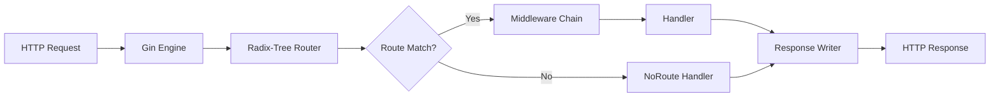

# Introduction to Gin

## Table of Contents

1. [What Is Gin?](#1-what-is-gin)
2. [Why Use Gin?](#2-why-use-gin)
3. [Installing Gin](#3-installing-gin)
4. [Setting Up a Basic Gin Server](#4-setting-up-a-basic-gin-server)
5. [Gin vs net/http](#5-gin-vs-nethttp)
6. [Routing: HTTP Methods](#6-routing-http-methods)
7. [Route Parameters](#7-route-parameters)
8. [Route Groups](#8-route-groups)
9. [Wildcard Parameters](#9-wildcard-parameters)
10. [Query Parameters](#10-query-parameters)
11. [Request Binding](#11-request-binding)
12. [Binding Tags](#12-binding-tags)
13. [JSON Responses](#13-json-responses)
14. [String, HTML, and XML Responses](#14-string-html-and-xml-responses)
15. [Redirects](#15-redirects)
16. [Error Handling](#16-error-handling)
17. [Practical Example: Book Management CRUD API](#17-practical-example-book-management-crud-api)
18. [Modern Practices](#18-modern-practices)
19. [Common Mistakes](#19-common-mistakes)
20. [Exercises](#20-exercises)
21. [Key Takeaways](#21-key-takeaways)

---

## 1. What Is Gin?

Gin is a high-performance HTTP web framework for Go. It wraps Go's standard
`net/http` package with a fast router, convenient middleware chain, request
binding, and response helpers — the kind of ergonomic surface that developers
expect from frameworks like Express.js, Sinatra, or Flask, but with Go's
performance characteristics intact.



Gin's core components:

- **Radix-tree router**: Routes are matched using a compressed radix tree (based
  on `httprouter`), which gives O(path-length) lookup instead of the O(n) linear
  scan of `net/http.ServeMux`.
- **Middleware chain**: First-class support for middleware with a clean
  `HandlerFunc` signature.
- **Request binding**: Automatic parsing and validation of JSON, XML, query
  parameters, and URI parameters into Go structs.
- **Response helpers**: One-liners for JSON, HTML, XML, YAML, binary, plain text,
  and file downloads.
- **Recovery middleware**: Built-in panic recovery that converts panics into
  HTTP 500 responses instead of crashing the server.

Gin does not force a particular project structure, database layer, or template
engine. It handles HTTP routing, request parsing, and response writing. Everything
else — database access, business logic, configuration — you bring yourself.

## 2. Why Use Gin?

The standard `net/http` package is fully capable of serving HTTP. So why add a
dependency?

### Performance

Gin's radix-tree router is measurably faster than `net/http.ServeMux` for
applications with many routes. Benchmarks consistently show Gin handling
hundreds of thousands more requests per second than the standard mux for
route-heavy workloads. For a service with five routes this is irrelevant; for
an API gateway with thousands it matters.

> 💡 **Pro tip:** The performance gap widens with route count. For simple microservices with a handful of endpoints, `net/http` is perfectly fine — don't add a framework for the sake of it.

### Ergonomics

With `net/http`, you handle request parsing manually:

```go
// Manual JSON parsing with net/http
var req CreateOrderRequest
body, err := io.ReadAll(r.Body)
if err != nil {
    http.Error(w, "read error", http.StatusBadRequest)
    return
}
defer r.Body.Close()

if err := json.Unmarshal(body, &req); err != nil {
    http.Error(w, "invalid JSON", http.StatusBadRequest)
    return
}

if req.Item == "" {
    http.Error(w, "item is required", http.StatusBadRequest)
    return
}
```

With Gin, the same logic is:

```go
// Automatic binding and validation with Gin
var req CreateOrderRequest
if err := c.ShouldBindJSON(&req); err != nil {
    c.AbortWithStatusJSON(http.StatusBadRequest, gin.H{"error": err.Error()})
    return
}
```

### Middleware

`net/http` middleware works, but the pattern is verbose. You must wrap handlers,
return `http.Handler` values, and call `next.ServeHTTP(w, r)` manually. Gin
simplifies this into a flat function chain where middleware calls `c.Next()`,
`c.Abort()`, or simply returns to short-circuit the chain.

### Validation

Gin integrates with the `go-playground/validator` package through binding tags.
Struct fields can declare constraints like `required`, `min`, `max`, `email`,
`oneof`, and dozens more. Validation runs automatically during binding — you
never write `if field == ""` checks.

### When NOT to Use Gin

Gin adds a dependency and a layer of abstraction. If you are building a simple
service with three endpoints, `net/http` is fine and you should use it. If you
need maximum control over every aspect of request handling, `net/http` gives you
that control. Gin is a pragmatic choice when you want ergonomic, fast routing
without building your own framework.

## 3. Installing Gin

Initialize a module (if you haven't already) and fetch Gin:

```bash
mkdir book-api && cd book-api
go mod init book-api
go get github.com/gin-gonic/gin
```

This downloads the Gin source and its dependencies (including
`github.com/go-playground/validator/v10`, `golang.org/x/net`, and others) and
updates your `go.mod` and `go.sum` files.

Verify the installation by checking `go.mod`:

```
module book-api

go 1.22

require github.com/gin-gonic/gin v1.10.0
```

Gin requires Go 1.21 or later. Check the release notes for the exact version
you install — the API is stable but minor behaviors can change between releases.

## 4. Setting Up a Basic Gin Server

```go
package main

import (
    "net/http"

    "github.com/gin-gonic/gin"
)

func main() {
    r := gin.Default()

    r.GET("/ping", func(c *gin.Context) {
        c.JSON(http.StatusOK, gin.H{
            "message": "pong",
        })
    })

    r.Run(":8080")
}
```

`gin.Default()` creates a Gin engine with two middleware pre-installed:

1. **Logger**: Prints request method, path, status code, and latency to stdout.
2. **Recovery**: Catches panics in handlers and returns HTTP 500 instead of
   crashing the process.

`gin.New()` creates a bare engine with no middleware. Use `gin.Default()` unless
you have a reason to build your own middleware stack from scratch.

> ⚠️ **Watch out:** The Logger middleware writes unstructured text to stdout. In production, replace it with a structured logger (slog, zerolog, zap) — otherwise your log aggregators will struggle to parse it.

`r.Run(":8080")` starts an HTTP server on port 8080. It blocks until the server
shuts down. Under the hood it calls `http.ListenAndServe`. For production use
you typically want to configure the server directly for graceful shutdown (see
[02-gin-advanced.md](02-gin-advanced.md)).

### Production-Ready Setup

```go
package main

import (
    "context"
    "log"
    "net/http"
    "os"
    "os/signal"
    "syscall"
    "time"

    "github.com/gin-gonic/gin"
)

func main() {
    r := gin.New()
    r.Use(gin.Logger(), gin.Recovery())

    r.GET("/health", func(c *gin.Context) {
        c.JSON(http.StatusOK, gin.H{"status": "ok"})
    })

    srv := &http.Server{
        Addr:         ":8080",
        Handler:      r,
        ReadTimeout:  10 * time.Second,
        WriteTimeout: 10 * time.Second,
        IdleTimeout:  60 * time.Second,
    }

    go func() {
        if err := srv.ListenAndServe(); err != nil && err != http.ErrServerClosed {
            log.Fatalf("listen: %s\n", err)
        }
    }()

    quit := make(chan os.Signal, 1)
    signal.Notify(quit, syscall.SIGINT, syscall.SIGTERM)
    <-quit
    log.Println("shutting down server...")

    ctx, cancel := context.WithTimeout(context.Background(), 5*time.Second)
    defer cancel()

    if err := srv.Shutdown(ctx); err != nil {
        log.Fatalf("server forced to shutdown: %s", err)
    }

    log.Println("server exiting")
}
```

This pattern combines Gin's routing with the graceful shutdown technique covered
in [02-gin-advanced.md](02-gin-advanced.md). The Gin engine implements
`http.Handler`, so it plugs directly into a standard `http.Server`.

> 💡 **Note:** Set `GIN_MODE=release` in production to disable debug logging and use JSON-formatted logs. Without it, Gin runs in debug mode by default.

## 5. Gin vs net/http

Understanding what Gin adds on top of the standard library helps you make
informed decisions about when to reach for the framework.

### Routing

`net/http.ServeMux` (prior to Go 1.22) only matches on path prefixes. Go 1.22
added method-based routing (`r.HandleFunc("GET /users/{id}", handler)`), but the
feature set is limited compared to Gin. Gin provides:

- Method-specific routes: `r.GET()`, `r.POST()`, `r.PUT()`, etc.
- Path parameters: `/users/:id` with automatic extraction via `c.Param("id")`.
- Wildcard parameters: `/files/*filepath` matching any depth of path.
- Route groups with shared middleware and path prefixes.
- `NoRoute` and `NoMethod` handlers for custom 404 and 405 responses.

### Middleware

Both support middleware, but Gin's middleware chain is more convenient:

```go
// Gin middleware
func AuthMiddleware() gin.HandlerFunc {
    return func(c *gin.Context) {
        token := c.GetHeader("Authorization")
        if token == "" {
            c.AbortWithStatusJSON(http.StatusUnauthorized, gin.H{"error": "unauthorized"})
            return
        }
        c.Set("userID", parseToken(token))
        c.Next()
    }
}
```

In `net/http`, you achieve the same by wrapping handlers with a higher-order
function, which works but requires more boilerplate and careful handler
rewriting.

### Request Binding

`net/http` requires manual JSON decoding (or XML, form parsing, etc.). Gin
provides `ShouldBindJSON`, `ShouldBindQuery`, `ShouldBindUri`, and others that
parse and validate in one step, returning structured errors.

### Context

Gin wraps `http.Request` and `http.ResponseWriter` in a `gin.Context` object
that provides:

- Per-request key-value store (`c.Set` / `c.Get`).
- Typed parameter extraction (`c.Param`, `c.Query`, `c.PostForm`).
- Streaming response helpers (`c.JSON`, `c.File`, `c.Redirect`).
- Abort mechanism to stop the middleware chain (`c.Abort()`).

### What You Lose

Gin is not part of the standard library. If you depend on middleware or patterns
that only work with `net/http.Handler` (such as some Go ecosystem libraries),
you may need adapters. The Gin engine itself implements `http.Handler`, so
embedding it in a standard server is straightforward, but the reverse — using
`net/http` middleware inside a Gin chain — requires wrapping.

## 6. Routing: HTTP Methods

Gin registers routes by HTTP method. Each method has a corresponding function on
the router:

```go
r.GET("/users", listUsers)           // GET  /users
r.POST("/users", createUser)         // POST /users
r.PUT("/users/:id", updateUser)      // PUT  /users/:id
r.PATCH("/users/:id", patchUser)     // PATCH /users/:id
r.DELETE("/users/:id", deleteUser)   // DELETE /users/:id
```

All route handlers receive a `*gin.Context`:

```go
func listUsers(c *gin.Context) {
    c.JSON(http.StatusOK, []string{"alice", "bob"})
}

func createUser(c *gin.Context) {
    var input CreateUserInput
    if err := c.ShouldBindJSON(&input); err != nil {
        c.JSON(http.StatusBadRequest, gin.H{"error": err.Error()})
        return
    }
    c.JSON(http.StatusCreated, gin.H{"id": 1, "name": input.Name})
}
```

### Any

`r.Any()` registers a handler for all HTTP methods on a path:

```go
r.Any("/ping", func(c *gin.Context) {
    c.String(http.StatusOK, "pong")
})
```

This matches GET, POST, PUT, PATCH, DELETE, HEAD, OPTIONS, and TRACE requests.
Inside the handler, check `c.Request.Method` if you need method-specific
behavior.

### NoRoute and NoMethod

Custom handlers for unmatched routes:

```go
r.NoRoute(func(c *gin.Context) {
    c.JSON(http.StatusNotFound, gin.H{
        "error": "route not found",
    })
})

r.NoMethod(func(c *gin.Context) {
    c.JSON(http.StatusMethodNotAllowed, gin.H{
        "error": "method not allowed",
    })
})
```

Without `NoRoute`, Gin returns a blank 404. Without `NoMethod`, it returns a
blank 405. These handlers let you return structured error responses.

## 7. Route Parameters

Route parameters are named placeholders in the path pattern, prefixed with a
colon:

```go
r.GET("/users/:id", func(c *gin.Context) {
    id := c.Param("id")
    c.JSON(http.StatusOK, gin.H{"user_id": id})
})
```

A request to `GET /users/42` produces `{"user_id": "42"}`. Parameters are always
strings. Convert them explicitly:

```go
import "strconv"

idStr := c.Param("id")
id, err := strconv.Atoi(idStr)
if err != nil {
    c.JSON(http.StatusBadRequest, gin.H{"error": "invalid id"})
    return
}
```

> 🧠 **Memory aid:** Route parameters are always strings — think of them as "just the raw text from the URL path." You must explicitly cast them to the type you need.

### Multiple Parameters

### Multiple Parameters

```go
r.GET("/users/:userId/posts/:postId", func(c *gin.Context) {
    userID := c.Param("userId")
    postID := c.Param("postId")
    c.JSON(http.StatusOK, gin.H{
        "user_id": userID,
        "post_id": postID,
    })
})
```

### Parameter Validation

Gin does not validate parameter types. `:id` matches any non-empty path segment
that is not `/`. You must validate and convert inside the handler.

## 8. Route Groups

Route groups let you share a path prefix and middleware across a set of routes:

```go
r := gin.Default()

api := r.Group("/api/v1")
{
    api.Use(AuthMiddleware())

    api.GET("/users", listUsers)
    api.POST("/users", createUser)
    api.GET("/users/:id", getUser)
}
```

All routes under `api` are prefixed with `/api/v1` and require the auth
middleware. The curly brace blocks are purely stylistic — they keep the group
visually contained.

### Nested Groups

Groups can nest:

```go
admin := r.Group("/admin")
admin.Use(AdminAuthMiddleware())
{
    admin.GET("/dashboard", adminDashboard)

    settings := admin.Group("/settings")
    {
        settings.GET("/", getSettings)
        settings.PUT("/", updateSettings)
    }
}
```

This produces:
- `GET /admin/dashboard`
- `GET /admin/settings/`
- `PUT /admin/settings/`

### Independent Groups

Groups are independent. Middleware applied to one group does not affect others:

```go
public := r.Group("/api")
private := r.Group("/api")
private.Use(AuthMiddleware())

public.GET("/products", listPublicProducts)  // no auth required
private.GET("/orders", listMyOrders)          // auth required
```

> 🔑 **Key idea:** Two groups can share the same path prefix (`/api`) but have completely independent middleware stacks. This is the standard way to separate public and private routes.

## 9. Wildcard Parameters

Wildcard parameters match the rest of the path, including slashes. They are
prefixed with `*`:

```go
r.GET("/files/*filepath", func(c *gin.Context) {
    filepath := c.Param("filepath")
    c.JSON(http.StatusOK, gin.H{"path": filepath})
})
```

A request to `GET /files/docs/readme.md` sets `filepath` to `/docs/readme.md`
(note the leading slash).

> ⚠️ **Gotcha:** The wildcard value always includes a leading slash. Trim it with `strings.TrimPrefix(filepath, "/")` if you need a clean relative path.

Wildcards are useful for:

- Serving static files from subdirectories.
- Catch-all routes for single-page applications.
- File download endpoints.

Gin only allows one wildcard per route and it must be the last segment:

```go
// Valid
r.GET("/static/*filepath", handler)

// Invalid: wildcard in the middle
r.GET("/static/*rest/extra", handler)  // will not compile
```

## 10. Query Parameters

Query parameters live after the `?` in the URL. Gin provides several helpers
to access them:

```go
// GET /search?q=golang&page=2&limit=20

r.GET("/search", func(c *gin.Context) {
    q := c.Query("q")             // "golang"
    page := c.DefaultQuery("page", "1")  // "2"
    limit := c.DefaultQuery("limit", "10") // "20"
    c.JSON(http.StatusOK, gin.H{
        "query": q,
        "page":  page,
        "limit": limit,
    })
})
```

### Differences Between the Helpers

| Method              | Returns                              |
|---------------------|--------------------------------------|
| `c.Query("key")`   | Value as string, empty string if absent |
| `c.DefaultQuery("key", "default")` | Value as string, default if absent |
| `c.QueryArray("key")` | Slice of strings for repeated keys (e.g., `?tag=a&tag=b`) |
| `c.QueryMap("key")` | `map[string]string` for indexed keys (e.g., `?ids[0]=1&ids[1]=2`) |

### Binding Query Parameters

For structured query parameters, bind them to a struct:

```go
type SearchParams struct {
    Query string `form:"q" binding:"required"`
    Page  int    `form:"page" binding:"gte=1"`
    Limit int    `form:"limit" binding:"gte=1,lte=100"`
}

r.GET("/search", func(c *gin.Context) {
    var params SearchParams
    params.Page = 1   // set defaults before binding
    params.Limit = 10

    if err := c.ShouldBindQuery(&params); err != nil {
        c.JSON(http.StatusBadRequest, gin.H{"error": err.Error()})
        return
    }
    c.JSON(http.StatusOK, params)
})
```

The `form` tag tells the binder which query parameter name to use. Without it,
Gin uses the field name.

## 11. Request Binding

Gin can automatically parse and validate request bodies, query parameters, and
URI parameters into Go structs. This eliminates manual decoding and
boilerplate validation code.

### ShouldBindJSON

The most common binding method for REST APIs:

```go
type CreateBookInput struct {
    Title  string  `json:"title" binding:"required"`
    Author string  `json:"author" binding:"required"`
    Year   int     `json:"year" binding:"required,gte=1000,lte=2100"`
    Price  float64 `json:"price" binding:"required,gt=0"`
}

r.POST("/books", func(c *gin.Context) {
    var input CreateBookInput
    if err := c.ShouldBindJSON(&input); err != nil {
        c.JSON(http.StatusBadRequest, gin.H{"error": err.Error()})
        return
    }
    c.JSON(http.StatusCreated, input)
})
```

A valid request:

```
POST /books
Content-Type: application/json

{
    "title": "The Go Programming Language",
    "author": "Alan Donovan",
    "year": 2015,
    "price": 49.99
}
```

If any required field is missing, or `year` is outside 1000-2100, binding fails
and returns a descriptive error.

### ShouldBindQuery

Binds query parameters to struct fields using the `form` tag:

```go
type ListBooksParams struct {
    Author string `form:"author"`
    Year   int    `form:"year"`
    Sort   string `form:"sort" binding:"oneof=title year price"`
}

r.GET("/books", func(c *gin.Context) {
    var params ListBooksParams
    if err := c.ShouldBindQuery(&params); err != nil {
        c.JSON(http.StatusBadRequest, gin.H{"error": err.Error()})
        return
    }
    c.JSON(http.StatusOK, params)
})
```

### ShouldBindUri

Binds URI path parameters to struct fields using the `uri` tag:

```go
type BookURI struct {
    ID int `uri:"id" binding:"required,gt=0"`
}

r.GET("/books/:id", func(c *gin.Context) {
    var uri BookURI
    if err := c.ShouldBindUri(&uri); err != nil {
        c.JSON(http.StatusBadRequest, gin.H{"error": err.Error()})
        return
    }
    c.JSON(http.StatusOK, gin.H{"book_id": uri.ID})
})
```

### Bind vs ShouldBind

Gin provides two variants:

- `c.Bind(&data)` calls `c.MustBindWith` which aborts the request with a 400
  status if binding fails. You cannot customize the error response.
- `c.ShouldBind(&data)` returns the error without aborting. You control the
  error response.

Always prefer `ShouldBind`. It gives you full control over error handling and
status codes.

## 12. Binding Tags

Gin uses the `go-playground/validator` package under the hood. Binding tags
declare constraints on struct fields. Multiple tags are comma-separated:

```go
type RegisterInput struct {
    Name     string `json:"name"     binding:"required,min=2,max=100"`
    Email    string `json:"email"    binding:"required,email"`
    Password string `json:"password" binding:"required,min=8,max=72"`
    Age      int    `json:"age"      binding:"gte=13,lte=150"`
    Role     string `json:"role"     binding:"required,oneof=admin user guest"`
}
```

### Common Binding Tags

| Tag          | Applies To           | Meaning                                  |
|--------------|----------------------|------------------------------------------|
| `required`   | all types            | Must be set (non-zero value)             |
| `min`        | strings, slices      | Minimum length                           |
| `max`        | strings, slices      | Maximum length                           |
| `gte`        | numbers              | Greater than or equal to                 |
| `gt`         | numbers              | Greater than                             |
| `lte`        | numbers              | Less than or equal to                    |
| `lt`         | numbers              | Less than                                |
| `email`      | strings              | Valid email format                       |
| `url`        | strings              | Valid URL                                |
| `uuid`       | strings              | Valid UUID                               |
| `oneof`      | strings, numbers     | Must be one of the listed values (space-separated) |
| `datetime`   | strings              | Valid datetime in the given format       |
| `len`        | strings, slices      | Exact length                             |
| `eq`         | strings, numbers     | Equal to a value                         |
| `ne`         | strings, numbers     | Not equal to a value                     |
| `alpha`      | strings              | Only alphabetic characters               |
| `alphanum`   | strings              | Only alphanumeric characters             |

### Multiple Binding Sources

A single struct can combine tags from different binding sources:

```go
type BookParams struct {
    // From URI
    ID int `uri:"id" binding:"required,gt=0"`

    // From JSON body
    Title string `json:"title" binding:"required"`

    // From query string
    Format string `form:"format" binding:"oneof=pdf epub"`
}
```

Different binding methods (`ShouldBindUri`, `ShouldBindJSON`, `ShouldBindQuery`)
each read from their respective sources. The `binding` tag is shared across all.

> 💡 **Note:** Gin uses `go-playground/validator` under the hood. You get dozens of built-in validators (`email`, `uuid`, `oneof`, `gte`, `min`, etc.) for free through struct tags.

### Custom Validation Messages

The default error messages from `go-playground/validator` are descriptive but
not user-friendly. For production APIs, map errors to human-readable messages:

```go
func translateValidationErrors(err error) map[string]string {
    errors := make(map[string]string)
    for _, e := range err.(validator.ValidationErrors) {
        switch e.Tag() {
        case "required":
            errors[e.Field()] = e.Field() + " is required"
        case "email":
            errors[e.Field()] = "must be a valid email"
        case "min":
            errors[e.Field()] = "must be at least " + e.Param() + " characters"
        case "max":
            errors[e.Field()] = "must be at most " + e.Param() + " characters"
        case "gte":
            errors[e.Field()] = "must be at least " + e.Param()
        case "lte":
            errors[e.Field()] = "must be at most " + e.Param()
        default:
            errors[e.Field()] = "invalid value"
        }
    }
    return errors
}
```

## 13. JSON Responses

### c.JSON

The primary method for sending JSON responses:

```go
c.JSON(http.StatusOK, gin.H{
    "id":    1,
    "title": "The Go Programming Language",
})
```

`gin.H` is a shorthand for `map[string]any`. You can also pass structs, slices,
or any type that `encoding/json` can marshal:

> 💡 **Pro tip:** In production APIs, prefer typed response structs over `gin.H`. They give you compile-time safety, consistent JSON field names, and make Swagger/OpenAPI generation straightforward.

```go
type Book struct {
    ID     int    `json:"id"`
    Title  string `json:"title"`
    Author string `json:"author"`
}

r.GET("/books/:id", func(c *gin.Context) {
    book := Book{ID: 1, Title: "Some Book", Author: "Someone"}
    c.JSON(http.StatusOK, book)
})
```

Output:

```json
{
    "id": 1,
    "title": "Some Book",
    "author": "Someone"
}
```

### c.IndentedJSON

Sends pretty-printed JSON with indentation. Useful for debugging:

```go
r.GET("/debug/books", func(c *gin.Context) {
    books := []Book{
        {ID: 1, Title: "Book One", Author: "Author One"},
        {ID: 2, Title: "Book Two", Author: "Author Two"},
    }
    c.IndentedJSON(http.StatusOK, books)
})
```

Do not use `IndentedJSON` in production. It increases payload size and encoding
time. Use it in development or when a human might read the response directly.

### c.AsciiJSON

Escapes non-ASCII characters in JSON. Useful when the response must contain only
ASCII characters:

```go
c.AsciiJSON(http.StatusOK, gin.H{"message": "Hello, World"})
```

## 14. String, HTML, and XML Responses

### c.String

Returns plain text:

```go
r.GET("/hello", func(c *gin.Context) {
    c.String(http.StatusOK, "Hello, %s!", c.Query("name"))
})
```

### c.HTML

Renders an HTML template. Gin requires you to load templates before starting
the server:

```go
r.LoadHTMLGlob("templates/*")

r.GET("/index", func(c *gin.Context) {
    c.HTML(http.StatusOK, "index.html", gin.H{
        "title": "Home Page",
    })
})
```

Templates use Go's `html/template` syntax. The third argument to `c.HTML` is the
data map passed to the template.

### c.XML

Returns XML:

```go
r.GET("/book", func(c *gin.Context) {
    type Book struct {
        XMLName xml.Name `xml:"book"`
        Title   string   `xml:"title"`
        Author  string   `xml:"author"`
    }
    c.XML(http.StatusOK, Book{
        Title:  "Go in Action",
        Author: "Kennedy",
    })
})
```

### c.Data

Returns raw bytes with a custom content type:

```go
r.GET("/favicon.ico", func(c *gin.Context) {
    data, _ := os.ReadFile("static/favicon.ico")
    c.Data(http.StatusOK, "image/x-icon", data)
})
```

### c.File

Serves a file from disk:

```go
r.GET("/download/:filename", func(c *gin.Context) {
    filename := c.Param("filename")
    c.File("./uploads/" + filename)
})
```

### c.FileAttachment

Serves a file with a `Content-Disposition: attachment` header so the browser
prompts a download:

```go
r.GET("/export", func(c *gin.Context) {
    c.FileAttachment("./data/report.csv", "report.csv")
})
```

## 15. Redirects

### c.Redirect

Sends an HTTP redirect:

```go
r.GET("/old-path", func(c *gin.Context) {
    c.Redirect(http.StatusMovedPermanently, "/new-path")
})
```

Common redirect status codes:

| Code | Name                  | Use Case                                   |
|------|-----------------------|--------------------------------------------|
| 301  | Moved Permanently     | URL has changed permanently                |
| 302  | Found                 | Temporary redirect (historical)            |
| 303  | See Other             | Redirect after POST (PRG pattern)          |
| 307  | Temporary Redirect    | Temporary redirect preserving method       |
| 308  | Permanent Redirect    | Permanent redirect preserving method       |

### RedirectTrailingSlash

By default, Gin redirects paths with trailing slashes to the non-slash version.
You can disable this:

> ⚠️ **Watch out:** That trailing-slash redirect is a silent 301. If you don't want it — for example in APIs where `/users` and `/users/` should be different — set `r.RedirectTrailingSlash = false`.

```go
r.RedirectTrailingSlash = false
```

## 16. Error Handling

### c.AbortWithStatusJSON

Stops the middleware chain and sends an error response:

```go
func AuthRequired() gin.HandlerFunc {
    return func(c *gin.Context) {
        token := c.GetHeader("Authorization")
        if token == "" {
            c.AbortWithStatusJSON(http.StatusUnauthorized, gin.H{
                "error": "authorization header is required",
            })
            return
        }
        c.Next()
    }
}
```

`c.Abort()` stops the chain without sending a response. `c.AbortWithStatus()`
stops the chain and sets only the status code. `c.AbortWithStatusJSON()` stops
the chain and sends a JSON response.

### c.Error

Records an error on the context without aborting the handler:

```go
r.GET("/complex", func(c *gin.Context) {
    err1 := doStepOne()
    if err1 != nil {
        c.Error(err1)  // logged but handler continues
    }

    err2 := doStepTwo()
    if err2 != nil {
        c.Error(err2)
    }

    // handler still executes, errors collected on context
})
```

> ⚠️ **Gotcha:** If a client disconnects mid-request, the context is cancelled. Long-running handlers that ignore it will keep processing work nobody is waiting for — always pass `c.Request.Context()` downstream.

### Error Middleware

Gin allows you to register error handlers that process errors set on the
context:

```go
r.Use(func(c *gin.Context) {
    c.Next()

    if len(c.Errors) > 0 {
        err := c.Errors.Last().Err
        c.JSON(http.StatusInternalServerError, gin.H{
            "error": err.Error(),
        })
    }
})
```

This pattern centralizes error responses. Handlers call `c.Error(err)` to record
errors without immediately writing a response, and the middleware at the end of
the chain sends the final response.

> 🔑 **Key idea:** Separate error *recording* (`c.Error`) from error *rendering* (middleware). This keeps handlers focused on logic and gives you a single place to format all error responses.

## 17. Practical Example: Book Management CRUD API

This section builds a complete in-memory CRUD API for a book management system.
It demonstrates routing, groups, parameters, binding, responses, and error
handling working together.

### Data Models

```go
package main

import (
    "errors"
    "net/http"
    "strconv"
    "sync"
    "time"

    "github.com/gin-gonic/gin"
)

type Book struct {
    ID        int       `json:"id"`
    Title     string    `json:"title"`
    Author    string    `json:"author"`
    Year      int       `json:"year"`
    Price     float64   `json:"price"`
    CreatedAt time.Time `json:"created_at"`
    UpdatedAt time.Time `json:"updated_at"`
}

type CreateBookInput struct {
    Title  string  `json:"title" binding:"required,min=1,max=200"`
    Author string  `json:"author" binding:"required,min=1,max=100"`
    Year   int     `json:"year" binding:"required,gte=1000,lte=2100"`
    Price  float64 `json:"price" binding:"required,gt=0"`
}

type UpdateBookInput struct {
    Title  string  `json:"title" binding:"omitempty,min=1,max=200"`
    Author string  `json:"author" binding:"omitempty,min=1,max=100"`
    Year   int     `json:"year" binding:"omitempty,gte=1000,lte=2100"`
    Price  float64 `json:"price" binding:"omitempty,gt=0"`
}

type ListBooksParams struct {
    Author string `form:"author"`
    Year   int    `form:"year"`
    Sort   string `form:"sort" binding:"omitempty,oneof=title year price"`
    Order  string `form:"order" binding:"omitempty,oneof=asc desc"`
    Page   int    `form:"page" binding:"omitempty,gte=1"`
    Limit  int    `form:"limit" binding:"omitempty,gte=1,lte=100"`
}

type ErrorResponse struct {
    Error   string            `json:"error"`
    Details map[string]string `json:"details,omitempty"`
}
```

### Store

```go
type BookStore struct {
    mu     sync.RWMutex
    books  map[int]Book
    nextID int
}

func NewBookStore() *BookStore {
    return &BookStore{
        books:  make(map[int]Book),
        nextID: 1,
    }
}

func (s *BookStore) List(params ListBooksParams) []Book {
    s.mu.RLock()
    defer s.mu.RUnlock()

    var result []Book
    for _, book := range s.books {
        if params.Author != "" && book.Author != params.Author {
            continue
        }
        if params.Year != 0 && book.Year != params.Year {
            continue
        }
        result = append(result, book)
    }

    if len(result) == 0 {
        return []Book{}
    }
    return result
}

func (s *BookStore) Get(id int) (Book, error) {
    s.mu.RLock()
    defer s.mu.RUnlock()

    book, ok := s.books[id]
    if !ok {
        return Book{}, errors.New("book not found")
    }
    return book, nil
}

func (s *BookStore) Create(input CreateBookInput) Book {
    s.mu.Lock()
    defer s.mu.Unlock()

    now := time.Now()
    book := Book{
        ID:        s.nextID,
        Title:     input.Title,
        Author:    input.Author,
        Year:      input.Year,
        Price:     input.Price,
        CreatedAt: now,
        UpdatedAt: now,
    }
    s.books[book.ID] = book
    s.nextID++
    return book
}

func (s *BookStore) Update(id int, input UpdateBookInput) (Book, error) {
    s.mu.Lock()
    defer s.mu.Unlock()

    book, ok := s.books[id]
    if !ok {
        return Book{}, errors.New("book not found")
    }

    if input.Title != "" {
        book.Title = input.Title
    }
    if input.Author != "" {
        book.Author = input.Author
    }
    if input.Year != 0 {
        book.Year = input.Year
    }
    if input.Price != 0 {
        book.Price = input.Price
    }
    book.UpdatedAt = time.Now()

    s.books[id] = book
    return book, nil
}

func (s *BookStore) Delete(id int) error {
    s.mu.Lock()
    defer s.mu.Unlock()

    if _, ok := s.books[id]; !ok {
        return errors.New("book not found")
    }
    delete(s.books, id)
    return nil
}
```

> ⚠️ **Watch out:** This `sync.RWMutex` guard is mandatory — the `concurrent map writes` runtime fatal from unprotected handlers is not a recoverable panic, so `gin.Recovery()` cannot save you from it.

### Handlers

```go
func listBooks(store *BookStore) gin.HandlerFunc {
    return func(c *gin.Context) {
        var params ListBooksParams
        params.Page = 1
        params.Limit = 20
        params.Sort = "title"
        params.Order = "asc"

        if err := c.ShouldBindQuery(&params); err != nil {
            c.JSON(http.StatusBadRequest, ErrorResponse{
                Error: "invalid query parameters",
            })
            return
        }

        books := store.List(params)
        c.JSON(http.StatusOK, gin.H{
            "books": books,
            "count": len(books),
        })
    }
}

func getBook(store *BookStore) gin.HandlerFunc {
    return func(c *gin.Context) {
        id, err := strconv.Atoi(c.Param("id"))
        if err != nil {
            c.JSON(http.StatusBadRequest, ErrorResponse{
                Error: "invalid book id",
            })
            return
        }

        book, err := store.Get(id)
        if err != nil {
            c.JSON(http.StatusNotFound, ErrorResponse{
                Error: err.Error(),
            })
            return
        }

        c.JSON(http.StatusOK, book)
    }
}

func createBook(store *BookStore) gin.HandlerFunc {
    return func(c *gin.Context) {
        var input CreateBookInput
        if err := c.ShouldBindJSON(&input); err != nil {
            c.JSON(http.StatusBadRequest, ErrorResponse{
                Error: "validation failed",
            })
            return
        }

        book := store.Create(input)
        c.JSON(http.StatusCreated, book)
    }
}

func updateBook(store *BookStore) gin.HandlerFunc {
    return func(c *gin.Context) {
        id, err := strconv.Atoi(c.Param("id"))
        if err != nil {
            c.JSON(http.StatusBadRequest, ErrorResponse{
                Error: "invalid book id",
            })
            return
        }

        var input UpdateBookInput
        if err := c.ShouldBindJSON(&input); err != nil {
            c.JSON(http.StatusBadRequest, ErrorResponse{
                Error: "validation failed",
            })
            return
        }

        book, err := store.Update(id, input)
        if err != nil {
            c.JSON(http.StatusNotFound, ErrorResponse{
                Error: err.Error(),
            })
            return
        }

        c.JSON(http.StatusOK, book)
    }
}

func deleteBook(store *BookStore) gin.HandlerFunc {
    return func(c *gin.Context) {
        id, err := strconv.Atoi(c.Param("id"))
        if err != nil {
            c.JSON(http.StatusBadRequest, ErrorResponse{
                Error: "invalid book id",
            })
            return
        }

        if err := store.Delete(id); err != nil {
            c.JSON(http.StatusNotFound, ErrorResponse{
                Error: err.Error(),
            })
            return
        }

        c.JSON(http.StatusOK, gin.H{"message": "book deleted"})
    }
}
```

### Main

```go
func main() {
    store := NewBookStore()

    store.Create(CreateBookInput{
        Title: "The Go Programming Language", Author: "Alan Donovan", Year: 2015, Price: 49.99,
    })
    store.Create(CreateBookInput{
        Title: "Concurrency in Go", Author: "Katherine Cox-Buday", Year: 2017, Price: 44.99,
    })

    r := gin.Default()

    r.GET("/health", func(c *gin.Context) {
        c.JSON(http.StatusOK, gin.H{"status": "ok"})
    })

    books := r.Group("/api/v1/books")
    {
        books.GET("", listBooks(store))
        books.GET("/:id", getBook(store))
        books.POST("", createBook(store))
        books.PUT("/:id", updateBook(store))
        books.DELETE("/:id", deleteBook(store))
    }

    r.NoRoute(func(c *gin.Context) {
        c.JSON(http.StatusNotFound, ErrorResponse{
            Error: "route not found",
        })
    })

    r.Run(":8080")
}
```

> 🧠 **Think of it as:** This example is a microcosm of a real API — route groups for namespacing, closure-injected stores for DI, input structs for validation, and consistent error responses. Every Gin app follows this shape.

```bash
# Create a book
curl -X POST http://localhost:8080/api/v1/books \
  -H "Content-Type: application/json" \
  -d '{"title":"Advanced Go","author":"Jane Smith","year":2024,"price":39.99}'

# List all books
curl http://localhost:8080/api/v1/books

# Get a specific book
curl http://localhost:8080/api/v1/books/1

# Update a book
curl -X PUT http://localhost:8080/api/v1/books/1 \
  -H "Content-Type: application/json" \
  -d '{"price":54.99}'

# Delete a book
curl -X DELETE http://localhost:8080/api/v1/books/1

# List with query filters
curl "http://localhost:8080/api/v1/books?author=Jane+Smith&sort=year&order=desc"
```

---

## 18. Modern Practices

### Always Use ShouldBind Over Bind

`ShouldBind` gives you full control over error responses. `Bind` aborts
automatically with a 400 and you cannot customize the response body or status
code.

### Use gin.H Sparingly in Production

`gin.H` is convenient for examples and prototypes, but in production APIs
prefer typed response structs. They give you compile-time guarantees, consistent
JSON field names, and make OpenAPI/Swagger generation straightforward.

### Structured Logging

Replace the default `gin.Logger()` middleware with a structured logger
(`slog`, `zerolog`, `zap`) early in development. Once your API is public,
changing the log format is a breaking change for log consumers.

### Context Propagation

Always pass `c.Request.Context()` to downstream calls (database, HTTP clients,
message queues). This ensures cancellation and timeouts propagate correctly
when the client disconnects.

### API Versioning via Route Groups

```go
v1 := r.Group("/api/v1")
v2 := r.Group("/api/v2")
```

Versioning at the router level avoids the need for header-based or
query-parameter-based versioning and makes rolling back a new API version
trivial.

### Configuration via Environment

Never hardcode ports, database URLs, or secrets. Read them from environment
variables or a configuration library (`viper`, `envconfig`).

---

## 19. Common Mistakes

### 1. Forgetting to call c.Abort after c.AbortWithStatusJSON

`c.AbortWithStatusJSON` already calls `c.Abort()` internally. Calling
`c.Abort()` again after it is harmless but redundant. The mistake is doing the
opposite: calling only `c.JSON` in middleware when you should call
`c.AbortWithStatusJSON`. Without abort, the request continues to the next
handler even after you sent a 401 response.

```go
// Wrong: sends 401 but handler still runs
c.JSON(http.StatusUnauthorized, gin.H{"error": "unauthorized"})
return  // only stops THIS handler, not the chain

// Correct: stops the chain
c.AbortWithStatusJSON(http.StatusUnauthorized, gin.H{"error": "unauthorized"})
// no return needed, chain is stopped
```

### 2. Using c.JSON after c.AbortWithStatusJSON

Once the chain is aborted, the response is already written. Calling `c.JSON`
again will produce a double-write error or duplicate response body.

### 3. Not closing the request body

Gin does not close the request body for you. Always defer `c.Request.Body.Close()`
if you read the body manually. When using `ShouldBindJSON`, Gin manages the body
internally — you do not need to close it.

### 4. Binding after writing a response

If you call `c.JSON` before `ShouldBindJSON`, the binding will still work but
you have already written headers. This leads to confusing behavior where the
client receives the first response and binding errors are logged silently.

### 5. Mutating gin.H after passing it to c.JSON

`c.JSON` serializes immediately. If you modify the map after calling `c.JSON`,
the response is not affected — but you might accidentally change data for
subsequent logic. This is not a bug, but it is confusing. Keep response
construction and mutation separate.

### 6. Not handling strconv.Atoi errors

Route parameters are always strings. Forgetting to convert or handle the
conversion error leads to either runtime panics (if you use `%d` in a fmt
format with a string) or subtle logic bugs (treating "abc" as 0).

### 7. Sharing mutable state without synchronization

If you store data in a `map` at the package level and access it from multiple
Gin handlers, you must use a mutex or channel-based synchronization. Gin runs
handlers concurrently across goroutines. Concurrent map writes in Go cause a
runtime panic.

### 8. Using gin.Default() in production without understanding it

`gin.Default()` installs Logger and Recovery. In production you might want
custom logging (structured logs, log levels) and custom recovery (sending crash
alerts). Use `gin.New()` and add middleware explicitly when you need control.

### 9. Over-complicating the response structure

Returning deeply nested JSON objects makes your API hard to consume. Keep
responses flat and predictable. The client should not need to parse three levels
of nesting to find the data.

### 10. Ignoring the Context deadline

Gin handlers run within the HTTP request context. If a client disconnects, the
context is cancelled. Long-running handlers should respect `c.Request.Context()`
and abort when it is done:

```go
func slowHandler(c *gin.Context) {
    ctx := c.Request.Context()
    result, err := longOperation(ctx)
    if err != nil {
        c.AbortWithStatusJSON(http.StatusGatewayTimeout, gin.H{"error": "timeout"})
        return
    }
    c.JSON(http.StatusOK, result)
}
```

---

## 20. Exercises

### Exercise 1: User Registration API

Build an API with a single `POST /api/v1/users` endpoint. The request body
should contain `name`, `email`, and `password`. Use Gin's binding to validate
that all fields are present, the email is valid, the name is at least 2
characters, and the password is at least 8 characters. Store users in an
in-memory map with an auto-incrementing ID. Return the created user with status
201. Add a `GET /api/v1/users/:id` endpoint that retrieves a user by ID.
Return 404 with a JSON error body if the user does not exist.

### Exercise 2: Middleware Chain

Build three middleware functions: `RequestID` (generates a UUID and adds it to
the response header `X-Request-ID` and the context), `Logger` (logs method,
path, status code, and latency for every request), and `Auth` (checks for an
`Authorization` header — any non-empty value is accepted as valid). Apply all
three to a route group. The `RequestID` middleware should run first, `Logger`
second, and `Auth` third. Confirm the order by examining the log output.

### Exercise 3: Wildcard File Server

Create a route `GET /static/*filepath` that serves files from a `./public`
directory. If the file exists, serve it. If it does not exist, return a 404
JSON response. Test it by placing an `index.html` and a `style.css` file in
`./public` and requesting them through curl.

### Exercise 4: Pagination with Query Parameters

Add a `GET /api/v1/books` endpoint that returns paginated results. Accept query
parameters `page` (default 1) and `limit` (default 10, max 100). Seed the store
with 50 books. The response should include the books array, the total count,
current page, limit, and total number of pages. Validate inputs using binding
tags.

### Exercise 5: Error Handling Middleware

Write middleware that captures all errors recorded on the context (via
`c.Error()`) and returns a structured JSON response with the first error's
message and a 500 status code. Modify your handlers to use `c.Error(err)`
instead of directly writing error responses. The middleware should sit after all
routes in the chain (call `r.Use()` before `r.Run()` but with logic that runs
after `c.Next()`). Log each error using `log.Printf`.

### Exercise 6 (Challenge): RESTful Product API with Groups

Build a product management API with two route groups: `/api/v1/public` (no
auth) and `/api/v1/admin` (requires auth middleware). Public endpoints:
`GET /products` (list, paginated) and `GET /products/:id` (get). Admin
endpoints: `POST /products` (create), `PUT /products/:id` (update),
`DELETE /products/:id` (delete). Product fields: `id`, `name`, `description`,
`price`, `category`, `created_at`, `updated_at`. Use a `sync.RWMutex`-protected
in-memory store. Seed with 5 products. All responses should use consistent
JSON structure: `{"data": ..., "error": ""}` for success, `{"data": null,
"error": "message"}` for failure.

---

## 21. Key Takeaways

- Gin wraps `net/http` with a radix-tree router, middleware chain, request
  binding, and response helpers — adding ergonomics without sacrificing
  performance.
- `gin.Default()` includes Logger and Recovery; `gin.New()` gives you a blank
  engine for full control.
- Always prefer `ShouldBind*` methods over `Bind*` to control error responses.
- Route groups let you share prefixes and middleware; independent groups keep
  public and private routes separate.
- Binding tags (`binding:"required,email"`) delegate validation to
  `go-playground/validator` — no manual field checks needed.
- Handle `strconv.Atoi` errors on route parameters, close request bodies, and
  always use `c.AbortWithStatusJSON` in middleware (not just `c.JSON`).
- Use `gin.Recovery()` in every application, and configure graceful shutdown
  with `http.Server` for production.

---

**Next**: [Gin Advanced — middleware, auth, context, error handling, dependency injection, testing, graceful shutdown, CRUD example](02-gin-advanced.md)
