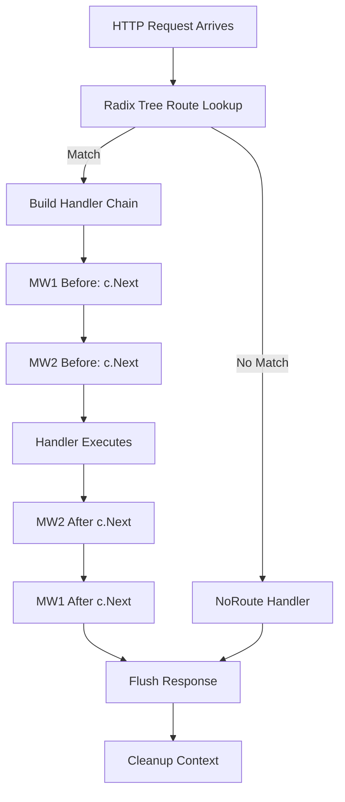

# Gin Advanced

## Table of Contents

1. [Middleware in Detail](#1-middleware-in-detail)
2. [Authentication Middleware](#2-authentication-middleware)
3. [Gin Context In-Depth](#3-gin-context-in-depth)
4. [Request Lifecycle](#4-request-lifecycle)
5. [Error Handling Patterns](#5-error-handling-patterns)
6. [Dependency Injection](#6-dependency-injection)
7. [Testing Gin Applications](#7-testing-gin-applications)
8. [Custom Validators](#8-custom-validators)
9. [Custom Binding](#9-custom-binding)
10. [Routing Tree Internals](#10-routing-tree-internals)
11. [Static Files and Templates](#11-static-files-and-templates)
12. [Graceful Shutdown](#12-graceful-shutdown)
13. [Practical Example](#13-practical-example)
14. [Modern Practices](#14-modern-practices)
15. [Common Mistakes](#15-common-mistakes)
16. [Exercises](#16-exercises)
17. [Key Takeaways](#17-key-takeaways)

---

## 1. Middleware in Detail

A Gin middleware is a function with the signature `func(c *gin.Context)`. It runs
before (or after) the final handler. Middleware can modify the request, abort the
chain, or perform side effects like logging and authentication.

### How Middleware Works Internally

When you call `router.GET("/path", middlewareA, middlewareB, handler)`, Gin stores
these functions in order. When a request matches the route, Gin calls them
sequentially. Each middleware must call `c.Next()` to pass control to the next
function, or `c.Abort()` to stop the chain.

### Writing a Simple Logger

```go
package main

import (
	"log"
	"time"

	"github.com/gin-gonic/gin"
)

func Logger() gin.HandlerFunc {
	return func(c *gin.Context) {
		start := time.Now()
		path := c.Request.URL.Path
		query := c.Request.URL.RawQuery

		c.Next()

		latency := time.Since(start)
		status := c.Writer.Status()
		clientIP := c.ClientIP()
		method := c.Request.Method

		log.Printf(
			"%s | %3d | %13v | %15s | %s %s",
			time.Now().Format("2006-01-02 15:04:05"),
			status,
			latency,
			clientIP,
			method,
			path,
			query,
		)
	}
}

func main() {
	r := gin.New()
	r.Use(Logger())
	r.GET("/", func(c *gin.Context) {
		c.String(200, "Hello")
	})
	r.Run()
}
```

Notice that `Logger()` returns a `gin.HandlerFunc` rather than being one directly.
This is a factory pattern that lets you close over configuration values later.

> 🔑 **Key idea:** Writing middleware as a factory function (`func SomeMW() gin.HandlerFunc`) lets you pass configuration at registration time — a closure captures the settings, and the inner handler does the work.

### Middleware That Modifies the Response

You can write to the response inside a middleware. A common pattern is a
response-writer wrapper that captures the status code:

```go
type statusRecorder struct {
	gin.ResponseWriter
	status int
}

func (r *statusRecorder) WriteHeader(code int) {
	r.status = code
	r.ResponseWriter.WriteHeader(code)
}

func StatusCapture() gin.HandlerFunc {
	return func(c *gin.Context) {
		rec := &statusRecorder{
			ResponseWriter: c.Writer,
			status:         200,
		}
		c.Writer = rec
		c.Next()
		log.Printf("Captured status: %d", rec.status)
	}
}
```

### Chaining Middleware

Middleware runs in the order it is added via `r.Use()`. If you add multiple
middleware, they form a pipeline:

```
Request -> MW1 -> MW2 -> MW3 -> Handler -> MW3 (after Next) -> MW2 -> MW1 -> Response
```

```go
r := gin.New()
r.Use(MW1(), MW2(), MW3())
```

`c.Next()` is the key. When `MW1` calls `c.Next()`, control passes to `MW2`. When
`MW2` calls `c.Next()`, it passes to `MW3`, and so on. After the handler finishes,
control returns backward through each middleware's post-`c.Next()` code.

> 🧠 **Memory aid:** The chain is LIFO — like a stack of plates. Code before `c.Next()` runs top-down; code after it runs bottom-up as unwinds. That is why logging/cleanup goes *after* `c.Next()`.

Calling `c.Abort()` stops the chain. It does not terminate the current function;
code after `c.Abort()` still runs, but subsequent middleware and handlers will not.

```go
func AuthRequired() gin.HandlerFunc {
	return func(c *gin.Context) {
		token := c.GetHeader("Authorization")
		if token == "" {
			c.JSON(401, gin.H{"error": "missing token"})
			c.Abort()
			return
		}
		// validate token ...
		c.Next()
	}
}
```

### Route-Group Middleware

You can apply middleware to a group of routes:

```go
api := r.Group("/api")
api.Use(AuthRequired())
{
	api.GET("/users", listUsers)
	api.POST("/users", createUser)
}
```

Only routes under `/api` will go through `AuthRequired`. Routes outside the group
are unaffected.

You can also chain group-level middleware with route-level middleware:

```go
api := r.Group("/api")
api.Use(AuthRequired())
api.GET("/users", RateLimit(), listUsers) // both AuthRequired and RateLimit apply
```

Route-level middleware is appended after group middleware. The execution order is:
group middleware first, then route middleware, then handler.

### Middleware with Configuration

Pass configuration through a closure or a struct:

```go
func Timeout(d time.Duration) gin.HandlerFunc {
	return func(c *gin.Context) {
		done := make(chan struct{})

		go func() {
			c.Next()
			close(done)
		}()

		select {
		case <-done:
			return
		case <-time.After(d):
			c.AbortWithStatusJSON(504, gin.H{"error": "request timed out"})
		}
	}
}

// Usage:
r.GET("/slow", Timeout(5*time.Second), slowHandler)
```

---

## 2. Authentication Middleware

### API Key Validation

The simplest authentication pattern is checking a header or query parameter:

```go
func APIKeyAuth(validKeys map[string]string) gin.HandlerFunc {
	return func(c *gin.Context) {
		key := c.GetHeader("X-API-Key")
		if key == "" {
			c.AbortWithStatusJSON(401, gin.H{"error": "API key required"})
			return
		}

		name, ok := validKeys[key]
		if !ok {
			c.AbortWithStatusJSON(403, gin.H{"error": "invalid API key"})
			return
		}

		// Store who authenticated for downstream handlers
		c.Set("authenticated_user", name)
		c.Next()
	}
}

func main() {
	keys := map[string]string{
		"abc123": "service-a",
		"def456": "service-b",
	}

	r := gin.New()
	r.Use(APIKeyAuth(keys))
	r.GET("/data", func(c *gin.Context) {
		user := c.MustGet("authenticated_user").(string)
		c.JSON(200, gin.H{"data": "secret", "user": user})
	})
}
```

> 💡 **Note:** Store the authenticated identity (user ID, role) on the context with `c.Set(...)`. Handlers then read it via `c.MustGet` instead of re-validating the token.

### JWT Token Validation

For JWT, use the `golang-jwt/jwt/v5` package:

```go
package middleware

import (
	"net/http"
	"strings"

	"github.com/gin-gonic/gin"
	"github.com/golang-jwt/jwt/v5"
)

var jwtSecret = []byte("your-secret-key") // load from env in production

type Claims struct {
	UserID string `json:"user_id"`
	Role   string `json:"role"`
	jwt.RegisteredClaims
}

func JWTAuth() gin.HandlerFunc {
	return func(c *gin.Context) {
		authHeader := c.GetHeader("Authorization")
		if authHeader == "" {
			c.AbortWithStatusJSON(http.StatusUnauthorized, gin.H{"error": "missing authorization header"})
			return
		}

		parts := strings.SplitN(authHeader, " ", 2)
		if len(parts) != 2 || parts[0] != "Bearer" {
			c.AbortWithStatusJSON(http.StatusUnauthorized, gin.H{"error": "invalid authorization format"})
			return
		}

		tokenStr := parts[1]
		claims := &Claims{}

		token, err := jwt.ParseWithClaims(tokenStr, claims, func(t *jwt.Token) (interface{}, error) {
			if _, ok := t.Method.(*jwt.SigningMethodHMAC); !ok {
				return nil, jwt.ErrSignatureInvalid
			}
			return jwtSecret, nil
		})

		if err != nil || !token.Valid {
			c.AbortWithStatusJSON(http.StatusUnauthorized, gin.H{"error": "invalid or expired token"})
			return
		}

		// Store claims in context for handlers
		c.Set("claims", claims)
		c.Set("user_id", claims.UserID)
		c.Next()
	}
}
```

Usage:

```go
protected := r.Group("/api")
protected.Use(JWTAuth())
{
	protected.GET("/profile", func(c *gin.Context) {
		userID := c.GetString("user_id")
		c.JSON(200, gin.H{"user_id": userID})
	})
}
```

> ⚠️ **Gotcha:** The JWT secret is declared as a global here — load it from an environment variable at startup instead. Hardcoded signing keys in source code are a classic credential leak.

### Role-Based Access Control

Layer a second middleware on top of JWT:

```go
func RequireRole(roles ...string) gin.HandlerFunc {
	return func(c *gin.Context) {
		claimsVal, exists := c.Get("claims")
		if !exists {
			c.AbortWithStatusJSON(401, gin.H{"error": "unauthorized"})
			return
		}

		claims, ok := claimsVal.(*Claims)
		if !ok {
			c.AbortWithStatusJSON(500, gin.H{"error": "internal error"})
			return
		}

		for _, role := range roles {
			if claims.Role == role {
				c.Next()
				return
			}
		}

		c.AbortWithStatusJSON(403, gin.H{"error": "insufficient permissions"})
	}
}

// Usage:
adminRoutes := r.Group("/admin")
adminRoutes.Use(JWTAuth(), RequireRole("admin"))
{
	adminRoutes.DELETE("/users/:id", deleteUser)
}
```

---

## 3. Gin Context In-Depth

The `*gin.Context` object is the most important type in Gin. It wraps both the
request and response, and serves as a per-request key-value store.

### Setting and Getting Values

```go
c.Set("key", value)           // store any value
val, exists := c.Get("key")   // retrieve, returns (interface{}, bool)
val := c.MustGet("key")       // retrieve or panic
str := c.GetString("key")     // type-asserted convenience for string
id := c.GetInt64("id")        // type-asserted convenience for int64
```

Values set with `c.Set()` are scoped to the current request only. They are not
shared across requests. Gin stores them in a map on the context and clears them
after the handler chain completes.

> ⚠️ **Watch out:** Never store `*gin.Context` itself (or values from it) beyond the request lifetime — it is reused by Gin. If a goroutine needs data after the handler returns, copy it out first.

### Common Context Methods

```go
c.Param("id")           // URL path parameter: /users/:id
c.Query("page")         // query string: ?page=1
c.DefaultQuery("page", "1") // query with default
c.PostForm("name")      // form field
c.GetHeader("Accept")   // request header
c.ClientIP()            // client IP (respects X-Forwarded-For)
c.ContentType()         // Content-Type header
c.Request               // *http.Request
c.Writer                // gin.ResponseWriter
```

### Passing Data Between Middleware and Handlers

The `Set`/`Get` pattern on context is the standard way to pass data:

```go
func DatabaseMiddleware(db *sql.DB) gin.HandlerFunc {
	return func(c *gin.Context) {
		c.Set("db", db)
		c.Next()
	}
}

func CreateUser(c *gin.Context) {
	dbVal, _ := c.Get("db")
	db := dbVal.(*sql.DB)

	var user User
	if err := c.ShouldBindJSON(&user); err != nil {
		c.JSON(400, gin.H{"error": err.Error()})
		return
	}

	result, err := db.Exec("INSERT INTO users (name) VALUES (?)", user.Name)
	// ...
}
```

### Context After c.Next()

Code after `c.Next()` in a middleware executes after all downstream handlers finish.
This is useful for cleanup, logging, or response modification:

```go
func MetricsMiddleware() gin.HandlerFunc {
	return func(c *gin.Context) {
		start := time.Now()
		c.Next()
		duration := time.Since(start)

		metrics.RecordRequestDuration(c.Request.URL.Path, duration)
	}
}
```

> 💡 **Pro tip:** This is the canonical "after" pattern: measure before `c.Next()`, then do work after the handler completes. It works for metrics, logging status codes, and cleanup.

### Context With Cancel

Gin provides `c.Request.Context()` which is the standard `context.Context`. You
can use it for cancellation propagation:

```go
func Handler(c *gin.Context) {
	ctx, cancel := context.WithTimeout(c.Request.Context(), 2*time.Second)
	defer cancel()

	result, err := queryDatabase(ctx)
	// ...
}
```

> ⚠️ **Watch out:** A `*gin.Context` is not safe to use from another goroutine once the handler returns — Gin reclaims it for the next request. Copy any data you need, or pass `c.Request.Context()` into the goroutine, before letting it outlive the handler.

---

## 4. Request Lifecycle

Understanding the request lifecycle helps you reason about middleware ordering and
behavior.

### Step by Step

1. An HTTP request arrives at the router.
2. The radix tree is traversed to find a matching route.
3. If found, the handler chain is built: global middleware + group middleware +
   route-level middleware + handler.
4. The chain starts executing from index 0.
5. Each middleware calls `c.Next()` (which increments the index and calls the next
   function) or `c.Abort()` (which sets the index past the end of the chain).
6. After the handler runs, control returns to each middleware at the point after
   their `c.Next()` call (in reverse order).
7. When the chain completes, Gin flushes the response and cleans up the context.



### Visual Example

```go
r := gin.New()
r.Use(LoggerMW)          // global
api := r.Group("/api")
api.Use(AuthMW)          // group
api.GET("/users", RoleMW, ListUsers)  // route-level + handler
```

Execution for `GET /api/users`:

```
LoggerMW (before) -> AuthMW (before) -> RoleMW (before) -> ListUsers
ListUsers finishes
RoleMW (after) -> AuthMW (after) -> LoggerMW (after)
```

### Abort vs. Return

`c.Abort()` does not stop execution of the current function. It prevents
subsequent middleware/handlers from running. Always use `return` after calling
`c.Abort()` to avoid executing post-`Next()` code unexpectedly:

```go
func AuthCheck() gin.HandlerFunc {
	return func(c *gin.Context) {
		if !isValid(c) {
			c.AbortWithStatusJSON(401, gin.H{"error": "unauthorized"})
			return // must return after abort
		}
		c.Next()
	}
}
```

> 🔑 **Remember:** `c.Abort()`, `c.AbortWithStatusJSON()`, and friends already stop the chain — but they do *not* stop your current function. Always `return` right after them or post-`Next()` code may still run.

---

## 5. Error Handling Patterns

### Problem With Per-Handler Error Handling

Repeating `if err != nil { c.JSON(500, ...) }` in every handler is tedious and
inconsistent. There are better patterns.

### Pattern 1: Error Response Helper

```go
func respondWithError(c *gin.Context, code int, message string) {
	c.JSON(code, gin.H{"error": message})
}

func respondWithJSON(c *gin.Context, code int, payload interface{}) {
	c.JSON(code, payload)
}

func CreateUser(c *gin.Context) {
	var user User
	if err := c.ShouldBindJSON(&user); err != nil {
		respondWithError(c, 400, err.Error())
		return
	}

	if err := saveUser(&user); err != nil {
		respondWithError(c, 500, "failed to create user")
		return
	}

	respondWithJSON(c, 201, user)
}
```

### Pattern 2: Custom Error Type

Define a structured error that carries both an HTTP status and a message:

```go
type AppError struct {
	Status  int    `json:"-"`
	Message string `json:"error"`
}

func (e *AppError) Error() string {
	return e.Message
}

func NewAppError(status int, msg string) *AppError {
	return &AppError{Status: status, Message: msg}
}

// ErrorMiddleware catches AppErrors and renders them
func ErrorMiddleware() gin.HandlerFunc {
	return func(c *gin.Context) {
		c.Next()

		// Check if any errors were recorded
		if len(c.Errors) > 0 {
			err := c.Errors.Last().Err
			if appErr, ok := err.(*AppError); ok {
				c.JSON(appErr.Status, appErr)
			} else {
				c.JSON(500, gin.H{"error": "internal server error"})
			}
		}
	}
}
```

Handlers use `c.Error(err)` to record errors without writing a response:

```go
func GetUser(c *gin.Context) {
	id := c.Param("id")
	user, err := findUser(id)
	if err != nil {
		c.Error(NewAppError(404, "user not found"))
		return
	}
	c.JSON(200, user)
}
```

### Pattern 3: Using c.Errors

Gin maintains a slice of errors on the context. You can append to it and check at
the end:

```go
r.Use(ErrorMiddleware())
r.POST("/users", func(c *gin.Context) {
	if err := doWork(); err != nil {
		c.Error(err) // appends to c.Errors
		return
	}
	c.JSON(200, gin.H{"ok": true})
})
```

This is useful when multiple operations might fail and you want to collect all
errors.

> 🧠 **Think of it as:** `c.Errors` is an inbox for errors — handlers post to it, and the error-handling middleware reads it at the end of the chain. This decouples "something failed" from "how to respond".

---

## 6. Dependency Injection

Gin does not have a built-in dependency injection container. There are three
common approaches.

### Approach 1: Pass Dependencies via Closure

```go
type UserService struct {
	repo UserRepository
}

func NewUserService(repo UserRepository) *UserService {
	return &UserService{repo: repo}
}

func (s *UserService) RegisterHandlers(r *gin.Engine) {
	r.GET("/users", s.listUsers)
	r.POST("/users", s.createUser)
}

func (s *UserService) listUsers(c *gin.Context) {
	users, err := s.repo.GetAll()
	if err != nil {
		c.JSON(500, gin.H{"error": err.Error()})
		return
	}
	c.JSON(200, users)
}

func (s *UserService) createUser(c *gin.Context) {
	var input CreateUserInput
	if err := c.ShouldBindJSON(&input); err != nil {
		c.JSON(400, gin.H{"error": err.Error()})
		return
	}

	user, err := s.repo.Create(input.Name, input.Email)
	if err != nil {
		c.JSON(500, gin.H{"error": err.Error()})
		return
	}
	c.JSON(201, user)
}

func main() {
	repo := NewPostgresUserRepo()
	svc := NewUserService(repo)

	r := gin.Default()
	svc.RegisterHandlers(r)
	r.Run()
}
```

This is the cleanest approach. The handler methods have access to the service
through the method receiver.

> 💡 **Pro tip:** Closure-based DI composes well with middleware factories — your `SetupRouter` becomes a single place that wires services into handlers, which makes it trivial to swap implementations or write tests.

### Approach 2: Store in Context

```go
func ServiceMiddleware(svc *UserService) gin.HandlerFunc {
	return func(c *gin.Context) {
		c.Set("userService", svc)
		c.Next()
	}
}

func ListUsers(c *gin.Context) {
	svc := c.MustGet("userService").(*UserService)
	users, err := svc.GetAll()
	// ...
}
```

This works but has drawbacks: the dependency is hidden behind string keys and
requires type assertions. Prefer closures when possible.

> ⚠️ **Gotcha:** Context keys are untyped strings — a typo silently returns `nil`, and two packages can collide on the same key. Reserve `c.Set` for request-scoped data (request ID, user), not app-wide dependencies.

### Approach 3: Structured Handler Registration

```go
type Server struct {
	userService *UserService
	orderService *OrderService
}

func NewServer(us *UserService, os *OrderService) *Server {
	return &Server{userService: us, orderService: os}
}

func (s *Server) SetupRouter() *gin.Engine {
	r := gin.Default()

	r.GET("/users", s.ListUsers)
	r.POST("/orders", s.CreateOrder)

	return r
}

func (s *Server) ListUsers(c *gin.Context) {
	users, err := s.userService.GetAll()
	if err != nil {
		c.JSON(500, gin.H{"error": err.Error()})
		return
	}
	c.JSON(200, users)
}
```

This keeps handlers as methods on a struct that holds all dependencies. It is
easy to test by substituting mock implementations.

---

## 7. Testing Gin Applications

### Setting Up a Test Context

For unit tests that need a `*gin.Context` without starting a server:

```go
func setupTestContext(method, path string, body io.Reader) (*gin.Context, *httptest.ResponseRecorder) {
	w := httptest.NewRecorder()
	r, _ := http.NewRequest(method, path, body)

	router := gin.New()
	c, _ := gin.CreateTestContext(w)
	c.Request = r

	return c, w
}
```

### Testing a Handler Directly

```go
func TestCreateUser(t *testing.T) {
	c, w := setupTestContext(
		"POST",
		"/users",
		strings.NewReader(`{"name":"Alice","email":"alice@example.com"}`),
	)
	c.Request.Header.Set("Content-Type", "application/json")

	// Call the handler directly
	createUserHandler(c)

	assert.Equal(t, 201, w.Code)

	var user User
	err := json.Unmarshal(w.Body.Bytes(), &user)
	assert.NoError(t, err)
	assert.Equal(t, "Alice", user.Name)
}
```

### Using httptest with the Full Router

```go
func TestGetUsersEndpoint(t *testing.T) {
	router := setupRouter() // your function that returns *gin.Engine

	req, _ := http.NewRequest("GET", "/api/users", nil)
	req.Header.Set("Authorization", "Bearer test-token")

	w := httptest.NewRecorder()
	router.ServeHTTP(req, w)

	assert.Equal(t, 200, w.Code)

	var response []User
	json.Unmarshal(w.Body.Bytes(), &response)
	assert.Greater(t, len(response), 0)
}
```

`router.ServeHTTP` processes the request through the entire middleware chain
without starting an actual HTTP server. This is fast and reliable.

> 💡 **Note:** There is no test server to manage — `ServeHTTP` runs the request synchronously in-process, so tests are fast, deterministic, and need no ports.

### Testing Middleware

```go
func TestAuthMiddlewareRejectsNoToken(t *testing.T) {
	w := httptest.NewRecorder()
	r, _ := http.NewRequest("GET", "/protected", nil)

	c, _ := gin.CreateTestContext(w)
	c.Request = r

	authMW := JWTAuth()
	authMW(c)

	assert.Equal(t, 401, w.Code)
	assert.True(t, c.IsAborted())
}
```

### Table-Driven Tests

```go
func TestListUsers_Validation(t *testing.T) {
	tests := []struct {
		name       string
		page       string
		expectCode int
	}{
		{"valid page", "1", 200},
		{"valid page 2", "5", 200},
		{"invalid page", "abc", 400},
		{"negative page", "-1", 400},
	}

	for _, tt := range tests {
		t.Run(tt.name, func(t *testing.T) {
			w := httptest.NewRecorder()
			r, _ := http.NewRequest("GET", "/users?page="+tt.page, nil)

			c, _ := gin.CreateTestContext(w)
			c.Request = r

			listUsersHandler(c)

			assert.Equal(t, tt.expectCode, w.Code)
		})
	}
}
```

---

## 8. Custom Validators

### Registering a Custom Validation Function

Gin uses `go-playground/validator` under the hood. You can register custom
functions on the validator instance:

```go
package main

import (
	"time"

	"github.com/gin-gonic/gin"
	"github.com/gin-gonic/gin/binding"
	"github.com/go-playground/validator/v10"
)

type Event struct {
	Name      string    `json:"name" binding:"required"`
	StartTime time.Time `json:"start_time" binding:"required,gtfield=EndTime"`
	EndTime   time.Time `json:"end_time" binding:"required"`
	Date      string    `json:"date" binding:"required,futureDate"`
}

func init() {
	if v, ok := binding.Validator.Engine().(*validator.Validate); ok {
		v.RegisterValidation("futureDate", validateFutureDate)
	}
}

func validateFutureDate(fl validator.FieldLevel) bool {
	dateStr := fl.Field().String()
	t, err := time.Parse("2006-01-02", dateStr)
	if err != nil {
		return false
	}
	return t.After(time.Now())
}
```

### Custom Field-Level Error Messages

Register translations for better error messages:

```go
func init() {
	if v, ok := binding.Validator.Engine().(*validator.Validate); ok {
		v.RegisterValidation("futureDate", validateFutureDate)

		v.RegisterTranslation("futureDate", gin.Default,
			func(ut ut.Translator) error {
				return ut.Add("futureDate", "{0} must be a future date", true)
			},
			func(ut ut.Translator, fe validator.FieldError) string {
				t, _ := ut.T("futureDate", fe.Field())
				return t
			},
		)
	}
}
```

### Using Struct Tags

With custom validators registered, you use them in struct tags:

```go
type Appointment struct {
	Date string `json:"date" binding:"required,futureDate"`
}
```

If `date` is in the past, the validator returns the translated error message.

> 💡 **Note:** Custom validators are registered once, typically in `init()`, and then reused everywhere via the struct tag. Register them before any binding happens.

---

## 9. Custom Binding

### Implementing the binding.Binding Interface

The `binding.Binding` interface requires two methods:

```go
type Binding interface {
	Name() string
	Bind(req *http.Request, obj interface{}) error
}
```

Here is a custom binder for `application/x-protobuf` (simplified):

```go
package binding

import (
	"io"
	"net/http"
)

type protobufBinding struct{}

func (protobufBinding) Name() string {
	return "protobuf"
}

func (protobufBinding) Bind(req *http.Request, obj interface{}) error {
	body, err := io.ReadAll(req.Body)
	if err != nil {
		return err
	}
	defer req.Body.Close()

	// In a real implementation you would unmarshal protobuf here
	// protobuf.Unmarshal(body, obj)
	_ = body
	return nil
}
```

### Implementing binding.BindingBody

For binders that need the request body, implement `binding.BindingBody`:

```go
type BindingBody interface {
	Binding
	BindBody([]byte, interface{}) error
}
```

### Registering a Custom Binder

```go
var Protobuf binding.BindingBody = protobufBindingBody{}

func (b protobufBindingBody) BindBody(data []byte, obj interface{}) error {
	// protobuf.Unmarshal(data, obj)
	return nil
}

// Usage in a handler:
func ProtobufBody() gin.HandlerFunc {
	return func(c *gin.Context) {
		var req MyProtoRequest
		if err := binding.Protobuf.BindBody(c.Request.Body, &req); err != nil {
			c.JSON(400, gin.H{"error": err.Error()})
			return
		}
		// Use req ...
	}
}
```

### Custom Form Binding

For a custom query/form format:

```go
type customFormBinding struct{}

func (customFormBinding) Name() string {
	return "customform"
}

func (customFormBinding) Bind(req *http.Request, obj interface{}) error {
	// Custom parsing logic, e.g., parsing a non-standard query format
	// ...
	return nil
}
```

Register it with `c.MustBindWith(obj, customFormBinding{})`.

---

## 10. Routing Tree Internals

### Why Gin Is Fast

Gin uses a radix tree (also called a compressed prefix tree or patricia tree)
for route storage. This is the same approach used by `httprouter`.

### What Is a Radix Tree?

A radix tree compresses chains of single-child nodes into one node. For routes:

```
/users
/users/:id
/users/:id/posts
/orders
/orders/:id
```

The tree structure looks like:

```
       /
      / \
   users  orders
    |      |
   / \     |
  ""  :id  :id
      |     |
    posts  ""
```

### Key Properties

**O(k) lookup where k is the path length.** Unlike a map which hashes the full
key, the radix tree traverses one byte at a time and short-circuits on
mismatches. For most practical applications, this is effectively constant time.

**Memory efficient.** Common prefixes are shared. The path `/api/v1/users` and
`/api/v1/orders` share the `/api/v1` prefix in memory.

**No hash collisions.** Map-based routing can degrade with many keys due to hash
collisions. A tree has deterministic performance.

> 🧠 **Memory aid:** A radix tree is like a file system path — `/api/v1/users` and `/api/v1/orders` share the `/api/v1` directory. Common prefixes are stored once, and matching walks the path segment by segment.

### Path Parameters

Gin stores path parameters like `:id` as wildcards in the tree nodes. During
matching, the tree extracts the parameter value and stores it for `c.Param()` to
retrieve.

---

## 11. Static Files and Templates

### Serving Static Files

```go
func main() {
	r := gin.Default()

	// Serve files from ./static directory at /static/*url
	r.Static("/static", "./static")

	// Serve a single file
	r.StaticFile("/favicon.ico", "./static/favicon.ico")

	// Serve files under /assets mapping to ./public/assets
	r.StaticFS("/assets", http.Dir("./public/assets"))

	r.Run()
}
```

- `Static` serves files from a directory, preserving the URL path structure.
- `StaticFile` serves a single file at an exact path.
- `StaticFS` serves files using `http.FileSystem`, giving you full control.

### Serving HTML Templates

```go
func main() {
	r := gin.Default()

	r.LoadHTMLGlob("templates/*")

	r.GET("/page/:name", func(c *gin.Context) {
		name := c.Param("name")
		c.HTML(200, name+".html", gin.H{
			"title": "My Page",
			"body":  "Page content",
		})
	})

	r.Run()
}
```

### Template Syntax

Gin uses Go's `html/template` package. Templates in the `templates/` directory
are loaded by filename:

```html
<!-- templates/index.html -->
<!DOCTYPE html>
<html>
<head><title>{{ .title }}</title></head>
<body>
    <h1>{{ .title }}</h1>
    <p>{{ .body }}</p>
</body>
</html>
```

### Subdirectories and Custom Delimiters

```go
// For nested template directories:
r.LoadHTMLGlob("templates/**/*")

// Set custom delimiters (useful if template syntax conflicts with JS):
r.SetFuncMap(template.FuncMap{
    "formatDate": func(t time.Time) string {
        return t.Format("2006-01-02")
    },
})
r.LoadHTMLGlob("templates/*")
```

---

## 12. Graceful Shutdown

### The Problem

When you call `r.Run()`, Gin starts an HTTP server that blocks until an error
occurs. If the process is killed, in-flight requests are terminated abruptly.

### The Solution

Use `http.Server` directly and handle OS signals:

```go
package main

import (
	"context"
	"log"
	"net/http"
	"os"
	"os/signal"
	"syscall"
	"time"

	"github.com/gin-gonic/gin"
)

func main() {
	r := gin.Default()

	r.GET("/slow", func(c *gin.Context) {
		time.Sleep(2 * time.Second)
		c.String(200, "done")
	})

	srv := &http.Server{
		Addr:    ":8080",
		Handler: r,
	}

	// Start server in a goroutine
	go func() {
		if err := srv.ListenAndServe(); err != nil && err != http.ErrServerClosed {
			log.Fatalf("ListenAndServe: %v", err)
		}
	}()

	// Wait for interrupt signal
	quit := make(chan os.Signal, 1)
	signal.Notify(quit, syscall.SIGINT, syscall.SIGTERM)
	<-quit

	log.Println("Shutting down server...")

	// Give in-flight requests 5 seconds to finish
	ctx, cancel := context.WithTimeout(context.Background(), 5*time.Second)
	defer cancel()

	if err := srv.Shutdown(ctx); err != nil {
		log.Fatalf("Server forced to shutdown: %v", err)
	}

	log.Println("Server exited cleanly")
}
```

### How It Works

1. `srv.ListenAndServe()` starts in a goroutine.
2. The main goroutine blocks on `<-quit` waiting for SIGINT or SIGTERM.
3. When the signal arrives, `srv.Shutdown(ctx)` stops accepting new connections
   and waits for in-flight requests to finish.
4. The 5-second timeout ensures the server does not hang indefinitely.
5. After shutdown, the process exits cleanly.

> 🔑 **Key idea:** Graceful shutdown is about *draining*, not killing: stop accepting new connections, let in-flight requests finish, and only force-exit if the timeout expires.

### Draining in Practice

For production systems with long-running connections (WebSockets, streaming):

```go
func main() {
	r := gin.Default()
	// ... setup routes ...

	srv := &http.Server{
		Addr:         ":8080",
		Handler:      r,
		ReadTimeout:  15 * time.Second,
		WriteTimeout: 15 * time.Second,
		IdleTimeout:  60 * time.Second,
	}

	go func() {
		log.Printf("Server starting on %s", srv.Addr)
		if err := srv.ListenAndServe(); err != nil && err != http.ErrServerClosed {
			log.Fatalf("Server error: %v", err)
		}
	}()

	quit := make(chan os.Signal, 1)
	signal.Notify(quit, syscall.SIGINT, syscall.SIGTERM)
	<-quit

	ctx, cancel := context.WithTimeout(context.Background(), 30*time.Second)
	defer cancel()

	if err := srv.Shutdown(ctx); err != nil {
		log.Printf("Server forced shutdown: %v", err)
	}

	log.Println("Server stopped")
}
```

---

## 13. Practical Example

Here is a complete mini-API with authentication, validation, error handling,
and testing structure.

### Project Structure

```
project/
  main.go
  middleware/
    auth.go
    errors.go
  handlers/
    users.go
  models/
    user.go
  store/
    user_store.go
  main_test.go
```

### models/user.go

```go
package models

import "time"

type User struct {
	ID        string    `json:"id"`
	Name      string    `json:"name" binding:"required,min=2,max=100"`
	Email     string    `json:"email" binding:"required,email"`
	CreatedAt time.Time `json:"created_at"`
}
```

### store/user_store.go

```go
package store

import (
	"sync"
	"time"

	"github.com/google/uuid"
	"project/models"
)

type UserStore struct {
	mu    sync.RWMutex
	users map[string]*models.User
}

func NewUserStore() *UserStore {
	return &UserStore{users: make(map[string]*models.User)}
}

func (s *UserStore) GetAll() []*models.User {
	s.mu.RLock()
	defer s.mu.RUnlock()

	users := make([]*models.User, 0, len(s.users))
	for _, u := range s.users {
		users = append(users, u)
	}
	return users
}

func (s *UserStore) Get(id string) (*models.User, bool) {
	s.mu.RLock()
	defer s.mu.RUnlock()
	u, ok := s.users[id]
	return u, ok
}

func (s *UserStore) Create(name, email string) *models.User {
	s.mu.Lock()
	defer s.mu.Unlock()

	user := &models.User{
		ID:        uuid.New().String(),
		Name:      name,
		Email:     email,
		CreatedAt: time.Now(),
	}
	s.users[user.ID] = user
	return user
}

func (s *UserStore) Delete(id string) bool {
	s.mu.Lock()
	defer s.mu.Unlock()
	_, ok := s.users[id]
	if ok {
		delete(s.users, id)
	}
	return ok
}
```

### middleware/auth.go

```go
package middleware

import (
	"strings"

	"github.com/gin-gonic/gin"
)

var validAPIKeys = map[string]string{
	"secret-key-123": "admin",
}

func APIKeyAuth() gin.HandlerFunc {
	return func(c *gin.Context) {
		key := c.GetHeader("X-API-Key")
		if key == "" {
			c.AbortWithStatusJSON(401, gin.H{"error": "API key required"})
			return
		}

		role, ok := validAPIKeys[key]
		if !ok {
			c.AbortWithStatusJSON(403, gin.H{"error": "invalid API key"})
			return
		}

		c.Set("role", role)
		c.Next()
	}
}

func RequireAdmin() gin.HandlerFunc {
	return func(c *gin.Context) {
		role, exists := c.Get("role")
		if !exists || role.(string) != "admin" {
			c.AbortWithStatusJSON(403, gin.H{"error": "admin access required"})
			return
		}
		c.Next()
	}
}
```

### middleware/errors.go

```go
package middleware

import (
	"github.com/gin-gonic/gin"
)

type AppError struct {
	Status  int    `json:"-"`
	Message string `json:"error"`
}

func (e *AppError) Error() string {
	return e.Message
}

func ErrorHandler() gin.HandlerFunc {
	return func(c *gin.Context) {
		c.Next()

		if len(c.Errors) > 0 {
			err := c.Errors.Last().Err
			if appErr, ok := err.(*AppError); ok {
				c.JSON(appErr.Status, appErr)
			} else {
				c.JSON(500, gin.H{"error": "internal server error"})
			}
		}
	}
}
```

### handlers/users.go

```go
package handlers

import (
	"net/http"

	"github.com/gin-gonic/gin"
	"project/middleware"
	"project/models"
	"project/store"
)

type UserHandler struct {
	store *store.UserStore
}

func NewUserHandler(s *store.UserStore) *UserHandler {
	return &UserHandler{store: s}
}

func (h *UserHandler) List(c *gin.Context) {
	users := h.store.GetAll()
	c.JSON(http.StatusOK, users)
}

func (h *UserHandler) Get(c *gin.Context) {
	id := c.Param("id")
	user, ok := h.store.Get(id)
	if !ok {
		c.Error(&middleware.AppError{
			Status:  http.StatusNotFound,
			Message: "user not found",
		})
		return
	}
	c.JSON(http.StatusOK, user)
}

func (h *UserHandler) Create(c *gin.Context) {
	var input struct {
		Name  string `json:"name" binding:"required,min=2,max=100"`
		Email string `json:"email" binding:"required,email"`
	}

	if err := c.ShouldBindJSON(&input); err != nil {
		c.JSON(http.StatusBadRequest, gin.H{"error": err.Error()})
		return
	}

	user := h.store.Create(input.Name, input.Email)
	c.JSON(http.StatusCreated, user)
}

func (h *UserHandler) Delete(c *gin.Context) {
	id := c.Param("id")
	if !h.store.Delete(id) {
		c.JSON(http.StatusNotFound, gin.H{"error": "user not found"})
		return
	}
	c.JSON(http.StatusOK, gin.H{"deleted": id})
}
```

### main.go

```go
package main

import (
	"context"
	"log"
	"net/http"
	"os"
	"os/signal"
	"syscall"
	"time"

	"github.com/gin-gonic/gin"
	"project/handlers"
	"project/middleware"
	"project/store"
)

func SetupRouter() *gin.Engine {
	r := gin.New()
	r.Use(gin.Recovery())
	r.Use(middleware.ErrorHandler())

	userStore := store.NewUserStore()
	userHandler := handlers.NewUserHandler(userStore)

	r.GET("/health", func(c *gin.Context) {
		c.JSON(200, gin.H{"status": "ok"})
	})

	api := r.Group("/api")
	{
		api.Use(middleware.APIKeyAuth())

		users := api.Group("/users")
		{
			users.GET("", userHandler.List)
			users.GET("/:id", userHandler.Get)
			users.POST("", userHandler.Create)
			users.DELETE("/:id", middleware.RequireAdmin(), userHandler.Delete)
		}
	}

	return r
}

func main() {
	r := SetupRouter()

	srv := &http.Server{
		Addr:         ":8080",
		Handler:      r,
		ReadTimeout:  10 * time.Second,
		WriteTimeout: 10 * time.Second,
	}

	go func() {
		if err := srv.ListenAndServe(); err != nil && err != http.ErrServerClosed {
			log.Fatalf("Server error: %v", err)
		}
	}()

	log.Println("Server started on :8080")

	quit := make(chan os.Signal, 1)
	signal.Notify(quit, syscall.SIGINT, syscall.SIGTERM)
	<-quit

	log.Println("Shutting down...")
	ctx, cancel := context.WithTimeout(context.Background(), 5*time.Second)
	defer cancel()

	if err := srv.Shutdown(ctx); err != nil {
		log.Printf("Shutdown error: %v", err)
	}
	log.Println("Server stopped")
}
```

### main_test.go

```go
package main

import (
	"bytes"
	"encoding/json"
	"net/http"
	"net/http/httptest"
	"testing"

	"github.com/stretchr/testify/assert"
)

func TestHealthEndpoint(t *testing.T) {
	router := SetupRouter()

	req, _ := http.NewRequest("GET", "/health", nil)
	w := httptest.NewRecorder()
	router.ServeHTTP(w, req)

	assert.Equal(t, 200, w.Code)

	var body map[string]string
	json.Unmarshal(w.Body.Bytes(), &body)
	assert.Equal(t, "ok", body["status"])
}

func TestListUsersRequiresAuth(t *testing.T) {
	router := SetupRouter()

	req, _ := http.NewRequest("GET", "/api/users", nil)
	w := httptest.NewRecorder()
	router.ServeHTTP(w, req)

	assert.Equal(t, 401, w.Code)
}

func TestListUsersWithAuth(t *testing.T) {
	router := SetupRouter()

	req, _ := http.NewRequest("GET", "/api/users", nil)
	req.Header.Set("X-API-Key", "secret-key-123")
	w := httptest.NewRecorder()
	router.ServeHTTP(w, req)

	assert.Equal(t, 200, w.Code)

	var body []map[string]interface{}
	json.Unmarshal(w.Body.Bytes(), &body)
	assert.Empty(t, body) // no users yet
}

func TestCreateAndListUser(t *testing.T) {
	router := SetupRouter()

	payload := `{"name":"Alice","email":"alice@example.com"}`
	req, _ := http.NewRequest("POST", "/api/users", bytes.NewBufferString(payload))
	req.Header.Set("Content-Type", "application/json")
	req.Header.Set("X-API-Key", "secret-key-123")
	w := httptest.NewRecorder()
	router.ServeHTTP(w, req)

	assert.Equal(t, 201, w.Code)

	req, _ = http.NewRequest("GET", "/api/users", nil)
	req.Header.Set("X-API-Key", "secret-key-123")
	w = httptest.NewRecorder()
	router.ServeHTTP(w, req)

	assert.Equal(t, 200, w.Code)

	var users []map[string]interface{}
	json.Unmarshal(w.Body.Bytes(), &users)
	assert.Equal(t, 1, len(users))
	assert.Equal(t, "Alice", users[0]["name"])
}

func TestCreateUserInvalidBody(t *testing.T) {
	router := SetupRouter()

	payload := `{"name":""}`
	req, _ := http.NewRequest("POST", "/api/users", bytes.NewBufferString(payload))
	req.Header.Set("Content-Type", "application/json")
	req.Header.Set("X-API-Key", "secret-key-123")
	w := httptest.NewRecorder()
	router.ServeHTTP(w, req)

	assert.Equal(t, 400, w.Code)
}

func TestDeleteRequiresAdmin(t *testing.T) {
	router := SetupRouter()

	payload := `{"name":"Bob","email":"bob@example.com"}`
	req, _ := http.NewRequest("POST", "/api/users", bytes.NewBufferString(payload))
	req.Header.Set("Content-Type", "application/json")
	req.Header.Set("X-API-Key", "secret-key-123")
	w := httptest.NewRecorder()
	router.ServeHTTP(w, req)

	req, _ = http.NewRequest("GET", "/api/users", nil)
	req.Header.Set("X-API-Key", "secret-key-123")
	w = httptest.NewRecorder()
	router.ServeHTTP(w, req)

	var users []map[string]interface{}
	json.Unmarshal(w.Body.Bytes(), &users)
	userID := users[0]["id"].(string)

	req, _ = http.NewRequest("DELETE", "/api/users/"+userID, nil)
	req.Header.Set("X-API-Key", "secret-key-123")
	w = httptest.NewRecorder()
	router.ServeHTTP(w, req)

	assert.Equal(t, 200, w.Code)
}
```

---

## 14. Modern Practices

### Prefer Struct-Based DI Over Context Keys

Context key strings are untyped and prone to collisions. The struct-based
handler approach (Approach 3 in [Section 6](#6-dependency-injection)) makes
dependencies explicit and testable.

### Use gin.New() + Explicit Middleware in Production

`gin.Default()` bundles `gin.Logger()` which writes to stdout in an unstructured
format. In production, replace it with a structured logger (`slog`, `zerolog`,
`zap`) so you get JSON logs, log levels, and correlation IDs.

### Separate Router Setup from main()

Extract router configuration into a `SetupRouter()` function (as shown in the
[practical example](#13-practical-example)). This lets you:
- Call `router.ServeHTTP(w, req)` in tests without starting a server.
- Swap router configurations for different environments.

### Use testcontainers for Integration Tests

Spinning up a real PostgreSQL instance in a Docker container via
`testcontainers-go` gives you confidence that queries, migrations, and
connection pooling work end-to-end. Avoid mocking database drivers.

### Version API Routes

```go
v1 := r.Group("/api/v1")
v2 := r.Group("/api/v2")
```

Versioning at the router level is simpler and more transparent than header-based
approaches.

### Security Headers Middleware

Add a middleware that sets security headers (`X-Content-Type-Options`,
`X-Frame-Options`, `Strict-Transport-Security`) on every response. Do not rely
on clients to enforce security policies.

---

## 15. Common Mistakes

### 1. Not Returning After Abort

```go
// WRONG
func CheckAuth(c *gin.Context) {
	if unauthorized(c) {
		c.AbortWithStatusJSON(401, gin.H{"error": "unauthorized"})
		// execution continues, c.Next() will be called
	}
	c.Next()
}

// CORRECT
func CheckAuth(c *gin.Context) {
	if unauthorized(c) {
		c.AbortWithStatusJSON(401, gin.H{"error": "unauthorized"})
		return
	}
	c.Next()
}
```

### 2. Blocking c.Next()

Never block on `c.Next()` in a goroutine without coordination. The request context
may be cleaned up before the goroutine finishes.

```go
// WRONG - handler may finish and context is reused
go func() {
    c.Next()
}()

// RIGHT - just call it synchronously
c.Next()
```

### 3. Ignoring c.Next()

Forgetting to call `c.Next()` in middleware silently drops all downstream handlers:

```go
// WRONG - handlers will never run
func MyMiddleware() gin.HandlerFunc {
    return func(c *gin.Context) {
        c.Set("key", "value")
        // c.Next() is missing
    }
}
```

### 4. Modifying Context After c.Next() in Handlers

The handler should not assume it can modify context values that other middleware
depends on after `c.Next()` returns.

### 5. Not Using gin.Recovery()

Always include `gin.Recovery()` middleware in production to prevent panics from
crashing the server:

```go
r := gin.New()
r.Use(gin.Logger())
r.Use(gin.Recovery())
```

### 6. Using c.Request.Body Without Resetting

The request body can only be read once. If you need to read it in middleware and
handler, save the body bytes in middleware and set up a new reader:

```go
func BodyCache() gin.HandlerFunc {
    return func(c *gin.Context) {
        body, _ := io.ReadAll(c.Request.Body)
        c.Request.Body = io.NopCloser(bytes.NewReader(body))
        c.Set("body", body)
        c.Next()
    }
}
```

### 7. Goroutine Leaks

Starting goroutines that reference the context without ensuring they finish before
shutdown can cause leaks. Use `context.Context` cancellation in goroutines:

```go
func Handler(c *gin.Context) {
    ctx := c.Request.Context()
    go func() {
        select {
        case <-ctx.Done():
            return
        case <-time.After(time.Minute):
            // context was not cancelled
        }
    }()
}
```

### 8. Overusing Context for Dependencies

Storing too many things in context via `c.Set()` makes code hard to trace. If
you have more than 2-3 shared values, consider a struct-based approach (closures
or method receivers).

---

## 16. Exercises

### Exercise 1: Rate Limiter Middleware

Implement a per-IP rate limiter middleware that limits requests to 100 per
minute. Use a `map[string][]time.Time` with a counter and a timestamp. Reject
requests over the limit with HTTP 429.

```go
// Starter code:
func RateLimit() gin.HandlerFunc {
    var mu sync.Mutex
    hits := make(map[string][]time.Time)

    return func(c *gin.Context) {
        ip := c.ClientIP()
        now := time.Now()
        window := now.Add(-1 * time.Minute)

        mu.Lock()
        // Your code here: filter out timestamps older than window,
        // check length, append current time, unlock
        mu.Unlock()

        c.Next()
    }
}
```

### Exercise 2: Request ID Middleware

Write middleware that:
- Checks for an `X-Request-ID` header in the incoming request.
- If absent, generates a UUID and sets it.
- Stores it in context and sets it in the response header.
- Every downstream handler can access it via `c.GetString("request_id")`.

### Exercise 3: Panic Recovery Middleware

Write a custom recovery middleware (do not use `gin.Recovery()`) that:
- Catches panics using `defer` and `recover()`.
- Logs the panic with a stack trace using `runtime.Stack`.
- Returns HTTP 500 with a JSON error body.
- Does not crash the server.

```go
// Starter code:
func CustomRecovery() gin.HandlerFunc {
    return func(c *gin.Context) {
        defer func() {
            if r := recover(); r != nil {
                // Your code here
            }
        }()
        c.Next()
    }
}
```

### Exercise 4: Request Timing Middleware

Write middleware that:
- Records the start time before calling `c.Next()`.
- After the handler finishes, computes the duration.
- Sets `X-Response-Time` header on the response (e.g., `"12.345ms"`).
- Logs the method, path, status code, and duration.

### Exercise 5: Conditional Middleware

Write a `SkipPaths` middleware factory that takes a list of paths and skips the
middleware when the request matches any of them:

```go
func SkipPaths(paths []string, next gin.HandlerFunc) gin.HandlerFunc {
    return func(c *gin.Context) {
        for _, p := range paths {
            if c.Request.URL.Path == p {
                c.Next()
                return
            }
        }
        next(c)
    }
}
```

Test it with `gin.CreateTestContext` to verify it skips and passes correctly.

### Exercise 6: Write Integration Tests

Take the practical example from this article and write additional tests:
- Test that creating a user with an invalid email returns 400.
- Test that deleting a nonexistent user returns 404.
- Test that the health endpoint works without an API key.
- Use table-driven tests for the create endpoint with various invalid payloads.

### Exercise 7: Custom Validator

Create a `strongPassword` validator that requires:
- At least 8 characters
- At least one uppercase letter
- At least one digit
- At least one special character

Apply it to a `RegisterRequest` struct and test it with `gin.CreateTestContext`.

---

## 17. Key Takeaways

- Middleware is the backbone of Gin's extensibility. Understand `c.Next()` and
  `c.Abort()` to control the execution chain.
- The context (`*gin.Context`) is a per-request key-value store and the primary
  mechanism for passing data between middleware and handlers.
- Errors should be handled centrally using either response helpers, custom error
  types, or Gin's `c.Errors` slice.
- Dependencies are best injected via closures or struct methods rather than
  context strings.
- Testing is straightforward with `gin.CreateTestContext` for unit tests and
  `httptest.NewRecorder` + `router.ServeHTTP` for integration tests.
- Always use `gin.Recovery()`, handle graceful shutdown, and return after
  calling `c.Abort()`.

---

**Next**: [SQL & PostgreSQL Fundamentals](../10-databases/01-sql-fundamentals.md)
