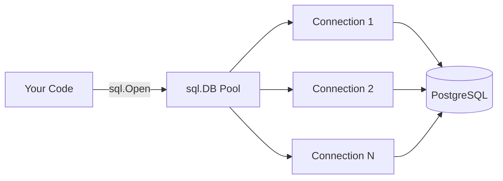
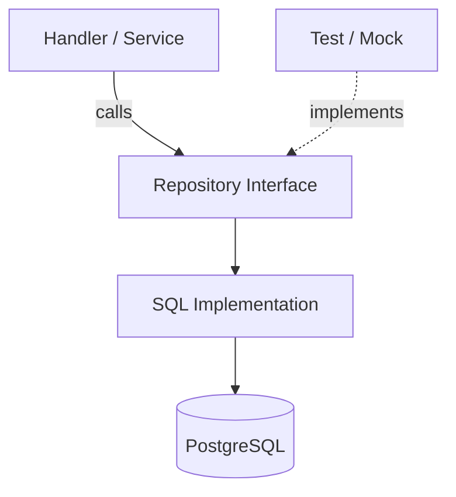

# database/sql — Go's Standard Database Interface

## Table of Contents

1. [Package Overview](#1-package-overview)
2. [Connecting to PostgreSQL](#2-connecting-to-postgresql)
3. [Connection Pooling](#3-connection-pooling)
4. [Querying Data](#4-querying-data)
5. [Scanning Results](#5-scanning-results)
6. [Parameterized Queries](#6-parameterized-queries)
7. [Handling NULL Values](#7-handling-null-values)
8. [Inserting Data](#8-inserting-data)
9. [Updating and Deleting](#9-updating-and-deleting)
10. [Transactions](#10-transactions)
11. [Prepared Statements](#11-prepared-statements)
12. [Error Handling](#12-error-handling)
13. [Repository Pattern](#13-repository-pattern)
14. [Migrations](#14-migrations)
15. [Testing Database Code](#15-testing-database-code)
16. [Practical Example: User Repository](#16-practical-example-user-repository)
17. [Modern Practices](#17-modern-practices)
18. [Common Mistakes](#18-common-mistakes)
19. [Exercises](#19-exercises)
20. [Key Takeaways](#20-key-takeaways)

---

## 1. Package Overview

The `database/sql` package provides:

- `sql.DB` — a connection pool, not a single connection. It is safe for concurrent use.
- `sql.Rows` — an iterator over query results.
- `sql.Row` — a single row from a query result.
- `sql.Tx` — a database transaction.
- `sql.Stmt` — a prepared statement.
- `sql.Result` — the result of an `Exec` call (rows affected, last insert id).

You never create a `sql.DB` directly. Instead, you register a driver and then call
`sql.Open`:

```go
import (
    "database/sql"
    _ "github.com/lib/pq" // register the PostgreSQL driver
)
```

The blank import (`_ "github.com/lib/pq"`) invokes the driver's `init` function,
which registers itself with `database/sql`. After that, you can use `"postgres"`
as the driver name in `sql.Open`.

**Key point**: `sql.Open` does not open a connection. It creates a `sql.DB` value
and validates the arguments. The actual connection happens on the first query or
when you call `db.Ping()`.

> 🧠 **Memory aid:** `sql.DB` is not a single connection — it is a **pool manager**. Creating it is cheap; the real network work happens lazily on the first query or `Ping()`.



> 💡 **Note:** The canonical drivers are `pgx` (actively maintained, faster) and `lib/pq` (older, stable). Both plug into `database/sql` — pick `pgx` for new projects and you get native `IN (...)` slice support too.

---

## 2. Connecting to PostgreSQL

### 2.1 sql.Open

```go
package main

import (
    "database/sql"
    "fmt"
    "log"

    _ "github.com/lib/pq"
)

func main() {
    connStr := "host=localhost port=5432 user=postgres password=secret dbname=mydb sslmode=disable"
    db, err := sql.Open("postgres", connStr)
    if err != nil {
        log.Fatal(err)
    }
    defer db.Close()

    if err := db.Ping(); err != nil {
        log.Fatal("cannot connect to database:", err)
    }

    fmt.Println("connected successfully")
}
```

`db.Ping()` actually opens a connection and verifies the database is reachable.
Always call it after `sql.Open` to confirm connectivity.

> 💡 **Pro tip:** Use `PingContext` with a short timeout at startup so a misconfigured database fails fast — with a clear error — instead of on the first real request.

### 2.2 Connection String Parameters

| Parameter | Description |
|-----------|-------------|
| `host` | Database server hostname |
| `port` | Database server port (default 5432) |
| `user` | Database user |
| `password` | User password |
| `dbname` | Database name |
| `sslmode` | SSL preference: `disable`, `require`, `verify-ca`, `verify-full` |
| `connect_timeout` | Connection timeout in seconds |
| `sslrootcert` | Path to CA certificate for SSL verification |

### 2.3 sql.OpenDB with a Connector

```go
import "github.com/lib/pq"

connector, err := pq.NewConnector(connStr)
if err != nil {
    log.Fatal(err)
}

db := sql.OpenDB(connector)
defer db.Close()
```

This is useful when you need a custom net dialer, TLS config, or connection
interception. For most applications, `sql.Open` is sufficient.

### 2.4 Environment Variables

Never hardcode credentials:

```go
import "os"

func connect() (*sql.DB, error) {
    connStr := fmt.Sprintf(
        "host=%s port=%s user=%s password=%s dbname=%s sslmode=disable",
        os.Getenv("DB_HOST"),
        os.Getenv("DB_PORT"),
        os.Getenv("DB_USER"),
        os.Getenv("DB_PASSWORD"),
        os.Getenv("DB_NAME"),
    )
    return sql.Open("postgres", connStr)
}
```

---

## 3. Connection Pooling

`sql.DB` manages a pool of connections. Configure the pool size and lifecycle to
balance performance and resource usage.

### SetMaxOpenConns

Limits the maximum number of open connections. If all connections are in use,
new queries will block until one becomes available.

```go
db.SetMaxOpenConns(25)
```

PostgreSQL has a `max_connections` setting (default 100). If you run multiple
instances, the sum of all `MaxOpenConns` values should not exceed
`max_connections`.

### SetMaxIdleConns

Limits idle connections kept in the pool:

```go
db.SetMaxIdleConns(5)
```

If too low, the pool will frequently close and reopen connections. If too high,
you waste database resources.

### SetConnMaxLifetime

Maximum time a connection can be reused. Set this lower than any server-side
connection timeout:

```go
db.SetConnMaxLifetime(5 * time.Minute)
```

### SetConnMaxIdleTime

Maximum time a connection can sit idle before being closed:

```go
db.SetConnMaxIdleTime(3 * time.Minute)
```

### Recommended Pool Configuration

```go
func configurePool(db *sql.DB) {
    db.SetMaxOpenConns(25)
    db.SetMaxIdleConns(5)
    db.SetConnMaxLifetime(5 * time.Minute)
    db.SetConnMaxIdleTime(3 * time.Minute)
}
```

Start with conservative values and adjust based on load testing. Use
`db.Stats()` to monitor pool utilization at runtime.

> 💡 **Note:** `db.Stats()` gives you `InUse`, `Idle`, `WaitCount`, and `MaxOpenConnections` — polling it periodically tells you whether the pool is too small (growing wait counts) or oversized.

---

## 4. Querying Data

### 4.1 QueryRow for a Single Row

```go
var name string
var age int
err := db.QueryRow("SELECT name, age FROM users WHERE id = $1", 1).Scan(&name, &age)
if err != nil {
    if err == sql.ErrNoRows {
        fmt.Println("no user found")
    } else {
        log.Fatal(err)
    }
}
fmt.Printf("Name: %s, Age: %d\n", name, age)
```

`QueryRow` returns a `*sql.Row`. It never returns `nil` — the error is deferred
until you call `Scan`.

### 4.2 Query for Multiple Rows

```go
rows, err := db.Query("SELECT name, age FROM users WHERE age > $1", 18)
if err != nil {
    log.Fatal(err)
}
defer rows.Close()

for rows.Next() {
    var name string
    var age int
    if err := rows.Scan(&name, &age); err != nil {
        log.Fatal(err)
    }
    fmt.Printf("Name: %s, Age: %d\n", name, age)
}

if err := rows.Err(); err != nil {
    log.Fatal(err)
}
```

**Always call `rows.Close()`** with `defer` immediately after the nil-error
check. Leaving rows open leaks connections and can exhaust the pool.

**Always check `rows.Err()`** after the loop. The loop may terminate early due
to an error that `rows.Next()` does not report.

> 🧠 **Think of it as:** While you iterate, the driver holds one connection from the pool hostage. `rows.Close()` (or exhausting the rows) returns it — forget it and healthy apps silently run out of connections.

### 4.3 Exec for Commands

```go
result, err := db.Exec("DELETE FROM users WHERE id = $1", 42)
if err != nil {
    log.Fatal(err)
}

rowsAffected, err := result.RowsAffected()
if err != nil {
    log.Fatal(err)
}
fmt.Printf("deleted %d row(s)\n", rowsAffected)
```

---

## 5. Scanning Results

The `Scan` method copies columns from the current row into Go values:

| SQL Type | Go Type |
|----------|---------|
| `integer`, `serial` | `int`, `int32`, `int64` |
| `bigint` | `int64` |
| `real` | `float32` |
| `double precision` | `float64` |
| `boolean` | `bool` |
| `text`, `varchar` | `string` |
| `bytea` | `[]byte` |
| `timestamp`, `timestamptz` | `time.Time` |
| `json`, `jsonb` | `[]byte` or use `json.Unmarshal` |
| `uuid` | `string` (or use a UUID library) |
| `numeric` | `float64` or `string` for exact precision |

### Scanning into Structs

```go
type User struct {
    ID    int
    Name  string
    Email string
    Age   int
}

var u User
err := db.QueryRow("SELECT id, name, email, age FROM users WHERE id = $1", 1).
    Scan(&u.ID, &u.Name, &u.Email, &u.Age)
if err != nil {
    log.Fatal(err)
}
```

The order of `Scan` arguments must match the order of columns in SELECT.

> 🧠 **Memory aid:** `Scan` and your `SELECT` list are positionally coupled — think "left to right, top to bottom". Adding a column to the query without adding a matching pointer is one of the most common runtime scan errors (`Scan... expected 4 destination arguments`).

### Using Column Names with sql.Rows

```go
cols, err := rows.Columns()
if err != nil {
    log.Fatal(err)
}

vals := make([]interface{}, len(cols))
valPtrs := make([]interface{}, len(cols))
for i := range vals {
    valPtrs[i] = &vals[i]
}

for rows.Next() {
    if err := rows.Scan(valPtrs...); err != nil {
        log.Fatal(err)
    }
    for i, col := range cols {
        fmt.Printf("%s: %v\n", col, vals[i])
    }
}
```

Useful for generic query tools but avoid in application code where type safety
matters.

---

## 6. Parameterized Queries

**Never concatenate user input into SQL strings.** Always use parameterized
queries.

PostgreSQL uses `$1`, `$2`, etc. as placeholders:

```go
// CORRECT
rows, err := db.Query("SELECT name FROM users WHERE age > $1 AND city = $2", 25, "New York")

// WRONG: SQL injection vulnerability
rows, err := db.Query("SELECT name FROM users WHERE age > " + ageInput)
```

> ⚠️ **Watch out:** PostgreSQL placeholders are `$1`-based (1-indexed) — not MySQL's `?`. Mixing up dialects is a classic porting bug that only fails at execution time.

### IN Clauses

You cannot pass a slice directly to `IN ($1)`. Build the placeholder list
dynamically:

```go
ids := []int{1, 2, 3, 4, 5}
query := "SELECT name FROM users WHERE id IN ("
args := make([]interface{}, len(ids))
for i, id := range ids {
    if i > 0 {
        query += ", "
    }
    query += fmt.Sprintf("$%d", i+1)
    args[i] = id
}
query += ")"

rows, err := db.Query(query, args...)
```

Alternatively, the `pgx` driver supports passing slices directly.

---

## 7. Handling NULL Values

SQL `NULL` is not the same as a zero value in Go. Scanning a `NULL` column into
a `string` or `int` will produce an error. Use the `sql.Null*` types:

### sql.NullString

```go
var name sql.NullString
err := db.QueryRow("SELECT name FROM users WHERE id = $1", 1).Scan(&name)
if err != nil {
    log.Fatal(err)
}

if name.Valid {
    fmt.Println("Name:", name.String)
} else {
    fmt.Println("Name is NULL")
}
```

### sql.NullInt64

```go
var age sql.NullInt64
err := db.QueryRow("SELECT age FROM users WHERE id = $1", 1).Scan(&age)
if err != nil {
    log.Fatal(err)
}

if age.Valid {
    fmt.Println("Age:", age.Int64)
} else {
    fmt.Println("Age is NULL")
}
```

### Mapping NULL to Struct Fields

```go
// Option 1: Use sql.Null* types in the struct
type User struct {
    ID        int
    Name      sql.NullString
    CreatedAt sql.NullTime
}

// Option 2: Use pointers (nil represents NULL)
type UserPtr struct {
    ID        int
    Name      *string
    CreatedAt *time.Time
}
```

Pointers are simpler but nullable numeric types (`*int64`) must be dereferenced
carefully. The `sql.Null*` types are explicit about validity.

> ⚠️ **Gotcha:** Scanning a SQL `NULL` into a plain `string` or `int` returns an error. Use `sql.NullString`, `sql.NullInt64`, or pointer fields — and decide what a "missing" value means for your domain.

---

## 8. Inserting Data

### Basic Insert

```go
result, err := db.Exec(
    "INSERT INTO users (name, email, age) VALUES ($1, $2, $3)",
    "Alice", "alice@example.com", 30,
)
if err != nil {
    log.Fatal(err)
}

id, err := result.LastInsertId()
if err != nil {
    log.Fatal(err)
}
fmt.Println("Inserted user with ID:", id)
```

Note: `LastInsertId()` may not work reliably with PostgreSQL for SERIAL columns.
Use `RETURNING` instead.

### Using RETURNING

```go
var id int
var createdAt time.Time
err := db.QueryRow(
    "INSERT INTO users (name, email, age) VALUES ($1, $2, $3) RETURNING id, created_at",
    "Bob", "bob@example.com", 25,
).Scan(&id, &createdAt)
if err != nil {
    log.Fatal(err)
}

fmt.Printf("Inserted user %d, created at %v\n", id, createdAt)
```

This is the idiomatic way to get auto-generated values in PostgreSQL.

> 💡 **Pro tip:** `RETURNING` can return any column, not just the ID — it is the natural way to fetch defaults, timestamps, and computed values in one round trip.

---

## 9. Updating and Deleting

### Update with RowsAffected

```go
result, err := db.Exec(
    "UPDATE users SET name = $1, email = $2 WHERE id = $3",
    "Alice Updated", "alice_new@example.com", 1,
)
if err != nil {
    log.Fatal(err)
}

count, err := result.RowsAffected()
if err != nil {
    log.Fatal(err)
}

if count == 0 {
    fmt.Println("no user found with that ID")
} else {
    fmt.Printf("updated %d user(s)\n", count)
}
```

### Delete with RowsAffected

```go
result, err := db.Exec("DELETE FROM users WHERE id = $1", 42)
if err != nil {
    log.Fatal(err)
}

count, err := result.RowsAffected()
if err != nil {
    log.Fatal(err)
}

if count == 0 {
    fmt.Println("no user found to delete")
}
```

### Upsert

```go
result, err := db.Exec(`
    INSERT INTO users (name, email, age) VALUES ($1, $2, $3)
    ON CONFLICT (email) DO UPDATE SET name = $1, age = $3
`, "Alice", "alice@example.com", 30)
```

> 💡 **Note:** `ON CONFLICT` is a single atomic statement — no race window between "check exists" and "insert", which the read-then-write pattern in application code cannot guarantee.

---

## 10. Transactions

### Basic Transaction

```go
tx, err := db.Begin()
if err != nil {
    log.Fatal(err)
}
defer tx.Rollback() // safe to call even after Commit

_, err = tx.Exec("UPDATE accounts SET balance = balance - $1 WHERE id = $2", 100, 1)
if err != nil {
    log.Fatal(err)
}

_, err = tx.Exec("UPDATE accounts SET balance = balance + $1 WHERE id = $2", 100, 2)
if err != nil {
    log.Fatal(err)
}

if err := tx.Commit(); err != nil {
    log.Fatal(err)
}
```

The `defer tx.Rollback()` at the start ensures cleanup if something fails
before `Commit`. Once `Commit` is called, `Rollback` becomes a no-op.

> 💡 **Pro tip:** Follow the pattern `Begin` → `defer Rollback` → work → `Commit` in every transaction. It guarantees cleanup on all error paths, and you never leave a transaction open by accident.

### Transaction with FOR UPDATE

```go
tx, err := db.Begin()
if err != nil {
    log.Fatal(err)
}
defer tx.Rollback()

var balance float64
err = tx.QueryRow("SELECT balance FROM accounts WHERE id = $1 FOR UPDATE", 1).Scan(&balance)
if err != nil {
    log.Fatal(err)
}

if balance < 100 {
    log.Fatal("insufficient funds")
}

_, err = tx.Exec("UPDATE accounts SET balance = balance - $1 WHERE id = $2", 100, 1)
if err != nil {
    log.Fatal(err)
}

if err := tx.Commit(); err != nil {
    log.Fatal(err)
}
```

`FOR UPDATE` locks the row, preventing other transactions from reading it until
this transaction completes.

### Context-Aware Transactions

```go
ctx, cancel := context.WithTimeout(context.Background(), 5*time.Second)
defer cancel()

tx, err := db.BeginTx(ctx, &sql.TxOptions{Isolation: sql.LevelSerializable})
if err != nil {
    log.Fatal(err)
}
defer tx.Rollback()

// ... perform operations ...

if err := tx.Commit(); err != nil {
    log.Fatal(err)
}
```

### Isolation Levels

| Level | Description |
|-------|-------------|
| `sql.LevelDefault` | Driver default (PostgreSQL: READ COMMITTED) |
| `sql.LevelReadUncommitted` | Behaves like READ COMMITTED in PostgreSQL |
| `sql.LevelReadCommitted` | Each statement sees only committed data |
| `sql.LevelRepeatableRead` | All queries see the same snapshot |
| `sql.LevelSerializable` | Highest isolation; transactions run as if serialized |

---

## 11. Prepared Statements

### Preparing at the Database Level

```go
stmt, err := db.Prepare("SELECT name, email FROM users WHERE id = $1")
if err != nil {
    log.Fatal(err)
}
defer stmt.Close()

var name, email string
err = stmt.QueryRow(1).Scan(&name, &email)
err = stmt.QueryRow(2).Scan(&name, &email)
```

### When to Use Prepared Statements

- Repeating the same query with different parameters in a loop.
- When you want the database to cache the query plan.

### When NOT to Use Prepared Statements

- For one-off queries, the overhead of preparing may exceed the benefit.
- When using connection pooling — prepared statements are bound to the
  connection they were prepared on.

> ⚠️ **Watch out:** `db.Prepare` + pooling can silently re-prepare per connection, adding overhead instead of removing it. Reserved statements on a busy pool can also block. For most apps, plain parameterized queries are simpler and sufficient.

For most applications, using parameterized queries directly (without `Prepare`)
is simpler and sufficient.

### Prepared Statements in Transactions

```go
tx, err := db.Begin()
if err != nil {
    log.Fatal(err)
}
defer tx.Rollback()

stmt, err := tx.Prepare("UPDATE users SET name = $1 WHERE id = $2")
if err != nil {
    log.Fatal(err)
}
defer stmt.Close()

_, err = stmt.Exec("Alice", 1)
_, err = stmt.Exec("Bob", 2)

if err := tx.Commit(); err != nil {
    log.Fatal(err)
}
```

Statements prepared within a transaction are bound to that transaction's
connection and automatically closed when the transaction ends.

---

## 12. Error Handling

### Checking for sql.ErrNoRows

```go
err := db.QueryRow("SELECT name FROM users WHERE id = $1", 999).Scan(&name)
if err != nil {
    if err == sql.ErrNoRows {
        // no matching row — not necessarily an error
    } else {
        // actual database error
        log.Fatal(err)
    }
}
```

### Error Types from PostgreSQL

The `github.com/lib/pq` driver provides a `pq.Error` type:

```go
import "github.com/lib/pq"

var pqErr *pq.Error
if errors.As(err, &pqErr) {
    fmt.Println("Code:", pqErr.Code)
    fmt.Println("Message:", pqErr.Message)
    fmt.Println("Detail:", pqErr.Detail)

    switch pqErr.Code.Class() {
    case "23": // integrity constraint violation
        fmt.Println("constraint violation:", pqErr.Constraint)
    }
}
```

Common PostgreSQL error codes:

| Code | Meaning |
|------|---------|
| `23505` | Unique violation (duplicate key) |
| `23503` | Foreign key violation |
| `23502` | NOT NULL violation |
| `42P01` | Undefined table |
| `42703` | Undefined column |

### Errors After rows.Close

```go
for rows.Next() {
    // scan...
}
if err := rows.Err(); err != nil {
    log.Fatal(err)
}
```

### Wrapping Errors

```go
result, err := db.Exec("DELETE FROM users WHERE id = $1", id)
if err != nil {
    return fmt.Errorf("delete user %d: %w", id, err)
}
```

This preserves the original error for `errors.Is` and `errors.As` while adding
context.

> 💡 **Note:** Always wrap with `%w` (not `%v`) if callers may need to match the error — e.g. `errors.Is(err, sql.ErrNoRows)` or your own sentinel errors. `%w` keeps the chain intact.

---

## 13. Repository Pattern

The repository pattern encapsulates database access behind an interface. This
makes your code testable and separates business logic from data access.

> 🔑 **Key idea:** Handlers talk to an interface (`UserStore`), not a concrete SQL implementation. Swap a mock in tests and a real repository in production — zero changes to the business logic.



### Basic Structure

```go
type UserRepository struct {
    db *sql.DB
}

func NewUserRepository(db *sql.DB) *UserRepository {
    return &UserRepository{db: db}
}
```

### Interface Definition

```go
type UserStore interface {
    GetByID(ctx context.Context, id int) (*User, error)
    GetByEmail(ctx context.Context, email string) (*User, error)
    Create(ctx context.Context, user *User) error
    Update(ctx context.Context, user *User) error
    Delete(ctx context.Context, id int) error
    List(ctx context.Context, limit, offset int) ([]User, error)
}
```

### Implementation

```go
func (r *UserRepository) GetByID(ctx context.Context, id int) (*User, error) {
    var u User
    err := r.db.QueryRowContext(ctx,
        "SELECT id, name, email, age, created_at FROM users WHERE id = $1", id,
    ).Scan(&u.ID, &u.Name, &u.Email, &u.Age, &u.CreatedAt)
    if err != nil {
        if err == sql.ErrNoRows {
            return nil, fmt.Errorf("user %d: %w", id, ErrNotFound)
        }
        return nil, fmt.Errorf("get user %d: %w", id, err)
    }
    return &u, nil
}

func (r *UserRepository) Create(ctx context.Context, user *User) error {
    err := r.db.QueryRowContext(ctx,
        `INSERT INTO users (name, email, age) VALUES ($1, $2, $3) RETURNING id, created_at`,
        user.Name, user.Email, user.Age,
    ).Scan(&user.ID, &user.CreatedAt)
    if err != nil {
        return fmt.Errorf("create user: %w", err)
    }
    return nil
}
```

### Using Context

Always pass `context.Context` through repository methods. This enables timeouts,
cancellation, and request-scoped tracing. Use `QueryRowContext`, `QueryContext`,
and `ExecContext`.

### Custom Sentinel Errors

```go
var ErrNotFound = errors.New("not found")
```

Define domain-specific sentinel errors so callers can check with
`errors.Is(err, ErrNotFound)`.

---

## 14. Migrations

Migrations are versioned SQL scripts that modify your database schema over time.

### Why Migrations

- Track schema changes in version control.
- Apply changes consistently across environments.
- Roll back broken changes.
- Collaborate safely when multiple developers modify the schema.

### Manual Migrations

Numbered SQL files:

```
migrations/
  001_create_users.up.sql
  001_create_users.down.sql
  002_add_email_index.up.sql
  002_add_email_index.down.sql
```

`001_create_users.up.sql`:
```sql
CREATE TABLE users (
    id SERIAL PRIMARY KEY,
    name TEXT NOT NULL,
    email TEXT UNIQUE NOT NULL,
    age INTEGER,
    created_at TIMESTAMPTZ DEFAULT NOW()
);
```

`001_create_users.down.sql`:
```sql
DROP TABLE users;
```

### golang-migrate/migrate

```go
import (
    "github.com/golang-migrate/migrate/v4"
    _ "github.com/golang-migrate/migrate/v4/database/postgres"
    _ "github.com/golang-migrate/migrate/v4/source/file"
)

func runMigrations(dbURL string) error {
    m, err := migrate.New(
        "file://migrations",
        dbURL,
    )
    if err != nil {
        return fmt.Errorf("create migrate instance: %w", err)
    }
    defer m.Close()

    if err := m.Up(); err != nil && err != migrate.ErrNoChange {
        return fmt.Errorf("run migrations: %w", err)
    }

    return nil
}
```

### Best Practices

- Never edit a migration that has already been applied. Create a new one.
- Always write both up and down migrations.
- Keep migrations small and focused on a single change.
- Test migrations on a copy of production data before applying.

---

## 15. Testing Database Code

Testing database code requires isolation. Each test should start with a clean
state and not affect other tests.

### Using Transactions for Test Isolation

```go
func TestUserRepository_Create(t *testing.T) {
    db, err := sql.Open("postgres", testConnStr)
    if err != nil {
        t.Fatal(err)
    }
    defer db.Close()

    tx, err := db.Begin()
    if err != nil {
        t.Fatal(err)
    }
    defer tx.Rollback()

    repo := &UserRepository{db: tx} // pass the transaction as a db-like value

    user := &User{Name: "Test", Email: "test@example.com", Age: 25}
    err = repo.Create(context.Background(), user)
    if err != nil {
        t.Fatal(err)
    }

    if user.ID == 0 {
        t.Fatal("expected non-zero ID")
    }
}
```

Wait — `UserRepository` expects `*sql.DB`, not `*sql.Tx`. Refactor to accept an
interface:

```go
type querier interface {
    QueryRowContext(ctx context.Context, query string, args ...interface{}) *sql.Row
    QueryContext(ctx context.Context, query string, args ...interface{}) (*sql.Rows, error)
    ExecContext(ctx context.Context, query string, args ...interface{}) (sql.Result, error)
}

type UserRepository struct {
    db querier
}

func NewUserRepository(db querier) *UserRepository {
    return &UserRepository{db: db}
}
```

Both `*sql.DB` and `*sql.Tx` satisfy this interface. In production you pass `db`;
in tests you pass `tx`.

> 🔑 **Remember:** Define the smallest interface you actually use (`querier` with the three `Context` methods). Because both `*sql.DB` and `*sql.Tx` satisfy it, tests can run against a rolled-back transaction for automatic isolation.

### Test Setup and Teardown

```go
func setupTestDB(t *testing.T) *sql.DB {
    t.Helper()

    db, err := sql.Open("postgres", testConnStr)
    if err != nil {
        t.Fatal(err)
    }

    _, err = db.Exec(`
        CREATE TABLE IF NOT EXISTS users (
            id SERIAL PRIMARY KEY,
            name TEXT NOT NULL,
            email TEXT UNIQUE NOT NULL,
            age INTEGER,
            created_at TIMESTAMPTZ DEFAULT NOW()
        )
    `)
    if err != nil {
        t.Fatal(err)
    }

    t.Cleanup(func() {
        db.Exec("DROP TABLE users")
        db.Close()
    })

    return db
}
```

### Using testcontainers

For integration tests that need a real PostgreSQL instance:

```go
func TestWithContainer(t *testing.T) {
    ctx := context.Background()

    req := testcontainers.ContainerRequest{
        Image:        "postgres:15",
        ExposedPorts: []string{"5432/tcp"},
        Env: map[string]string{
            "POSTGRES_USER":     "test",
            "POSTGRES_PASSWORD": "test",
            "POSTGRES_DB":       "testdb",
        },
    }

    container, err := testcontainers.GenericContainer(ctx, testcontainers.GenericContainerRequest{
        ContainerRequest: req,
        Started:          true,
    })
    if err != nil {
        t.Fatal(err)
    }
    defer container.Terminate(ctx)

    host, _ := container.Host(ctx)
    port, _ := container.MappedPort(ctx, "5432")

    connStr := fmt.Sprintf("postgres://test:test@%s:%s/testdb?sslmode=disable", host, port.Port())
    db, err := sql.Open("postgres", connStr)
    if err != nil {
        t.Fatal(err)
    }
    defer db.Close()

    // ... run tests ...
}
```

This spins up a real PostgreSQL container, runs tests against it, and tears it
down automatically.

---

## 16. Practical Example: User Repository

### Model

```go
package model

import "time"

type User struct {
    ID        int       `json:"id"`
    Name      string    `json:"name"`
    Email     string    `json:"email"`
    Age       int       `json:"age"`
    CreatedAt time.Time `json:"created_at"`
    UpdatedAt time.Time `json:"updated_at"`
}
```

### Repository

```go
package repository

import (
    "context"
    "database/sql"
    "errors"
    "fmt"
    "time"

    "myapp/model"
)

var ErrNotFound = errors.New("user not found")
var ErrDuplicateEmail = errors.New("email already exists")

type UserRepository struct {
    db *sql.DB
}

func NewUserRepository(db *sql.DB) *UserRepository {
    return &UserRepository{db: db}
}

func (r *UserRepository) GetByID(ctx context.Context, id int) (*model.User, error) {
    var u model.User
    err := r.db.QueryRowContext(ctx,
        `SELECT id, name, email, age, created_at, updated_at
         FROM users WHERE id = $1`, id,
    ).Scan(&u.ID, &u.Name, &u.Email, &u.Age, &u.CreatedAt, &u.UpdatedAt)
    if err != nil {
        if errors.Is(err, sql.ErrNoRows) {
            return nil, fmt.Errorf("get user by id %d: %w", id, ErrNotFound)
        }
        return nil, fmt.Errorf("get user by id %d: %w", id, err)
    }
    return &u, nil
}

func (r *UserRepository) GetByEmail(ctx context.Context, email string) (*model.User, error) {
    var u model.User
    err := r.db.QueryRowContext(ctx,
        `SELECT id, name, email, age, created_at, updated_at
         FROM users WHERE email = $1`, email,
    ).Scan(&u.ID, &u.Name, &u.Email, &u.Age, &u.CreatedAt, &u.UpdatedAt)
    if err != nil {
        if errors.Is(err, sql.ErrNoRows) {
            return nil, fmt.Errorf("get user by email %s: %w", email, ErrNotFound)
        }
        return nil, fmt.Errorf("get user by email %s: %w", email, err)
    }
    return &u, nil
}

func (r *UserRepository) Create(ctx context.Context, user *model.User) error {
    now := time.Now()
    user.CreatedAt = now
    user.UpdatedAt = now

    err := r.db.QueryRowContext(ctx,
        `INSERT INTO users (name, email, age, created_at, updated_at)
         VALUES ($1, $2, $3, $4, $5)
         RETURNING id`,
        user.Name, user.Email, user.Age, user.CreatedAt, user.UpdatedAt,
    ).Scan(&user.ID)
    if err != nil {
        return fmt.Errorf("create user: %w", err)
    }
    return nil
}

func (r *UserRepository) Update(ctx context.Context, user *model.User) error {
    user.UpdatedAt = time.Now()

    result, err := r.db.ExecContext(ctx,
        `UPDATE users SET name = $1, email = $2, age = $3, updated_at = $4
         WHERE id = $5`,
        user.Name, user.Email, user.Age, user.UpdatedAt, user.ID,
    )
    if err != nil {
        return fmt.Errorf("update user %d: %w", user.ID, err)
    }

    rows, err := result.RowsAffected()
    if err != nil {
        return fmt.Errorf("update user %d: %w", user.ID, err)
    }
    if rows == 0 {
        return fmt.Errorf("update user %d: %w", user.ID, ErrNotFound)
    }
    return nil
}

func (r *UserRepository) Delete(ctx context.Context, id int) error {
    result, err := r.db.ExecContext(ctx,
        "DELETE FROM users WHERE id = $1", id,
    )
    if err != nil {
        return fmt.Errorf("delete user %d: %w", id, err)
    }

    rows, err := result.RowsAffected()
    if err != nil {
        return fmt.Errorf("delete user %d: %w", id, err)
    }
    if rows == 0 {
        return fmt.Errorf("delete user %d: %w", id, ErrNotFound)
    }
    return nil
}

func (r *UserRepository) List(ctx context.Context, limit, offset int) ([]model.User, error) {
    rows, err := r.db.QueryContext(ctx,
        `SELECT id, name, email, age, created_at, updated_at
         FROM users ORDER BY id LIMIT $1 OFFSET $2`,
        limit, offset,
    )
    if err != nil {
        return nil, fmt.Errorf("list users: %w", err)
    }
    defer rows.Close()

    var users []model.User
    for rows.Next() {
        var u model.User
        if err := rows.Scan(&u.ID, &u.Name, &u.Email, &u.Age, &u.CreatedAt, &u.UpdatedAt); err != nil {
            return nil, fmt.Errorf("list users: scan: %w", err)
        }
        users = append(users, u)
    }
    if err := rows.Err(); err != nil {
        return nil, fmt.Errorf("list users: %w", err)
    }
    return users, nil
}

func (r *UserRepository) CreateInTx(ctx context.Context, users ...*model.User) error {
    tx, err := r.db.BeginTx(ctx, nil)
    if err != nil {
        return fmt.Errorf("begin transaction: %w", err)
    }
    defer tx.Rollback()

    now := time.Now()
    for _, user := range users {
        user.CreatedAt = now
        user.UpdatedAt = now

        err := tx.QueryRowContext(ctx,
            `INSERT INTO users (name, email, age, created_at, updated_at)
             VALUES ($1, $2, $3, $4, $5) RETURNING id`,
            user.Name, user.Email, user.Age, user.CreatedAt, user.UpdatedAt,
        ).Scan(&user.ID)
        if err != nil {
            return fmt.Errorf("create user in tx: %w", err)
        }
    }

    if err := tx.Commit(); err != nil {
        return fmt.Errorf("commit transaction: %w", err)
    }
    return nil
}
```

### Schema

```sql
CREATE TABLE users (
    id SERIAL PRIMARY KEY,
    name TEXT NOT NULL,
    email TEXT UNIQUE NOT NULL,
    age INTEGER NOT NULL DEFAULT 0,
    created_at TIMESTAMPTZ NOT NULL DEFAULT NOW(),
    updated_at TIMESTAMPTZ NOT NULL DEFAULT NOW()
);

CREATE INDEX idx_users_email ON users (email);
```

### Usage

```go
func main() {
    db, err := sql.Open("postgres", "host=localhost port=5432 user=postgres dbname=myapp sslmode=disable")
    if err != nil {
        log.Fatal(err)
    }
    defer db.Close()

    repo := repository.NewUserRepository(db)

    user := &model.User{
        Name:  "Alice",
        Email: "alice@example.com",
        Age:   30,
    }

    ctx := context.Background()
    if err := repo.Create(ctx, user); err != nil {
        log.Fatal(err)
    }

    fmt.Printf("Created user: %+v\n", user)

    found, err := repo.GetByID(ctx, user.ID)
    if err != nil {
        log.Fatal(err)
    }

    fmt.Printf("Found user: %+v\n", found)
}
```

---

## 17. Modern Practices

### Use a Querier Interface for Testability

Define a minimal interface covering only the methods you use:

```go
type querier interface {
    QueryRowContext(ctx context.Context, query string, args ...interface{}) *sql.Row
    QueryContext(ctx context.Context, query string, args ...interface{}) (*sql.Rows, error)
    ExecContext(ctx context.Context, query string, args ...interface{}) (sql.Result, error)
}
```

Both `*sql.DB` and `*sql.Tx` satisfy this interface. In tests, pass a transaction
that gets rolled back.

### Always Use Context Variants

Use `QueryRowContext`, `QueryContext`, and `ExecContext` instead of their
non-context counterparts. Pass a context with a timeout from the HTTP handler:

```go
ctx := c.Request.Context()
user, err := repo.GetByID(ctx, id)
```

### Use RETURNING Instead of LastInsertId

`LastInsertId()` does not work reliably with PostgreSQL. Use `RETURNING` to
get generated values:

```go
err := db.QueryRowContext(ctx,
    "INSERT INTO users (name) VALUES ($1) RETURNING id",
    name,
).Scan(&id)
```

### Use pgx Instead of lib/pq

The `github.com/jackc/pgx` driver is actively maintained and generally faster
than `github.com/lib/pq`. It supports the `database/sql` interface via
`pgx/v5/stdlib`:

```go
import _ "github.com/jackc/pgx/v5/stdlib"

db, err := sql.Open("pgx", connStr)
```

### Log Slow Queries

Use `pg_stat_statements` or middleware to log queries that exceed a threshold.
Never log parameter values in production — they may contain passwords or PII.

### Close the Pool on Shutdown

Always `defer db.Close()` and drain the pool during graceful shutdown:

```go
quit := make(chan os.Signal, 1)
signal.Notify(quit, syscall.SIGINT, syscall.SIGTERM)
<-quit

db.Close() // drain pool
```

---

## 18. Common Mistakes

### Not Closing Rows

```go
// WRONG: rows never closed, connection leaked
rows, _ := db.Query("SELECT name FROM users")
for rows.Next() {
    // ...
}

// CORRECT
rows, _ := db.Query("SELECT name FROM users")
defer rows.Close()
for rows.Next() {
    // ...
}
```

### Not Handling the Error from rows.Next

```go
// WRONG: loop may terminate early on error
for rows.Next() {
    rows.Scan(&name)
}

// CORRECT
for rows.Next() {
    rows.Scan(&name)
}
if err := rows.Err(); err != nil {
    log.Fatal(err)
}
```

### Ignoring Errors from Exec/Query

```go
// WRONG
db.Exec("DELETE FROM users WHERE id = $1", 1)

// CORRECT
_, err := db.Exec("DELETE FROM users WHERE id = $1", 1)
if err != nil {
    log.Fatal(err)
}
```

### String Concatenation in Queries

```go
// WRONG: SQL injection
db.Query("SELECT * FROM users WHERE name = '" + name + "'")

// CORRECT
db.Query("SELECT * FROM users WHERE name = $1", name)
```

### Checking Errors Before Nil

```go
// WRONG: may dereference nil
rows, err := db.Query("...")
rows.Next() // panics if rows is nil

// CORRECT
rows, err := db.Query("...")
if err != nil {
    log.Fatal(err)
}
defer rows.Close()
```

### Not Using Context

```go
// WRONG: no timeout, no cancellation
db.QueryRow("SELECT ...").Scan(&val)

// CORRECT
ctx, cancel := context.WithTimeout(context.Background(), 3*time.Second)
defer cancel()
db.QueryRowContext(ctx, "SELECT ...").Scan(&val)
```

### Not Calling defer db.Close

```go
// WRONG: connection pool never cleaned up
db, _ := sql.Open("postgres", connStr)

// CORRECT
db, _ := sql.Open("postgres", connStr)
defer db.Close()
```

---

## 19. Exercises

### Exercise 1: Connection Pool Monitoring

Write a program that connects to a PostgreSQL database, configures the connection
pool, and prints pool statistics every 5 seconds using `db.Stats()`. Use
`SetMaxOpenConns(10)` and observe the `InUse`, `Idle`, and `WaitCount` fields.

### Exercise 2: CRUD Operations

Implement a full `TaskRepository` with the following methods:
- `Create(ctx, task *Task) error`
- `GetByID(ctx, id int) (*Task, error)`
- `Update(ctx, task *Task) error`
- `Delete(ctx, id int) error`
- `ListByStatus(ctx, status string) ([]Task, error)`

The `Task` struct should have: `ID`, `Title`, `Description`, `Status`
(pending/in_progress/done), `CreatedAt`, `UpdatedAt`. Use proper error handling
with sentinel errors.

### Exercise 3: Transaction Transfer

Implement a bank transfer function:

```go
func Transfer(ctx context.Context, db *sql.DB, fromID, toID int, amount float64) error
```

Requirements:
1. Begin a transaction.
2. Check that the source account has sufficient balance.
3. Deduct from the source account.
4. Add to the destination account.
5. Commit the transaction.
6. Roll back on any error.

Use `SELECT ... FOR UPDATE` to prevent race conditions.

### Exercise 4: Batch Insert

Write a function that inserts 1000 users in a single transaction using prepared
statements. Measure the time it takes compared to inserting them one at a time
without transactions. Use `time.Now()` and `time.Since()` to benchmark both
approaches.

### Exercise 5: Nullable Fields

Create a `Product` struct with nullable `Description` (`sql.NullString`) and
nullable `Price` (`sql.NullFloat64`). Write a repository that:
- Creates products where description and price can be NULL.
- Reads products and properly handles NULL values.
- Tests with both NULL and non-NULL values.

Write a test that verifies NULL handling works correctly.

---

## 20. Key Takeaways

| Task | Method |
|------|--------|
| Connect | `sql.Open("postgres", connStr)` then `db.Ping()` |
| Single row | `db.QueryRow(query, args...).Scan(&dest)` |
| Multiple rows | `db.Query(query, args...)` then iterate with `rows.Next()` |
| Execute commands | `db.Exec(query, args...)` |
| Start transaction | `db.Begin()` then `tx.Exec`, `tx.QueryRow` |
| Commit | `tx.Commit()` |
| Rollback | `tx.Rollback()` (use `defer` after `Begin`) |
| Prepared statement | `db.Prepare(query)` then `stmt.Exec` / `stmt.QueryRow` |
| NULL handling | `sql.NullString`, `sql.NullInt64`, etc. or pointer types |
| Returning values | Use `RETURNING` clause with `QueryRow().Scan()` |

- `database/sql` is not an ORM. It gives you direct, typed access to your
  database. That is a feature, not a limitation.
- Always close rows, check `rows.Err()`, use parameterized queries, and pass
  context for timeouts.
- The repository pattern with a `querier` interface makes code testable — swap
  `*sql.DB` for `*sql.Tx` in tests.
- Use `RETURNING` instead of `LastInsertId()` with PostgreSQL.
- Configure the connection pool (`MaxOpenConns`, `MaxIdleConns`,
  `ConnMaxLifetime`) based on your workload and PostgreSQL's `max_connections`.

---

**Next**: [Back to Part 9 — Gin Advanced](../09-gin-framework/02-gin-advanced.md)
