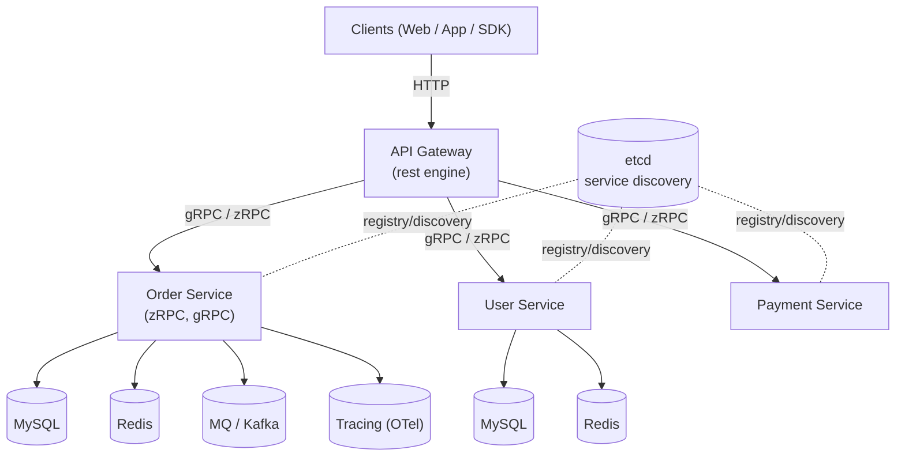
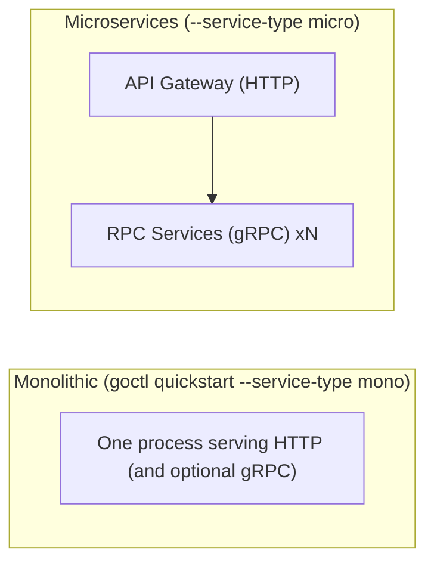

# 01 — Introduction to go-zero

## What is go-zero?

**go-zero** is a cloud-native Go **web + microservices framework** built
specifically to make it fast and easy to build reliable, high-concurrency,
highly-available services. It is widely used in production in China's
largest internet companies (WeChat Pay provenance — the author was an
ex-WeChat engineer).

It has two intertwined halves:

1. **A runtime framework** — batteries included: HTTP server & router, gRPC
   (zRPC) client/server, service discovery, middleware, authentication,
   rate limiting, caching, distributed tracing, metrics, and graceful
   shutdown — all designed to work together.
2. **A code-generation CLI (`goctl`)** — reads a tiny DSL (`.api` for HTTP,
   `.proto` for RPC) and generates complete, idiomatic, production-ready Go
   service code, plus multi-language clients and deployment artifacts.

## The core philosophy

> **"Prefer tools over conventions and documents."**

Instead of writing (and maintaining) the repetitive boilerplate that every
HTTP/gRPC service needs, you describe your contract once in the DSL and the
tool generates the rest. This:

- eliminates boilerplate and handwritten glue,
- keeps API/type definitions as a **single source of truth**,
- gives you consistency across many services,
- frees you to focus on the **business logic** (the `internal/logic` files).

## Architecture diagram



In a typical go-zero microservice architecture:
- **API Gateway** services (the `rest` engine) face the outside world over
  HTTP/JSON and validate/route requests.
- **RPC services** (the `zrpc` engine) provide internal business capabilities
  over gRPC, registered in **etcd** for discovery.
- Gateways call RPC services; RPC services talk to DBs, caches, and message
  queues.
- A single go-zero process can also serve both HTTP and RPC endpoints in a
  **monolithic** (mono) layout — go-zero does not force microservices on you.

> 🧠 **Think of it as:** the Gateway is the front door (HTTP), RPC services are the back-office workers (gRPC), and etcd is the phone book that lets the front door find the right worker.

## What go-zero provides out of the box

| Capability | go-zero feature |
|------------|-----------------|
| HTTP router | `rest` engine; method-based routing via DSL |
| gRPC client/server | `zrpc` (zRPC) built on `google.golang.org/grpc` |
| Service discovery | etcd (built-in), or direct targets |
| Config | yaml config + strong-typed `config` structs, `conf` package |
| Logging | `logx` (structured-ish, color console, file, rotation) |
| Metrics | Prometheus metrics built-in |
| Tracing | OpenTelemetry / distributed tracing integrations |
| Auth | middleware, JWT support, `rest/middleware` |
| Rate limiting | period / token-bucket limiters |
| Caching | `core/stores/cache`, `core/mapping` for SQL/Redis |
| Validation | struct tags + `httpx` validation, custom validation |
| Graceful shutdown | built into the service group |
| Codegen | `goctl`: api, rpc, model, docker, kube, multi-language SDK |

> 💡 **Note:** you won't use all of that at once. A first service is just `rest` + `conf` + `logx` — etcd, caching, metrics and rate limiting are opt-in as you need them.

## Monolith vs microservice



- **Mono**: simplest to start; one binary, one deployment; great for small
  teams / small traffic. go-zero still keeps the clean layered layout.
- **Micro**: separate RPC services discovered via etcd, an API gateway in
  front; scales and isolates better, costs more operational complexity.

Start **mono** and split into microservices only when you actually need to.

> ⚠️ **Watch out:** starting "micro" from day one adds etcd, more config, and more moving parts. Mono is the sane default — go-zero keeps the same clean layer layout either way.

## Installation

### 1. Install Go (≥ 1.21)

Follow the earlier notes in `01-go-fundamentals/01-getting-started.md`.

### 2. Install goctl

```bash
go install github.com/zeromicro/go-zero/tools/goctl@latest
goctl --version   # e.g. goctl version 1.7.3 darwin/arm64
```

(or `brew install goctl`; or `docker pull kevinwan/goctl`.)

The same install command re-run later upgrades it.

### 3. Install protocol tooling (RPC parts only)

```bash
# protoc (the protobuf compiler) — install via package manager
protoc --version

go install google.golang.org/protobuf/cmd/protoc-gen-go@latest
go install google.golang.org/grpc/cmd/protoc-gen-go-grpc@latest
```

goctl can check the environment: `goctl env check`.

## Your first steps

```bash
# mono quickstart (writes code AND runs it)
mkdir quickstart && cd quickstart
goctl quickstart --service-type mono
curl http://127.0.0.1:8888/ping

# micro quickstart (HTTP gateway + gRPC service)
goctl quickstart --service-type micro
```

See the next files (`02-api-dsl-and-goctl`, `03-http-api-services`,
`04-rpc-zrpc-services`) for the full walkthrough.

## Modern Practices

- Use the **DSL + codegen** workflow; never hand-edit generated `handler/`,
  `types/`, or `routes.go`. Regenerate instead.
- Keep the **`.api`/`.proto` file as the source of truth** for types & routes.
- Prefer `goctl quickstart`/`goctl api new` for new services to get a battle
  tested layout.
- Start **mono**, scale to **micro** only when needed.
- Pin/verify goctl & go-zero versions; upgrade deliberately.

## Common Mistakes

- Editing **generated files** by hand — they get overwritten on regenerate.
- Installing goctl but **forgetting protoc** when you later add RPCs.
- Copy-pasting a service without re-running `go mod tidy`.
- Assuming go-zero forces microservices — it happily does monoliths too.
- Ignoring the `etc/*.yaml` config when the service fails to start on a
  different port.

## Key Takeaways

1. go-zero = **runtime framework** + **goctl codegen CLI**.
2. Philosophy: **prefer tools over conventions** — describe, generate, focus
   on logic.
3. Provides HTTP (`rest`), gRPC (`zrpc`), discovery (etcd), config, logging,
   metrics, tracing, caching, rate limiting out of the box.
4. Both **mono** and **micro** architectures are supported.
5. Learn the `.api` DSL and goctl workflow next.

## Next

Continue to [02-api-dsl-and-goctl.md](02-api-dsl-and-goctl.md).
