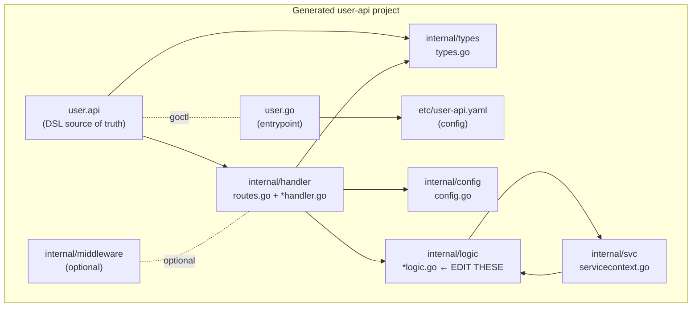

# 02 — The `.api` DSL and goctl

## What is the `.api` DSL?

The `.api` file is go-zero's **declarative contract** for an HTTP API service.
It declares:

- request/response **types** (structs),
- **routes** (method + path → handler → request type → response type),
- service metadata (`info`, `@server` blocks).

goctl reads it and generates: the Go entrypoint, config struct, handler stubs,
route registration, types, and (optionally) clients for many languages.

> The `.api` DSL is **not** Go, but its `type` syntax is very close to Go
> struct syntax, so it's easy to read.

> 🔑 **Key idea:** the `.api` file is a single source of truth — types and routes declared once drive the handlers, types, routes, and clients everywhere else.

## Anatomy of an `.api` file

```go
syntax = "v1"                    // DSL version

type (
    LoginReq struct {
        Username string `json:"username"`   // full JSON tags supported
        Password string `json:"password"`
    }

    LoginResp struct {
        Token string `json:"token"`
    }
)

service user-api {               // service name (used for the yaml/config)
    @handler Login               // handler name (optional block)
    post /user/login (LoginReq) returns (LoginResp)

    @handler GetUserInfo
    get /user/:id (UserInfoReq) returns (UserInfoResp)
}
```

### Route syntax

```
<method> <path> (RequestType) returns (ResponseType)
```

- **method**: `get` | `post` | `put` | `delete` | `head` | `options` | `patch`
- **path**: can contain path params — `:id` (single segment) or `*path`
  (wildcard/rest)
- **RequestType/ResponseType**: types defined in the same file (or imported)

### Tags mean binding

Field tags tell goctl how the field is populated:

| Tag | Source |
|-----|--------|
| `` `json:"name"` `` | JSON request **body** |
| `` `form:"name"` `` | query/form parameter |
| `` `path:"id"` `` | URL path parameter |
| `` `header:"X-User-Id"` `` | request header |
| `default:"x"`, `options:[a,b]`, `range:"[0,100]"` | validation |

> 🧠 **Memory aid:** the tag is where go-zero looks: `json`=body, `form`=query, `path`=URL, `header`=header. If a field comes through as zero, check the tag — not the request.

Example with validation:

```go
type (
    Request struct {
        Name string `path:"name,options=[you,me]"` // auto-validated
        Page int    `form:"page,default=1,range=[1,1000]"`
    }
    Response struct {
        Message string `json:"message"`
    }
)
```

## Instantiating a service from the DSL

Two main workflows:

### A. `goctl api new <name>` — scaffold from scratch

```bash
goctl api new greet
cd greet
go mod tidy
go run greet.go
```

This generates a working project with a sample `.api`, config, entrypoint,
and a stub logic layer.

### B. `goctl api go -api x.api -dir .` — from an existing `.api`

```bash
mkdir user-api && cd user-api
# write user.api by hand (or goctl api -o user.api for a template)
go mod init user-api
goctl api go -api user.api -dir .
go mod tidy
```

Use this when the `.api` is the **source of truth** for the team (e.g.,
checked into a shared repo).

### Regenerating after DSL changes

```bash
goctl api go -api user.api -dir .
```

goctl **only overwrites files it owns** (`handler/`, `types/`, `routes.go`,
config, entrypoint). Your `internal/logic/` edits are **preserved**.

## The generated project layout



What the folders mean:

| Folder | Purpose | Edit? |
|--------|---------|-------|
| `internal/config` | `Config` struct mirroring the yaml | yes (add fields) |
| `internal/handler` | HTTP handlers + `routes.go` | **no** (regenerated) |
| `internal/logic` | business logic per route | **yes** — the main work |
| `internal/middleware` | custom middleware hooks | yes |
| `internal/svc` | `ServiceContext` sharing deps (db, redis) | yes |
| `internal/types` | request/response structs | **no** (regenerated) |
| `etc/*.yaml` | runtime configuration | yes |
| `<name>.go` | main entrypoint | **no** |

> 💡 **Pro tip:** memorize the edit/regenerate split: `handler/`, `types/`, `routes.go` and the entrypoint are machine-owned; `logic/`, `svc/`, `config/`, `middleware/` are yours. Commit the `.api`, not the glue.

## Implementing the logic (the only thing you normally write)

After generation, open `internal/logic/loginlogic.go`:

```go
package logic

import (
	"context"
	"errors"

	"user-api/internal/svc"
	"user-api/internal/types"

	"github.com/zeromicro/go-zero/core/logx"
)

type LoginLogic struct {
	logx.Logger
	ctx    context.Context
	svcCtx *svc.ServiceContext
}

func NewLoginLogic(ctx context.Context, svcCtx *svc.ServiceContext) *LoginLogic {
	return &LoginLogic{
		Logger: logx.WithContext(ctx),
		ctx:    ctx,
		svcCtx: svcCtx,
	}
}

func (l *LoginLogic) Login(req *types.LoginReq) (resp *types.LoginResp, err error) {
	// In production: verify against DB, issue a real JWT.
	if req.Username == "admin" && req.Password == "secret" {
		return &types.LoginResp{Token: "mock-jwt-token-for-" + req.Username}, nil
	}
	return nil, errors.New("invalid credentials")
}
```

Observations:

- Every logic struct carries a **`*svc.ServiceContext`** so you can share
  dependencies (DB, Redis, other RPC clients).
- It embeds **`logx.Logger`** for contextual logging.
- The `ctx` is per-request — use it for cancellation propagation.
- Signature is generated from the DSL route; return `(resp, err)`.

> 💡 **Note:** the generated handler calls `logic.NewXLogic(ctx, svcCtx)` for you — only the `Logic` file changes when a business rule changes.

## goctl sub-commands quick reference

| Command | Generates |
|---------|-----------|
| `goctl api new <name>` | new HTTP API service skeleton |
| `goctl api go -api f.api -dir .` | Go code from `.api` |
| `goctl api -o greet.api` | a sample/blank `.api` template |
| `goctl api format -api f.api` | formats the `.api` file |
| `goctl api validate -api f.api` | validates the `.api` file |
| `goctl api doc -api f.api` | API docs |
| `goctl api swagger -api f.api` | Swagger/OpenAPI spec |
| `goctl api ts / dart / kt / java -api f.api` | language client SDKs |
| `goctl rpc new <name>` | new zRPC (gRPC) service skeleton |
| `goctl rpc protoc f.proto ...` | Go + zRPC code from `.proto` |
| `goctl model mysql ddl -src f.sql -dir .` | DB model layer from SQL |
| `goctl docker -go main.go` | Dockerfile |
| `goctl kube deploy -name s -namespace n ...` | Kubernetes manifest |
| `goctl template init` | initialize custom templates |

> ⚠️ **Gotcha:** customized templates only apply when goctl knows where they live — regenerate with the `-home` flag pointing at your customized dir, or your tweaks are silently ignored.

## Custom templates

For team conventions (error codes, logging, OpenTelemetry, CI config), goctl
supports templates:

```bash
goctl template init          # write default templates to ~/.goctl
vim ~/.goctl/api/logic.tpl   # customize the logic template
goctl api go -api x.api -dir .   # regenerate using your templates
```

## Modern Practices

- Treat the **`.api` as the source of truth**; review it in code review.
- **Regenerate, don't hand-edit** generated files; only touch `logic/`,
  `svc/`, `config/`, `middleware/`.
- Use **validation tags** (`options`, `range`, `default`) in the DSL so bad
  input is rejected before it reaches your logic.
- Keep `@handler` names descriptive (they become route handler identifiers).
- Run `goctl api validate` and `goctl api format` before committing.
- Generate Swagger (`goctl api swagger`) for client/API documentation.

## Common Mistakes

- Editing `handler/*.go`, `types/*.go`, or `routes.go` by hand — overwritten
  on next regenerate.
- Forgetting to run `go mod tidy` after generating (missing deps).
- Using `:id` when you meant a JSON/body param (or vice versa) — wrong binding.
- Not adding validation tags, letting invalid input reach business logic.
- Duplicating logic across many handlers instead of using shared helper /
  service methods.
- Ignoring the generated `svc.ServiceContext` and initializing deps inside a
  single handler.

## Key Takeaways

1. `.api` DSL declares **types + routes** in one place = single source of truth.
2. `goctl api go` (or `api new`) generates a **production-ready** service.
3. You normally only implement **`internal/logic`**, sharing deps via
   `svc.ServiceContext`.
4. Field tags (`json`/`form`/`path`/`header`) determine binding; validation
   tags (`options`/`range`/`default`) enforce input rules.
5. Regenerate safely — goctl **preserves your logic** files.

## Next

Continue to [03-http-api-services.md](03-http-api-services.md).
