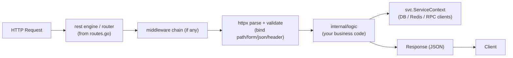

# 03 — Building HTTP API Services

Now we build a complete, real HTTP API service in go-zero and walk through
every part: config, entrypoint, ServiceContext, handlers, logic, and running it.

## The full example: a small user service

### Step 1 — the DSL (`user.api`)

```go
syntax = "v1"

type (
	LoginReq struct {
		Username string `json:"username"`
		Password string `json:"password"`
	}
	LoginResp struct {
		Token string `json:"token"`
	}
)

type (
	UserInfoReq struct {
		Id int64 `path:"id"`
	}
	UserInfoResp struct {
		Id       int64  `json:"id"`
		Username string `json:"username"`
		Email    string `json:"email"`
	}
)

service user-api {
	@handler Login
	post /user/login (LoginReq) returns (LoginResp)

	@handler GetUserInfo
	get /user/:id (UserInfoReq) returns (UserInfoResp)
}
```

> 🔑 **Remember:** one route = one `@handler` + one generated logic struct. The DSL line above controls the handler name, the binding tags, and the logic method signature.

### Step 2 — generate

```bash
mkdir user-api && cd user-api
go mod init user-api
goctl api go -api user.api -dir .
go mod tidy
```

### Step 3 — inspect the generated entrypoint (`user.go`)

```go
package main

import (
	"flag"
	"fmt"

	"user-api/internal/config"
	"user-api/internal/handler"
	"user-api/internal/svc"

	"github.com/zeromicro/go-zero/core/conf"
	"github.com/zeromicro/go-zero/rest"
)

var configFile = flag.String("f", "etc/user-api.yaml", "the config file")

func main() {
	flag.Parse()

	var c config.Config
	conf.MustLoad(*configFile, &c)   // load yaml into the typed struct

	server := rest.MustNewServer(rest.RestConf{
		Host: c.Host,
		Port: c.Port,
	}, rest.WithUnauthorizedCallback(...))  // optional
	defer server.Stop()

	ctx := svc.NewServiceContext(c)          // build shared dependencies
	handler.RegisterHandlers(server, ctx)    // register all routes

	fmt.Printf("Starting server at %s:%d...\n", c.Host, c.Port)
	server.Start()
}
```

> 💡 **Note:** this entrypoint is nearly identical across go-zero services. `conf.MustLoad` reads the yaml into a typed struct — get the `-f` path right and you rarely touch this file again.

### Step 4 — config (`etc/user-api.yaml` + `internal/config/config.go`)

```yaml
Name: user-api
Host: 0.0.0.0
Port: 8888
Log:
  Mode: console
  Level: info
```

```go
package config

import "github.com/zeromicro/go-zero/rest"

type Config struct {
	rest.RestConf        // embeds Name, Host, Port, Log, Metrics, etc.
	// Add your own fields, e.g.:
	// Mysql struct{ Dsn string } `json:"Mysql"`
}
```

`rest.RestConf` already provides Name/Host/Port/Cert/Log/Timeout/MaxBytes,
so you usually just embed it and add your own settings.

### Step 5 — ServiceContext (`internal/svc/servicecontext.go`)

```go
package svc

import (
	"user-api/internal/config"
	// "user-api/model"           // DB model layer
	// "github.com/redis/go-redis/v9"
)

type ServiceContext struct {
	Config config.Config
	// DB    *gorm.DB          // or sqlx
	// Cache *redis.Client
}

func NewServiceContext(c config.Config) *ServiceContext {
	return &ServiceContext{
		Config: c,
		// DB:    initDB(c),
		// Cache: redis.NewClient(&redis.Options{Addr: c.Cache.Addr}),
	}
}
```

> 🔑 **Key idea:** `ServiceContext` is the app's dependency hub — DB, Redis, and RPC clients are built once here and handed to every logic via `svcCtx`.

### Step 6 — implement logic

`internal/logic/loginlogic.go`:

```go
package logic

import (
	"context"
	"errors"

	"user-api/internal/svc"
	"user-api/internal/types"

	"github.com/zeromicro/go-zero/core/logx"
)

type LoginLogic struct {
	logx.Logger
	ctx    context.Context
	svcCtx *svc.ServiceContext
}

func NewLoginLogic(ctx context.Context, svcCtx *svc.ServiceContext) *LoginLogic {
	return &LoginLogic{
		Logger: logx.WithContext(ctx),
		ctx:    ctx,
		svcCtx: svcCtx,
	}
}

func (l *LoginLogic) Login(req *types.LoginReq) (resp *types.LoginResp, err error) {
	if req.Username == "admin" && req.Password == "secret" {
		return &types.LoginResp{Token: "mock-jwt-" + req.Username}, nil
	}
	return nil, errors.New("invalid credentials")
}
```

`internal/logic/getuserinfologic.go`:

```go
func (l *GetUserInfoLogic) GetUserInfo(req *types.UserInfoReq) (resp *types.UserInfoResp, err error) {
	// In production: SELECT ... FROM user WHERE id = req.Id using l.svcCtx.DB
	return &types.UserInfoResp{
		Id:       req.Id,
		Username: "alice",
		Email:    "alice@example.com",
	}, nil
}
```

### Step 7 — run & test

```bash
go run user.go
# Starting server at 0.0.0.0:8888...

curl -X POST http://localhost:8888/user/login \
  -H "Content-Type: application/json" \
  -d '{"username":"admin","password":"secret"}'
# {"token":"mock-jwt-admin"}

curl http://localhost:8888/user/42
# {"id":42,"username":"alice","email":"alice@example.com"}
```

## How a request flows through



> 🧠 **Memory aid:** the request walks forward — router → middleware → parse → logic — and the response walks back. Only the `logic` layer is yours to write; everything before it is go-zero's.

## The `rest` engine

`rest.MustNewServer` / `rest.NewServer` build the HTTP server. Key points:

- Uses **`net/http`** under the hood, so everything you know from Part 7
  applies (handlers are `http.Handler`-compatible).
- Routes are registered via `RegisterHandlers(server, ctx)` — goctl generates
  this from the DSL.
- Built-in **middleware support** (see Part 05-advanced) and metrics/logging.

### A note on routes & paths

- `get /user/:id` → single-segment param, bound to `` `path:"id"` ``.
- `get /user/*rest` (or `/user/:name/*rest`) → wildcard catch-all.
- Method collapse: same path with different methods = different handlers
  (like Go 1.22 ServeMux from Part 7, but declared in the DSL).

## Config and environments

Separate yaml per environment is conventional:

```
etc/user-api.yaml        # dev
etc/user-api-prod.yaml   # prod (Name/Host/Port/log level differ)
```

```bash
go run user.go -f etc/user-api.yaml
go run user.go -f etc/user-api-prod.yaml
```

The `conf` package loads YAML into the typed `Config` struct and fails fast on
missing fields — catching mistakes at startup instead of runtime.

> 💡 **Pro tip:** per-environment yaml + the `-f` flag is the go-zero way to switch environments — same binary, different config — and `conf` failing fast surfaces config typos at boot.

## Adding a DB dependency to ServiceContext

When you have a model layer (from `goctl model mysql ddl`), wire it in:

```go
package svc

import (
	"user-api/internal/config"
	"user-api/model"
	"github.com/zeromicro/go-zero/core/stores/sqlx"
)

type ServiceContext struct {
	Config    config.Config
	UserModel model.UserModel   // interface from the model layer
}

func NewServiceContext(c config.Config) *ServiceContext {
	conn := sqlx.NewMysql(c.Mysql.Dsn)
	return &ServiceContext{
		Config:    c,
		UserModel: model.NewUserModel(conn, c.CacheRedis),
	}
}
```

Then any logic can call `l.svcCtx.UserModel.FindOne(l.ctx, id)`.

> ⚠️ **Watch out:** build shared deps in `NewServiceContext`, never inside a handler or logic method — otherwise every request re-creates connections and testing becomes impossible.

## Modern Practices

- **Never** put business logic in handler files — keep it in `logic/`.
- Initialize **shared dependencies in ServiceContext**, not per handler.
- Keep config in **typed structs**; fail fast via `conf.MustLoad`.
- Return proper **error responses** using go-zero's `httpx.Error` / your own
  error type (see advanced notes) instead of raw strings.
- Use per-environment **yaml files** and never commit secrets.
- Use `logx.WithContext(ctx)` so logs carry request context in distributed
  tracing.

## Common Mistakes

- Forgetting `flag.Parse()` / `-f` config path → server starts with defaults
  or fails.
- Embedding `rest.RestConf` but not adding your own config fields, then
  wondering why DB config isn't loaded.
- Panicking when config is missing instead of using `conf.MustLoad`'s clear
  error (that's actually a helper, use it).
- Doing DB work directly in handlers (bypasses ServiceContext and testing).
- Not binding/validating inputs before using them.

## Key Takeaways

1. goctl generates entrypoint, config, handlers, routes, types — you fill in
   **logic**.
2. **ServiceContext** is the hub for shared dependencies.
3. Config is typed YAML; load with `conf.MustLoad`, fail fast.
4. Request flow: router → middleware → parse/validate → logic → response.
5. Wire DB/Redis/RPC into ServiceContext, call them from logic.

## Next

Continue to [04-rpc-zrpc-services.md](04-rpc-zrpc-services.md).
