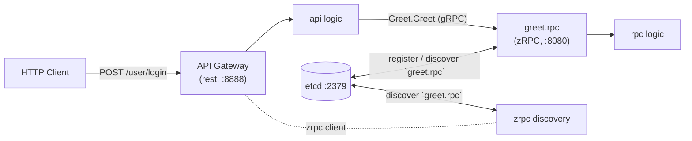

# 04 — RPC Services (zRPC) and Calling Them

go-zero's RPC engine is called **zRPC** and is built on top of
`google.golang.org/grpc` + **Protocol Buffers**. Everything you learned in
`08-grpc-protobuf` applies; go-zero adds service discovery, configuration, and
codegen ergonomics on top.

## The workflow: describe → generate → implement → call

1. Write a `.proto` file (or `goctl rpc template`).
2. Generate with `goctl rpc protoc` (or `goctl rpc new`).
3. Implement the business logic in `internal/logic`.
4. The API gateway calls the RPC via a generated client + etcd discovery.

> 🔑 **Key idea:** the whole zRPC flow is describe → generate → implement → call. You only ever write the `.proto` and the `logic`; clients and servers are tooling's job.

## Step 1 — the `.proto`

A minimal `greet.proto`:

```protobuf
syntax = "proto3";

package greet;

option go_package = "./pb";

message Request {
  string name = 1;
}

message Response {
  string message = 1;
}

service Greet {
  rpc Greet(Request) returns (Response);
}
```

## Step 2 — generate the zRPC service

```bash
mkdir rpc && cd rpc
goctl rpc new greet
# OR, from an existing .proto:
goctl rpc protoc greet.proto --go_out=./pb --go-grpc_out=./pb --zrpc_out=.
go mod tidy
```

The generated layout:

```
rpc/greet/
├── etc/greet.yaml          # config (ListenOn, Etcd, etc.)
├── internal/
│   ├── config/config.go
│   ├── logic/greetlogic.go   # ← implement business logic
│   ├── server/greetserver.go # generated server binding
│   └── svc/servicecontext.go
├── greet.go                # rpc main entry
├── greet.proto             # rpc definition
├── greetclient/greet.go    # client call entry
└── pb/greet.pb.go          # generated protobuf types
```

## Step 3 — the generated entrypoint (`greet.go`)

```go
package main

import (
	"flag"

	"rpc/greet/internal/config"
	"rpc/greet/internal/server"
	"rpc/greet/internal/svc"
	"rpc/greet/pb"

	"github.com/zeromicro/go-zero/core/conf"
	"github.com/zeromicro/go-zero/core/service"
	"github.com/zeromicro/go-zero/zrpc"
	"google.golang.org/grpc/reflection"
)

var configFile = flag.String("f", "etc/greet.yaml", "the config file")

func main() {
	flag.Parse()
	var c config.Config
	conf.MustLoad(*configFile, &c)

	ctx := svc.NewServiceContext(c)
	srv := server.NewGreetServer(ctx)

	s := zrpc.MustNewServer(c.RpcServerConf, func(grpcServer *grpc.Server) {
		pb.RegisterGreetServer(grpcServer, srv)
		if c.Mode == service.DevMode || c.Mode == service.TestMode {
			reflection.Register(grpcServer)   // easy debugging via grpcurl
		}
	})
	defer s.Stop()
	s.Start()
}
```

## Step 4 — config (`etc/greet.yaml`)

```yaml
Name: greet.rpc
ListenOn: 0.0.0.0:8080
Etcd:
  Hosts:
    - 127.0.0.1:2379
  Key: greet.rpc      # the unique service key registered in etcd
```

When `Etcd` is configured, go-zero **registers the service in etcd** and other
services discover it by `Key`. If you have no etcd, you can use a **direct**
target (`Target: dns:///host:port` or a comma list of endpoints).

> ⚠️ **Watch out:** with `Etcd` configured but no etcd running, the service never registers and clients can't dial — for local dev or CI, point the client at a `Target`/direct address instead.

## Step 5 — implement the logic (`internal/logic/greetlogic.go`)

```go
package logic

import (
	"context"

	"rpc/greet/internal/svc"
	"rpc/greet/pb"

	"github.com/zeromicro/go-zero/core/logx"
)

type GreetLogic struct {
	ctx    context.Context
	svcCtx *svc.ServiceContext
	logx.Logger
}

func NewGreetLogic(ctx context.Context, svcCtx *svc.ServiceContext) *GreetLogic {
	return &GreetLogic{ctx: ctx, svcCtx: svcCtx, Logger: logx.WithContext(ctx)}
}

func (l *GreetLogic) Greet(in *pb.Request) (*pb.Response, error) {
	return &pb.Response{Message: "Hello " + in.Name}, nil
}
```

The **Logic** is where all business code lives. The **Server** (generated) is
just a thin adapter calling into the logic.

## Step 6 — run and test

```bash
go run greet.go -f etc/greet.yaml
# Starting rpc server at 0.0.0.0:8080...

# grpcurl (with reflection enabled):
grpcurl -plaintext -d '{"name":"world"}' 0.0.0.0:8080 greet.Greet/Greet
# {"message":"Hello world"}
```

## Calling an RPC service FROM an API gateway

The usual pattern: an HTTP API gateway (Part 03) calls the RPC service.

### Add a zrpc client config to the API service

```go
// internal/config/config.go
package config

import (
	"github.com/zeromicro/go-zero/rest"
	"github.com/zeromicro/go-zero/zrpc"
)

type Config struct {
	rest.RestConf
	Greet zrpc.RpcClientConf   // config to connect to the greet rpc
}
```

```yaml
# etc/user-api.yaml
Name: user-api
Host: 0.0.0.0
Port: 8888
Greet:
  Etcd:
    Hosts:
      - 127.0.0.1:2379
    Key: greet.rpc
```

> ⚠️ **Gotcha:** the client's `Etcd.Key` must exactly match the service's `Etcd.Key` — a mismatch means "no service found", and the error won't point at the key name.

### Wire the client into ServiceContext

```go
// internal/svc/servicecontext.go
package svc

import (
	"user-api/internal/config"
	"user-api/greetclient"

	"github.com/zeromicro/go-zero/zrpc"
)

type ServiceContext struct {
	Config config.Config
	Greet  greetclient.Greet  // the RPC client interface
}

func NewServiceContext(c config.Config) *ServiceContext {
	return &ServiceContext{
		Config: c,
		Greet:  greetclient.NewGreet(zrpc.MustNewClient(c.Greet)), // discovery via etcd
	}
}
```

### Use it in an HTTP logic

```go
func (l *SayHelloLogic) SayHello(req *types.Request) (resp *types.Response, err error) {
	// l.svcCtx.Greet is the RPC client; it does discovery + load balancing
	res, err := l.svcCtx.Greet.Greet(l.ctx, &pb.Request{Name: req.Name})
	if err != nil {
		return nil, err
	}
	return &types.Response{Message: res.Message}, nil
}
```

## Architecture: API gateway + RPC + etcd



> 🧠 **Memory aid:** etcd is the phone book — services *register* their `Key` on startup; clients *look up* the same `Key` when they call. Nobody hardcodes an address.

## Streaming, interceptors, deadlines

zRPC supports the full gRPC feature set you learned in `08-grpc-protobuf`:

- **Unary**, **server streaming**, **client streaming**, **bidirectional** RPCs.
- **Interceptors** (unary & stream) for auth, logging, metrics, recovery.
- **Deadlines/timeouts**: `context.WithTimeout`/`WithDeadline` from the API
  side propagate to RPC service.
- **Status codes / errors**: return `status.Error(codes.InvalidArgument, ...)`.

goctl generates separate server/logic for each RPC method. For streaming, the
generated `Logic` method receives the gRPC stream interface you implement
(e.g., a `stream.Greet_SubscribeServer`).

> 💡 **Pro tip:** set a per-service `Timeout` in the RPC client yaml and propagate `ctx` end-to-end — otherwise one slow RPC blocks the gateway indefinitely.

## Modern Practices

- Let goctl generate, then **implement logic only**; keep the generated server
  untouched.
- Use **etcd for discovery** in multi-service setups; use direct targets in
  tests/CI to avoid the etcd dependency.
- Enable **reflection** in dev/test for `grpcurl` debugging.
- Propagate **context** end-to-end so deadlines & tracing flow across services.
- Set per-service **timeouts** in the yaml (`Timeout:` in `RpcClientConf`) to
  avoid cascading hangs.
- Return typed gRPC **status errors** so the client can distinguish
  not-found/conflict/temporary failures.

## Common Mistakes

- Configuring the client key that doesn't match the service's `Etcd.Key`.
- **Missing etcd** but leaving discovery config → service never dials; use
  `Target`/direct for local dev.
- Not setting a **client timeout** → a slow RPC blocks the gateway forever.
- Forgetting to import the pb package / generated client properly.
- Implementing business logic in the **server** file instead of **logic**.
- Mixing HTTP error handling with gRPC status codes incorrectly across the
  gateway boundary.

## Key Takeaways

1. zRPC = gRPC + service discovery + go-zero config/codegen ergonomics.
2. `.proto` → `goctl rpc protoc` → generated entrypoint/client/server → you
   implement **logic**.
3. Services register in **etcd** by `Key`; clients discover by the same key.
4. API gateways call RPCs via a **client wired into ServiceContext**.
5. All gRPC features (streaming, interceptors, deadlines, status codes) apply.

## Next

Continue to [05-advanced-patterns.md](05-advanced-patterns.md).
