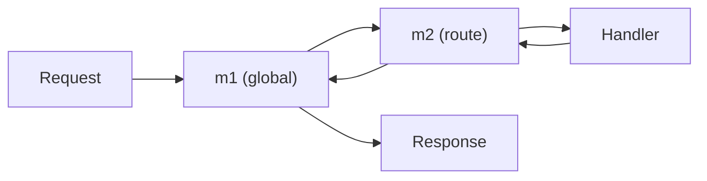

# 05 — Advanced Patterns

This file covers the go-zero features that make real services production-grade:
middleware, interceptors, `httpx` helpers, validation, error handling, caching,
rate limiting, metrics, and auth — with the shared idioms you'll use daily.

## 1. Middleware (HTTP, `rest`)

Middleware wraps requests before/after they hit the handler. Two ways to use it:

### A. Route-level middleware registered in code

```go
// middleware/loggingmiddleware.go
package middleware

import "net/http"

func LoggingMiddleware(next http.HandlerFunc) http.HandlerFunc {
	return func(w http.ResponseWriter, r *http.Request) {
		// before handler
		next(w, r)
		// after handler
	}
}
```

> 🔑 **Key idea:** a go-zero middleware is just a wrapper around an `http.HandlerFunc` — the same middleware you wrote in Gin/Part 7, with optional DSL declaration on top.

Attach globally when creating the server:

```go
server := rest.MustNewServer(c.RestConf, rest.WithMiddleware(func(next http.HandlerFunc) http.HandlerFunc {
	return func(w http.ResponseWriter, r *http.Request) {
		// BEFORE
		next(w, r)
		// AFTER
	}
}))
```

### B. DSL-declared middleware (goctl)

Declare middleware classes in the `.api` and reference them per route:

```go
@server(
	middleware: Auth   // name must correspond to a struct in internal/middleware
)
service user-api {
	@handler GetUserInfo
	get /user/:id (UserInfoReq) returns (UserInfoResp)
}
```

goctl generates `internal/middleware/authmiddleware.go`:

```go
package middleware

import "net/http"

type AuthMiddleware struct{}

func NewAuthMiddleware() *AuthMiddleware {
	return &AuthMiddleware{}
}

func (m *AuthMiddleware) Handle(next http.HandlerFunc) http.HandlerFunc {
	return func(w http.ResponseWriter, r *http.Request) {
		// parse & verify JWT, reject with 401 if invalid
		next(w, r)
	}
}
```

Wire it in ServiceContext so the handler layer can instantiate it:

```go
type ServiceContext struct {
	Config config.Config
	Auth   *middleware.AuthMiddleware
}

func NewServiceContext(c config.Config) *ServiceContext {
	return &ServiceContext{Config: c, Auth: middleware.NewAuthMiddleware()}
}
```

## 2. Middleware chain order



Global middleware (added in `rest.NewServer(...WithMiddleware)`) runs first;
route middleware declared in the DSL runs in declaration order. Each can short
circuit by writing a response and not calling `next`.

> 🧠 **Memory aid:** middleware layers wrap the handler like an onion — global on the outside, route-level inside. Skipping `next()` returns early without reaching the core.

## 3. Interceptors (zRPC / gRPC)

For RPC services, use gRPC **unary** and **stream** interceptors. goctl lets
you hook them via the server options:

```go
s := zrpc.MustNewServer(c.RpcServerConf, func(grpcServer *grpc.Server) {
	pb.RegisterGreetServer(grpcServer, srv)
}, zrpc.WithUnaryServerInterceptor(func(ctx context.Context, req any, info *grpc.UnaryServerInfo, handler grpc.UnaryHandler) (any, error) {
	// BEFORE
	resp, err := handler(ctx, req)
	// AFTER (log duration, method, errors)
	return resp, err
}))
```

Common interceptors: auth, logging, metrics, panic recovery, request-ID.

## 4. `httpx` helpers

`github.com/zeromicro/go-zero/rest/httpx` has request/response utilities that
go-zero's generated handlers already use:

```go
httpx.Parse(r, &req)          // bind JSON/form/query/path + validate tags
httpx.ParseForm(r, &req)
httpx.ParseJsonBody(r, &req)
httpx.OkJson(w, resp)          // 200 + JSON
httpx.Ok(w, resp)
httpx.WriteJson(w, code, resp)
httpx.Error(w, err)            // map err -> status/JSON
httpx.ErrorCtx(ctx, w, err)    // context-aware variant
httpx.JsonBaseResponse(w, ...) // unified response envelope
```

A common unified-response-wrapper pattern:

```go
func wrap(next http.HandlerFunc) http.HandlerFunc {
	return func(w http.ResponseWriter, r *http.Request) {
		var buf bytes.Buffer
		// capture body, then wrap in {code,msg,data}
		next(w, r)
	}
}
```

> 💡 **Pro tip:** standardize on one response envelope (e.g. `{code,msg,data}` via `httpx.JsonBaseResponse`) and route all handlers through it — clients get a stable contract.

## 5. Validation

Tags on DSL types become validation at request time (via `httpx.Parse`):

```go
type RegisterReq struct {
	Name     string `form:"name,options=[user,admin]"` // restrict values
	Age      int    `form:"age,range=[0,150]"`          // numeric range
	Email    string `form:"email"`                       // add custom validator
	Password string `form:"password,optional"`           // optional field
	Page     int    `form:"page,default=1"`              // default if absent
}
```

Custom validation functions can be registered globally (go-zero supports
a `Validator(customValidator)` option via `rest` and `httpx`).

## 6. Error handling & unified error type

Define a custom error carrying an HTTP code + friendly message, then map it
everywhere via a helper:

```go
// internal/err/err.go
package err

import "net/http"

type ApiError struct {
	Code    int    `json:"code"`
	Message string `json:"message"`
}

func (e *ApiError) Error() string { return e.Message }

func New(code int, msg string) *ApiError { return &ApiError{Code: code, Message: msg} }

func NotFound(msg string) *ApiError { return New(http.StatusNotFound, msg) }
```

Return it from logic:

```go
func (l *GetUserInfoLogic) GetUserInfo(req *types.UserInfoReq) (*types.UserInfoResp, error) {
	if req.Id != 42 {
		return nil, err.NotFound("user not found")
	}
	// ...
}
```

Convert to responses centrally in a middleware or the `httpx.Error` handler so
clients always get `{code,message}` instead of raw Go error strings.

> ⚠️ **Watch out:** returning plain `errors.New(...)` leaks internals and gives an inconsistent JSON shape — map every error to your `{code,message}` type in one place.

## 7. Caching

go-zero's `core/stores/cache` provides cache-aside via Redis with
**single-flight** on cache misses to avoid stampede:

```go
import "github.com/zeromicro/go-zero/core/stores/cache"

var c = cache.NewNode("localhost:6379", cache.NodeConf{})

func getUser(id string) (string, error) {
	var v string
	err := c.Get(id, &v)          // try cache
	if err == nil {
		return v, nil
	}
	v = loadFromDB(id)            // on miss, load from source
	_ = c.SetWithExpire(id, v, time.Hour)
	return v, nil
}
```

For DB model layers generated with `goctl model mysql`, cache is built-in:
`FindOne`, `FindOneByXxx`, `Insert`, `Update`, `Delete` all use an optional
Redis cache + singleflight automatically.

> 💡 **Note:** the model-layer cache is automatic — cache keys derive from PK and unique indexes, so the hard part is invalidation on writes, not cache setup.

## 8. Rate limiting

go-zero ships limiters you can drop into ServiceContext or an interceptor:

```go
import "github.com/zeromicro/go-zero/core/limit"

// token bucket with a Redis node
limiter := limit.NewTokenLimiter(rate, burst, store, "user-api")

if !limiter.Allow() {
	// 429 Too Many Requests
}
```

Also `limit.NewPeriodLimit` for period-based quotas. There are also
`core/breaker` circuit breakers for resilient downstream calls.

## 9. Auth (JWT)

Three common approaches:
- **JWT via `rest.JwtConf`** in config: go-zero validates `Authorization:
  Bearer <token>` using configured secret/key against the route.
- **Custom middleware** (above) reading/refreshing tokens and putting the
  identity into context:
  ```go
  ctx = context.WithValue(r.Context(), "userId", claims.Sub)
  r = r.WithContext(ctx)
  ```
  then read it in logic: `l.ctx.Value("userId")`.
- **zRPC interceptors** for service-to-service auth.

See also `12-architecture-auth-production/authentication-security.md` for the
full JWT/OAuth/OIDC treatment — go-zero services typically use the same
patterns on top of the framework.

> 🔑 **Remember:** carry identity in `context`, never in globals — set it in middleware/interceptors, read it in logic, and re-validate on every service hop.

## 10. Metrics & observability

- go-zero exposes Prometheus metrics via config; add your own counters/gauges
  with `prometheus`/`metric`.
- `logx` integrates with context for clean request-scoped logs.
- Distributed tracing via OpenTelemetry propagates across API → zRPC hops.

## Modern Practices

- Centralize middleware and **error mapping**; keep handles thin.
- Use validation tags in the DSL **and** a custom validator for business rules.
- Combine **cache (singleflight) + DB** for hot reads; cache the right key.
- Rate limit at the gateway; circuit-break downstream RPC/HTTP calls.
- Carry identity in **context**, not globals; validate on every hop.

## Common Mistakes

- Putting auth/rate-limit logic inside **handlers** instead of middleware.
- Returning **raw Go errors** to clients (leaks internals & inconsistent shape).
- Cache without **singleflight** → cache-stampede under load.
- Applying rate limiting only to the **API gateways** and not internal RPCs.
- Forgetting to **propagate context** so deadlines/identity reach downstream.

## Key Takeaways

1. Middleware: global (`rest.WithMiddleware`) and DSL-declared route middleware.
2. zRPC uses gRPC **interceptors** for cross-cutting concerns.
3. `httpx` does parse+validate+respond; build a **unified error type**.
4. Use `core/stores/cache` (singleflight) and `limit`/`breaker` for scale.
5. JWT auth via config or middleware; identity flows through context.

## Next

Continue to [06-production-patterns.md](06-production-patterns.md).
