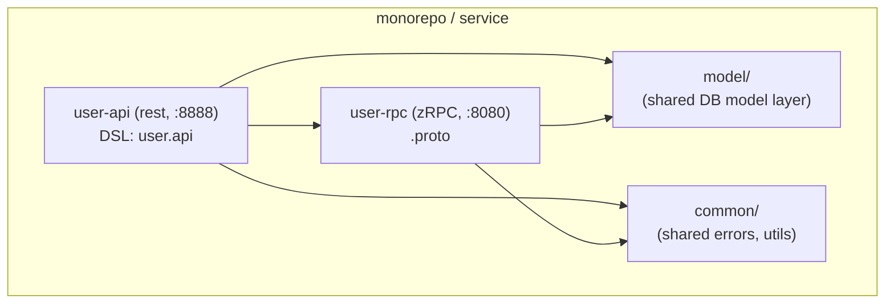
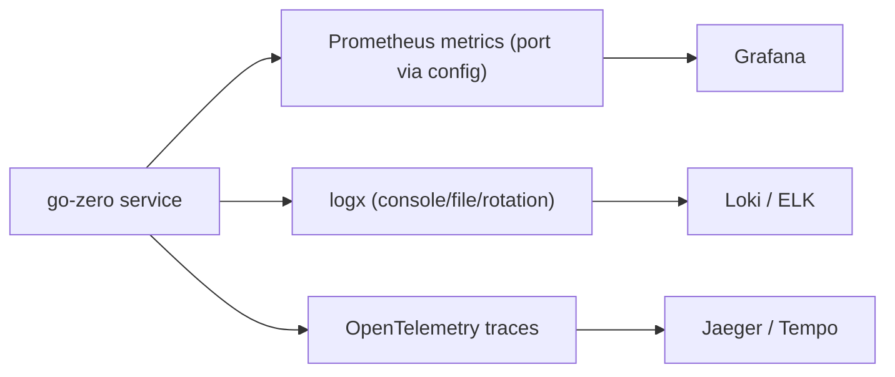
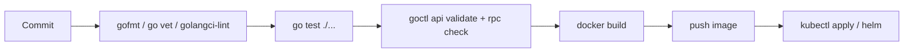

# 06 — Production Patterns

Taking go-zero services to production: project structure, models, Docker,
Kubernetes, observability, and the "modern practices vs common mistakes" lens
consistent with the rest of *Go Complete Notes*.

## Structuring a real project



Layering is strict and consistent across teams (this is go-zero's main
value): config → handler → logic → (model/data) and everything else in
`common/` for reuse.

> 🔑 **Key idea:** the layered layout config → handler → logic → model is go-zero's core consistency win — a new engineer can find code in any service on day one.

## Database model layer with `goctl model`

Generate a typed, cached CRUD model from a DDL so you never hand-write SQL
boilerplate:

```sql
-- user.sql
CREATE TABLE `user` (
  `id` bigint unsigned NOT NULL AUTO_INCREMENT,
  `name` varchar(255) NOT NULL DEFAULT '',
  `email` varchar(255) NOT NULL DEFAULT '',
  `create_time` datetime NOT NULL,
  `update_time` datetime NOT NULL,
  PRIMARY KEY (`id`),
  UNIQUE KEY `uniq_email` (`email`)
) ENGINE=InnoDB DEFAULT CHARSET=utf8mb4;
```

```bash
goctl model mysql ddl -src user.sql -dir model
```

Generated `model/` package provides `UserModel` (interface) with methods:

```go
FindOne(ctx, id)                    // caches via Redis w/ singleflight
FindOneByEmail(ctx, email)
FindOneByEmailAndName(ctx, email, name) // generates from unique keys
Insert(ctx, data)                   // sets create/update_time
Update(ctx, data)
SoftDelete(ctx, id)                 // needs deleted_at design
Delete(ctx, id)
```

Wire the model into `svc.ServiceContext` (see Part 03) and call it from logic.
The cache layer keys by PK and unique indexes automatically.

> 💡 **Pro tip:** never hand-write CRUD — regenerate the model layer from DDL and reuse what `goctl model` gives you: caching, singleflight, and unique-key lookups for free.

## Configuration best practices

- One `etc/*.yaml` per environment (`-f` flag).
- Secrets (DB passwords, JWT keys, Redis creds) injected via env vars or a
  vault, never committed. Map them into the typed config with
  `${ENV_VAR}` or via config-providers.
- Set sane server values in the yaml: `Timeout`, `MaxBytes`, `Log.Level`.

> ⚠️ **Watch out:** secrets in `etc/*.yaml` get committed too easily — map `${ENV_VAR}` placeholders into the typed config (or use a config provider) so DB passwords and JWT keys never touch the repo.

## Docker

`goctl docker` generates a multi-stage Dockerfile from your entrypoint:

```bash
goctl docker -go user.go
```

```dockerfile
FROM golang:1.22 AS builder
WORKDIR /src
COPY . .
RUN GOPROXY=https://proxy.golang.org,direct go mod download
RUN GOPROXY=https://proxy.golang.org,direct go build -ldflags "-s -w" -o server user.go

FROM alpine
COPY --from=builder /src/server /usr/bin/server
EXPOSE 8888
ENTRYPOINT ["/usr/bin/server"]
```

```bash
docker build -t user-api .
docker run -p 8888:8888 -v $(pwd)/etc:/app/etc user-api -f /app/etc/user-api.yaml
```

Note: the binary reads config via `-f`; mount the yaml, don't bake secrets in.

## Kubernetes

`goctl kube deploy` generates a manifest:

```bash
goctl kube deploy -name user-api -namespace demo -image user-api:latest \
  -port 8888 -replicas 3 -requestCpu 100 -limitCpu 500
```

```yaml
apiVersion: apps/v1
kind: Deployment
metadata:
  name: user-api
  namespace: demo
spec:
  replicas: 3
  selector: { matchLabels: { app: user-api } }
  template:
    metadata: { labels: { app: user-api } }
    spec:
      containers:
        - name: user-api
          image: user-api:latest
          imagePullPolicy: Always
          ports: [{ containerPort: 8888 }]
          readinessProbe:
            httpGet: { path: /healthz, port: 8888 }
          livenessProbe:
            httpGet: { path: /healthz, port: 8888 }
```

Register a `/healthz` route so probes work. For etcd in-cluster, configure
`Etcd.Hosts` with the service DNS names. Use `Deployment` (stateless) for
HTTP gateways; k8s handles scaling/restart.

> ⚠️ **Gotcha:** without a `/healthz` route and probes, Kubernetes may restart a pod that's alive but not ready — register the route and point readiness/liveness at it.

## Observability: metrics, logging, tracing



- **Metrics**: enable in config; add app-specific counters via `metric`.
- **Logging**: `logx` with `WithContext` for request-scoped correlation.
- **Tracing**: OpenTelemetry propagates across API → zRPC so you can follow a
  request through the whole graph.

> 🧠 **Memory aid:** metrics tell you *something* is wrong, logs tell you *what*, traces tell you *where* — wire all three and you can debug any distributed failure.

## Graceful shutdown

go-zero's service group handles SIGTERM/SIGINT: it stops accepting new
connections, drains in-flight requests, then exits. You don't write this — it's
built in. Just avoid spawning orphaned goroutines.

## CI pipeline



Add the checks: `go test`, `goctl api validate -api x.api`,
`goctl rpc protoc --consistency`-style checks (validate protos), and a docker
build step.

> 💡 **Pro tip:** validate the `.api` (and proto) in CI before the build — catching a bad DSL in a pipeline is far cheaper than debugging a broken deploy.

## Modern Practices

- Generate **models** from DDL; keep SQL/DDL versioned in the repo.
- **Never hand-write CRUD** — leverage `goctl model` + cache.
- Keep **secrets out of the repo**; inject at deploy time.
- Add `/healthz` + readiness/liveness probes; rely on built-in graceful shutdown.
- Set explicit `Timeout`/`MaxBytes` in config.
- Instrument metrics/logs/traces at the **gateway** and **RPC** layers.

## Common Mistakes

- Committing **`.env`/secrets** or bad DSN strings into yaml.
- Bumping replicas but forgetting etcd service DNS → discovery fails.
- No health probe → k8s restarts a healthy-but-unready pod in a loop.
- Using one giant binary with no layering (defeats goctl's structure).
- Ignoring goctl's model cache, then hand-rolling inconsistent caching.
- Not setting timeouts, so a hung downstream blocks requests indefinitely.

## Key Takeaways

1. Layered structure: config → handler → logic → model + shared `common`.
2. `goctl model mysql ddl` → typed, cached CRUD; never hand-write it.
3. `goctl docker` / `goctl kube deploy` → deployment artifacts in seconds.
4. Add `/healthz`, probes, metrics/logs/traces; rely on graceful shutdown.
5. Keep secrets out of the repo; set explicit timeouts.

## Next

Continue to [07-go-zero-vs-gin.md](07-go-zero-vs-gin.md), or apply all of this
in the capstone: `../13-projects/06-go-zero-microservice.md`.
