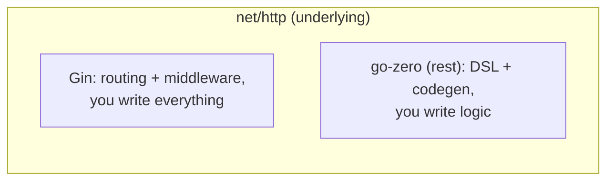

# 07 — go-zero vs Gin

You've now covered both **Gin** (Part 09) and **go-zero** (this part). Both are
popular Go web frameworks, but they solve different problems. This file helps
you choose and understand the tradeoffs.

## Key differences at a glance

| Aspect | Gin | go-zero |
|--------|-----|---------|
| Primary focus | Lightweight HTTP router + middleware | Full web & **microservices** framework |
| Routing | Hand-written `r.Group(...)` with functions | Declarative `.api` DSL + codegen |
| Code scale | You write everything | goctl generates structure; you write logic |
| gRPC/RPC | Bring your own | Built-in **zRPC** + discovery |
| Service discovery | N/A | etcd built-in |
| DB model layer | Bring your own (GORM/sqlx/hand-written) | `goctl model` generates cached CRUD |
| Config | manual | typed yaml via `conf` |
| Middleware | Rich built-in + custom | Built-in + DSL-declared |
| Observability | Manual | metrics/logs/tracing integrated |
| Learning curve | Low | Moderate (DSL + codegen concepts) |
| Idiomatic style | Hand-written, lightweight | Tool-driven, convention-by-codegen |

> 🔑 **Key idea:** both sit on `net/http` — the real difference is philosophy: Gin is "you write everything", go-zero is "goctl generates, you write logic".

## Strengths (use this one when...)

### Choose **Gin** when:
- You want a **minimal, familiar HTTP router** and full manual control.
- The project is a **small service / API** without RPC or multi-service needs.
- You prefer **writing everything explicitly** over code generation.
- Your team already owns its scaffolding/deployment conventions.
- You need to mix **custom middleware & routing** freely with minimum magic.

### Choose **go-zero** when:
- You're building a **microservices system** (API gateway + many RPC services).
- You want **standardized structure across many services/teams**.
- You want to move fast via **codegen** (`.api`/`.proto` → working service).
- You need **service discovery, models, caching, metrics** out of the box.
- You value a **batteries-included, opinionated** framework that removes
  boilerplate decisions.

> 🧠 **Think of it as:** Gin is a scalpel — sharp, minimal, full control. go-zero is a stocked workshop — codegen, discovery, models, caching already wired. Pick by job size.

## Same-goal features compared

The good news: the fundamentals you learned in Gin carry over almost verbatim
into go-zero, because both ultimately sit on `net/http`.

## Can you mix them?

**Yes, deliberately.** Many teams use **Gin for the HTTP gateway** and go-zero
for **RPC services** (or vice versa) since go-zero's role is often the
internal RPC layer. But note: goctl's integrated tooling is most valuable when
you commit to the go-zero ecosystem for a service.

> 💡 **Pro tip:** one framework per service — but mixing across boundaries is legitimate: a Gin HTTP gateway in front of go-zero RPC services is a common, sane setup.

## Decision guide

| Your situation | Recommendation |
|----------------|----------------|
| Single small HTTP API, full control | **Gin** |
| Large team, many services, standardized | **go-zero** |
| You need gRPC + discovery internally | **go-zero** |
| You dislike code generation / magic | **Gin** |
| You want caching, models, metrics wired up fast | **go-zero** |
| Prototype or hackathon | **Either** — Gin slightly faster to first byte |

## Modern Practices

- Pick **one** framework per service; don't mix routers inside a single service.
- If you need RPC + discovery, prefer go-zero over bolting gRPC onto Gin.
- Standardize error responses and middleware regardless of framework.
- Engineer the choice based on **team + scale needs**, not hype.

## Common Mistakes

- Choosing go-zero for a trivial API and fighting the codegen ceremony.
- Choosing Gin and hand-maintaining a large fleet of inconsistent services.
- Mixing both routers in one process without clear boundaries.
- Ignoring go-zero's integrated model/cache/metrics and re-hand-rolling them.

## Key Takeaways

1. Gin = lightweight hand-written HTTP routing; go-zero = opinionated
   full-stack/microservice framework with codegen.
2. go-zero gives discovery, models, caching, metrics, tracing out of the box.
3. Both sit on `net/http`; the HTTP fundamentals (Part 7) transfer.
4. Use Gin for small/controlled APIs; go-zero for standardized multi-service
   systems.

## Next

You've finished Part 11. Put it all together in the capstone:
`../13-projects/06-go-zero-microservice.md`, or review the full learning path
in `../README.md`.
