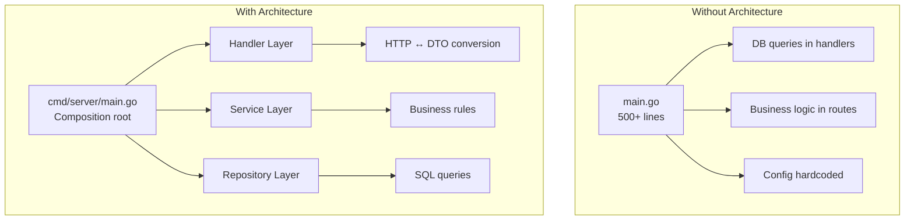
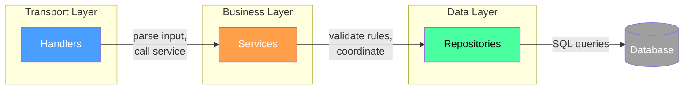
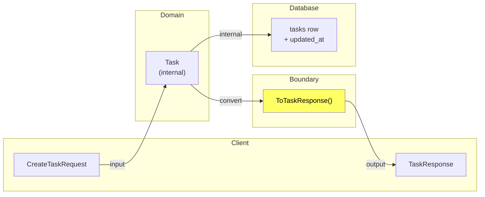
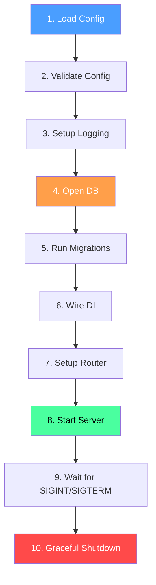

# Application Architecture in Go

Building a Go backend that works is not the same as building one that scales,
stays maintainable, and can be handed off to another developer. This file
covers the structural decisions that separate a weekend project from a
production application.

---

## Table of Contents

1. [The Core Problem](#1-the-core-problem)
2. [Application Layers](#2-application-layers)
3. [Domain Models vs DTOs](#3-domain-models-vs-dtos)
4. [Configuration and Environment Variables](#4-configuration-and-environment-variables)
5. [Dependency Injection in Go](#5-dependency-injection-in-go)
6. [Structured Logging](#6-structured-logging)
7. [Project Structure](#7-project-structure)
8. [Application Lifecycle](#8-application-lifecycle)
9. [Complete Project Example](#9-complete-project-example)
10. [Modern Practices](#10-modern-practices)
11. [Common Mistakes](#11-common-mistakes)

---

## 1. The Core Problem

Without a plan, a Go backend devolves into a single `main.go` with hundreds
of lines, database queries scattered across handlers, and business logic
embedded inside HTTP route functions. The code works. Six months later, adding
a feature requires reading 300 lines of tangled code to understand one endpoint.

The solution is not a framework. It is a set of conventions about where code
lives, what depends on what, and how information flows.

> 🔑 **Key idea:** Architecture is a set of habits about where code lives and
> how information flows — not a framework you install.



---

## 2. Application Layers

Every backend application processes requests, applies business rules, and
persists data. These map to three layers.

### Architecture Overview



> 🧠 **Memory aid:** Think of the layers as a delivery chain — the handler
> takes the order (HTTP), the service cooks (business rules), the repository
> fetches ingredients (data). Each link only talks to its neighbor.

### Handlers

Handlers receive HTTP requests, parse input, call the service layer, and
format responses. They do not contain business logic.

```go
type TaskHandler struct {
    service *TaskService
}

func NewTaskHandler(s *TaskService) *TaskHandler {
    return &TaskHandler{service: s}
}

func (h *TaskHandler) Create(c *gin.Context) {
    var req CreateTaskRequest
    if err := c.ShouldBindJSON(&req); err != nil {
        c.JSON(http.StatusBadRequest, gin.H{"error": err.Error()})
        return
    }
    task, err := h.service.Create(c.Request.Context(), req)
    if err != nil {
        c.JSON(http.StatusBadRequest, gin.H{"error": err.Error()})
        return
    }
    c.JSON(http.StatusCreated, ToTaskResponse(task))
}
```

There is no SQL. There is no business rule validation. The handler is a thin
adapter between HTTP and your system.

### Services

Services contain business logic. They validate inputs against business rules,
coordinate between repositories, and orchestrate complex operations. A service
never knows about HTTP.

```go
type TaskService struct {
    repo *TaskRepository
}

func NewTaskService(r *TaskRepository) *TaskService {
    return &TaskService{repo: r}
}

func (s *TaskService) Create(ctx context.Context, req CreateTaskRequest) (*Task, error) {
    if req.Title == "" {
        return nil, fmt.Errorf("title is required")
    }
    if len(req.Title) > 200 {
        return nil, fmt.Errorf("title must be 200 characters or less")
    }
    task := &Task{
        Title:     req.Title,
        Description: req.Description,
        Status:    StatusPending,
        CreatedAt: time.Now(),
        UpdatedAt: time.Now(),
    }
    if err := s.repo.Create(ctx, task); err != nil {
        return nil, fmt.Errorf("creating task: %w", err)
    }
    return task, nil
}
```

### Repositories

Repositories handle data access. They contain SQL queries and nothing else.
They never validate business rules.

```go
type TaskRepository struct {
    db *sql.DB
}

func NewTaskRepository(db *sql.DB) *TaskRepository {
    return &TaskRepository{db: db}
}

func (r *TaskRepository) Create(ctx context.Context, t *Task) error {
    query := `INSERT INTO tasks (title, description, status, created_at, updated_at)
              VALUES ($1, $2, $3, $4, $5) RETURNING id`
    return r.db.QueryRowContext(ctx, query,
        t.Title, t.Description, t.Status, t.CreatedAt, t.CreatedAt,
    ).Scan(&t.ID)
}

func (r *TaskRepository) GetByID(ctx context.Context, id int64) (*Task, error) {
    query := `SELECT id, title, description, status, created_at, updated_at
              FROM tasks WHERE id = $1`
    t := &Task{}
    err := r.db.QueryRowContext(ctx, query, id).Scan(
        &t.ID, &t.Title, &t.Description, &t.Status, &t.CreatedAt, &t.UpdatedAt,
    )
    if err == sql.ErrNoRows {
        return nil, nil
    }
    return t, err
}

func (r *TaskRepository) List(ctx context.Context, limit, offset int) ([]*Task, error) {
    query := `SELECT id, title, description, status, created_at, updated_at
              FROM tasks ORDER BY created_at DESC LIMIT $1 OFFSET $2`
    rows, err := r.db.QueryContext(ctx, query, limit, offset)
    if err != nil {
        return nil, err
    }
    defer rows.Close()
    var tasks []*Task
    for rows.Next() {
        t := &Task{}
        if err := rows.Scan(
            &t.ID, &t.Title, &t.Description, &t.Status, &t.CreatedAt, &t.UpdatedAt,
        ); err != nil {
            return nil, err
        }
        tasks = append(tasks, t)
    }
    return tasks, rows.Err()
}
```

### Why These Layers Matter

**Separation of concerns.** Each layer has one responsibility. When something
breaks, you know where to look.

**Testability.** You can test services without an HTTP server. You can test
handlers without a database. Each layer depends on an interface, not a concrete
implementation.

**Replaceability.** Switch from PostgreSQL to MongoDB by rewriting only the
repository layer. Add a gRPC interface by adding a new handler layer without
touching services.

> 💡 **Pro tip:** Keep each layer depending on an *interface*, not a concrete
> type. Handlers take `SomeService`, not `*TaskService`, so mocks slot in
> trivially during tests.

### Layer Responsibilities Matrix

| Layer       | Knows about   | Does NOT know about  | Depends on           |
|-------------|---------------|----------------------|----------------------|
| Handler     | HTTP, JSON    | SQL, business rules  | Service (interface)  |
| Service     | Business rules| HTTP, SQL, protocols | Repository (interface)|
| Repository  | SQL, DB schema| Business rules, HTTP | `sql.DB` or `*sqlx.DB`|

---

## 3. Domain Models vs DTOs

Using the same struct for the database row, the business entity, and the JSON
response creates coupling. A change to the database schema breaks the API.

### Domain Model

The core business entity. It contains what business logic needs:

```go
type Task struct {
    ID          int64
    Title       string
    Description string
    Status      TaskStatus
    CreatedAt   time.Time
    UpdatedAt   time.Time
}

type TaskStatus string

const (
    StatusPending    TaskStatus = "pending"
    StatusInProgress TaskStatus = "in_progress"
    StatusDone       TaskStatus = "done"
)
```

### Request Model

What the client sends. Only fields the client should provide:

```go
type CreateTaskRequest struct {
    Title       string `json:"title" binding:"required,max=200"`
    Description string `json:"description" binding:"max=1000"`
}

type UpdateTaskRequest struct {
    Title       *string     `json:"title,omitempty"`
    Description *string     `json:"description,omitempty"`
    Status      *TaskStatus `json:"status,omitempty"`
}
```

### Response Model

What the client receives. It controls exactly what is exposed:

```go
type TaskResponse struct {
    ID          int64      `json:"id"`
    Title       string     `json:"title"`
    Description string     `json:"description"`
    Status      TaskStatus `json:"status"`
    CreatedAt   time.Time  `json:"created_at"`
}

func ToTaskResponse(t *Task) TaskResponse {
    return TaskResponse{
        ID:          t.ID,
        Title:       t.Title,
        Description: t.Description,
        Status:      t.Status,
        CreatedAt:   t.CreatedAt,
    }
}
```

The conversion function is the boundary. The domain model is never serialized
directly. Internal fields like `UpdatedAt` are omitted from the response.

> 🔑 **Key idea:** The DTO conversion function is your API contract control
> point — the DB schema and the wire format stay fully decoupled.



---

## 4. Configuration and Environment Variables

Hardcoded database URLs, API keys, and port numbers belong nowhere in source
code.

### Config Loading

```go
type Config struct {
    Port         string
    DatabaseURL  string
    RedisAddr    string
    LogLevel     string
    JWTSecret    string
    ReadTimeout  time.Duration
    WriteTimeout time.Duration
}

func LoadConfig() (*Config, error) {
    cfg := &Config{
        Port:         getEnv("PORT", "8080"),
        DatabaseURL:  getEnv("DATABASE_URL", "postgres://localhost:5432/myapp?sslmode=disable"),
        RedisAddr:    getEnv("REDIS_ADDR", "localhost:6379"),
        LogLevel:     getEnv("LOG_LEVEL", "info"),
        JWTSecret:    os.Getenv("JWT_SECRET"),
        ReadTimeout:  getDurationEnv("READ_TIMEOUT", 15*time.Second),
        WriteTimeout: getDurationEnv("WRITE_TIMEOUT", 15*time.Second),
    }
    if err := cfg.Validate(); err != nil {
        return nil, err
    }
    return cfg, nil
}

func getEnv(key, fallback string) string {
    if v := os.Getenv(key); v != "" {
        return v
    }
    return fallback
}

func getDurationEnv(key string, fallback time.Duration) time.Duration {
    if v := os.Getenv(key); v != "" {
        d, err := time.ParseDuration(v)
        if err == nil {
            return d
        }
    }
    return fallback
}
```

### Loading .env Files

Use `godotenv` for development. Never commit `.env` to version control:

```go
import "github.com/joho/godotenv"

func main() {
    _ = godotenv.Load()
    cfg, err := LoadConfig()
    if err != nil {
        log.Fatalf("config: %v", err)
    }
    // ...
}
```

### Validation

Fail fast before the server starts:

```go
func (c *Config) Validate() error {
    if c.Port == "" {
        return fmt.Errorf("PORT is required")
    }
    if c.DatabaseURL == "" {
        return fmt.Errorf("DATABASE_URL is required")
    }
    if c.JWTSecret == "" {
        return fmt.Errorf("JWT_SECRET is required")
    }
    return nil
}
```

> ⚠️ **Watch out:** Never commit `.env` files to version control. Keep a
> committed `.env.example` template with empty values instead — and always
> validate config at startup so a typo fails fast, not mid-request.

---

## 5. Dependency Injection in Go

Go does not need a DI framework. Constructor functions and interfaces are
sufficient.

### Constructor Injection

Each component receives its dependencies when created:

```go
func NewTaskHandler(s *TaskService) *TaskHandler {
    return &TaskHandler{service: s}
}

func NewTaskService(r *TaskRepository) *TaskService {
    return &TaskService{repo: r}
}

func NewTaskRepository(db *sql.DB) *TaskRepository {
    return &TaskRepository{db: db}
}
```

Dependencies flow in one direction: handler → service → repository. Nothing
creates its own dependencies.

### Interface-Based Injection

For testability, depend on interfaces:

```go
type TaskRepository interface {
    Create(ctx context.Context, task *Task) error
    GetByID(ctx context.Context, id int64) (*Task, error)
    List(ctx context.Context, limit, offset int) ([]*Task, error)
    Update(ctx context.Context, task *Task) error
    Delete(ctx context.Context, id int64) error
}
```

In production, pass the concrete type. In tests, pass a mock. The service
does not know the difference.

### Wiring in main()

The `main()` function is the composition root — the only place that knows
about concrete types:

```go
func main() {
    cfg := LoadConfig()
    if err := cfg.Validate(); err != nil {
        log.Fatalf("config: %v", err)
    }

    db, err := sql.Open("postgres", cfg.DatabaseURL)
    if err != nil {
        log.Fatalf("database: %v", err)
    }
    defer db.Close()

    taskRepo := NewTaskRepository(db)
    taskService := NewTaskService(taskRepo)
    taskHandler := NewTaskHandler(taskService)

    router := gin.New()
    tasks := router.Group("/api/v1/tasks")
    tasks.POST("", taskHandler.Create)
    tasks.GET("/:id", taskHandler.GetByID)
    tasks.GET("", taskHandler.List)

    srv := &http.Server{Addr: ":" + cfg.Port, Handler: router}
    log.Fatal(srv.ListenAndServe())
}
```

> 🔑 **Key idea:** `main()` is the composition root — the only place that
> knows concrete types. Everything below it depends on interfaces, so each
> layer is testable in isolation.

---

## 6. Structured Logging

Production logs need structure, levels, and context.

### Structured Logging with slog

Go 1.21 added `log/slog` to the standard library:

```go
func main() {
    logger := slog.New(slog.NewJSONHandler(os.Stdout, &slog.HandlerOptions{
        Level: slog.LevelInfo,
    }))
    slog.SetDefault(logger)
    slog.Info("server starting", "port", "8080")
}
```

Output is machine-readable JSON, filterable by field, aggregable by log
systems.

### Request-Scoped Logging

Attach context to each request:

```go
func RequestLogger() gin.HandlerFunc {
    return func(c *gin.Context) {
        requestID := c.GetHeader("X-Request-ID")
        logger := slog.With("request_id", requestID, "method", c.Request.Method)
        c.Set("logger", logger)
        c.Next()
    }
}

func getLogger(c *gin.Context) *slog.Logger {
    if l, ok := c.Get("logger"); ok {
        return l.(*slog.Logger)
    }
    return slog.Default()
}
```

### Log Levels

| Level  | When to use                           | Production? |
|--------|---------------------------------------|-------------|
| Debug  | Diagnostic details, variable values   | No          |
| Info   | Normal operation — request processed  | Yes         |
| Warn   | Unexpected but recoverable, slow query| Yes         |
| Error  | Something failed, request could not   | Yes         |

> 🧠 **Memory aid:** `slog` JSON output is like a spreadsheet for your logs —
> every field is a filterable column, so you can grep production by
> `request_id` without brittle text parsing.

---

## 7. Project Structure

### Standard Layout

```
task-api/
├── cmd/
│   └── server/
│       └── main.go            # Composition root — thin
├── internal/
│   └── task/
│       ├── handler.go         # HTTP layer
│       ├── service.go         # Business logic
│       ├── repository.go      # Data access
│       ├── model.go           # Domain models
│       ├── dto.go             # Request/Response DTOs
│       ├── handler_test.go
│       └── service_test.go
│   └── config/
│       └── config.go          # Configuration loading
├── migrations/
│   └── 001_create_tasks.sql
├── .env.example               # Template (committed, no values)
├── .gitignore                 # Contains .env
├── go.mod
└── go.sum
```

### Rules

**`internal/` prevents external imports.** Packages inside `internal/` cannot
be imported outside the module.

**One domain per package.** Everything related to tasks lives in the `task`
package.

**Export only what is necessary.** Unexported functions and fields are invisible
outside the package.

**Avoid circular dependencies.** If Package A depends on B and B depends on A,
merge them or extract a shared interface into a third package.

**Keep `main()` thin.** Business logic lives under `internal/`. The
`main()` package only wires dependencies and starts the server.

> 💡 **Pro tip:** `internal/` is enforced by the Go compiler — code outside
> your module literally cannot import it. That's free architecture insurance.

---

## 8. Application Lifecycle

### Initialization Order

1. Load configuration
2. Validate configuration
3. Set up logging
4. Open database connection
5. Run migrations
6. Wire dependencies
7. Set up router
8. Start server
9. Handle shutdown signals
10. Graceful shutdown



### Graceful Shutdown

When you kill a server mid-request, those requests fail:

```go
quit := make(chan os.Signal, 1)
signal.Notify(quit, syscall.SIGINT, syscall.SIGTERM)
<-quit

ctx, cancel := context.WithTimeout(context.Background(), 30*time.Second)
defer cancel()

if err := srv.Shutdown(ctx); err != nil {
    slog.Error("forced shutdown", "error", err)
}
```

`Shutdown` stops accepting new connections and waits for in-flight requests.
The timeout prevents indefinite hangs.

> ⚠️ **Watch out:** Shut down the HTTP server *first*, then close downstream
> connections. If you close the DB first, in-flight requests crash mid-write.

### Cleanup Order

Shut down the HTTP server first (no new traffic), then close downstream
connections:

```go
if err := server.Shutdown(ctx); err != nil {
    slog.Error("server shutdown", "error", err)
}
if err := db.Close(); err != nil {
    slog.Error("db close", "error", err)
}
```

---

## 9. Complete Project Example

### cmd/server/main.go

```go
package main

import (
    "context"
    "database/sql"
    "log"
    "log/slog"
    "net/http"
    "os"
    "os/signal"
    "syscall"
    "time"

    _ "github.com/lib/pq"
    "github.com/joho/godotenv"
    "github.com/gin-gonic/gin"

    "task-api/internal/task"
)

func main() {
    _ = godotenv.Load()

    port := getEnv("PORT", "8080")
    dbURL := getEnv("DATABASE_URL", "postgres://localhost:5432/myapp?sslmode=disable")

    slog.SetDefault(slog.New(slog.NewJSONHandler(os.Stdout, nil)))

    db, err := sql.Open("postgres", dbURL)
    if err != nil {
        slog.Error("database open failed", "error", err)
        os.Exit(1)
    }
    defer db.Close()

    if err := db.Ping(); err != nil {
        slog.Error("database ping failed", "error", err)
        os.Exit(1)
    }

    taskRepo := task.NewTaskRepository(db)
    taskService := task.NewTaskService(taskRepo)
    taskHandler := task.NewTaskHandler(taskService)

    router := gin.New()
    router.Use(gin.Recovery())

    v1 := router.Group("/api/v1")
    v1.POST("/tasks", taskHandler.Create)
    v1.GET("/tasks/:id", taskHandler.GetByID)
    v1.GET("/tasks", taskHandler.List)
    v1.PUT("/tasks/:id", taskHandler.Update)
    v1.DELETE("/tasks/:id", taskHandler.Delete)

    srv := &http.Server{
        Addr:         ":" + port,
        Handler:      router,
        ReadTimeout:  15 * time.Second,
        WriteTimeout: 15 * time.Second,
    }

    quit := make(chan os.Signal, 1)
    signal.Notify(quit, syscall.SIGINT, syscall.SIGTERM)

    go func() {
        slog.Info("server starting", "port", port)
        if err := srv.ListenAndServe(); err != nil && err != http.ErrServerClosed {
            slog.Error("server error", "error", err)
        }
    }()

    <-quit
    slog.Info("shutting down")

    ctx, cancel := context.WithTimeout(context.Background(), 30*time.Second)
    defer cancel()

    if err := srv.Shutdown(ctx); err != nil {
        slog.Error("forced shutdown", "error", err)
    }
    log.Println("server stopped")
}

func getEnv(key, fallback string) string {
    if v := os.Getenv(key); v != "" {
        return v
    }
    return fallback
}
```

> 🔑 **Key idea:** The whole file up to here composes into this entry point —
> config, DI, lifecycle, and logging all converge in one readable `main()`.

---

## 10. Modern Practices

- **Use `cmd/` + `internal/` layout** — standard Go convention, enforced by
  the compiler (cannot import `internal/` from outside the module).
- **Keep `main()` thin** — extract setup into `setupRouter()`,
  `setupDatabase()`, `setupLogger()` functions. Each is testable independently.
- **Use `log/slog`** (Go 1.21+) for structured logging — JSON output,
  level filtering, context propagation. No third-party dependency needed.
- **Constructor DI without a framework** — Go interfaces + constructors
  provide sufficient DI for all but the most complex applications.
- **DTOs at the boundary** — never serialize domain models directly to JSON.
  The conversion function is your API contract control point.
- **Config validation at startup** — fail fast with clear error messages
  rather than failing at runtime when a config value is first used.
- **Interface-based repositories** — depend on interfaces in the service
  layer so you can test with mocks and swap implementations later.
- **Context propagation** — pass `context.Context` through all layers for
  cancellation, timeouts, and request-scoped values (logging, tracing).
- **`go vet` / `gofmt` / `go test -race` in CI** — automated quality gates
  prevent regressions.

---

## 11. Common Mistakes

### God functions

A `main()` that does everything cannot be tested. Extract setup into
`setupRouter`, `setupDatabase`, `setupLogger`. Each is testable independently.

### Leaking domain models

When the domain struct is serialized directly to JSON, the database schema
becomes the API contract. Use DTOs to control what crosses the wire.

### Too many layers

If you have three endpoints and one table, a handler calling a repository
directly is fine. Layers manage complexity. No complexity means layers are
overhead.

### Ignoring errors

Every ignored error is a future bug. Wrap with
`fmt.Errorf("context: %w", err)` so production failures are diagnosable.

### Mixing HTTP and business logic

Validation, SQL, and response formatting should not all live in the handler.
Parse input, call the service, return the response.

### Circular dependencies

If Package A imports B and B imports A, merge them or extract a shared
interface into a third package.

### Hardcoded configuration

Database URLs, API keys, and port numbers in source code create security
risks and environment-specific breakage. Always use environment variables.

---

## Exercises

### Exercise 1: Interface-Based Repository Testing

Define a `TaskRepository` interface in the service package. Refactor the
service to depend on the interface. Write a mock implementation and test
every service method without a database.

### Exercise 2: Configuration Validation

Extend the config to validate all fields: database URL format, port range
(1-65535), valid log level. Write tests for valid and invalid configs.

### Exercise 3: Error Handling Middleware

Create an `AppError` type with `Code`, `Message`, and `Status` fields.
Refactor handlers to return `*AppError`. Write a Gin middleware that
converts errors to the correct HTTP response.

### Exercise 4: Cursor-Based Pagination

Replace offset pagination with cursor-based pagination using `created_at`
as the cursor. Update repository, service, and handler. Write tests
verifying correctness across 50 tasks.

### Exercise 5: Rate Limiting Middleware

Implement a token bucket rate limiter per IP using `sync.Map`. Allow 100
requests per minute. Return `429` with `Retry-After` header. Add cleanup
logic for stale entries.

### Exercise 6: Integration Tests

Write tests using `httptest.NewServer` and a real PostgreSQL database. Test
the full lifecycle: create, retrieve, update, list, delete. Verify status
codes and response bodies.

---

## Key Takeaways

1. The handler layer translates HTTP. The service layer contains business
   logic. The repository layer accesses data.
2. Configuration comes from the environment. Dependencies flow in one
   direction. Errors carry context.
3. Use DTOs at the boundary — never serialize domain models directly.
4. `main()` is the composition root — the only code that knows about
   concrete types.
5. Start simple. Add layers when complexity demands it. Keep `main()` as
   the single place where everything is assembled.
6. Use `internal/` to enforce package boundaries at the compiler level.
7. Structured logging with `slog` gives you machine-parseable, filterable
   output from day one.

---

## Next

Continue to [02-authentication-security.md](02-authentication-security.md)
for password hashing with bcrypt, JWT implementation, RBAC, CORS, CSRF
protection, rate limiting, and security headers.
