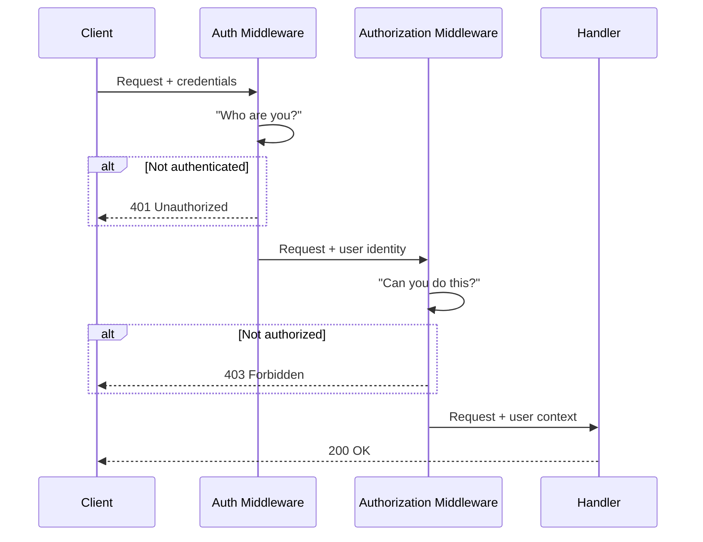
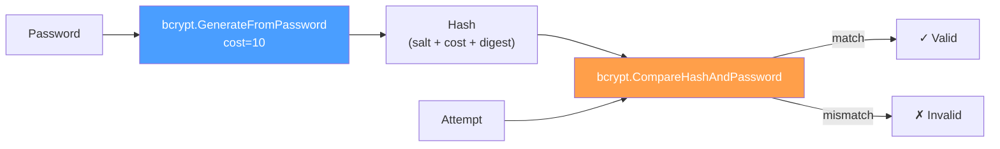
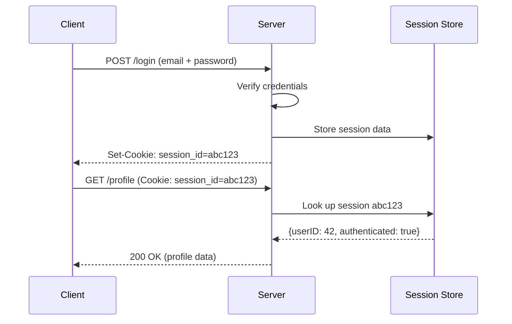
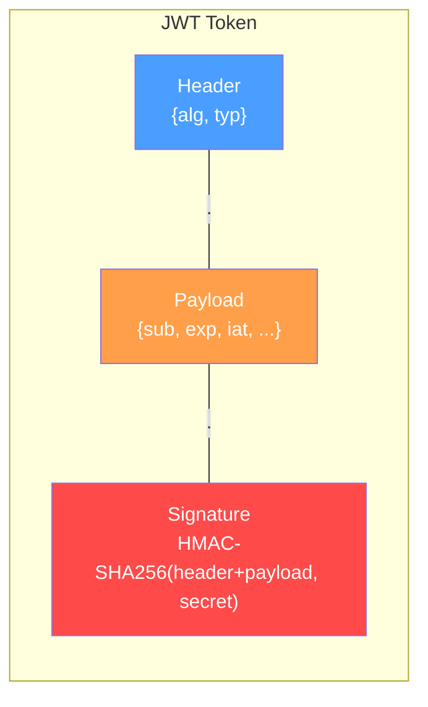
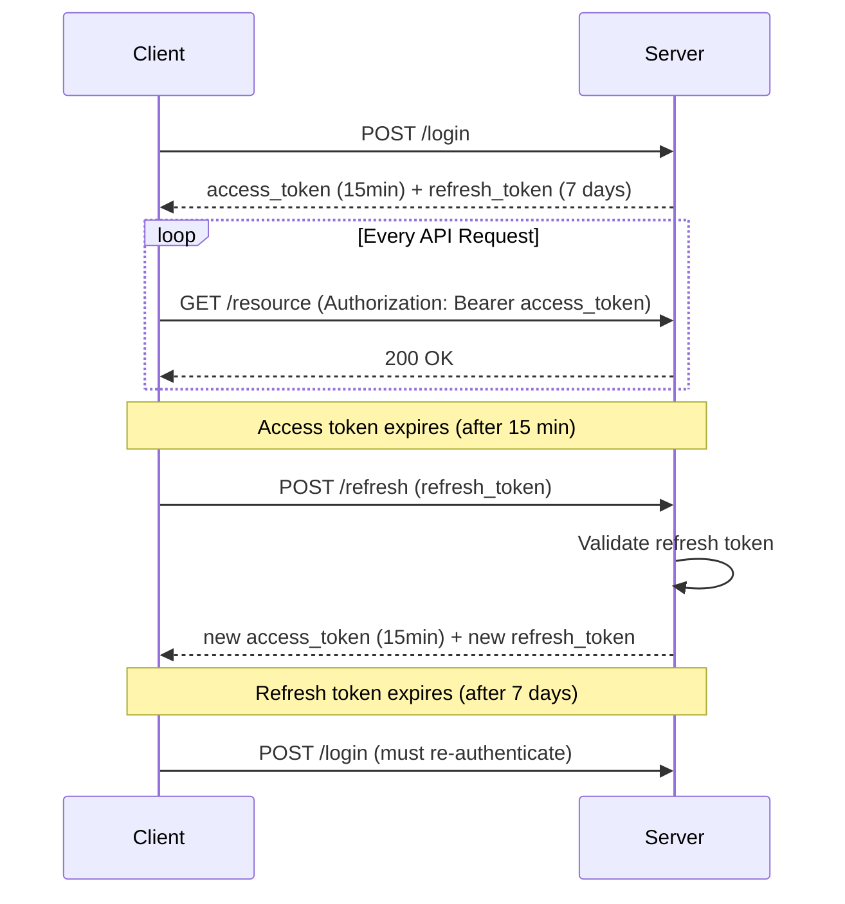
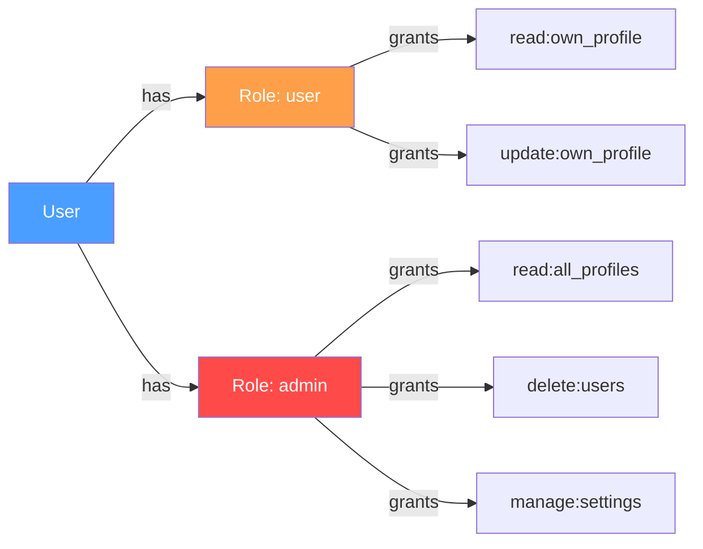
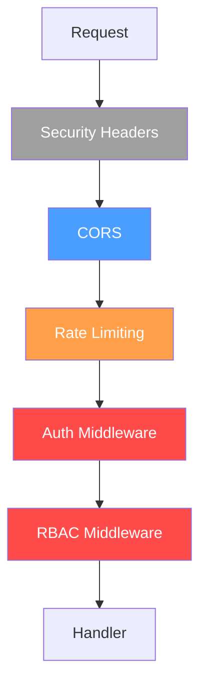
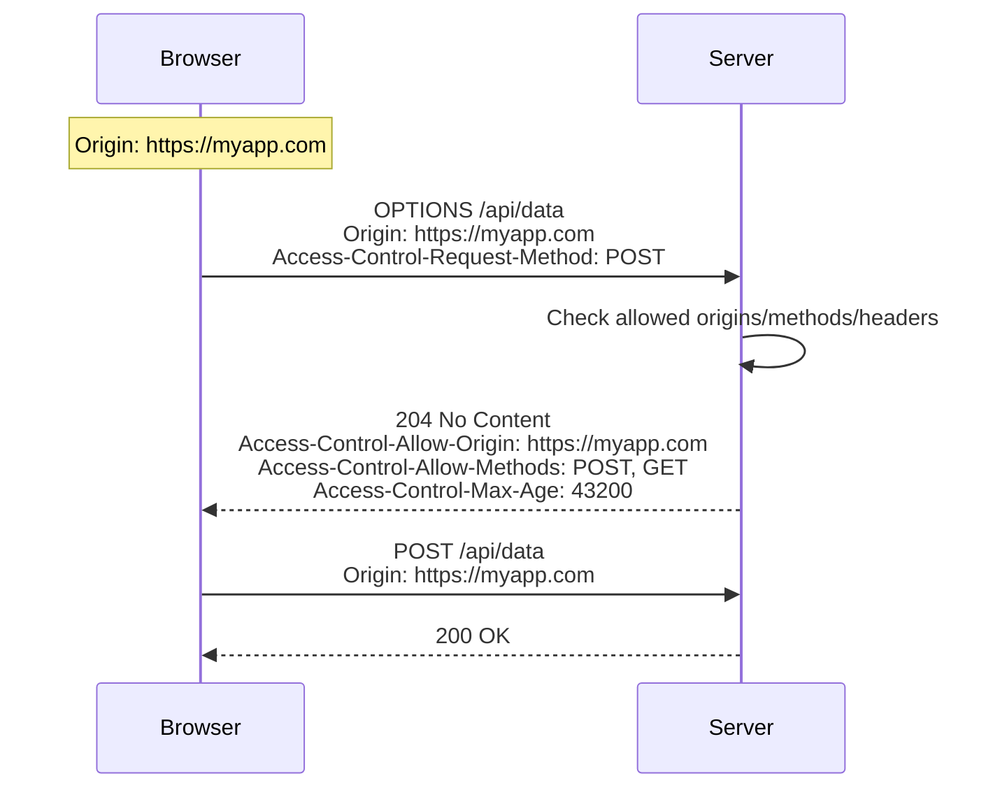

# Authentication and Security in Go Backends

Authentication and security are non-negotiable in backend development. This
file covers the full spectrum: from password hashing and token-based auth to
rate limiting and secure headers. Every concept includes Go implementations
and explains common mistakes.

---

## Table of Contents

1. [Authentication vs Authorization](#1-authentication-vs-authorization)
2. [Password Hashing with bcrypt](#2-password-hashing-with-bcrypt)
3. [User Registration](#3-user-registration)
4. [Login and Password Verification](#4-login-and-password-verification)
5. [Server-Side Sessions](#5-server-side-sessions)
6. [JSON Web Tokens (JWT)](#6-json-web-tokens-jwt)
7. [Access Tokens and Refresh Tokens](#7-access-tokens-and-refresh-tokens)
8. [JWT Implementation in Go](#8-jwt-implementation-in-go)
9. [Role-Based Access Control (RBAC)](#9-role-based-access-control-rbac)
10. [Auth Middleware](#10-auth-middleware)
11. [CORS](#11-cors-cross-origin-resource-sharing)
12. [CSRF Protection](#12-csrf-cross-site-request-forgery)
13. [Input Validation](#13-input-validation)
14. [SQL Injection Prevention](#14-sql-injection-prevention)
15. [Rate Limiting](#15-rate-limiting)
16. [Brute-Force Protection](#16-brute-force-protection)
17. [Secrets Management](#17-secrets-management)
18. [HTTPS and TLS](#18-https-and-tls)
19. [Security Headers](#19-security-headers)
20. [Sensitive Information in Logs](#20-sensitive-information-in-logs)
21. [Complete Authentication System](#21-complete-authentication-system)
22. [Modern Practices](#22-modern-practices)
23. [Common Security Mistakes](#23-common-security-mistakes)

---

## 1. Authentication vs Authorization

These terms are often conflated but represent distinct concerns.

- **Authentication** answers: "Who are you?"
- **Authorization** answers: "What are you allowed to do?"



Authentication typically runs first. If the user cannot be identified,
authorization is irrelevant. Both are layers in your security pipeline.

> 🧠 **Memory aid:** Authentication asks "Who are you?" (check the ID at the
> door). Authorization asks "What are you allowed to do?" (check the guest
> list for the VIP room). 401 vs 403.

---

## 2. Password Hashing with bcrypt

### Why Not MD5 or SHA256

MD5 and SHA256 are cryptographic hash functions designed for speed. Speed is
a liability for password storage. An attacker with a modern GPU can compute
billions of MD5 hashes per second, making brute-force and dictionary attacks
trivial.

```go
// INSECURE: Never hash passwords with MD5
import "crypto/md5"

func hashPassword(password string) string {
    hash := md5.Sum([]byte(password))
    return hex.EncodeToString(hash[:])
}
```

**Why this is wrong:**
- MD5 is deterministic. Same input always produces the same output.
- No salt means identical passwords produce identical hashes.
- MD5 is fast. Attackers can try billions of guesses per second.
- MD5 is cryptographically broken. Collision attacks are practical.

```go
// INSECURE: SHA256 is also wrong for passwords
import "crypto/sha256"

func hashPassword(password string) string {
    hash := sha256.Sum256([]byte(password))
    return hex.EncodeToString(hash[:])
}
```

SHA256 is faster than MD5. It provides no meaningful protection against
brute-force attacks without a work factor.

> ⚠️ **Watch out:** MD5 and SHA256 were *designed to be fast*. Speed is the
> enemy of password storage — an attacker on modern GPUs can try billions of
> guesses per second.

### Why Use bcrypt

bcrypt is a password hashing function designed specifically for password
storage. It includes:

- **A configurable work factor** — controls computation time. As hardware
  improves, you increase the factor.
- **Automatic salting** — each hash includes a unique random salt, so
  identical passwords produce different hashes.
- **Adaptive cost** — you can tune the time it takes to compute a hash.



```go
import "golang.org/x/crypto/bcrypt"

func HashPassword(password string) (string, error) {
    bytes, err := bcrypt.GenerateFromPassword([]byte(password), bcrypt.DefaultCost)
    return string(bytes), err
}

func CheckPassword(password, hash string) bool {
    err := bcrypt.CompareHashAndPassword([]byte(hash), []byte(password))
    return err == nil
}
```

`bcrypt.DefaultCost` is 10, which takes roughly 100ms on modern hardware.
For high-security applications, use 12 or 14. Each increment roughly doubles
computation time.

| Cost Factor | Approx. Time (modern CPU) |
|-------------|---------------------------|
| 8           | ~25ms                     |
| 10 (default)| ~100ms                    |
| 12          | ~400ms                    |
| 14          | ~1.6s                     |

> 🔑 **Key idea:** Each cost increment doubles the work — pick the slowest
> factor your users will tolerate (10–12 is typical) and bump it as hardware
> improves.

---

## 3. User Registration

A registration endpoint accepts user credentials, hashes the password, and
stores the user.

```go
func Register(c *gin.Context) {
    var req struct {
        Email    string `json:"email" binding:"required,email"`
        Password string `json:"password" binding:"required,min=8"`
    }

    if err := c.ShouldBindJSON(&req); err != nil {
        c.JSON(http.StatusBadRequest, gin.H{"error": err.Error()})
        return
    }

    hashedPassword, err := bcrypt.GenerateFromPassword(
        []byte(req.Password), bcrypt.DefaultCost,
    )
    if err != nil {
        c.JSON(http.StatusInternalServerError, gin.H{"error": "failed to hash password"})
        return
    }

    _, err = db.Exec(
        "INSERT INTO users (email, password_hash) VALUES ($1, $2)",
        req.Email, string(hashedPassword),
    )
    if err != nil {
        c.JSON(http.StatusConflict, gin.H{"error": "email already exists"})
        return
    }

    c.JSON(http.StatusCreated, gin.H{"message": "user created"})
}
```

Key points:
- Never store plaintext passwords. Hash before inserting into the database.
- Validate input before hashing. Don't waste CPU on invalid data.
- Return a generic error on duplicate emails. Don't reveal whether an email
  exists.

> 💡 **Pro tip:** Return the *same* error message for "user not found" and
> "wrong password". Different messages let attackers enumerate valid emails.

---

## 4. Login and Password Verification

Login retrieves the stored hash and compares it against the provided password.

```go
func Login(c *gin.Context) {
    var req struct {
        Email    string `json:"email" binding:"required,email"`
        Password string `json:"password" binding:"required"`
    }

    if err := c.ShouldBindJSON(&req); err != nil {
        c.JSON(http.StatusBadRequest, gin.H{"error": err.Error()})
        return
    }

    var storedHash string
    err := db.QueryRow(
        "SELECT password_hash FROM users WHERE email = $1", req.Email,
    ).Scan(&storedHash)
    if err != nil {
        c.JSON(http.StatusUnauthorized, gin.H{"error": "invalid credentials"})
        return
    }

    if err := bcrypt.CompareHashAndPassword([]byte(storedHash), []byte(req.Password)); err != nil {
        c.JSON(http.StatusUnauthorized, gin.H{"error": "invalid credentials"})
        return
    }

    // Generate token or session here
    c.JSON(http.StatusOK, gin.H{"message": "login successful"})
}
```

**Critical:** Return the same error message for "user not found" and "wrong
password." If you differentiate, an attacker can enumerate valid email
addresses.

---

## 5. Server-Side Sessions

Sessions store authentication state on the server. The client receives a
session ID via a cookie, and the server looks up the associated data.



### Using gorilla/sessions

```go
import "github.com/gorilla/sessions"

var store = sessions.NewCookieStore([]byte("your-secret-key"))

func LoginHandler(c *gin.Context) {
    // After verifying credentials...

    session, _ := store.Get(c.Request, "session-id")
    session.Values["userID"] = user.ID
    session.Values["authenticated"] = true
    session.Save(c.Request, c.Writer)

    c.JSON(http.StatusOK, gin.H{"message": "logged in"})
}

func AuthMiddleware() gin.HandlerFunc {
    return func(c *gin.Context) {
        session, _ := store.Get(c.Request, "session-id")
        auth, ok := session.Values["authenticated"].(bool)
        if !ok || !auth {
            c.AbortWithStatusJSON(http.StatusUnauthorized, gin.H{"error": "unauthorized"})
            return
        }
        c.Set("userID", session.Values["userID"])
        c.Next()
    }
}
```

### Session Cookie Configuration

```go
store.Options = &sessions.Options{
    Path:     "/",
    MaxAge:   3600,       // 1 hour
    HttpOnly: true,       // Prevent JavaScript access
    Secure:   true,       // HTTPS only
    SameSite: http.SameSiteLaxMode,
}
```

- `HttpOnly` prevents XSS from stealing session cookies.
- `Secure` ensures cookies are only sent over HTTPS.
- `SameSite` provides CSRF protection (discussed later).

### Sessions vs JWTs

| Feature           | Sessions              | JWTs                    |
|-------------------|-----------------------|-------------------------|
| Storage           | Server-side (DB/Redis)| Client-side (token)     |
| Scalability       | Sticky sessions needed| Stateless, any server   |
| Revocation        | Easy (delete session) | Hard (blocklist needed) |
| Cross-domain      | Cookie limitations    | Easy (Authorization hdr)|
| Mobile/native     | Awkward               | Natural fit             |

> 🔑 **Key idea:** Sessions trade revocation for scalability — you can kill a
> session instantly, but every server needs shared state. JWTs trade the
> opposite way: stateless, but revoking them requires a blocklist.

---

## 6. JSON Web Tokens (JWT)

JWTs are self-contained tokens that carry claims. They are stateless: the
server does not need to store session data.

### JWT Structure

A JWT has three parts separated by dots: `header.payload.signature`



**Header:**
```json
{
  "alg": "HS256",
  "typ": "JWT"
}
```

**Payload (claims):**
```json
{
  "sub": "user@example.com",
  "name": "Alice",
  "iat": 1700000000,
  "exp": 1700003600
}
```

**Signature:**
```
HMAC-SHA256(
  base64UrlEncode(header) + "." + base64UrlEncode(payload),
  secret
)
```

The signature prevents tampering. If someone modifies the payload, the
signature will not match, and validation fails.

> 🧠 **Memory aid:** A JWT is a signed receipt: customers can read it, but any
> change to the items invalidates the signature — nobody swaps "admin" into
> your receipt without the secret.

### Common Claims

| Claim | Name        | Purpose                        |
|-------|-------------|--------------------------------|
| `sub` | Subject     | The user identifier            |
| `iss` | Issuer      | Who issued the token           |
| `exp` | Expiration  | When the token expires         |
| `iat` | Issued At   | When the token was created     |
| `aud` | Audience    | Intended recipient             |
| `jti` | JWT ID      | Unique token identifier        |

---

## 7. Access Tokens and Refresh Tokens

Using a single token creates a dilemma: short-lived tokens are secure but
force frequent re-login; long-lived tokens are convenient but risky if
compromised.

The solution is two tokens:

**Access Token:**
- Short-lived (15-60 minutes).
- Used to access protected resources.
- Sent with every request.

**Refresh Token:**
- Long-lived (days to weeks).
- Used only to obtain new access tokens.
- Stored securely (httpOnly cookie or secure storage).

### Token Lifecycle



```
1. User logs in
2. Server generates access token (15 min) + refresh token (7 days)
3. Client uses access token for API requests
4. After 15 minutes, access token expires
5. Client sends refresh token to /api/refresh
6. Server validates refresh token, issues new access token
7. Repeat steps 3-6
8. After 7 days, refresh token expires
9. User must log in again
```

Revocation: Since JWTs are stateless, you cannot invalidate them before
expiry without a server-side blocklist. Store revoked token IDs (`jti`) in
Redis or a database, and check against it during validation.

> ⚠️ **Watch out:** A long-lived token is a standing key to your system.
> Keep access tokens to 15–60 minutes and store refresh tokens in an
> httpOnly cookie so JavaScript can't steal them.

---

## 8. JWT Implementation in Go

Use the `golang-jwt/jwt` library (the maintained fork).

### Creating Tokens

```go
import (
    "time"
    "github.com/golang-jwt/jwt/v5"
)

var jwtSecret = []byte(os.Getenv("JWT_SECRET"))

type Claims struct {
    UserID int    `json:"user_id"`
    Email  string `json:"email"`
    Role   string `json:"role"`
    jwt.RegisteredClaims
}

func GenerateAccessToken(userID int, email, role string) (string, error) {
    claims := Claims{
        UserID: userID,
        Email:  email,
        Role:   role,
        RegisteredClaims: jwt.RegisteredClaims{
            ExpiresAt: jwt.NewNumericDate(time.Now().Add(15 * time.Minute)),
            IssuedAt:  jwt.NewNumericDate(time.Now()),
            Issuer:    "myapp",
        },
    }

    token := jwt.NewWithClaims(jwt.SigningMethodHS256, claims)
    return token.SignedString(jwtSecret)
}

func GenerateRefreshToken(userID int) (string, error) {
    claims := jwt.RegisteredClaims{
        ExpiresAt: jwt.NewNumericDate(time.Now().Add(7 * 24 * time.Hour)),
        IssuedAt:  jwt.NewNumericDate(time.Now()),
        Issuer:    "myapp",
    }

    token := jwt.NewWithClaims(jwt.SigningMethodHS256, claims)
    return token.SignedString(jwtSecret)
}
```

### Validating Tokens

```go
func ValidateToken(tokenString string) (*Claims, error) {
    token, err := jwt.ParseWithClaims(tokenString, &Claims{}, func(token *jwt.Token) (interface{}, error) {
        if _, ok := token.Method.(*jwt.SigningMethodHMAC); !ok {
            return nil, fmt.Errorf("unexpected signing method: %v", token.Header["alg"])
        }
        return jwtSecret, nil
    })

    if err != nil {
        return nil, err
    }

    claims, ok := token.Claims.(*Claims)
    if !ok || !token.Valid {
        return nil, fmt.Errorf("invalid token")
    }

    return claims, nil
}
```

**Never hardcode secrets.** Load them from environment variables or a secrets
manager.

> ⚠️ **Watch out:** Always verify the signing algorithm in the key function.
> Without `token.Method` checking, an attacker can forge tokens with the
> `alg: none` trick.

### Asymmetric Keys (RS256)

For services where multiple parties need to verify but not create tokens,
use RSA keys:

```go
func GenerateRSAToken(claims jwt.Claims, privateKey *rsa.PrivateKey) (string, error) {
    token := jwt.NewWithClaims(jwt.SigningMethodRS256, claims)
    return token.SignedString(privateKey)
}

func ValidateRSAToken(tokenString string, publicKey *rsa.PublicKey) (jwt.Claims, error) {
    token, err := jwt.ParseWithClaims(tokenString, &jwt.RegisteredClaims{}, func(token *jwt.Token) (interface{}, error) {
        return publicKey, nil
    })
    if err != nil {
        return nil, err
    }
    return token.Claims, nil
}
```

---

## 9. Role-Based Access Control (RBAC)

RBAC assigns roles to users and permissions to roles.



### Define Roles and Permissions

```go
type Role string

const (
    RoleUser  Role = "user"
    RoleAdmin Role = "admin"
)

var rolePermissions = map[Role][]string{
    RoleUser:  {"read:own_profile", "update:own_profile"},
    RoleAdmin: {"read:all_profiles", "delete:users", "manage:settings"},
}

func HasPermission(role Role, permission string) bool {
    perms, ok := rolePermissions[role]
    if !ok {
        return false
    }
    for _, p := range perms {
        if p == permission {
            return true
        }
    }
    return false
}
```

### Authorization Middleware

```go
func RequirePermission(permission string) gin.HandlerFunc {
    return func(c *gin.Context) {
        role, exists := c.Get("userRole")
        if !exists {
            c.AbortWithStatusJSON(http.StatusForbidden, gin.H{"error": "no role found"})
            return
        }

        if !HasPermission(role.(Role), permission) {
            c.AbortWithStatusJSON(http.StatusForbidden, gin.H{"error": "insufficient permissions"})
            return
        }

        c.Next()
    }
}
```

Usage in routes:

```go
router.GET("/profile", AuthMiddleware(), RequirePermission("read:own_profile"), GetProfile)
router.DELETE("/users/:id", AuthMiddleware(), RequirePermission("delete:users"), DeleteUser)
```

> 🔑 **Key idea:** RBAC is about *permissions*, not roles — users map to
> roles, roles map to permissions. Check the fine-grained permission in
> middleware, never the raw role string in handlers.

---

## 10. Auth Middleware

Middleware intercepts requests before they reach handlers. Auth middleware
validates tokens and injects user data into the request context.

```go
func AuthMiddleware() gin.HandlerFunc {
    return func(c *gin.Context) {
        authHeader := c.GetHeader("Authorization")
        if authHeader == "" {
            c.AbortWithStatusJSON(http.StatusUnauthorized, gin.H{"error": "missing authorization header"})
            return
        }

        parts := strings.SplitN(authHeader, " ", 2)
        if len(parts) != 2 || parts[0] != "Bearer" {
            c.AbortWithStatusJSON(http.StatusUnauthorized, gin.H{"error": "invalid authorization format"})
            return
        }

        claims, err := ValidateToken(parts[1])
        if err != nil {
            c.AbortWithStatusJSON(http.StatusUnauthorized, gin.H{"error": "invalid or expired token"})
            return
        }

        c.Set("userID", claims.UserID)
        c.Set("userEmail", claims.Email)
        c.Set("userRole", Role(claims.Role))
        c.Next()
    }
}
```

**Important:** Always call `c.Abort()` when rejecting a request. Without it,
the request continues to the next handler even after returning a 401.

> ⚠️ **Watch out:** Always `c.Abort()` after writing a 401/403 — otherwise
> the request keeps flowing to the handler and your "rejection" is silently
> ignored.

### Middleware Chain Order



---

## 11. CORS (Cross-Origin Resource Sharing)

CORS is a browser-enforced policy that restricts how resources can be
requested from a different origin. An origin is the combination of scheme,
host, and port.

### Why CORS Exists

Without CORS, a malicious website could make API requests to your backend
using the user's cookies. CORS requires the server to explicitly declare
which origins are permitted.

### CORS Preflight Flow



### Handling CORS in Gin

```go
import "github.com/gin-contrib/cors"

func main() {
    r := gin.Default()

    r.Use(cors.New(cors.Config{
        AllowOrigins:     []string{"https://myapp.com"},
        AllowMethods:     []string{"GET", "POST", "PUT", "DELETE", "OPTIONS"},
        AllowHeaders:     []string{"Origin", "Content-Type", "Authorization"},
        ExposeHeaders:    []string{"Content-Length"},
        AllowCredentials: true,
        MaxAge:           12 * time.Hour,
    }))

    r.Run(":8080")
}
```

### CORS Misconfigurations

```go
// INSECURE: Allows any origin
r.Use(cors.New(cors.Config{
    AllowAllOrigins: true,
}))
```

This defeats the purpose of CORS entirely. Any website can make authenticated
requests to your API.

```go
// INSECURE: Wildcard with credentials
r.Use(cors.New(cors.Config{
    AllowOrigins:     []string{"*"},
    AllowCredentials: true,
}))
```

Browsers reject this combination. But the intent itself is dangerous. Be
explicit about allowed origins.

> ⚠️ **Watch out:** `AllowAllOrigins: true` (or `"*"` + credentials) makes
> CORS decoration instead of defense — any website can then make
> authenticated calls on behalf of your users.

---

## 12. CSRF (Cross-Site Request Forgery)

CSRF tricks an authenticated user's browser into making unintended requests
to your application. If a user is logged into `bank.com` and visits a
malicious page, that page could submit a form to
`bank.com/transfer?to=attacker&amount=1000`. The browser automatically
includes cookies, so the request appears legitimate.

### The Double-Submit Cookie Pattern

The server sets a random token as a cookie. The client must include the same
token as a header or form field. An attacker cannot read cookies from another
origin, so they cannot include the correct token.

```go
func CSRFProtection() gin.HandlerFunc {
    return func(c *gin.Context) {
        if c.Request.Method == "GET" {
            token := generateCSRFToken()
            http.SetCookie(c.Writer, &http.Cookie{
                Name:     "csrf_token",
                Value:    token,
                Path:     "/",
                HttpOnly: false, // Must be readable by JavaScript
                SameSite: http.SameSiteStrictMode,
            })
            c.Set("csrfToken", token)
            c.Next()
            return
        }

        cookieToken, err := c.Cookie("csrf_token")
        if err != nil || cookieToken == "" {
            c.AbortWithStatusJSON(http.StatusForbidden, gin.H{"error": "missing CSRF token"})
            return
        }

        headerToken := c.GetHeader("X-CSRF-Token")
        if headerToken == "" {
            headerToken = c.PostForm("csrf_token")
        }

        if !secure.Compare(cookieToken, headerToken) {
            c.AbortWithStatusJSON(http.StatusForbidden, gin.H{"error": "CSRF token mismatch"})
            return
        }

        c.Next()
    }
}
```

### SameSite Cookies

SameSite is a browser-level defense against CSRF:

```go
http.SetCookie(c.Writer, &http.Cookie{
    Name:     "session",
    Value:    sessionID,
    SameSite: http.SameSiteStrictMode, // Best protection
    HttpOnly: true,
    Secure:   true,
})
```

| SameSite | Behavior                                      | Use case                   |
|----------|-----------------------------------------------|----------------------------|
| `Strict` | Never sent cross-site                         | Maximum protection         |
| `Lax`    | Sent with top-level GET navigations only      | Recommended for most apps  |
| `None`   | Sent with all cross-site requests (+ Secure)  | Cross-site access needed   |

> 🧠 **Memory aid:** SameSite is a bouncer for cookies — `Strict` turns away
> every guest from another site, `Lax` admits only direct visits, `None`
> waves everyone through (and only over HTTPS).

---

## 13. Input Validation

Input validation prevents malformed data from reaching your database and
application logic. It is the first line of defense against injection attacks.

### Using Gin's Binding Validation

```go
type CreateUserRequest struct {
    Name     string `json:"name" binding:"required,min=2,max=100"`
    Email    string `json:"email" binding:"required,email"`
    Password string `json:"password" binding:"required,min=8,max=128"`
    Age      int    `json:"age" binding:"required,gte=18,lte=150"`
}

func CreateUser(c *gin.Context) {
    var req CreateUserRequest
    if err := c.ShouldBindJSON(&req); err != nil {
        c.JSON(http.StatusBadRequest, gin.H{"error": err.Error()})
        return
    }
    // Proceed with validated input
}
```

### Custom Validators

```go
func init() {
    v, _ := binding.Validator.Engine().(*validator.Validate)
    v.RegisterValidation("strong_password", func(fl validator.FieldLevel) bool {
        password := fl.Field().String()
        hasUpper := false
        hasLower := false
        hasDigit := false
        hasSpecial := false

        for _, c := range password {
            switch {
            case unicode.IsUpper(c):
                hasUpper = true
            case unicode.IsLower(c):
                hasLower = true
            case unicode.IsDigit(c):
                hasDigit = true
            case unicode.IsPunct(c) || unicode.IsSymbol(c):
                hasSpecial = true
            }
        }
        return hasUpper && hasLower && hasDigit && hasSpecial
    })
}

type RegisterRequest struct {
    Password string `json:"password" binding:"required,min=8,strong_password"`
}
```

---

## 14. SQL Injection Prevention

SQL injection occurs when user input is concatenated directly into SQL
queries.

### INSECURE: String Concatenation

```go
// INSECURE: Never do this
func GetUser(email string) {
    query := "SELECT * FROM users WHERE email = '" + email + "'"
    db.Query(query)
}
```

If an attacker submits `'; DROP TABLE users; --`, the query becomes:

```sql
SELECT * FROM users WHERE email = ''; DROP TABLE users; --'
```

### Secure: Parameterized Queries

```go
// SECURE: Use parameterized queries
func GetUser(email string) (*User, error) {
    var user User
    err := db.QueryRow(
        "SELECT id, email, name FROM users WHERE email = $1", email,
    ).Scan(&user.ID, &user.Email, &user.Name)
    return &user, err
}
```

With parameterized queries, the database engine treats the parameter as a
literal value, not as executable SQL. The `$1` placeholder is replaced with
the escaped value by the database driver.

> 🧠 **Memory aid:** Parameterized queries are like quoting when you speak:
> the user's input is *quoted*, never *executed*. String concatenation lets
> attacker input run commands.

### Additional Measures

- Use an ORM (GORM, sqlx) which handles parameterization internally.
- Apply the principle of least privilege: the database user should only have
  the permissions it needs.
- Validate input types before they reach the query layer.

---

## 15. Rate Limiting

Rate limiting restricts how many requests a client can make within a time
window. It protects against abuse, denial-of-service attacks, and resource
exhaustion.

### Using golang.org/x/time/rate

```go
import "golang.org/x/time/rate"

type RateLimiter struct {
    limiters map[string]*rate.Limiter
    mu       sync.RWMutex
    rate     rate.Limit
    burst    int
}

func NewRateLimiter(rps float64, burst int) *RateLimiter {
    return &RateLimiter{
        limiters: make(map[string]*rate.Limiter),
        rate:     rate.Limit(rps),
        burst:    burst,
    }
}

func (rl *RateLimiter) GetLimiter(key string) *rate.Limiter {
    rl.mu.Lock()
    defer rl.mu.Unlock()

    limiter, exists := rl.limiters[key]
    if !exists {
        limiter = rate.NewLimiter(rl.rate, rl.burst)
        rl.limiters[key] = limiter
    }
    return limiter
}

func RateLimitMiddleware(rl *RateLimiter) gin.HandlerFunc {
    return func(c *gin.Context) {
        key := c.ClientIP()
        limiter := rl.GetLimiter(key)

        if !limiter.Allow() {
            c.AbortWithStatusJSON(http.StatusTooManyRequests, gin.H{
                "error": "rate limit exceeded",
            })
            return
        }
        c.Next()
    }
}
```

### Route-Specific Rate Limits

Apply stricter limits to sensitive endpoints:

```go
loginLimiter := NewRateLimiter(0.1, 3) // 1 request per 10 seconds, burst of 3

func LoginHandler(c *gin.Context) {
    limiter := loginLimiter.GetLimiter(c.ClientIP())
    if !limiter.Allow() {
        c.AbortWithStatusJSON(http.StatusTooManyRequests, gin.H{
            "error": "too many login attempts, try again later",
        })
        return
    }
    // Process login
}
```

> 🔑 **Key idea:** Always apply *stricter* rate limits to sensitive endpoints.
> Login at 1 req/10s beats a global limiter that still lets bots try 10,000
> passwords a minute.

---

## 16. Brute-Force Protection

Rate limiting alone may not be sufficient. Account lockout and progressive
delays add additional layers.

### Account Lockout

```go
type LoginAttempt struct {
    FailedCount int
    LockedUntil time.Time
}

var loginAttempts = sync.Map{}

func CheckAccountLock(email string) bool {
    val, ok := loginAttempts.Load(email)
    if !ok {
        return false
    }
    attempt := val.(*LoginAttempt)
    if time.Now().Before(attempt.LockedUntil) {
        return true // Account is locked
    }
    return false
}

func RecordFailedAttempt(email string) {
    val, ok := loginAttempts.Load(email)
    if !ok {
        loginAttempts.Store(email, &LoginAttempt{
            FailedCount: 1,
            LockedUntil: time.Time{},
        })
        return
    }

    attempt := val.(*LoginAttempt)
    attempt.FailedCount++

    if attempt.FailedCount >= 5 {
        // Lock for 15 minutes
        attempt.LockedUntil = time.Now().Add(15 * time.Minute)
    }
}

func ResetAttempts(email string) {
    loginAttempts.Delete(email)
}
```

### Progressive Delays

Instead of locking the account, increase the delay between allowed attempts:

```go
func GetDelay(failedCount int) time.Duration {
    if failedCount <= 1 {
        return 0
    }
    delay := time.Duration(math.Pow(2, float64(failedCount-1))) * time.Second
    maxDelay := 5 * time.Minute
    if delay > maxDelay {
        delay = maxDelay
    }
    return delay
}
```

After 1 failure: no delay. After 2: 1 second. After 3: 2 seconds. After 4:
4 seconds. After 5+: capped at 5 minutes.

---

## 17. Secrets Management

Secrets include database passwords, API keys, JWT signing keys, and
encryption keys. They must never be committed to version control.

### Environment Variables

```go
func LoadConfig() {
    dbPassword := os.Getenv("DB_PASSWORD")
    jwtSecret := os.Getenv("JWT_SECRET")

    if dbPassword == "" || jwtSecret == "" {
        log.Fatal("required environment variables not set")
    }
}
```

### .env Files for Development

Use `godotenv` for local development:

```go
import "github.com/joho/godotenv"

func init() {
    if err := godotenv.Load(); err != nil {
        log.Println("no .env file found")
    }
}
```

**.env file (never commit this):**
```
DB_PASSWORD=secret_password_here
JWT_SECRET=another_secret_here
API_KEY=sk_live_xxxxx
```

**.gitignore:**
```
.env
.env.*
!.env.example
```

**.env.example (commit this, without values):**
```
DB_PASSWORD=
JWT_SECRET=
API_KEY=
```

### Secrets in Code

### Secrets in Code

> ⚠️ **Watch out:** Never hardcode JWT secrets, DB passwords, or API keys.
> A committed secret is compromised the moment it touches version control —
> rotate it and move it to the environment.

---

## 18. HTTPS and TLS

HTTP sends data in plaintext. HTTPS encrypts the connection using TLS,
preventing eavesdropping and man-in-the-middle attacks.

Without HTTPS:
- Passwords are sent in plaintext.
- Session cookies can be intercepted.
- Tokens can be stolen.
- Responses can be modified in transit.

### TLS Configuration in Go

```go
tlsConfig := &tls.Config{
    MinVersion:               tls.VersionTLS12,
    PreferServerCipherSuites: true,
    CipherSuites: []uint16{
        tls.TLS_ECDHE_ECDSA_WITH_AES_256_GCM_SHA384,
        tls.TLS_ECDHE_RSA_WITH_AES_256_GCM_SHA384,
        tls.TLS_ECDHE_ECDSA_WITH_AES_128_GCM_SHA256,
        tls.TLS_ECDHE_RSA_WITH_AES_128_GCM_SHA256,
    },
}

server := &http.Server{
    Addr:      ":443",
    TLSConfig: tlsConfig,
}
server.ListenAndServeTLS("cert.pem", "key.pem")
```

### Production Deployment

In production, use a reverse proxy (Nginx, Caddy, AWS ALB) for TLS
termination. Let your application handle HTTP on localhost, and let the proxy
manage certificates.

> 💡 **Pro tip:** Let a reverse proxy (Nginx, Caddy, ALB) terminate TLS and
> manage certificates — your app stays on plain HTTP over localhost, and you
> get automatic cert renewal for free.

---

## 19. Security Headers

Security headers instruct browsers to enforce specific security policies.

```go
func SecurityHeaders() gin.HandlerFunc {
    return func(c *gin.Context) {
        c.Header("X-Content-Type-Options", "nosniff")
        c.Header("X-Frame-Options", "DENY")
        c.Header("X-XSS-Protection", "0")
        c.Header("Strict-Transport-Security", "max-age=63072000; includeSubDomains; preload")
        c.Header("Content-Security-Policy", "default-src 'self'")
        c.Header("Referrer-Policy", "strict-origin-when-cross-origin")
        c.Header("Permissions-Policy", "camera=(), microphone=(), geolocation=()")
        c.Next()
    }
}
```

### Header Descriptions

| Header | Purpose |
|--------|---------|
| `X-Content-Type-Options: nosniff` | Prevents browsers from MIME-type sniffing |
| `X-Frame-Options: DENY` | Prevents clickjacking via iframes |
| `X-XSS-Protection: 0` | Disables legacy XSS filter (CSP is the modern approach) |
| `Strict-Transport-Security` | Forces HTTPS for the specified duration |
| `Content-Security-Policy` | Restricts resources the page can load |
| `Referrer-Policy` | Controls how much referrer information is sent |
| `Permissions-Policy` | Restricts browser features (camera, microphone, etc.) |

---

## 20. Sensitive Information in Logs

Logging sensitive data creates a secondary attack vector. If logs are
compromised, attacker gains passwords, tokens, or personal information.

```go
// INSECURE: Never log passwords
log.Printf("Login attempt: email=%s password=%s", email, password)

// INSECURE: Never log tokens
log.Printf("Token: %s", token)

// SECURE: Log what you need without sensitive values
log.Printf("Login attempt: email=%s", email)

// SECURE: If you must log tokens, truncate them
log.Printf("Token issued for user %d, token prefix: %s", userID, token[:8]+"...")

// SECURE: Use structured logging with redaction
log := slog.New(slog.NewJSONHandler(os.Stdout, nil))
log.Info("login attempt",
    "email", email,
    "ip", c.ClientIP(),
    "success", true,
)
```

### Structured Logging Example

```go
import "log/slog"

func SecureLoginHandler(c *gin.Context) {
    var req struct {
        Email    string `json:"email"`
        Password string `json:"password"`
    }
    c.ShouldBindJSON(&req)

    logger := slog.With(
        "email", req.Email,
        "ip", c.ClientIP(),
        "user_agent", c.Request.UserAgent(),
    )

    // Never include req.Password in any log statement
    user, err := authenticateUser(req.Email, req.Password)
    if err != nil {
        logger.Warn("failed login attempt")
        c.JSON(http.StatusUnauthorized, gin.H{"error": "invalid credentials"})
        return
    }

    logger.Info("successful login", "user_id", user.ID)
}
```

---

## 21. Complete Authentication System

Below is a complete, working authentication system combining all concepts
from this file.

```go
package main

import (
    "database/sql"
    "fmt"
    "log"
    "net/http"
    "os"
    "strings"
    "sync"
    "time"

    "github.com/gin-contrib/cors"
    "github.com/gin-gonic/gin"
    "github.com/golang-jwt/jwt/v5"
    "golang.org/x/crypto/bcrypt"
    _ "github.com/lib/pq"
)

var (
    db        *sql.DB
    jwtSecret []byte
)

type Claims struct {
    UserID int    `json:"user_id"`
    Email  string `json:"email"`
    Role   string `json:"role"`
    jwt.RegisteredClaims
}

type RefreshTokenStore struct {
    tokens map[string]time.Time
    mu     sync.RWMutex
}

var refreshStore = &RefreshTokenStore{
    tokens: make(map[string]time.Time),
}

func main() {
    jwtSecret = []byte(os.Getenv("JWT_SECRET"))
    if len(jwtSecret) == 0 {
        log.Fatal("JWT_SECRET environment variable is required")
    }

    var err error
    db, err = sql.Open("postgres", os.Getenv("DATABASE_URL"))
    if err != nil {
        log.Fatal(err)
    }

    initDB()

    r := gin.Default()

    r.Use(SecurityHeaders())
    r.Use(cors.New(cors.Config{
        AllowOrigins:     []string{"https://myapp.com"},
        AllowMethods:     []string{"GET", "POST", "PUT", "DELETE"},
        AllowHeaders:     []string{"Origin", "Content-Type", "Authorization"},
        AllowCredentials: true,
        MaxAge:           12 * time.Hour,
    }))

    rl := NewRateLimiter(10, 20)
    r.Use(RateLimitMiddleware(rl))

    r.POST("/api/register", RegisterHandler)
    r.POST("/api/login", LoginHandler)
    r.POST("/api/refresh", RefreshHandler)

    protected := r.Group("/api")
    protected.Use(AuthMiddleware())
    {
        protected.GET("/profile", GetProfileHandler)
        protected.POST("/logout", LogoutHandler)
    }

    admin := r.Group("/api/admin")
    admin.Use(AuthMiddleware(), RequireRole("admin"))
    {
        admin.GET("/users", ListUsersHandler)
    }

    r.Run(":8080")
}

func initDB() {
    _, err := db.Exec(`
        CREATE TABLE IF NOT EXISTS users (
            id SERIAL PRIMARY KEY,
            email VARCHAR(255) UNIQUE NOT NULL,
            password_hash VARCHAR(255) NOT NULL,
            role VARCHAR(50) DEFAULT 'user',
            created_at TIMESTAMP DEFAULT NOW()
        )
    `)
    if err != nil {
        log.Fatal(err)
    }
}

func HashPassword(password string) (string, error) {
    bytes, err := bcrypt.GenerateFromPassword([]byte(password), bcrypt.DefaultCost)
    return string(bytes), err
}

func CheckPassword(password, hash string) bool {
    return bcrypt.CompareHashAndPassword([]byte(hash), []byte(password)) == nil
}

func GenerateAccessToken(userID int, email, role string) (string, error) {
    claims := Claims{
        UserID: userID,
        Email:  email,
        Role:   role,
        RegisteredClaims: jwt.RegisteredClaims{
            ExpiresAt: jwt.NewNumericDate(time.Now().Add(15 * time.Minute)),
            IssuedAt:  jwt.NewNumericDate(time.Now()),
            Issuer:    "myapp",
        },
    }
    token := jwt.NewWithClaims(jwt.SigningMethodHS256, claims)
    return token.SignedString(jwtSecret)
}

func GenerateRefreshToken(userID int) (string, error) {
    claims := jwt.RegisteredClaims{
        ExpiresAt: jwt.NewNumericDate(time.Now().Add(7 * 24 * time.Hour)),
        IssuedAt:  jwt.NewNumericDate(time.Now()),
        Subject:   fmt.Sprintf("%d", userID),
    }
    token := jwt.NewWithClaims(jwt.SigningMethodHS256, claims)
    return token.SignedString(jwtSecret)
}

func ValidateToken(tokenString string) (*Claims, error) {
    token, err := jwt.ParseWithClaims(tokenString, &Claims{}, func(t *jwt.Token) (interface{}, error) {
        if _, ok := t.Method.(*jwt.SigningMethodHMAC); !ok {
            return nil, fmt.Errorf("unexpected signing method")
        }
        return jwtSecret, nil
    })
    if err != nil {
        return nil, err
    }
    claims, ok := token.Claims.(*Claims)
    if !ok || !token.Valid {
        return nil, fmt.Errorf("invalid token")
    }
    return claims, nil
}

func RegisterHandler(c *gin.Context) {
    var req struct {
        Email    string `json:"email" binding:"required,email"`
        Password string `json:"password" binding:"required,min=8"`
    }

    if err := c.ShouldBindJSON(&req); err != nil {
        c.JSON(http.StatusBadRequest, gin.H{"error": err.Error()})
        return
    }

    hash, err := HashPassword(req.Password)
    if err != nil {
        c.JSON(http.StatusInternalServerError, gin.H{"error": "internal error"})
        return
    }

    _, err = db.Exec(
        "INSERT INTO users (email, password_hash) VALUES ($1, $2)",
        req.Email, hash,
    )
    if err != nil {
        c.JSON(http.StatusConflict, gin.H{"error": "email already exists"})
        return
    }

    c.JSON(http.StatusCreated, gin.H{"message": "user created"})
}

func LoginHandler(c *gin.Context) {
    var req struct {
        Email    string `json:"email" binding:"required,email"`
        Password string `json:"password" binding:"required"`
    }

    if err := c.ShouldBindJSON(&req); err != nil {
        c.JSON(http.StatusBadRequest, gin.H{"error": err.Error()})
        return
    }

    if CheckAccountLock(req.Email) {
        c.JSON(http.StatusTooManyRequests, gin.H{"error": "account temporarily locked"})
        return
    }

    var id int
    var hash, role string
    err := db.QueryRow(
        "SELECT id, password_hash, role FROM users WHERE email = $1", req.Email,
    ).Scan(&id, &hash, &role)
    if err != nil || !CheckPassword(req.Password, hash) {
        RecordFailedAttempt(req.Email)
        c.JSON(http.StatusUnauthorized, gin.H{"error": "invalid credentials"})
        return
    }

    ResetAttempts(req.Email)

    accessToken, err := GenerateAccessToken(id, req.Email, role)
    if err != nil {
        c.JSON(http.StatusInternalServerError, gin.H{"error": "failed to generate token"})
        return
    }

    refreshToken, err := GenerateRefreshToken(id)
    if err != nil {
        c.JSON(http.StatusInternalServerError, gin.H{"error": "failed to generate refresh token"})
        return
    }

    refreshStore.Save(refreshToken, time.Now().Add(7*24*time.Hour))

    c.JSON(http.StatusOK, gin.H{
        "access_token":  accessToken,
        "refresh_token": refreshToken,
    })
}

func RefreshHandler(c *gin.Context) {
    var req struct {
        RefreshToken string `json:"refresh_token" binding:"required"`
    }

    if err := c.ShouldBindJSON(&req); err != nil {
        c.JSON(http.StatusBadRequest, gin.H{"error": err.Error()})
        return
    }

    if !refreshStore.IsValid(req.RefreshToken) {
        c.JSON(http.StatusUnauthorized, gin.H{"error": "invalid refresh token"})
        return
    }

    claims, err := ValidateToken(req.RefreshToken)
    if err != nil {
        c.JSON(http.StatusUnauthorized, gin.H{"error": "invalid token"})
        return
    }

    var id int
    var email, role string
    err = db.QueryRow(
        "SELECT id, email, role FROM users WHERE id = $1", claims.Subject,
    ).Scan(&id, &email, &role)
    if err != nil {
        c.JSON(http.StatusUnauthorized, gin.H{"error": "user not found"})
        return
    }

    refreshStore.Revoke(req.RefreshToken)

    accessToken, _ := GenerateAccessToken(id, email, role)
    newRefreshToken, _ := GenerateRefreshToken(id)
    refreshStore.Save(newRefreshToken, time.Now().Add(7*24*time.Hour))

    c.JSON(http.StatusOK, gin.H{
        "access_token":  accessToken,
        "refresh_token": newRefreshToken,
    })
}

func AuthMiddleware() gin.HandlerFunc {
    return func(c *gin.Context) {
        authHeader := c.GetHeader("Authorization")
        if authHeader == "" {
            c.AbortWithStatusJSON(http.StatusUnauthorized, gin.H{"error": "missing authorization header"})
            return
        }

        parts := strings.SplitN(authHeader, " ", 2)
        if len(parts) != 2 || !strings.EqualFold(parts[0], "Bearer") {
            c.AbortWithStatusJSON(http.StatusUnauthorized, gin.H{"error": "invalid authorization format"})
            return
        }

        claims, err := ValidateToken(parts[1])
        if err != nil {
            c.AbortWithStatusJSON(http.StatusUnauthorized, gin.H{"error": "invalid or expired token"})
            return
        }

        c.Set("userID", claims.UserID)
        c.Set("userEmail", claims.Email)
        c.Set("userRole", claims.Role)
        c.Next()
    }
}

func RequireRole(role string) gin.HandlerFunc {
    return func(c *gin.Context) {
        userRole, _ := c.Get("userRole")
        if userRole.(string) != role {
            c.AbortWithStatusJSON(http.StatusForbidden, gin.H{"error": "insufficient permissions"})
            return
        }
        c.Next()
    }
}

func GetProfileHandler(c *gin.Context) {
    userID, _ := c.Get("userID")
    c.JSON(http.StatusOK, gin.H{"user_id": userID})
}

func LogoutHandler(c *gin.Context) {
    var req struct {
        RefreshToken string `json:"refresh_token"`
    }
    c.ShouldBindJSON(&req)
    if req.RefreshToken != "" {
        refreshStore.Revoke(req.RefreshToken)
    }
    c.JSON(http.StatusOK, gin.H{"message": "logged out"})
}

func ListUsersHandler(c *gin.Context) {
    c.JSON(http.StatusOK, gin.H{"users": []string{}})
}

// --- Helpers ---

func SecurityHeaders() gin.HandlerFunc {
    return func(c *gin.Context) {
        c.Header("X-Content-Type-Options", "nosniff")
        c.Header("X-Frame-Options", "DENY")
        c.Header("X-XSS-Protection", "0")
        c.Header("Strict-Transport-Security", "max-age=63072000; includeSubDomains")
        c.Next()
    }
}

func NewRateLimiter(rps float64, burst int) *RateLimiter {
    return &RateLimiter{
        limiters: make(map[string]*rate.Limiter),
        rate:     rate.Limit(rps),
        burst:    burst,
    }
}

type RateLimiter struct {
    limiters map[string]*rate.Limiter
    mu       sync.RWMutex
    rate     rate.Limit
    burst    int
}

func (rl *RateLimiter) GetLimiter(key string) *rate.Limiter {
    rl.mu.Lock()
    defer rl.mu.Unlock()
    if l, ok := rl.limiters[key]; ok {
        return l
    }
    l := rate.NewLimiter(rl.rate, rl.burst)
    rl.limiters[key] = l
    return l
}

func RateLimitMiddleware(rl *RateLimiter) gin.HandlerFunc {
    return func(c *gin.Context) {
        if !rl.GetLimiter(c.ClientIP()).Allow() {
            c.AbortWithStatusJSON(http.StatusTooManyRequests, gin.H{"error": "rate limit exceeded"})
            return
        }
        c.Next()
    }
}

var loginAttempts sync.Map

func CheckAccountLock(email string) bool {
    val, ok := loginAttempts.Load(email)
    if !ok {
        return false
    }
    a := val.(*LoginAttempt)
    return time.Now().Before(a.LockedUntil)
}

type LoginAttempt struct {
    FailedCount int
    LockedUntil time.Time
}

func RecordFailedAttempt(email string) {
    val, ok := loginAttempts.Load(email)
    if !ok {
        loginAttempts.Store(email, &LoginAttempt{FailedCount: 1})
        return
    }
    a := val.(*LoginAttempt)
    a.FailedCount++
    if a.FailedCount >= 5 {
        a.LockedUntil = time.Now().Add(15 * time.Minute)
    }
}

func ResetAttempts(email string) {
    loginAttempts.Delete(email)
}
```

---

## 22. Modern Practices

- **Use bcrypt for passwords** — never MD5, SHA256, or any fast hash. Set
  cost factor to at least 10, increase as hardware improves.
- **Use `golang-jwt/jwt/v5`** — the maintained fork. Always validate the
  signing method in the key function to prevent `alg:none` attacks.
- **Access + refresh token pattern** — short-lived access tokens (15 min)
  with refresh token rotation for long-lived sessions.
- **Defense in depth** — layer multiple controls: CORS + CSRF + security
  headers + rate limiting + input validation. No single measure is sufficient.
- **SameSite=Lax cookies** — the modern default for session cookies. Provides
  CSRF protection without breaking legitimate navigation.
- **Structured logging without secrets** — use `slog` with contextual fields.
  Never log passwords, tokens, or PII.
- **Brute-force protection** — combine rate limiting with account lockout or
  progressive delays for login endpoints.
- **Parameterized queries only** — never concatenate user input into SQL.
  Use `$1`, `$2` placeholders or an ORM.
- **Environment variables for secrets** — load from env, validate at startup,
  never commit `.env` files. Use `.env.example` templates.

---

## 23. Common Security Mistakes

### Storing passwords in plaintext

```go
// WRONG
db.Exec("INSERT INTO users (email, password) VALUES ($1, $2)", email, password)

// RIGHT
hash, _ := bcrypt.GenerateFromPassword([]byte(password), bcrypt.DefaultCost)
db.Exec("INSERT INTO users (email, password_hash) VALUES ($1, $2)", email, string(hash))
```

### Using MD5 or SHA256 for passwords

Any fast hash function is unsuitable for password storage. Always use bcrypt,
scrypt, or argon2.

### Hardcoding secrets

```go
// WRONG
var apiKey = "sk_live_abc123"

// RIGHT
var apiKey = os.Getenv("API_KEY")
```

### Returning detailed error messages

```go
// WRONG: Reveals whether the email exists
if userNotFound {
    c.JSON(401, "user not found")
} else if wrongPassword {
    c.JSON(401, "incorrect password")
}

// RIGHT: Generic message prevents enumeration
c.JSON(401, "invalid credentials")
```

### Missing HTTPS

Serving authentication endpoints over HTTP sends credentials in plaintext.
Always use HTTPS in production.

### Not validating JWT signing algorithm

```go
// WRONG: Accepts any algorithm, including "none"
func badValidator(token *jwt.Token) (interface{}, error) {
    return jwtSecret, nil // Doesn't check token.Method
}

// RIGHT
func goodValidator(token *jwt.Token) (interface{}, error) {
    if _, ok := token.Method.(*jwt.SigningMethodHMAC); !ok {
        return nil, fmt.Errorf("unexpected signing method: %v", token.Header["alg"])
    }
    return jwtSecret, nil
}
```

The `alg:none` attack allows an attacker to forge tokens by setting the
algorithm to "none" and removing the signature.

### Setting CORS to Allow All Origins

```go
// WRONG
AllowAllOrigins: true

// RIGHT
AllowOrigins: []string{"https://myapp.com"}
```

### Logging sensitive data

```go
// WRONG
log.Printf("User login: email=%s password=%s token=%s", email, password, token)

// RIGHT
log.Printf("Login attempt from %s", c.ClientIP())
```

### Not Using HttpOnly Cookies

If session cookies lack `HttpOnly`, any XSS vulnerability allows JavaScript
to steal the session.

### Ignoring Rate Limiting

Without rate limiting, attackers can brute-force passwords or abuse your API
without restriction.

---

## Exercises

### Exercise 1: Implement Password Reset

Build a password reset flow:
- User submits email to `/api/forgot-password`.
- Generate a time-limited reset token (store hash in database).
- Send token via email (mock the email service).
- User submits new password with token to `/api/reset-password`.
- Verify token, update password, invalidate token.
- Add rate limiting to prevent abuse.

### Exercise 2: Build RBAC Middleware with Permissions

Extend the RBAC system from this file:
- Create a `permissions` table in the database.
- Map roles to permissions dynamically (not hardcoded).
- Build middleware that checks granular permissions, not just roles.
- Implement an admin endpoint to assign roles to users.

### Exercise 3: Implement Refresh Token Rotation

Enhance the refresh token flow:
- On each refresh, issue a new refresh token and invalidate the old one.
- If a refresh token is reused after rotation, invalidate the entire token
  family (all tokens for that user).
- Log reuse attempts as potential token theft.

### Exercise 4: Build a Rate Limiter with Redis

Replace the in-memory rate limiter with Redis-backed rate limiting:
- Use the sliding window algorithm.
- Implement per-endpoint rate limits (different limits for `/api/login`
  vs `/api/data`).
- Return `Retry-After` and `X-RateLimit-Remaining` headers.

### Exercise 5: Security Audit

Review any existing Go project and fix:
- Add security headers middleware.
- Implement CORS properly.
- Add rate limiting to all endpoints.
- Remove any logged sensitive data.
- Ensure all SQL queries use parameterized queries.
- Add input validation to all endpoints.
- Document what secrets exist and ensure none are in version control.

---

## Key Takeaways

1. **Hash passwords** with bcrypt. Never store plaintext. Never use MD5/SHA256.
2. **Use JWTs** with access and refresh tokens. Validate signatures and expiry.
   Always check the signing method.
3. **Authenticate with middleware.** Validate tokens before handlers execute.
   Always call `c.Abort()` on rejection.
4. **Authorize with RBAC.** Check permissions after authentication. Layer
   auth middleware on protected routes.
5. **Defend with layers:** CORS, CSRF protection, security headers, rate
   limiting, input validation. No single measure is sufficient.
6. **Manage secrets properly.** Environment variables, never in code. Use
   `.env.example` templates.
7. **Log responsibly.** Never log passwords, tokens, or other secrets. Use
   structured logging with `slog`.
8. **Use parameterized queries only.** Never concatenate user input into SQL.
9. **SameSite=Lax** is the default recommendation for session cookies.

---

## Next

Continue to [03-production-backend.md](03-production-backend.md) for health
checks, structured logging in practice, caching with Redis, background jobs,
Docker, profiling, monitoring, and observability.
