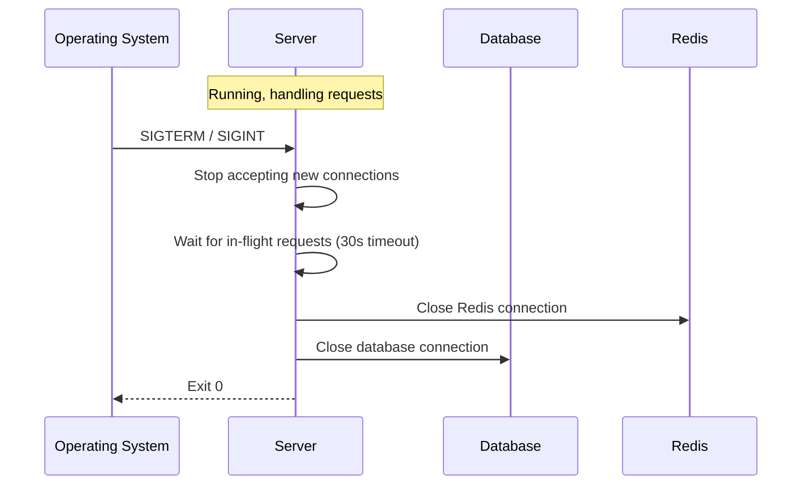
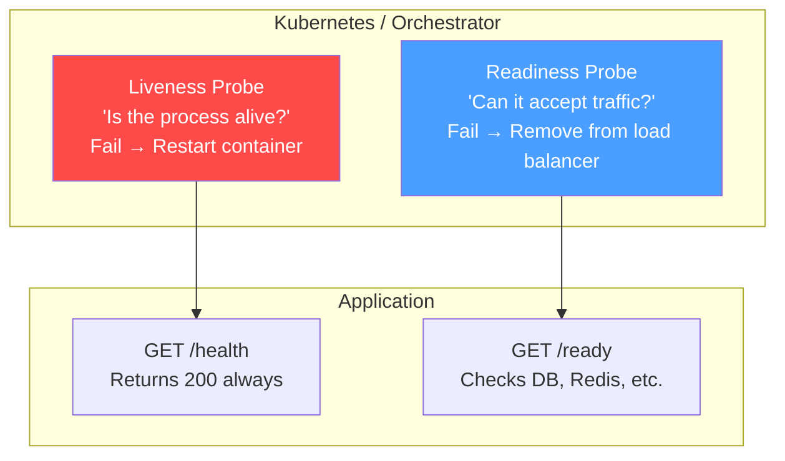
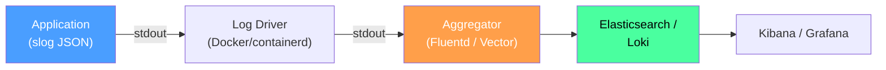
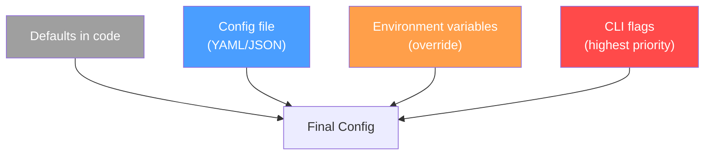
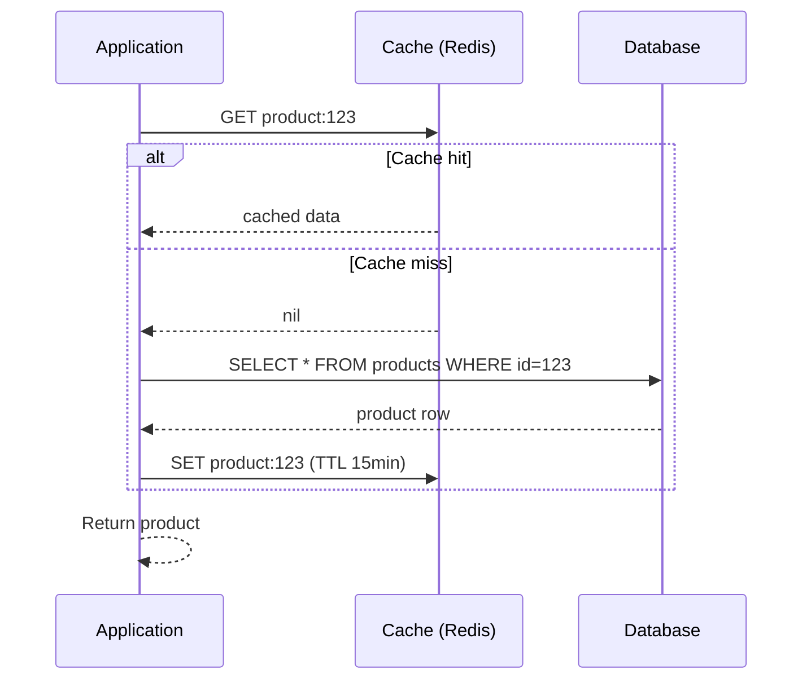
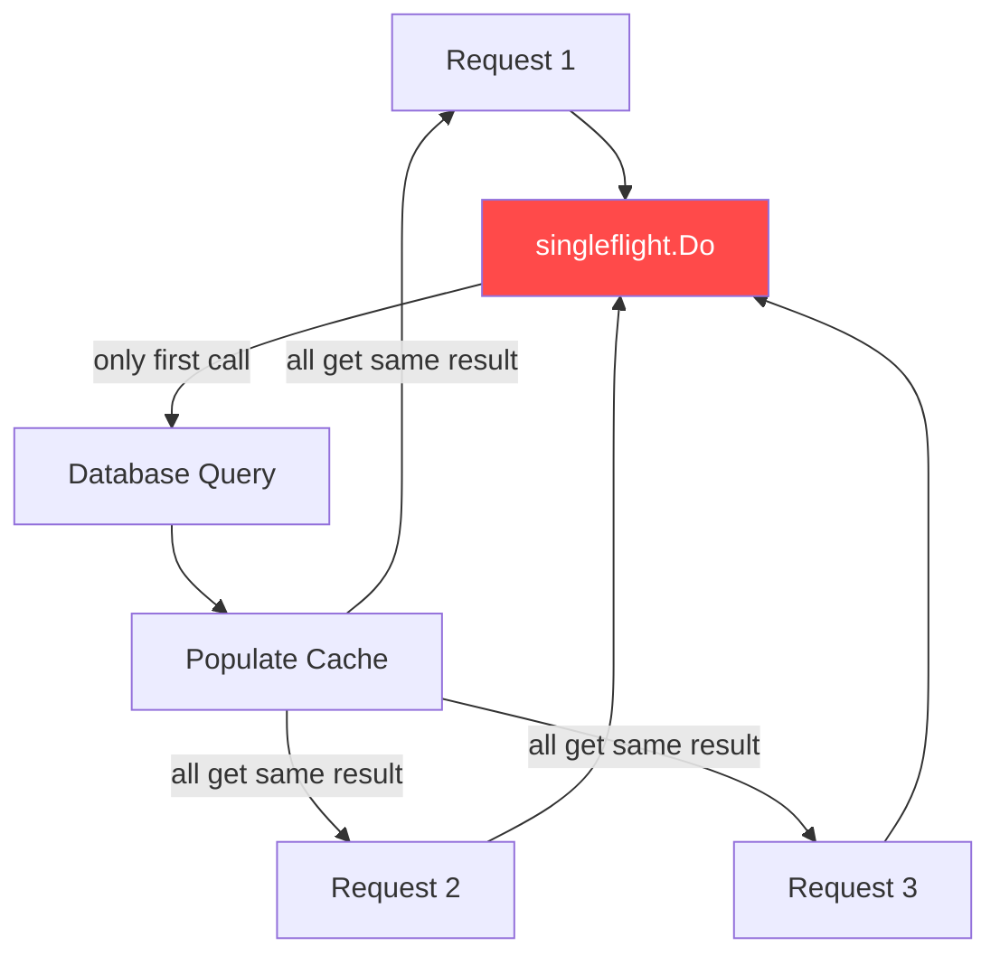
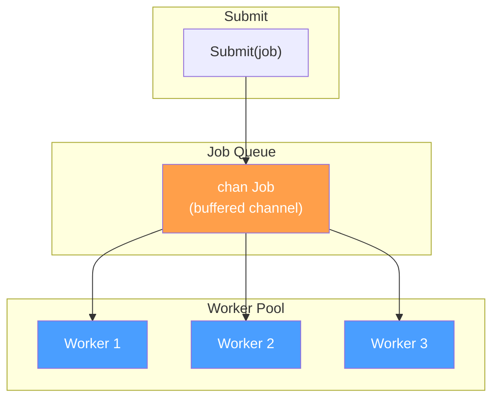
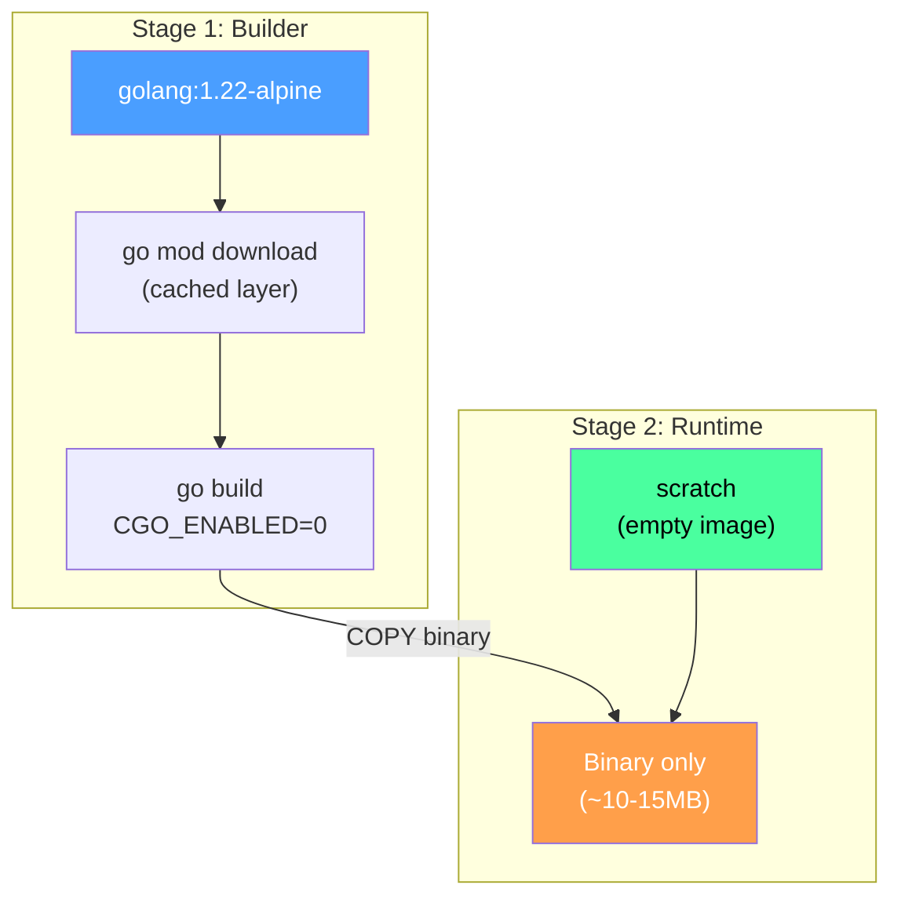
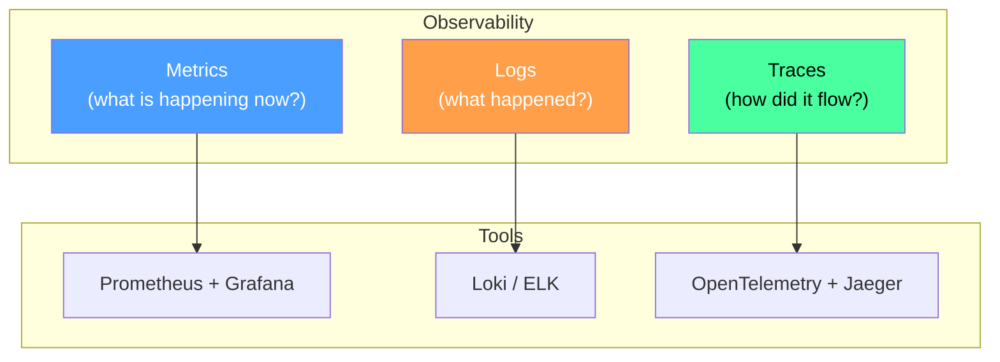

# Production Backend Engineering in Go

Previous files covered language fundamentals, the standard library,
concurrency, testing, HTTP servers, databases, application architecture, and
authentication. This file covers what happens when you move from a working
prototype to a service that handles real traffic and must stay alive under
adverse conditions.

---

## Table of Contents

1. [Graceful Shutdown](#1-graceful-shutdown)
2. [Health Checks](#2-health-checks)
3. [Structured Logging in Practice](#3-structured-logging-in-practice)
4. [Configuration Management](#4-configuration-management)
5. [Caching](#5-caching)
6. [Redis as Cache](#6-redis-as-cache)
7. [Background Jobs](#7-background-jobs)
8. [Rate Limiting](#8-rate-limiting)
9. [API Versioning](#9-api-versioning)
10. [File Uploads](#10-file-uploads)
11. [Docker](#11-docker)
12. [Performance Profiling](#12-performance-profiling)
13. [Monitoring and Observability](#13-monitoring-and-observability)
14. [Modern Practices](#14-modern-practices)
15. [Common Production Mistakes](#15-common-production-mistakes)

---

## 1. Graceful Shutdown

A production server must finish in-flight requests before exiting. Killing
the process abruptly causes connection resets and inconsistent state.

### Signal Handling



The standard approach: catch OS signals, call `http.Server.Shutdown`, then
clean up downstream resources.

```go
package main

import (
    "context"
    "log/slog"
    "net/http"
    "os"
    "os/signal"
    "syscall"
    "time"
)

func main() {
    mux := http.NewServeMux()
    server := &http.Server{Addr: ":8080", Handler: mux}

    go func() {
        slog.Info("server starting", "addr", server.Addr)
        if err := server.ListenAndServe(); err != nil && err != http.ErrServerClosed {
            slog.Error("listen error", "error", err)
        }
    }()

    quit := make(chan os.Signal, 1)
    signal.Notify(quit, syscall.SIGINT, syscall.SIGTERM)
    sig := <-quit
    slog.Info("received signal, shutting down", "signal", sig)

    ctx, cancel := context.WithTimeout(context.Background(), 30*time.Second)
    defer cancel()

    if err := server.Shutdown(ctx); err != nil {
        slog.Error("shutdown error", "error", err)
        os.Exit(1)
    }
    slog.Info("server stopped gracefully")
}
```

`Shutdown` does not close listeners immediately. It stops accepting new
connections and waits for active requests to complete or the context deadline
to expire.

> 🔑 **Key idea:** Graceful shutdown is drain-then-close: stop accepting new
> work, let in-flight requests finish, then release resources — in that
> order, every deploy.

### Cleanup Order

Shut down the HTTP server first so no new queries arrive, then close
downstream connections:

```go
// In your shutdown sequence:
if err := server.Shutdown(ctx); err != nil {
    slog.Error("server shutdown", "error", err)
}
if err := db.Close(); err != nil {
    slog.Error("db close", "error", err)
}
if err := rdb.Close(); err != nil {
    slog.Error("redis close", "error", err)
}
```

---

## 2. Health Checks

Orchestrators need to know whether your application is healthy. Two distinct
probes serve different purposes.



### Liveness Probe

"Is the process alive and not deadlocked?" If this fails, the orchestrator
restarts the container. The check must be cheap and independent of external
dependencies.

```go
mux.HandleFunc("GET /health", func(w http.ResponseWriter, r *http.Request) {
    w.Header().Set("Content-Type", "application/json")
    w.Write([]byte(`{"status":"ok"}`))
})
```

### Readiness Probe

"Can this instance accept traffic?" Verify that downstream dependencies are
reachable. If this fails, the orchestrator removes the instance from the load
balancer without restarting it.

```go
mux.HandleFunc("GET /ready", func(w http.ResponseWriter, r *http.Request) {
    ctx, cancel := context.WithTimeout(r.Context(), 2*time.Second)
    defer cancel()

    if err := db.PingContext(ctx); err != nil {
        w.Header().Set("Content-Type", "application/json")
        w.WriteHeader(http.StatusServiceUnavailable)
        w.Write([]byte(`{"status":"not ready","error":"database unreachable"}`))
        return
    }

    w.Header().Set("Content-Type", "application/json")
    w.Write([]byte(`{"status":"ok"}`))
})
```

Health checks should return in under 2 seconds. Never run expensive queries
or scans in these endpoints.

> ⚠️ **Watch out:** Don't put a database ping inside the liveness probe — a
> slow DB would trigger constant restarts. Liveness must stay dependency-free;
> only readiness checks downstream services.

---

## 3. Structured Logging in Practice

`log/slog` (Go 1.21+) provides structured, machine-parseable output with
context propagation.

### JSON Handler with Levels

```go
func setupLogger() {
    level := slog.LevelInfo
    if os.Getenv("LOG_LEVEL") == "debug" {
        level = slog.LevelDebug
    }

    handler := slog.NewJSONHandler(os.Stdout, &slog.HandlerOptions{Level: level})
    slog.SetDefault(slog.New(handler))
}
```

Use levels deliberately: `Debug` for development diagnostics, `Info` for
normal operations, `Warn` for degraded states, `Error` for failures.

### Request-Scoped Logging

Attach request metadata to every log line emitted during a request:

```go
type loggerKey struct{}

func LoggingMiddleware(next http.Handler) http.Handler {
    return http.HandlerFunc(func(w http.ResponseWriter, r *http.Request) {
        start := time.Now()
        logger := slog.With(
            "method", r.Method,
            "path", r.URL.Path,
            "request_id", r.Header.Get("X-Request-ID"),
        )

        ctx := context.WithValue(r.Context(), loggerKey{}, logger)
        next.ServeHTTP(w.WithContext(ctx), w)

        logger.Info("request completed",
            "status", rw.statusCode,
            "latency_ms", time.Since(start).Milliseconds(),
        )
    })
}

func LoggerFromContext(ctx context.Context) *slog.Logger {
    if l, ok := ctx.Value(loggerKey{}).(*slog.Logger); ok {
        return l
    }
    return slog.Default()
}
```

In handlers, call
`LoggerFromContext(r.Context()).Info("processing order", "id", id)` to get
consistent, traceable log output.

> 💡 **Pro tip:** Always attach a `request_id` and method/path to request
> logs. It turns "which request failed?" from archaeology into a one-line
> grep.

### Log Shipping Pipeline



---

## 4. Configuration Management

The 12-factor app methodology recommends storing configuration in the
environment. Secrets stay out of source code; the same binary runs across
environments.

### Environment Variables with Validation

```go
type Config struct {
    ServerAddr  string
    DatabaseURL string
    RedisAddr   string
    LogLevel    string
    MaxUploadMB int
}

func Load() (*Config, error) {
    cfg := &Config{
        ServerAddr:  getEnv("SERVER_ADDR", ":8080"),
        DatabaseURL: os.Getenv("DATABASE_URL"),
        RedisAddr:   getEnv("REDIS_ADDR", "localhost:6379"),
        LogLevel:    getEnv("LOG_LEVEL", "info"),
        MaxUploadMB: getEnvInt("MAX_UPLOAD_MB", 10),
    }
    if cfg.DatabaseURL == "" {
        return nil, fmt.Errorf("DATABASE_URL is required")
    }
    return cfg, nil
}

func getEnv(key, fallback string) string {
    if v := os.Getenv(key); v != "" {
        return v
    }
    return fallback
}
```

For complex applications, load a JSON or YAML config file and let environment
variables override specific values. This gives you readable defaults and
secret-free source control.

> 🔑 **Key idea:** Precedence is everything: code defaults → config file →
> environment variables → CLI flags. Each layer overrides the last, so the
> same binary runs unchanged across dev, staging, and prod.

### Configuration Hierarchy



---

## 5. Caching

Caching stores copies of data in a faster-to-access location to reduce
latency and database load.

### In-Memory Cache with TTL

```go
type entry struct {
    value     interface{}
    expiresAt time.Time
}

type MemoryCache struct {
    mu    sync.RWMutex
    items map[string]entry
}

func (c *MemoryCache) Set(key string, value interface{}, ttl time.Duration) {
    c.mu.Lock()
    c.items[key] = entry{value: value, expiresAt: time.Now().Add(ttl)}
    c.mu.Unlock()
}

func (c *MemoryCache) Get(key string) (interface{}, bool) {
    c.mu.RLock()
    e, ok := c.items[key]
    c.mu.RUnlock()
    if !ok || time.Now().After(e.expiresAt) {
        return nil, false
    }
    return e.value, true
}
```

### Invalidation Strategies

| Strategy | Description | Tradeoff |
|----------|-------------|----------|
| **TTL** | Entry expires after fixed duration | Simple, may serve stale data |
| **Cache-aside** (lazy loading) | App checks cache first; on miss, fetch from DB and populate | Most common for read-heavy |
| **Write-through** | Write to cache and DB simultaneously | Consistent, adds write latency |
| **Write-behind** | Write to cache, async flush to DB | Fast writes, risk of data loss |

> 🧠 **Memory aid:** Cache-aside is "try the short line first, fall back to
> the long line" — every cache miss is a DB hit, so instrument your hit rate
> to know which path users are really taking.

### Cache-Aside Flow



---

## 6. Redis as Cache

Redis is the standard distributed cache. The `go-redis/v9` package provides
an idiomatic client.

### Cache-Aside Pattern

```go
func GetProduct(ctx context.Context, id string) (*Product, error) {
    cacheKey := "product:" + id

    data, err := rdb.Get(ctx, cacheKey).Bytes()
    if err == nil {
        var p Product
        if json.Unmarshal(data, &p) == nil {
            return &p, nil
        }
    }

    p, err := dbQueryProduct(ctx, id)
    if err != nil {
        return nil, err
    }

    if data, err := json.Marshal(p); err == nil {
        rdb.Set(ctx, cacheKey, data, 15*time.Minute)
    }
    return p, nil
}
```

### Preventing Cache Stampede

When a popular key expires, many requests may rebuild it simultaneously. Use
`singleflight` to deduplicate concurrent fetches for the same key.



```go
var group singleflight.Group

func GetProductSafe(ctx context.Context, id string) (*Product, error) {
    cacheKey := "product:" + id

    data, err := rdb.Get(ctx, cacheKey).Bytes()
    if err == nil {
        var p Product
        if json.Unmarshal(data, &p) == nil {
            return &p, nil
        }
    }

    result, err, _ := group.Do(cacheKey, func() (interface{}, error) {
        p, err := dbQueryProduct(ctx, id)
        if err != nil {
            return nil, err
        }
        if data, err := json.Marshal(p); err == nil {
            rdb.Set(ctx, cacheKey, data, 15*time.Minute)
        }
        return p, nil
    })
    if err != nil {
        return nil, err
    }
    return result.(*Product), nil
}
```

> ⚠️ **Watch out:** When a hot key expires, dozens of requests can hit the DB
> at once (cache stampede). `singleflight` collapses concurrent misses into
> one DB query — always wrap miss handling for popular keys.

### Stale-While-Revalidate

Return cached data immediately even if expired within a stale window, while
refreshing in the background:

```go
func GetProductRevalidate(ctx context.Context, id string) (*Product, error) {
    cacheKey := "product:" + id
    staleKey := cacheKey + ":stale"

    // Try fresh cache
    data, err := rdb.Get(ctx, cacheKey).Bytes()
    if err == nil {
        var p Product
        if json.Unmarshal(data, &p) == nil {
            return &p, nil
        }
    }

    // Try stale cache (within 5-minute window)
    staleData, err := rdb.Get(ctx, staleKey).Bytes()
    if err == nil {
        var p Product
        if json.Unmarshal(staleData, &p) == nil {
            // Refresh in background
            go refreshCache(ctx, id, cacheKey, staleKey)
            return &p, nil
        }
    }

    return dbQueryProduct(ctx, id)
}
```

---

## 7. Background Jobs

Background jobs run asynchronously outside the request-response cycle: sending
emails, processing uploads, generating reports.

### Worker Pool Pattern



```go
type Job func(ctx context.Context)

type Pool struct {
    jobs    chan Job
    workers int
    wg      sync.WaitGroup
}

func NewPool(workers, queueSize int) *Pool {
    return &Pool{jobs: make(chan Job, queueSize), workers: workers}
}

func (p *Pool) Start(ctx context.Context) {
    for i := 0; i < p.workers; i++ {
        p.wg.Add(1)
        go func() {
            defer p.wg.Done()
            for {
                select {
                case <-ctx.Done():
                    return
                case job, ok := <-p.jobs:
                    if !ok {
                        return
                    }
                    func() {
                        defer func() {
                            if r := recover(); r != nil {
                                slog.Error("job panicked", "panic", r)
                            }
                        }()
                        job(ctx)
                    }()
                }
            }
        }()
    }
}

func (p *Pool) Submit(job Job)     { p.jobs <- job }
func (p *Pool) Shutdown()          { close(p.jobs); p.wg.Wait() }
```

> 🔑 **Key idea:** A worker pool bounds concurrency — the buffer caps queued
> work and the worker count caps parallel execution, so one burst can't
> exhaust memory. Persist heavy jobs in a broker for multi-instance setups.

For multi-instance deployments, replace the in-memory channel with a message
broker (Redis Streams, RabbitMQ, SQS) for persistence and retry guarantees.

### Using the Pool

```go
func main() {
    ctx, cancel := context.WithCancel(context.Background())
    defer cancel()

    pool := NewPool(4, 100)
    pool.Start(ctx)

    pool.Submit(func(ctx context.Context) {
        sendWelcomeEmail(user.Email)
    })

    // On shutdown:
    <-quit
    pool.Shutdown()
}
```

---

## 8. Rate Limiting

### Token Bucket

Each request consumes a token. Tokens refill at a fixed rate. When empty,
reject requests.

```go
type TokenBucket struct {
    mu         sync.Mutex
    tokens     float64
    maxTokens  float64
    refillRate float64
    lastRefill time.Time
}

func (tb *TokenBucket) Allow() bool {
    tb.mu.Lock()
    defer tb.mu.Unlock()
    now := time.Now()
    elapsed := now.Sub(tb.lastRefill).Seconds()
    tb.tokens = min(tb.maxTokens, tb.tokens+elapsed*tb.refillRate)
    tb.lastRefill = now
    if tb.tokens < 1 {
        return false
    }
    tb.tokens--
    return true
}
```

### Sliding Window

Counts requests within a rolling time window. Easier to reason about than
token bucket for fixed-window rate limits.

```go
func (sw *SlidingWindow) Allow(key string) bool {
    sw.mu.Lock()
    defer sw.mu.Unlock()
    now := time.Now()
    w, exists := sw.windows[key]
    if !exists || now.Sub(w.start) > sw.interval {
        sw.windows[key] = &window{count: 1, start: now}
        return true
    }
    if w.count >= sw.limit {
        return false
    }
    w.count++
    return true
}
```

### Redis-Based Rate Limiting

For shared rate limits across instances, use Redis INCR with EXPIRE or a Lua
script for atomic sliding window operations.

> ⚠️ **Watch out:** In-memory rate limiters only work per-instance. Behind a
> load balancer, each replica counts separately — move shared limits to Redis
> so the limit holds across the fleet.

---

## 9. API Versioning

### URL Path Versioning (Recommended for Public APIs)

```go
mux.HandleFunc("GET /v1/users/{id}", getUserV1)
mux.HandleFunc("GET /v2/users/{id}", getUserV2)
```

Simple, explicit, easy to route and document.

### Header Versioning

The client sends `Accept-Version: 2` in the header. Cleaner URLs but harder
to test and debug. Better suited for internal APIs where you control all
clients.

---

## 10. File Uploads

```go
func HandleUpload(maxSize int64, storagePath string) http.HandlerFunc {
    return func(w http.ResponseWriter, r *http.Request) {
        r.Body = http.MaxBytesReader(w, r.Body, maxSize)
        if err := r.ParseMultipartForm(maxSize); err != nil {
            http.Error(w, `{"error":"file too large"}`, http.StatusBadRequest)
            return
        }

        file, header, err := r.FormFile("file")
        if err != nil {
            http.Error(w, `{"error":"missing file"}`, http.StatusBadRequest)
            return
        }
        defer file.Close()

        filename := uuid.New().String() + filepath.Ext(header.Filename)
        dst, err := os.Create(filepath.Join(storagePath, filename))
        if err != nil {
            http.Error(w, `{"error":"save failed"}`, http.StatusInternalServerError)
            return
        }
        defer dst.Close()

        io.Copy(dst, file)
        fmt.Fprintf(w, `{"filename":"%s","size":%d}`, filename, header.Size)
    }
}
```

Always enforce max size with `MaxBytesReader`, validate content using magic
bytes (not just headers), and generate random filenames to prevent collisions
and path traversal.

> ⚠️ **Watch out:** Never trust a user-supplied filename or `Content-Type`
> header. Server-generate names and sniff magic bytes, or you open the door
> to path traversal and disguised executables.

---

## 11. Docker

### Multi-Stage Dockerfile

```dockerfile
FROM golang:1.22-alpine AS builder
WORKDIR /app
COPY go.mod go.sum ./
RUN go mod download
COPY . .
RUN CGO_ENABLED=0 GOOS=linux go build -ldflags="-s -w" -o /app/server ./cmd/server

FROM scratch
COPY --from=builder /app/server /server
EXPOSE 8080
ENTRYPOINT ["/server"]
```

- `CGO_ENABLED=0` produces a static binary required for the `scratch` base
  image.
- `-ldflags="-s -w"` strips debug symbols, reducing binary size.
- `go mod download` is cached separately so dependencies rebuild only when
  `go.mod` changes.

> 💡 **Pro tip:** `scratch` has no CA certificates or timezone data — switch
> to `alpine:3.19` and add `ca-certificates` if your service makes HTTPS
> calls. And never put secrets in `docker-compose.yml`.

For HTTPS calls, use `alpine:3.19` instead of `scratch` and add
`ca-certificates`.



### Docker Compose for Development

```yaml
version: "3.8"
services:
  app:
    build: .
    ports:
      - "8080:8080"
    environment:
      - DATABASE_URL=postgres://postgres:secret@db:5432/myapp?sslmode=disable
      - REDIS_ADDR=redis:6379
    depends_on:
      - db
      - redis

  db:
    image: postgres:16-alpine
    environment:
      POSTGRES_PASSWORD: secret
      POSTGRES_DB: myapp
    volumes:
      - pgdata:/var/lib/postgresql/data

  redis:
    image: redis:7-alpine

volumes:
  pgdata:
```

---

## 12. Performance Profiling

### Profiling with pprof

```go
import _ "net/http/pprof"

// Run on a separate port, never expose without auth in production.
go http.ListenAndServe(":6060", nil)
```

Collect and analyze:

```bash
go tool pprof http://localhost:6060/debug/pprof/profile?seconds=30
go tool pprof http://localhost:6060/debug/pprof/heap
go tool pprof http://localhost:6060/debug/pprof/goroutine
```

### Benchmarking

```go
func BenchmarkGetProduct(b *testing.B) {
    for i := 0; i < b.N; i++ {
        GetProduct(context.Background(), "product-1")
    }
}
```

Run with `go test -bench=. -benchmem -count=5 ./...` to see allocations per
operation.

### Avoid Allocations in Hot Paths

- Use `strings.Builder` instead of string concatenation.
- Pre-allocate slices: `make([]T, 0, expectedSize)`.
- Reuse buffers with `sync.Pool`.

---

## 13. Monitoring and Observability

### The Three Pillars



### Metrics (Prometheus)

```go
var (
    reqTotal = prometheus.NewCounterVec(
        prometheus.CounterOpts{Name: "http_requests_total"},
        []string{"method", "path", "status"},
    )
    reqDuration = prometheus.NewHistogramVec(
        prometheus.HistogramOpts{
            Name:    "http_request_duration_seconds",
            Buckets: prometheus.DefBuckets,
        },
        []string{"method", "path"},
    )
)

func MetricsMiddleware(next http.Handler) http.Handler {
    return http.HandlerFunc(func(w http.ResponseWriter, r *http.Request) {
        start := time.Now()
        next.ServeHTTP(w, r)
        duration := time.Since(start).Seconds()
        reqTotal.WithLabelValues(r.Method, r.URL.Path, fmt.Sprintf("%d", rw.statusCode)).Inc()
        reqDuration.WithLabelValues(r.Method, r.URL.Path).Observe(duration)
    })
}
```

Key metrics to track:

| Metric | What it tells you |
|--------|-------------------|
| `http_requests_total` | Request rate by method/path/status |
| `http_request_duration_seconds` | Latency distribution (p50/p95/p99) |
| `http_requests_in_flight` | Concurrent active requests |
| `go_goroutines` | Goroutine count (leak detection) |
| `go_memstats_alloc_bytes` | Memory usage |

### Tracing (OpenTelemetry)

Use OpenTelemetry to follow requests across service boundaries. Create spans
around important operations, record errors, and link trace IDs to your
structured logs.

```go
import "go.opentelemetry.io/otel"

func GetProduct(ctx context.Context, id string) (*Product, error) {
    ctx, span := tracer.Start(ctx, "GetProduct")
    defer span.End()

    // Check cache
    p, err := getFromCache(ctx, id)
    if err == nil {
        span.SetAttributes(attribute.Bool("cache.hit", true))
        return p, nil
    }

    // Query database
    span.SetAttributes(attribute.Bool("cache.hit", false))
    p, err = dbQueryProduct(ctx, id)
    if err != nil {
        span.RecordError(err)
        return nil, err
    }

    return p, nil
}
```

---

## 14. Modern Practices

- **Graceful shutdown is mandatory** — always catch SIGINT/SIGTERM, call
  `server.Shutdown()`, then close downstream connections in order.
- **Liveness + readiness probes** — separate them. Liveness is "am I alive?"
  (cheap, no external deps). Readiness is "can I serve?" (check DB, Redis).
- **Structured logging from day one** — `slog` JSON output shipped to Loki
  or ELK. Request-scoped context on every log line.
- **12-factor config** — environment variables, validated at startup. Never
  hardcode secrets or config values.
- **Cache-aside with singleflight** — prevent cache stampede. Add
  stale-while-revalidate for hot keys.
- **Worker pools with recovery** — panic recovery per job. Graceful shutdown
  with `pool.Shutdown()`. Message broker for multi-instance deployments.
- **Multi-stage Docker builds** — `golang` builder → `scratch` or `alpine`
  runtime. Strip symbols with `-ldflags="-s -w"`. Set `CGO_ENABLED=0`.
- **Profiling in production** — pprof on a separate port (auth-gated).
  Prometheus metrics for request rate, latency, error rate, goroutines.
- **OpenTelemetry tracing** — distributed tracing across service boundaries.
  Link trace IDs to structured logs.
- **Rate limiting at multiple layers** — API gateway for global limits,
  application-level for per-user/per-endpoint limits.
- **`GOMAXPROCS` in containers** — use `automaxprocs` to read cgroup limits
  instead of assuming host CPU count.

---

## 15. Common Production Mistakes

### Not closing response bodies

Leaks HTTP connections. Always `defer resp.Body.Close()`.

### Ignoring errors

Leads to silent failures. Handle every error explicitly.

### Goroutine leaks

Goroutines block on channels with no receiver. Use context for cancellation
and always ensure channels are closed or have consumers.

### No HTTP client timeout

A slow downstream can stall your entire server:

```go
client := &http.Client{Timeout: 10 * time.Second}
```

### Logging sensitive data

Exposes PII. Log events, not payloads.

### Shared mutable state without synchronization

Causes race conditions. Use `sync.Mutex`, `sync.Map`, or channels.

### Connecting to databases in `init()`

Prevents proper error handling and graceful shutdown. Open connections in
`main()`.

### Over-provisioning goroutines

Unbounded goroutine creation can exhaust memory. Use worker pools with
bounded concurrency.

### Not using `GOMEMLIMIT`

In containers, Go's GC may not be aware of memory limits. Set `GOMEMLIMIT`
to match your container's memory allocation.

```go
import _ "runtime/debug"

func init() {
    debug.SetMemoryLimit(256 << 20) // 256 MB
}
```

Or use `GOMEMLIMIT` environment variable (Go 1.19+).

### Incorrect `GOMAXPROCS`

In containers, Go's default `GOMAXPROCS` may see **host** CPU count, not the
container's limit, causing over-parallelism:

```go
import _ "go.uber.org/automaxprocs"
```

---

## Exercises

### Exercise 1: Graceful Shutdown

Write a server on port 9090 with `GET /work` (2s delay) and `GET /health`.
On SIGTERM, stop accepting new connections and wait up to 10s for in-flight
requests. Log completion counts.

### Exercise 2: Health Check Middleware

Implement `/health` (always 200) and `/ready` (200 only if an injected
`pingFunc` succeeds within 2s). Write unit tests for both states.

### Exercise 3: Rate Limiter

Per-IP sliding window: 100 requests/minute. Return 429 with retry-after.
Clean up stale entries periodically.

### Exercise 4: Prioritized Worker Pool

Extend the worker pool with three priority levels. High-priority jobs
process before Medium, Medium before Low. Benchmark against a FIFO pool.

### Exercise 5: Cache-Aside with Stale-While-Revalidate

Return cached data immediately even if expired within a 5-minute stale
window, while refreshing in the background. Use `singleflight` to prevent
stampede. Write tests for each behavior.

### Exercise 6: File Upload Service

Accept multipart uploads, validate magic bytes (not Content-Type), enforce
50MB limit, store with UUID filenames. Include a `/ready` check that verifies
the storage directory is writable.

---

## Key Takeaways

1. **Graceful shutdown** — catch signals, stop accepting, drain in-flight,
   close downstream. Cleanup order matters (HTTP first, then DB, then cache).
2. **Health checks** — liveness (am I alive?) and readiness (can I serve?)
   are distinct probes with different failure behaviors.
3. **Structured logging** — `slog` JSON, request-scoped context, log
   shipping pipeline. Never log secrets.
4. **Configuration** — environment variables, validated at startup, layered
   (defaults → file → env → flags).
5. **Caching** — cache-aside is the default pattern. Use `singleflight`
   for stampede prevention. Stale-while-revalidate for hot keys.
6. **Background jobs** — worker pools with bounded concurrency and panic
   recovery. Message broker for multi-instance.
7. **Docker** — multi-stage builds: `golang` builder → `scratch` runtime.
   `CGO_ENABLED=0` for static binary. Cache `go mod download` layer.
8. **Profiling** — pprof on a separate port. Benchmark with `-benchmem`.
   Reduce allocations in hot paths.
9. **Observability** — metrics (Prometheus), logs (Loki/ELK), traces
   (OpenTelemetry). The three pillars together give you full visibility.
10. **Container awareness** — `GOMAXPROCS` via `automaxprocs`, `GOMEMLIMIT`
    for GC tuning, proper signal handling for orchestrators.

---

## Next

Continue to [../13-projects/](../13-projects/) for hands-on projects that
apply everything from Part 1 through Part 12 — complete Go backends
built from scratch with architecture, auth, and production best practices.
