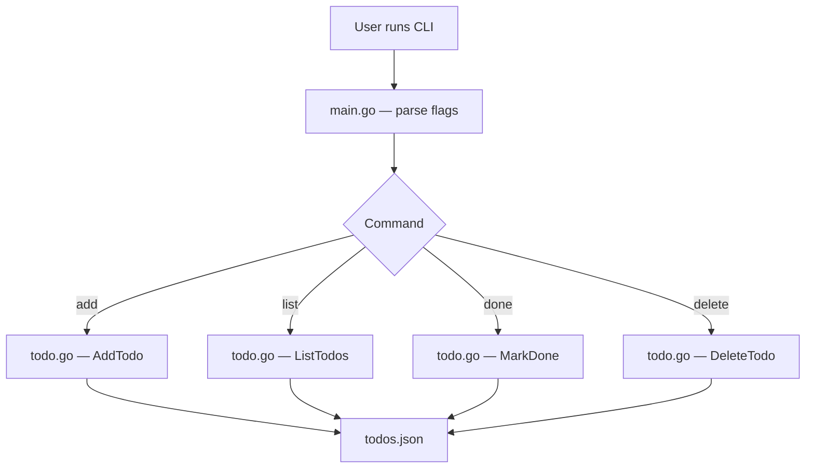

# Project 01: CLI Todo App

A command-line todo list application written entirely with Go's standard
library. No frameworks, no third-party dependencies — just `flag`, `os`,
`encoding/json`, and `fmt`.

---

## Learning Goals

- Parse command-line flags and arguments with `flag`
- Read and write JSON files with `encoding/json`
- Work with structs, slices, and pointers (Part 03)
- Practice error handling and `os.Exit`
- Write table-driven tests (Part 06)
- Understand file I/O patterns

## Prerequisites

| Part | What you need |
|------|---------------|
| 01   | Variables, constants, control flow, `fmt` |
| 02   | Slices, maps |
| 03   | Structs, pointers, methods, `encoding/json` basics |
| 05   | `os` package, file I/O |
| 06   | Writing tests |

---

## Project Structure

```
cli-todo/
├── main.go            # Entry point, flag parsing, command dispatch
├── todo.go            # Todo struct, Store type, JSON persistence
├── todo_test.go       # Table-driven tests for Todo operations
├── go.mod             # Module definition
└── todos.json         # Created at runtime for persistence
```



> 🧠 **Memory aid:** The project is a thin CLI on top of a JSON file — flags
> pick the command, the `Store` owns all file I/O, and `main.go` only talks
> to the `Store`. Same shape powers much bigger apps.

---

## Part A: The Todo Model and Store

Create `todo.go`:

```go
package main

import (
	"encoding/json"
	"fmt"
	"os"
	"time"
)

// Todo represents a single task.
type Todo struct {
	ID        int       `json:"id"`
	Title     string    `json:"title"`
	Done      bool      `json:"done"`
	CreatedAt time.Time `json:"created_at"`
}

// Store manages a collection of todos persisted to a JSON file.
type Store struct {
	filePath string
	todos    []Todo
	nextID   int
}

// NewStore creates a Store backed by the given file.
// If the file does not exist, it starts with an empty list.
func NewStore(filePath string) (*Store, error) {
	s := &Store{filePath: filePath}

	data, err := os.ReadFile(filePath)
	if err != nil {
		if os.IsNotExist(err) {
			// First run — no file yet, start fresh.
			return s, nil
		}
		return nil, fmt.Errorf("reading store file: %w", err)
	}

	if len(data) == 0 {
		return s, nil
	}

	type fileData struct {
		Todos  []Todo `json:"todos"`
		NextID int    `json:"next_id"`
	}

	var fd fileData
	if err := json.Unmarshal(data, &fd); err != nil {
		return nil, fmt.Errorf("parsing store file: %w", err)
	}

	s.todos = fd.Todos
	s.nextID = fd.NextID
	if s.nextID == 0 {
		s.nextID = 1
	}

	return s, nil
}

// Save writes the current state to disk atomically using a temp file.
func (s *Store) Save() error {
	type fileData struct {
		Todos  []Todo `json:"todos"`
		NextID int    `json:"next_id"`
	}

	data, err := json.MarshalIndent(fileData{
		Todos:  s.todos,
		NextID: s.nextID,
	}, "", "  ")
	if err != nil {
		return fmt.Errorf("marshaling todos: %w", err)
	}

	tmp := s.filePath + ".tmp"
	if err := os.WriteFile(tmp, data, 0644); err != nil {
		return fmt.Errorf("writing temp file: %w", err)
	}

	if err := os.Rename(tmp, s.filePath); err != nil {
		return fmt.Errorf("renaming temp file: %w", err)
	}

	return nil
}

// AddTodo appends a new todo and returns its ID.
func (s *Store) AddTodo(title string) int {
	t := Todo{
		ID:        s.nextID,
		Title:     title,
		Done:      false,
		CreatedAt: time.Now(),
	}
	s.todos = append(s.todos, t)
	s.nextID++
	return t.ID
}

// ListTodos returns all todos.
func (s *Store) ListTodos() []Todo {
	return s.todos
}

// MarkDone marks the todo with the given ID as done.
// Returns an error if the ID is not found.
func (s *Store) MarkDone(id int) error {
	for i := range s.todos {
		if s.todos[i].ID == id {
			s.todos[i].Done = true
			return nil
		}
	}
	return fmt.Errorf("todo with ID %d not found", id)
}

// DeleteTodo removes the todo with the given ID.
func (s *Store) DeleteTodo(id int) error {
	for i, t := range s.todos {
		if t.ID == id {
			s.todos = append(s.todos[:i], s.todos[i+1:]...)
			return nil
		}
	}
	return fmt.Errorf("todo with ID %d not found", id)
}
```

### Key Points

- **`os.ReadFile` + `os.WriteFile`** — simple file I/O, no streaming needed for
  small files.
- **Atomic rename** — write to a `.tmp` file then rename. Prevents corruption
  if the process crashes mid-write.
- **`time.Now()`** — stores creation timestamp for free.
- **Error wrapping** — `fmt.Errorf("context: %w", err)` preserves the original
  error chain.

> 💡 **Tip:** Writing to `.tmp` then `os.Rename` is the same crash-safe trick
> real databases use (write-ahead logs). Get comfortable with it now — you'll
> use it in every persistence project after this.

---

## Part B: The CLI Entry Point

Create `main.go`:

```go
package main

import (
	"flag"
	"fmt"
	"os"
	"strconv"
)

const defaultFile = "todos.json"

func main() {
	filePath := flag.String("file", defaultFile, "path to the JSON storage file")
	flag.Parse()

	store, err := NewStore(*filePath)
	if err != nil {
		fmt.Fprintf(os.Stderr, "error: %v\n", err)
		os.Exit(1)
	}

	args := flag.Args()
	if len(args) == 0 {
		printUsage()
		os.Exit(1)
	}

	command := args[0]

	switch command {
	case "add":
		if len(args) < 2 {
			fmt.Fprintln(os.Stderr, "usage: todo add <title>")
			os.Exit(1)
		}
		title := joinArgs(args[1:])
		id := store.AddTodo(title)
		if err := store.Save(); err != nil {
			fmt.Fprintf(os.Stderr, "error saving: %v\n", err)
			os.Exit(1)
		}
		fmt.Printf("Added todo #%d: %s\n", id, title)

	case "list":
		todos := store.ListTodos()
		if len(todos) == 0 {
			fmt.Println("No todos yet.")
			return
		}
		for _, t := range todos {
			status := " "
			if t.Done {
				status = "x"
			}
			fmt.Printf("[%s] #%d  %s\n", status, t.ID, t.Title)
		}

	case "done":
		if len(args) < 2 {
			fmt.Fprintln(os.Stderr, "usage: todo done <id>")
			os.Exit(1)
		}
		id, err := strconv.Atoi(args[1])
		if err != nil {
			fmt.Fprintf(os.Stderr, "invalid ID: %s\n", args[1])
			os.Exit(1)
		}
		if err := store.MarkDone(id); err != nil {
			fmt.Fprintf(os.Stderr, "error: %v\n", err)
			os.Exit(1)
		}
		if err := store.Save(); err != nil {
			fmt.Fprintf(os.Stderr, "error saving: %v\n", err)
			os.Exit(1)
		}
		fmt.Printf("Todo #%d marked as done.\n", id)

	case "delete":
		if len(args) < 2 {
			fmt.Fprintln(os.Stderr, "usage: todo delete <id>")
			os.Exit(1)
		}
		id, err := strconv.Atoi(args[1])
		if err != nil {
			fmt.Fprintf(os.Stderr, "invalid ID: %s\n", args[1])
			os.Exit(1)
		}
		if err := store.DeleteTodo(id); err != nil {
			fmt.Fprintf(os.Stderr, "error: %v\n", err)
			os.Exit(1)
		}
		if err := store.Save(); err != nil {
			fmt.Fprintf(os.Stderr, "error saving: %v\n", err)
			os.Exit(1)
		}
		fmt.Printf("Todo #%d deleted.\n", id)

	default:
		fmt.Fprintf(os.Stderr, "unknown command: %s\n", command)
		printUsage()
		os.Exit(1)
	}
}

// joinArgs joins all arguments with spaces (for multi-word titles).
func joinArgs(args []string) string {
	result := ""
	for i, a := range args {
		if i > 0 {
			result += " "
		}
		result += a
	}
	return result
}

func printUsage() {
	fmt.Println("Usage: todo <command> [arguments]")
	fmt.Println()
	fmt.Println("Commands:")
	fmt.Println("  add <title>     Add a new todo")
	fmt.Println("  list            List all todos")
	fmt.Println("  done <id>       Mark a todo as done")
	fmt.Println("  delete <id>     Delete a todo")
	fmt.Println()
	fmt.Println("Flags:")
	fmt.Println("  -file <path>    Path to JSON storage file (default: todos.json)")
}
```

### Running It

```bash
go run . add "Buy groceries"
# Added todo #1: Buy groceries

go run . add "Write tests"
# Added todo #2: Write tests

go run . list
# [ ] #1  Buy groceries
# [ ] #2  Write tests

go run . done 1
# Todo #1 marked as done.

go run . list
# [x] #1  Buy groceries
# [ ] #2  Write tests

go run . delete 2
# Todo #2 deleted.

go run . -file custom.json add "Custom file"
# Added todo #1: Custom file
```

> 💡 **Tip:** Every command calls `store.Save()` after mutating — that keeps
> the in-memory list and the JSON file in sync. Forget the save and your
> changes vanish on the next restart.

---

## Part C: Tests

Create `todo_test.go`:

```go
package main

import (
	"os"
	"path/filepath"
	"testing"
)

// tempStore creates a Store backed by a temp file, returned for cleanup.
func tempStore(t *testing.T) *Store {
	t.Helper()
	dir := t.TempDir()
	path := filepath.Join(dir, "todos.json")
	s, err := NewStore(path)
	if err != nil {
		t.Fatalf("NewStore: %v", err)
	}
	return s
}

func TestAddTodo(t *testing.T) {
	s := tempStore(t)

	id := s.AddTodo("Test task")
	if id != 1 {
		t.Errorf("expected ID 1, got %d", id)
	}

	todos := s.ListTodos()
	if len(todos) != 1 {
		t.Fatalf("expected 1 todo, got %d", len(todos))
	}
	if todos[0].Title != "Test task" {
		t.Errorf("expected title 'Test task', got %q", todos[0].Title)
	}
	if todos[0].Done {
		t.Error("expected Done=false for new todo")
	}
}

func TestAddMultipleTodos(t *testing.T) {
	s := tempStore(t)

	id1 := s.AddTodo("First")
	id2 := s.AddTodo("Second")

	if id1 != 1 || id2 != 2 {
		t.Errorf("expected IDs 1 and 2, got %d and %d", id1, id2)
	}

	if len(s.ListTodos()) != 2 {
		t.Errorf("expected 2 todos, got %d", len(s.ListTodos()))
	}
}

func TestMarkDone(t *testing.T) {
	s := tempStore(t)

	s.AddTodo("Task")
	err := s.MarkDone(1)
	if err != nil {
		t.Fatalf("MarkDone: %v", err)
	}

	todos := s.ListTodos()
	if !todos[0].Done {
		t.Error("expected Done=true after MarkDone")
	}
}

func TestMarkDoneNotFound(t *testing.T) {
	s := tempStore(t)

	s.AddTodo("Task")
	err := s.MarkDone(999)
	if err == nil {
		t.Error("expected error for non-existent ID")
	}
}

func TestDeleteTodo(t *testing.T) {
	s := tempStore(t)

	s.AddTodo("Task A")
	s.AddTodo("Task B")

	err := s.DeleteTodo(1)
	if err != nil {
		t.Fatalf("DeleteTodo: %v", err)
	}

	todos := s.ListTodos()
	if len(todos) != 1 {
		t.Fatalf("expected 1 todo after delete, got %d", len(todos))
	}
	if todos[0].ID != 2 {
		t.Errorf("expected remaining todo ID 2, got %d", todos[0].ID)
	}
}

func TestDeleteNotFound(t *testing.T) {
	s := tempStore(t)

	err := s.DeleteTodo(999)
	if err == nil {
		t.Error("expected error for non-existent ID")
	}
}

// table-driven test for marking done with various inputs
func TestMarkDoneTableDriven(t *testing.T) {
	tests := []struct {
		name    string
		addIDs  []int
		markID  int
		wantErr bool
	}{
		{"valid single", []int{1}, 1, false},
		{"valid middle", []int{1, 2, 3}, 2, false},
		{"valid last", []int{1, 2, 3}, 3, false},
		{"not found", []int{1}, 5, true},
		{"empty list", []int{}, 1, true},
	}

	for _, tt := range tests {
		t.Run(tt.name, func(t *testing.T) {
			s := tempStore(t)
			for range tt.addIDs {
				s.AddTodo("task")
			}
			err := s.MarkDone(tt.markID)
			if (err != nil) != tt.wantErr {
				t.Errorf("MarkDone(%d) error = %v, wantErr = %v",
					tt.markID, err, tt.wantErr)
			}
		})
	}
}
```

> 💡 **Tip:** Table-driven tests turn one function into five scenarios with
> one loop. Adding a case is a one-line diff — no copy-pasted test
> functions, no forgotten edge case.

func TestSaveAndLoad(t *testing.T) {
	dir := t.TempDir()
	path := filepath.Join(dir, "todos.json")

	// Create store, add todos, save
	s1, err := NewStore(path)
	if err != nil {
		t.Fatalf("NewStore: %v", err)
	}
	s1.AddTodo("Persistent task")
	s1.AddTodo("Another task")
	s1.MarkDone(1)
	if err := s1.Save(); err != nil {
		t.Fatalf("Save: %v", err)
	}

	// Load from same file
	s2, err := NewStore(path)
	if err != nil {
		t.Fatalf("NewStore (reload): %v", err)
	}

	todos := s2.ListTodos()
	if len(todos) != 2 {
		t.Fatalf("expected 2 todos after reload, got %d", len(todos))
	}
	if !todos[0].Done {
		t.Error("expected first todo to be Done after reload")
	}
	if todos[1].Done {
		t.Error("expected second todo to be NotDone after reload")
	}
}
```
func TestNewStoreMissingFile(t *testing.T) {
	s, err := NewStore(filepath.Join(t.TempDir(), "nonexistent.json"))
	if err != nil {
		t.Fatalf("expected no error for missing file, got: %v", err)
	}
	if len(s.ListTodos()) != 0 {
		t.Error("expected empty list for new store")
	}
}

func TestNewStoreCorruptFile(t *testing.T) {
	dir := t.TempDir()
	path := filepath.Join(dir, "bad.json")
	os.WriteFile(path, []byte("{invalid json"), 0644)

	_, err := NewStore(path)
	if err == nil {
		t.Error("expected error for corrupt JSON file")
	}
}
```

> 🔑 **Checkpoint:** Notice how `tempStore` uses `t.TempDir()` — every test
> gets an isolated directory, so tests never pollute each other. This helper
> is the secret to the whole test file staying deterministic.

### Running the Tests

```bash
go test -v ./...
```

Expected output:

```
=== RUN   TestAddTodo
--- PASS: TestAddTodo (0.00s)
=== RUN   TestAddMultipleTodos
--- PASS: TestAddMultipleTodos (0.00s)
=== RUN   TestMarkDone
--- PASS: TestMarkDone (0.00s)
=== RUN   TestMarkDoneNotFound
--- PASS: TestMarkDoneNotFound (0.00s)
=== RUN   TestDeleteTodo
--- PASS: TestDeleteTodo (0.00s)
=== RUN   TestDeleteNotFound
--- PASS: TestDeleteNotFound (0.00s)
=== RUN   TestMarkDoneTableDriven
    --- PASS: TestMarkDoneTableDriven/valid_single (0.00s)
    --- PASS: TestMarkDoneTableDriven/valid_middle (0.00s)
    --- PASS: TestMarkDoneTableDriven/valid_last (0.00s)
    --- PASS: TestMarkDoneTableDriven/not_found (0.00s)
    --- PASS: TestMarkDoneTableDriven/empty_list (0.00s)
--- PASS: TestMarkDoneTableDriven (0.00s)
=== RUN   TestSaveAndLoad
--- PASS: TestSaveAndLoad (0.00s)
=== RUN   TestNewStoreMissingFile
--- PASS: TestNewStoreMissingFile (0.00s)
=== RUN   TestNewStoreCorruptFile
--- PASS: TestNewStoreCorruptFile (0.00s)
PASS
```

> ⚠️ **Watch out:** If you add a new command, add a test for it too — and run
> `go test -race ./...` when you involve goroutines. Tests only guard the
> code you actually write tests for.

---

## TDD Notes

This project demonstrates the **Test-Driven Development** workflow:

1. **Write a failing test first.** For example, write `TestMarkDone` before
   writing the `MarkDone` method. Run `go test` — it won't compile because
   `MarkDone` doesn't exist yet.
2. **Write the minimum code to pass.** Implement `MarkDone` with just enough
   logic to satisfy the test.
3. **Refactor.** Now that the test passes, clean up the code. The test
   catches regressions.

### Why TDD Works for This Project

- Each `Store` method is pure logic (no network, no UI). Perfect for fast
  unit tests.
- The `tempStore` helper uses `t.TempDir()` — each test gets its own
  directory, so tests are fully isolated.
- Table-driven tests let you cover edge cases (empty list, missing ID)
  with minimal boilerplate.

> 🔑 **Checkpoint:** The test order *is* the implementation order. If your
> feature branch grows a "do everything" test that fails for five reasons at
> once, the test is writing the code for you instead of the other way
> around.

### Suggested TDD Order

```
1. Write TestAddTodo         → implement AddTodo
2. Write TestMarkDone        → implement MarkDone
3. Write TestDeleteTodo      → implement DeleteTodo
4. Write TestSaveAndLoad     → implement Save + NewStore (load path)
5. Write TestMarkDoneTableDriven → refactor MarkDone if needed
```

> 🧠 **Memory aid:** Red → Green → Refactor. The test first fails for
> the *right* reason (feature missing), then passes with minimal code,
> then the code gets cleaner while the test keeps guarding it.

---

## Modern Practices

- **Atomic file writes** — write to `.tmp`, then `os.Rename`. This is
  crash-safe: either the old file or the new file exists, never a partial
  write. Production databases use the same pattern (write-ahead logs).
- **Error wrapping** — `fmt.Errorf("reading store: %w", err)` lets callers
  use `errors.Is` and `errors.As` to inspect the original error.
- **Table-driven tests** — the idiomatic Go pattern for testing multiple
  cases. Each subtest runs in its own `t.Run` scope with its own `TempDir`.
- **`t.Helper()`** — marks `tempStore` as a test helper so failure messages
  point to the calling test, not the helper.
- **Build with no dependencies** — `go build .` produces a single binary.
  No `go.sum` bloat, no vendored code. This is the Go philosophy.

---

## Common Mistakes

- **Forgetting to check `os.IsNotExist`** when reading the store file. If you
  don't, you'll error on first run instead of starting fresh.
- **Not creating the temp dir for tests.** Using a hard-coded path like
  `/tmp/test.json` causes test pollution and failures on CI. Always use
  `t.TempDir()`.
- **Ignoring `json.Unmarshal` errors.** A corrupt file silently produces zero-
  value structs. Always check the error.
- **Not using atomic writes.** Calling `os.WriteFile` directly on the
  `todos.json` path means a crash mid-write leaves the file truncated.
- **Printing to stdout in library code.** The `Store` methods should never
  call `fmt.Println`. Only `main.go` should print. This makes the store
  testable.
- **Forgetting `t.Fatal` vs `t.Error`.** Use `Fatal` when the test cannot
  continue (e.g., `len(todos)` is wrong and accessing `todos[0]` would
  panic). Use `Error` for non-fatal assertions.

---

## Stretch Goals / Extensions

1. **Add priorities** — extend `Todo` with a `Priority int` field. Accept
   `-priority 3` on `add`. Sort list output by priority.
2. **Add due dates** — accept `-due 2026-09-15` on `add`, format output
   nicely, warn if overdue.
3. **Filter commands** — `todo list --done`, `todo list --pending` to filter
   by status.
4. **Colorized output** — use ANSI escape codes for green (done) and red
   (overdue) in the terminal.
5. **Subcommands with cobra** — replace `flag` with `github.com/spf13/cobra`
   for richer CLI UX (auto-generated help, completions).
6. **SQLite persistence** — replace the JSON file with SQLite using
   `modernc.org/sqlite` (pure Go, no CGO).
7. **Interactive mode** — `todo interactive` enters a REPL with a numbered
   menu.

---

## Next

Continue to [02-http-url-shortener.md](02-http-url-shortener.md) for an HTTP
URL shortener — your first networked application using `net/http`, middleware,
and graceful shutdown.
