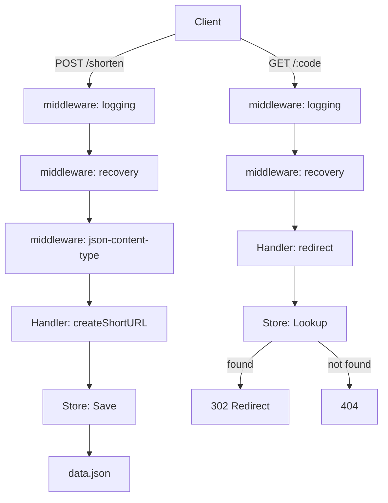

# Project 02: HTTP URL Shortener

A URL shortener service built with `net/http`. You'll create short URLs, redirect
them, and persist data to a JSON file — with middleware, graceful shutdown, and
table-driven tests.

---

## Learning Goals

- Build a real HTTP server with `net/http` (Part 07)
- Implement middleware (logging, recovery, content-type enforcement)
- Handle JSON request/response encoding
- Persist data to a file (asynchronous writes)
- Graceful shutdown with `signal.NotifyContext`
- Table-driven tests using `httptest`

## Prerequisites

| Part | What you need |
|------|---------------|
| 03   | Structs, pointers, methods |
| 04   | Goroutines, channels (for async persistence) |
| 05   | `fmt`, `strings`, `time` |
| 07   | `net/http`, `http.Handler`, middleware patterns, `httptest` |
| 06   | Table-driven tests |

---

## Project Structure

```
url-shortener/
├── main.go              # Entry point, server setup, graceful shutdown
├── handler.go           # HTTP handlers (create, redirect, list)
├── store.go             # In-memory + file persistence
├── middleware.go         # Logging, recovery, JSON content-type
├── handler_test.go      # Table-driven handler tests
├── store_test.go        # Store persistence tests
├── go.mod
└── data.json            # Created at runtime
```



> 🧠 **Memory aid:** The diagram is your request wall: every request walks
> through three middleware (logging → recovery → content-type) before ever
> reaching a handler — middleware runs before and after the handler like a
> security checkpoint.

---

## Part A: The Store

Create `store.go`:

```go
package main

import (
	"encoding/json"
	"fmt"
	"math/rand"
	"os"
	"sync"
	"time"
)

// Entry represents a single shortened URL.
type Entry struct {
	Code      string    `json:"code"`
	URL       string    `json:"url"`
	CreatedAt time.Time `json:"created_at"`
	Hits      int       `json:"hits"`
}

// Store is a thread-safe in-memory map with optional file persistence.
type Store struct {
	mu      sync.RWMutex
	entries map[string]Entry
	file    string
}

// NewStore creates a store. If file is non-empty, it loads existing data
// and starts a background goroutine that writes to disk periodically.
func NewStore(file string) *Store {
	s := &Store{
		entries: make(map[string]Entry),
		file:    file,
	}

	if file != "" {
		s.loadFromFile()
		go s.autoSave(5 * time.Second)
	}

	return s
}

// Create generates a short code for the given URL and stores it.
func (s *Store) Create(url string) (Entry, error) {
	code := generateCode(6)

	s.mu.Lock()
	defer s.mu.Unlock()

	// Check for collision — extremely unlikely with 6 chars but be safe.
	if _, exists := s.entries[code]; exists {
		return Entry{}, fmt.Errorf("code collision, try again")
	}

	entry := Entry{
		Code:      code,
		URL:       url,
		CreatedAt: time.Now(),
		Hits:      0,
	}
	s.entries[code] = entry
	return entry, nil
}

// Lookup returns the entry for the given code and increments hit count.
func (s *Store) Lookup(code string) (Entry, bool) {
	s.mu.Lock()
	defer s.mu.Unlock()

	entry, ok := s.entries[code]
	if !ok {
		return Entry{}, false
	}

	entry.Hits++
	s.entries[code] = entry
	return entry, true
}

// List returns all entries (snapshot).
func (s *Store) List() []Entry {
	s.mu.RLock()
	defer s.mu.RUnlock()

	result := make([]Entry, 0, len(s.entries))
	for _, e := range s.entries {
		result = append(result, e)
	}
	return result
}

// generateCode returns a random alphanumeric string of length n.
func generateCode(n int) string {
	const charset = "abcdefghijklmnopqrstuvwxyzABCDEFGHIJKLMNOPQRSTUVWXYZ0123456789"
	b := make([]byte, n)
	for i := range b {
		b[i] = charset[rand.Intn(len(charset))]
	}
	return string(b)
}

// --- File persistence ---

func (s *Store) loadFromFile() {
	data, err := os.ReadFile(s.file)
	if err != nil {
		if os.IsNotExist(err) {
			return
		}
		fmt.Fprintf(os.Stderr, "warning: could not load store: %v\n", err)
		return
	}

	var entries []Entry
	if err := json.Unmarshal(data, &entries); err != nil {
		fmt.Fprintf(os.Stderr, "warning: corrupt store file: %v\n", err)
		return
	}

	s.mu.Lock()
	defer s.mu.Unlock()
	for _, e := range entries {
		s.entries[e.Code] = e
	}
}

func (s *Store) saveToFile() error {
	s.mu.RLock()
	entries := make([]Entry, 0, len(s.entries))
	for _, e := range s.entries {
		entries = append(entries, e)
	}
	s.mu.RUnlock()

	data, err := json.MarshalIndent(entries, "", "  ")
	if err != nil {
		return err
	}

	tmp := s.file + ".tmp"
	if err := os.WriteFile(tmp, data, 0644); err != nil {
		return err
	}
	return os.Rename(tmp, s.file)
}

// autoSave periodically persists data to disk.
func (s *Store) autoSave(interval time.Duration) {
	ticker := time.NewTicker(interval)
	defer ticker.Stop()

	for range ticker.C {
		if err := s.saveToFile(); err != nil {
			fmt.Fprintf(os.Stderr, "warning: auto-save failed: %v\n", err)
		}
	}
}

// Save forces an immediate save to disk.
func (s *Store) Save() error {
	return s.saveToFile()
}
```

### Key Points

- **`sync.RWMutex`** — multiple readers can access concurrently, but writes
  take an exclusive lock. This is the standard pattern for read-heavy stores.
- **Background auto-save** — `autoSave` runs in its own goroutine, writing
  every 5 seconds. This avoids writing on every request while keeping data
  reasonably safe.
- **Atomic rename** — same pattern as Project 01 for crash safety.
- **Random code generation** — 62^6 ≈ 56 billion combinations. Collision
  probability is negligible for small-scale use.

> 🔑 **Checkpoint:** The store couples a `sync.RWMutex` with file persistence
> — same crash-safe rename trick as Project 01. Everything the HTTP layer
> sees is this one store, so unit-testing the store means the handlers can
> rely on it.

---

## Part B: Middleware

Create `middleware.go`:

```go
package main

import (
	"fmt"
	"log"
	"net/http"
	"runtime/debug"
	"time"
)

// Middleware is a function that wraps an http.Handler.
type Middleware func(http.Handler) http.Handler

// Chain applies a list of middleware to a handler, innermost first.
// Chain(A, B, C)(handler) executes as A → B → C → handler → C → B → A.
func Chain(h http.Handler, middlewares ...Middleware) http.Handler {
	for i := len(middlewares) - 1; i >= 0; i-- {
		h = middlewares[i](h)
	}
	return h
}

// Logging logs each request with method, path, status, and duration.
func Logging(next http.Handler) http.Handler {
	return http.HandlerFunc(func(w http.ResponseWriter, r *http.Request) {
		start := time.Now()

		// Wrap ResponseWriter to capture status code.
		rw := &responseWriter{ResponseWriter: w, statusCode: http.StatusOK}
		next.ServeHTTP(rw, r)

		log.Printf("%s %s %d %s",
			r.Method, r.URL.Path, rw.statusCode, time.Since(start))
	})
}

// Recovery catches panics in downstream handlers and returns 500.
func Recovery(next http.Handler) http.Handler {
	return http.HandlerFunc(func(w http.ResponseWriter, r *http.Request) {
		defer func() {
			if rec := recover(); rec != nil {
				log.Printf("PANIC: %v\n%s", rec, debug.Stack())
				http.Error(w, "Internal Server Error", http.StatusInternalServerError)
			}
		}()
		next.ServeHTTP(w, r)
	})
}

// JSONContentType sets the Content-Type header to application/json.
func JSONContentType(next http.Handler) http.Handler {
	return http.HandlerFunc(func(w http.ResponseWriter, r *http.Request) {
		w.Header().Set("Content-Type", "application/json; charset=utf-8")
		next.ServeHTTP(w, r)
	})
}

// responseWriter wraps http.ResponseWriter to capture the status code.
type responseWriter struct {
	http.ResponseWriter
	statusCode int
}

func (rw *responseWriter) WriteHeader(code int) {
	rw.statusCode = code
	rw.ResponseWriter.WriteHeader(code)
}

// --- Example: panicking handler (for testing Recovery) ---
func init() {
	_ = fmt.Sprintf // just to keep "fmt" imported in some builds
}
```

### Key Points

- **Middleware type alias** — `type Middleware func(http.Handler) http.Handler`
  makes chaining intuitive.
- **`responseWriter` wrapper** — Go's `ResponseWriter` doesn't expose the
  status code after writing. We wrap it to capture `WriteHeader` calls.
- **`Recovery` middleware** — catches panics so one bad handler doesn't crash
  the entire server. Essential for production.
- **`defer func() { recover() }()`** — the only way to catch panics in Go.
  Must be deferred.

> 🧠 **Memory aid:** Middleware order is a pipeline: logging wraps recovery,
> recovery wraps the handler. Each layer only sees its neighbors, so you can
> add or remove a stage without touching the handlers at all.

---

## Part C: HTTP Handlers

Create `handler.go`:

```go
package main

import (
	"encoding/json"
	"fmt"
	"net/http"
)

type createRequest struct {
	URL string `json:"url"`
}

type createResponse struct {
	ShortURL string `json:"short_url"`
	Code     string `json:"code"`
}

type errorResponse struct {
	Error string `json:"error"`
}

type listResponse struct {
	Entries []Entry `json:"entries"`
	Count   int     `json:"count"`
}

// Handler holds dependencies for HTTP handlers.
type Handler struct {
	store *Store
	host  string // e.g., "http://localhost:8080"
}

// NewHandler creates a Handler with the given store and host.
func NewHandler(store *Store, host string) *Handler {
	return &Handler{store: store, host: host}
}

// CreateShortURL handles POST /shorten.
func (h *Handler) CreateShortURL(w http.ResponseWriter, r *http.Request) {
	if r.Method != http.MethodPost {
		writeError(w, http.StatusMethodNotAllowed, "method not allowed")
		return
	}

	var req createRequest
	if err := json.NewDecoder(r.Body).Decode(&req); err != nil {
		writeError(w, http.StatusBadRequest, "invalid JSON body")
		return
	}
	defer r.Body.Close()

	if req.URL == "" {
		writeError(w, http.StatusBadRequest, "url is required")
		return
	}

	entry, err := h.store.Create(req.URL)
	if err != nil {
		writeError(w, http.StatusInternalServerError, err.Error())
		return
	}

	resp := createResponse{
		ShortURL: fmt.Sprintf("%s/%s", h.host, entry.Code),
		Code:     entry.Code,
	}

	w.WriteHeader(http.StatusCreated)
	json.NewEncoder(w).Encode(resp)
}

// Redirect handles GET /{code} — redirects to the original URL.
func (h *Handler) Redirect(w http.ResponseWriter, r *http.Request) {
	code := r.PathValue("code")
	if code == "" {
		writeError(w, http.StatusBadRequest, "code is required")
		return
	}

	entry, ok := h.store.Lookup(code)
	if !ok {
		writeError(w, http.StatusNotFound, "short URL not found")
		return
	}

	http.Redirect(w, r, entry.URL, http.StatusFound)
}
```

> 💡 **Tip:** `http.Redirect` with `StatusFound` (302) is the standard "normally
> redirected" move — but note it performs a new GET, unlike 307 which preserves
> the method. For a shortener that's exactly what you want.

```go
// ListURLs handles GET /urls — returns all shortened URLs.
func (h *Handler) ListURLs(w http.ResponseWriter, r *http.Request) {
	if r.Method != http.MethodGet {
		writeError(w, http.StatusMethodNotAllowed, "method not allowed")
		return
	}

	entries := h.store.List()
	resp := listResponse{
		Entries: entries,
		Count:   len(entries),
	}

	json.NewEncoder(w).Encode(resp)
}

func writeError(w http.ResponseWriter, code int, msg string) {
	w.WriteHeader(code)
	json.NewEncoder(w).Encode(errorResponse{Error: msg})
}
```

### Key Points

- **`r.PathValue("code")`** — Go 1.22+ path parameters. No router needed.
- **Streaming JSON decode** — `json.NewDecoder(r.Body).Decode(&req)` reads
  directly from the request body without buffering the entire body.
- **Explicit status codes** — always set the status code before writing the
  body. `WriteHeader` is ignored after `Write`.
- **`defer r.Body.Close()`** — always close the request body, even if decode
  fails.

> ⚠️ **Watch out:** Set the status code *before* writing the body —
> `WriteHeader` after `Write` is silently ignored, and 200 becomes the
> response code even when you meant 404.

---

## Part D: Main Server with Graceful Shutdown

Create `main.go`:

```go
package main

import (
	"context"
	"flag"
	"log"
	"net/http"
	"os"
	"os/signal"
	"syscall"
	"time"
)

func main() {
	addr := flag.String("addr", ":8080", "listen address")
	host := flag.String("host", "http://localhost:8080", "public host URL")
	file := flag.String("file", "data.json", "persistence file")
	flag.Parse()

	store := NewStore(*file)
	handler := NewHandler(store, *host)

	mux := http.NewServeMux()
	mux.HandleFunc("POST /shorten", handler.CreateShortURL)
	mux.HandleFunc("GET /{code}", handler.Redirect)
	mux.HandleFunc("GET /urls", handler.ListURLs)
	mux.HandleFunc("GET /health", func(w http.ResponseWriter, r *http.Request) {
		w.WriteHeader(http.StatusOK)
		w.Write([]byte(`{"status":"ok"}`))
	})

	// Apply middleware chain (outermost first).
	wrapped := Chain(mux, Recovery, Logging, JSONContentType)

	srv := &http.Server{
		Addr:         *addr,
		Handler:      wrapped,
		ReadTimeout:  10 * time.Second,
		WriteTimeout: 10 * time.Second,
		IdleTimeout:  60 * time.Second,
	}

	// Graceful shutdown on SIGINT / SIGTERM.
	ctx, stop := signal.NotifyContext(context.Background(),
		os.Interrupt, syscall.SIGTERM)
	defer stop()

	go func() {
		log.Printf("URL shortener listening on %s", *addr)
		if err := srv.ListenAndServe(); err != nil && err != http.ErrServerClosed {
			log.Fatalf("server error: %v", err)
		}
	}()

	// Block until signal.
	<-ctx.Done()
	log.Println("shutting down...")

	shutdownCtx, cancel := context.WithTimeout(context.Background(), 15*time.Second)
	defer cancel()

	if err := srv.Shutdown(shutdownCtx); err != nil {
		log.Printf("shutdown error: %v", err)
	}

	// Force save before exit.
	if err := store.Save(); err != nil {
		log.Printf("final save error: %v", err)
	}

	log.Println("server stopped")
}
```

> 🔑 **Checkpoint:** Graceful shutdown = listen for `SIGINT`/`SIGTERM`, give
> in-flight requests a deadline, then force-save. Ctrl+C no longer risks a
> truncated `data.json`.

### Running It

```bash
# Terminal 1
go run .

# Terminal 2 — create a short URL
curl -X POST http://localhost:8080/shorten \
  -H "Content-Type: application/json" \
  -d '{"url": "https://go.dev"}'
# {"short_url":"http://localhost:8080/aB3xK9","code":"aB3xK9"}

# Follow the redirect
curl -v http://localhost:8080/aB3xK9
# < Location: https://go.dev

# List all
curl http://localhost:8080/urls
# {"entries":[{"code":"aB3xK9","url":"https://go.dev",...}],"count":1}
```

---

## Part E: Tests

Create `handler_test.go`:

```go
package main

import (
	"bytes"
	"encoding/json"
	"net/http"
	"net/http/httptest"
	"testing"
)

func setupTestHandler(t *testing.T) (*Handler, *Store) {
	t.Helper()
	store := NewStore("") // no file persistence in tests
	host := "http://localhost:8080"
	return NewHandler(store, host), store
}

func TestCreateShortURL(t *testing.T) {
	h, _ := setupTestHandler(t)

	body := `{"url": "https://go.dev"}`
	req := httptest.NewRequest(http.MethodPost, "/shorten", bytes.NewBufferString(body))
	req.Header.Set("Content-Type", "application/json")
	w := httptest.NewRecorder()

	h.CreateShortURL(w, req)

	if w.Code != http.StatusCreated {
		t.Errorf("expected 201, got %d", w.Code)
	}

	var resp createResponse
	if err := json.NewDecoder(w.Body).Decode(&resp); err != nil {
		t.Fatalf("decode response: %v", err)
	}
	if resp.Code == "" {
		t.Error("expected non-empty code")
	}
	if resp.ShortURL == "" {
		t.Error("expected non-empty short_url")
	}
}

func TestCreateShortURL_MissingURL(t *testing.T) {
	h, _ := setupTestHandler(t)

	body := `{}`
	req := httptest.NewRequest(http.MethodPost, "/shorten", bytes.NewBufferString(body))
	req.Header.Set("Content-Type", "application/json")
	w := httptest.NewRecorder()

	h.CreateShortURL(w, req)

	if w.Code != http.StatusBadRequest {
		t.Errorf("expected 400, got %d", w.Code)
	}
}

func TestCreateShortURL_InvalidJSON(t *testing.T) {
	h, _ := setupTestHandler(t)

	body := `not json`
	req := httptest.NewRequest(http.MethodPost, "/shorten", bytes.NewBufferString(body))
	w := httptest.NewRecorder()

	h.CreateShortURL(w, req)

	if w.Code != http.StatusBadRequest {
		t.Errorf("expected 400, got %d", w.Code)
	}
}

func TestCreateShortURL_WrongMethod(t *testing.T) {
	h, _ := setupTestHandler(t)

	req := httptest.NewRequest(http.MethodGet, "/shorten", nil)
	w := httptest.NewRecorder()

	h.CreateShortURL(w, req)

	if w.Code != http.StatusMethodNotAllowed {
		t.Errorf("expected 405, got %d", w.Code)
	}
}

func TestRedirect(t *testing.T) {
	h, store := setupTestHandler(t)

	entry, _ := store.Create("https://go.dev")

	req := httptest.NewRequest(http.MethodGet, "/"+entry.Code, nil)
	w := httptest.NewRecorder()

	h.Redirect(w, req)

	if w.Code != http.StatusFound {
		t.Errorf("expected 302, got %d", w.Code)
	}
	loc := w.Header().Get("Location")
	if loc != "https://go.dev" {
		t.Errorf("expected redirect to https://go.dev, got %s", loc)
	}
}

func TestRedirect_NotFound(t *testing.T) {
	h, _ := setupTestHandler(t)

	req := httptest.NewRequest(http.MethodGet, "/nonexistent", nil)
	w := httptest.NewRecorder()

	h.Redirect(w, req)

	if w.Code != http.StatusNotFound {
		t.Errorf("expected 404, got %d", w.Code)
	}
}

func TestListURLs(t *testing.T) {
	h, store := setupTestHandler(t)

	store.Create("https://go.dev")
	store.Create("https://pkg.go.dev")

	req := httptest.NewRequest(http.MethodGet, "/urls", nil)
	w := httptest.NewRecorder()

	h.ListURLs(w, req)

	if w.Code != http.StatusOK {
		t.Errorf("expected 200, got %d", w.Code)
	}

	var resp listResponse
	if err := json.NewDecoder(w.Body).Decode(&resp); err != nil {
		t.Fatalf("decode: %v", err)
	}
	if resp.Count != 2 {
		t.Errorf("expected 2 entries, got %d", resp.Count)
	}
}

// Table-driven test for create + redirect flow
func TestCreateRedirectFlow(t *testing.T) {
	tests := []struct {
		name    string
		url     string
		wantErr bool
	}{
		{"valid https", "https://go.dev", false},
		{"valid http", "http://example.com", false},
		{"valid with path", "https://go.dev/doc", false},
		{"empty url", "", true},
	}

	for _, tt := range tests {
		t.Run(tt.name, func(t *testing.T) {
			h, _ := setupTestHandler(t)

			body, _ := json.Marshal(createRequest{URL: tt.url})
			createReq := httptest.NewRequest(http.MethodPost, "/shorten",
				bytes.NewBuffer(body))
			createReq.Header.Set("Content-Type", "application/json")
			createW := httptest.NewRecorder()

			h.CreateShortURL(createW, createReq)

			if tt.wantErr {
				if createW.Code == http.StatusCreated {
					t.Error("expected non-201 status")
				}
				return
			}

			if createW.Code != http.StatusCreated {
				t.Fatalf("expected 201, got %d", createW.Code)
			}

			var resp createResponse
			json.NewDecoder(createW.Body).Decode(&resp)

			// Now redirect
			redirReq := httptest.NewRequest(http.MethodGet,
				"/"+resp.Code, nil)
			redirW := httptest.NewRecorder()

			h.Redirect(redirW, redirReq)

			if redirW.Code != http.StatusFound {
				t.Errorf("redirect: expected 302, got %d", redirW.Code)
			}
			if loc := redirW.Header().Get("Location"); loc != tt.url {
				t.Errorf("redirect: expected %s, got %s", tt.url, loc)
			}
		})
	}
}

// Test store persistence separately
func TestStorePersistence(t *testing.T) {
	dir := t.TempDir()
	file := dir + "/test.json"

	// Create and save
	s1 := NewStore(file)
	s1.Create("https://go.dev")
	s1.Create("https://pkg.go.dev")
	if err := s1.Save(); err != nil {
		t.Fatalf("save: %v", err)
	}

	// Reload
	s2 := NewStore(file)
	entries := s2.List()
	if len(entries) != 2 {
		t.Fatalf("expected 2 entries after reload, got %d", len(entries))
	}
}
```

> 🔑 **Checkpoint:** The table-driven test covers the full round trip — create
> gets a 201, redirect gets a 302, and `s2 := NewStore(file)` proves the
> data survived a save/reload cycle. That's the whole product, tested.

### Running the Tests

```bash
go test -v -count=1 ./...
```

> 💡 **Tip:** `httptest.NewRecorder` means your handler tests never touch a
> real port — they run in milliseconds and are race-free. The same handlers
> work unchanged against a live server in production.

---

## Modern Practices

- **`signal.NotifyContext`** — Go 1.16+ provides a context that cancels on OS
  signals. Cleaner than the old `signal.Notify` + channel pattern.
- **Server timeouts** — always set `ReadTimeout`, `WriteTimeout`, and
  `IdleTimeout`. Without them, slow clients can hold connections forever
  (slowloris attack).
- **Middleware chaining** — the `Chain` function applies middleware in order.
  Each middleware wraps the next, forming an onion: request flows inward,
  response flows outward.
- **`httptest.NewRecorder`** — the standard way to test HTTP handlers in Go.
  No real network, no ports, no race conditions.
- **`httptest.NewRequest`** — creates a fake `*http.Request` without a real
  connection. Supports setting method, body, headers, and path values.
- **Background persistence** — writing to disk on every request is wasteful.
  A goroutine with a `time.Ticker` is the standard pattern for periodic
  background work.

---

## Common Mistakes

- **Not wrapping the ResponseWriter.** If you don't wrap it, you can't capture
  the status code in logging middleware. Always wrap when logging.
- **Forgetting server timeouts.** `http.ListenAndServe` with no `Server`
  struct has zero timeouts. Always create an `http.Server` with explicit
  timeouts.
- **Calling `http.Redirect` after writing body.** `Redirect` calls
  `WriteHeader(302)`. If you've already called `Write`, the status is locked
  to 200. Set status before writing.
- **Not closing `r.Body`.** Leaks file descriptors. Always `defer r.Body.Close()`
  after reading.
- **Race conditions on maps.** The `entries` map is accessed from multiple
  goroutines (requests). Without `sync.RWMutex`, you'll get `concurrent map
  read and map write` panics.
- **Ignoring `json.Encode` errors.** If the client disconnects mid-response,
  `Encode` returns an error. In production, log it. In tests, ignore it.
- **Missing `context.Background()` on `httptest.NewRequest`.** The request
  needs a context. `NewRequest` handles this automatically, but if you create
  requests manually, always set a context.

---

## Stretch Goals / Extensions

1. **Custom short codes** — let users specify their own code: `{"url":"...","code":"mylink"}`.
2. **Expiring links** — add a `TTL` field. Check `CreatedAt + TTL` on redirect.
3. **Click analytics** — store user-agent, referer, IP, timestamp per hit.
4. **Rate limiting** — add a rate-limiting middleware (token bucket per IP).
5. **In-memory cache with LRU eviction** — cap the store at N entries.
6. **Redis persistence** — replace the JSON file with Redis using `go-redis`.
7. **Swagger/OpenAPI docs** — document the API with comments that generate
   OpenAPI specs.
8. **Dockerize** — write a multi-stage `Dockerfile` for a tiny image.

---

## Next

Continue to [03-concurrency-web-crawler.md](03-concurrency-web-crawler.md) for
a concurrent web crawler — master goroutines, channels, worker pools, and rate
limiting from Part 04.
