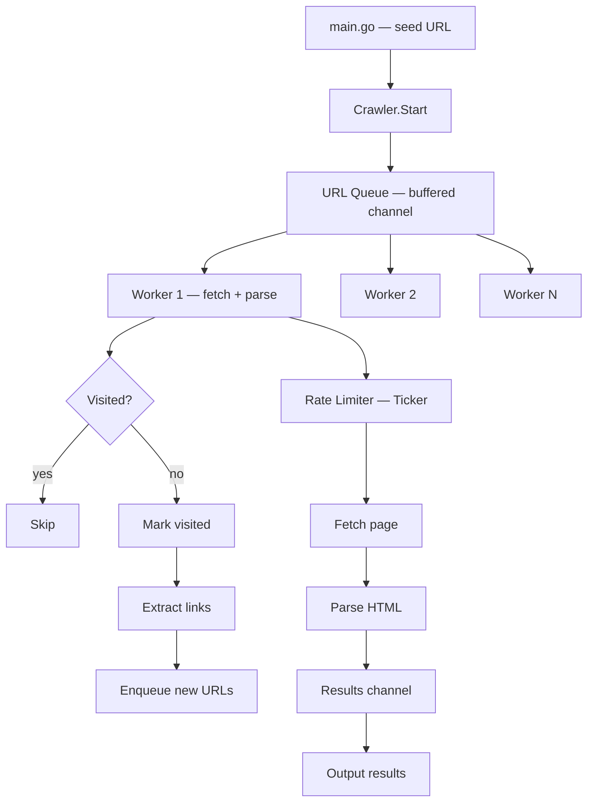

# Project 03: Concurrent Web Crawler

A web crawler that fetches pages concurrently using goroutines, channels, a
worker pool, `sync.WaitGroup`, URL deduplication, and rate limiting. This
project exercises every major concurrency concept from Part 04.

---

## Learning Goals

- Use goroutines and channels for concurrent work (Part 04)
- Implement a fixed-size worker pool
- Coordinate goroutines with `sync.WaitGroup` and `sync.Mutex`
- Build a thread-safe visited set for deduplication
- Implement rate limiting with `time.Ticker`
- Parse HTML and extract links with `golang.org/x/net/html`
- Handle errors across goroutines without panics

## Prerequisites

| Part | What you need |
|------|---------------|
| 03   | Structs, interfaces, error handling |
| 04   | Goroutines, channels, WaitGroup, Mutex, select |
| 05   | `net/http`, `net/url`, `strings`, `time` |
| 06   | Testing basics |

---

## Project Structure

```
web-crawler/
├── main.go              # Entry point, CLI flags, orchestration
├── crawler.go           # Crawler engine: worker pool, dedup, rate limit
├── crawler_test.go      # Tests for dedup, rate limiter, URL filtering
├── go.mod
└── go.sum               # Created after `go mod tidy`
```



> 🧠 **Memory aid:** The worker pool is a queue of work in the middle: the
> `Start` method feeds URLs into a buffered channel, N workers drain it, and
> fallout URLs loop back to the same channel. Channels are the plumbing of
> the whole crawler.

---

## Part A: Rate Limiter

Create `crawler.go`. We'll build it in sections.

```go
package main

import (
	"fmt"
	"io"
	"net/http"
	"net/url"
	"os"
	"strings"
	"sync"
	"sync/atomic"
	"time"

	"golang.org/x/net/html"
)

// --- Rate Limiter ---

// RateLimiter controls how often requests are made.
type RateLimiter struct {
	ticker *time.Ticker
	done   chan struct{}
}

// NewRateLimiter creates a limiter that allows one request per interval.
func NewRateLimiter(interval time.Duration) *RateLimiter {
	return &RateLimiter{
		ticker: time.NewTicker(interval),
		done:   make(chan struct{}),
	}
}

// Wait blocks until the next request is allowed or the limiter is stopped.
func (rl *RateLimiter) Wait() {
	select {
	case <-rl.ticker.C:
	case <-rl.done:
	}
}

// Stop halts the rate limiter.
func (rl *RateLimiter) Stop() {
	rl.ticker.Stop()
	close(rl.done)
}
```

### Why a Rate Limiter?

Without rate limiting, a crawler can hammer a server with hundreds of requests
per second. This is:
1. **Rude** — you're effectively DDoSing the target.
2. **Blocked** — most servers will ban your IP.
3. **Unnecessary** — you can't process pages that fast anyway.

A `time.Ticker` is the simplest rate limiter. It ticks at a fixed interval.
The crawler calls `Wait()` before each request, blocking until the next tick.

> ⚠️ **Watch out:** The rate limiter paces *outbound* requests only — an
> empty `Ticker` interval, or forgetting to call `Wait()` before a fetch,
> silently turns "polite" into "hammering". Always tick before every
> `http.Get`.

---

## Part B: The Crawler

Continue in `crawler.go`:

```go
// --- Result ---

// Result holds the outcome of crawling a single URL.
type Result struct {
	URL       string
	Depth     int
	Links     []string
	Error     error
	FetchedAt time.Time
}

// --- Crawler ---

// Config holds crawler settings.
type Config struct {
	MaxDepth    int
	MaxWorkers  int
	RateLimit   time.Duration
	MaxPages    int
	Timeout     time.Duration
}

// DefaultConfig returns sensible defaults.
func DefaultConfig() Config {
	return Config{
		MaxDepth:   2,
		MaxWorkers: 5,
		RateLimit:  500 * time.Millisecond,
		MaxPages:   50,
		Timeout:    10 * time.Second,
	}
}

// Crawler manages concurrent URL fetching.
type Crawler struct {
	config  Config
	visited sync.Map          // map[string]bool — thread-safe
	limiter *RateLimiter
	client  *http.Client
	results chan Result
	wg      sync.WaitGroup
	active  atomic.Int32      // number of active workers
}

// NewCrawler creates a crawler with the given config.
func NewCrawler(config Config) *Crawler {
	return &Crawler{
		config:  config,
		limiter: NewRateLimiter(config.RateLimit),
		client: &http.Client{
			Timeout: config.Timeout,
			// Don't follow redirects automatically — we want to see them.
			CheckRedirect: func(req *http.Request, via []*http.Request) error {
				return http.ErrUseLastResponse
			},
		},
		results: make(chan Result, 100),
	}
}

// Crawl starts crawling from the given seed URLs and returns all results.
func (c *Crawler) Crawl(seeds []string) []Result {
	// Feed channel — URLs waiting to be crawled.
	feed := make(chan crawlJob, 1000)

	// Start workers.
	for i := 0; i < c.config.MaxWorkers; i++ {
		c.wg.Add(1)
		go c.worker(feed)
	}

	// Enqueue seed URLs at depth 0.
	for _, seed := range seeds {
		if c.markVisited(seed) {
			feed <- crawlJob{url: seed, depth: 0}
		}
	}

	// Wait for all workers to finish, then close results.
	go func() {
		c.wg.Wait()
		close(c.results)
	}()

	// Drain results into a slice.
	var all []Result
	for r := range c.results {
		all = append(all, r)
	}

	return all
}

// crawlJob is an internal type for the work queue.
type crawlJob struct {
	url   string
	depth int
}

// worker processes jobs from the feed channel.
func (c *Crawler) worker(feed <-chan crawlJob) {
	defer c.wg.Done()

	for job := range feed {
		// Check page limit.
		if int(c.active.Load())+len(allVisited(&c.visited)) >= c.config.MaxPages {
			return
		}

		// Rate limit.
		c.limiter.Wait()

		c.active.Add(1)
		result := c.fetchAndParse(job.url, job.depth)
		c.active.Add(-1)

		c.results <- result

		// Enqueue discovered links if within depth limit.
		if result.Error == nil && job.depth < c.config.MaxDepth {
			for _, link := range result.Links {
				if c.markVisited(link) {
					feed <- crawlJob{url: link, depth: job.depth + 1}
				}
			}
		}
	}
}

// crawlJobURL is not needed — we store the URL in the job.

// fetchAndParse fetches a URL and extracts links from the HTML.
func (c *Crawler) fetchAndParse(rawURL string, depth int) Result {
	result := Result{
		URL:       rawURL,
		Depth:     depth,
		FetchedAt: time.Now(),
	}

	resp, err := c.client.Get(rawURL)
	if err != nil {
		result.Error = fmt.Errorf("fetching %s: %w", rawURL, err)
		return result
	}
	defer resp.Body.Close()

	// Only parse HTML content.
	contentType := resp.Header.Get("Content-Type")
	if !strings.Contains(contentType, "text/html") {
		return result
	}

	// Limit body size to 1MB.
	body := io.LimitReader(resp.Body, 1<<20)

	links, err := extractLinks(body, rawURL)
	if err != nil {
		result.Error = fmt.Errorf("parsing %s: %w", rawURL, err)
		return result
	}

	result.Links = links
	return result
}

// markVisited returns true if this URL has not been seen before.
func (c *Crawler) markVisited(rawURL string) bool {
	_, loaded := c.visited.LoadOrStore(rawURL, true)
	return !loaded // true = new URL
}

// allVisited returns a snapshot of all visited URLs (for counting).
func allVisited(m *sync.Map) []string {
	var urls []string
	m.Range(func(key, value any) bool {
		urls = append(urls, key.(string))
		return true
	})
	return urls
}
```

> 🔑 **Checkpoint:** `LoadOrStore` is the whole dedup algorithm — if the key
> is new it's stored and `loaded` is false (crawl it); if it already exists
> you skip. One atomic call, safe across all workers.

---

## Part C: HTML Link Extraction

Continue in `crawler.go`:

```go
// extractLinks parses HTML and returns absolute URLs found in <a href="...">.
func extractLinks(body io.Reader, baseURL string) ([]string, error) {
	parsed, err := url.Parse(baseURL)
	if err != nil {
		return nil, err
	}

	tokenizer := html.NewTokenizer(body)
	var links []string

	for {
		tt := tokenizer.Next()
		switch tt {
		case html.ErrorToken:
			return links, tokenizer.Err()
		case html.StartTagToken, html.EndTagToken:
			tn, _ := tokenizer.TagName()
			if string(tn) == "a" {
				for {
					key, val, more := tokenizer.TagAttr()
					if string(key) == "href" {
						href := string(val)
						absURL, err := resolveURL(parsed, href)
						if err == nil && isHTTP(absURL) {
							links = append(links, absURL)
						}
					}
					if !more {
						break
					}
				}
			}
		}
	}
}

// resolveURL resolves a potentially relative URL against a base.
func resolveURL(base *url.URL, href string) (string, error) {
	ref, err := url.Parse(href)
	if err != nil {
		return "", err
	}
	return base.ResolveReference(ref).String(), nil
}

// isHTTP returns true if the URL uses http or https scheme.
func isHTTP(rawURL string) bool {
	return strings.HasPrefix(rawURL, "http://") || strings.HasPrefix(rawURL, "https://")
}
```

### Key Points

- **`html.NewTokenizer`** — Go's standard library includes an HTML tokenizer.
  No need for a full parser like `goquery` for simple link extraction.
- **`url.ResolveReference`** — handles relative URLs (`/about`, `../page`)
  correctly against a base URL.
- **`io.LimitReader`** — prevents parsing gigabyte HTML pages. Caps at 1MB.

> 💡 **Tip:** `io.LimitReader` caps work per page AND caps memory: a hostile
> 10 GB page reads like 1 MB. Get in the habit of limiting every untrusted
> input you read.

---

## Part D: Entry Point

Create `main.go`:

```go
package main

import (
	"flag"
	"fmt"
	"os"
	"time"
)

func main() {
	depth := flag.Int("depth", 2, "maximum crawl depth")
	workers := flag.Int("workers", 5, "number of concurrent workers")
	rate := flag.Duration("rate", 500*time.Millisecond, "delay between requests")
	pages := flag.Int("pages", 50, "maximum pages to crawl")
	timeout := flag.Duration("timeout", 10*time.Second, "HTTP request timeout")
	flag.Parse()

	if flag.NArg() == 0 {
		fmt.Fprintln(os.Stderr, "Usage: crawler [flags] <url> [url...]")
		fmt.Fprintln(os.Stderr)
		fmt.Fprintln(os.Stderr, "Examples:")
		fmt.Fprintln(os.Stderr, "  crawler https://go.dev")
		fmt.Fprintln(os.Stderr, "  crawler -depth 3 -workers 10 https://example.com")
		flag.PrintDefaults()
		os.Exit(1)
	}

	config := Config{
		MaxDepth:   *depth,
		MaxWorkers: *workers,
		RateLimit:  *rate,
		MaxPages:   *pages,
		Timeout:    *timeout,
	}

	crawler := NewCrawler(config)
	seeds := flag.Args()

	fmt.Printf("Starting crawler with %d workers, depth %d, rate %v\n",
		config.MaxWorkers, config.MaxDepth, config.RateLimit)
	fmt.Printf("Seeds: %v\n\n", seeds)

	start := time.Now()
	results := crawler.Crawl(seeds)
	elapsed := time.Since(start)

	// Print results.
	errorCount := 0
	for _, r := range results {
		if r.Error != nil {
			fmt.Fprintf(os.Stderr, "[ERROR] %s: %v\n", r.URL, r.Error)
			errorCount++
			continue
		}
		fmt.Printf("[OK]    %s (depth=%d, links=%d)\n",
			r.URL, r.Depth, len(r.Links))
	}

	fmt.Printf("\nDone. %d pages in %v (%d errors)\n",
		len(results), elapsed, errorCount)
}
```

### Running It

```bash
go run . -depth 2 -workers 3 -rate 1s https://go.dev

# Output:
# Starting crawler with 3 workers, depth 2, rate 1s
# Seeds: [https://go.dev]
#
# [OK]    https://go.dev (depth=0, links=45)
# [OK]    https://go.dev/doc/ (depth=1, links=23)
# [OK]    https://go.dev/learn/ (depth=1, links=12)
# ...
#
# Done. 35 pages in 18.2s (2 errors)
```

> 🔑 **Checkpoint:** Bumping `-workers` only helps up to your rate limit and
> the site's tolerance. With `-rate 1s`, 3 workers are already plenty — the
> limiter, not the pool, decides your throughput.

---

## Part E: Tests

Create `crawler_test.go`:

```go
package main

import (
	"net/http"
	"net/http/httptest"
	"strings"
	"sync"
	"testing"
	"time"
)

func TestExtractLinks(t *testing.T) {
	tests := []struct {
		name     string
		html     string
		base     string
		wantN    int
		wantErr  bool
	}{
		{
			name:  "single link",
			html:  `<a href="/about">About</a>`,
			base:  "https://example.com",
			wantN: 1,
		},
		{
			name:  "multiple links",
			html:  `<a href="https://go.dev">Go</a><a href="/doc">Doc</a>`,
			base:  "https://example.com",
			wantN: 2,
		},
		{
			name:  "relative links resolved",
			html:  `<a href="page2">Next</a>`,
			base:  "https://example.com/page1",
			wantN: 1,
		},
		{
			name:  "skip non-http links",
			html:  `<a href="mailto:user@example.com">Email</a><a href="https://go.dev">Go</a>`,
			base:  "https://example.com",
			wantN: 1,
		},
		{
			name:  "skip anchors",
			html:  `<a href="#section1">Section</a>`,
			base:  "https://example.com",
			wantN: 0,
		},
		{
			name:  "no links",
			html:  `<p>No links here</p>`,
			base:  "https://example.com",
			wantN: 0,
		},
		{
			name:  "complex nested",
			html:  `<div><a href="/a">A</a><p><a href="/b">B</a></p></div>`,
			base:  "https://example.com",
			wantN: 2,
		},
	}

	for _, tt := range tests {
		t.Run(tt.name, func(t *testing.T) {
			links, err := extractLinks(strings.NewReader(tt.html), tt.base)
			if (err != nil) != tt.wantErr {
				t.Errorf("extractLinks() error = %v, wantErr = %v", err, tt.wantErr)
				return
			}
			if len(links) != tt.wantN {
				t.Errorf("extractLinks() got %d links, want %d: %v",
					len(links), tt.wantN, links)
			}
		})
	}
}

func TestMarkVisited(t *testing.T) {
	c := NewCrawler(DefaultConfig())

	// First time should return true (new URL).
	if !c.markVisited("https://go.dev") {
		t.Error("expected true for first visit")
	}

	// Second time should return false (already visited).
	if c.markVisited("https://go.dev") {
		t.Error("expected false for second visit")
	}

	// Different URL should return true.
	if !c.markVisited("https://pkg.go.dev") {
		t.Error("expected true for different URL")
	}
}

func TestMarkVisitedConcurrent(t *testing.T) {
	c := NewCrawler(DefaultConfig())

	var wg sync.WaitGroup
	results := make([]bool, 100)

	for i := range results {
		wg.Add(1)
		go func(idx int) {
			defer wg.Done()
			results[idx] = c.markVisited("https://go.dev")
		}(i)
	}
	wg.Wait()

	trueCount := 0
	for _, v := range results {
		if v {
			trueCount++
		}
	}
	// Exactly one goroutine should see it as new.
	if trueCount != 1 {
		t.Errorf("expected exactly 1 first-visit, got %d", trueCount)
	}
}
```

> 🧠 **Memory aid:** `TestMarkVisitedConcurrent` fires 100 goroutines at the
> same URL and asserts exactly one wins. Race-free `sync.Map` makes the test
> deterministic — if it ever flaked, you'd know the dedup isn't atomic.

```go
func TestRateLimiter(t *testing.T) {
	rl := NewRateLimiter(50 * time.Millisecond)
	defer rl.Stop()

	start := time.Now()

	rl.Wait() // First call should be immediate.
	rl.Wait() // Second call waits for tick.

	elapsed := time.Since(start)
	if elapsed < 40*time.Millisecond {
		t.Errorf("rate limiter too fast: %v (expected ~50ms)", elapsed)
	}
}

func TestCrawlerIntegration(t *testing.T) {
	// Set up a fake HTML server.
	mux := http.NewServeMux()
	mux.HandleFunc("/", func(w http.ResponseWriter, r *http.Request) {
		w.Header().Set("Content-Type", "text/html")
		w.Write([]byte(`<html><body>
			<a href="/page1">Page 1</a>
			<a href="/page2">Page 2</a>
		</body></html>`))
	})
	mux.HandleFunc("/page1", func(w http.ResponseWriter, r *http.Request) {
		w.Header().Set("Content-Type", "text/html")
		w.Write([]byte(`<html><body>
			<a href="/">Home</a>
			<a href="/page3">Page 3</a>
		</body></html>`))
	})
	mux.HandleFunc("/page2", func(w http.ResponseWriter, r *http.Request) {
		w.Header().Set("Content-Type", "text/html")
		w.Write([]byte(`<html><body><p>No links</p></body></html>`))
	})
	mux.HandleFunc("/page3", func(w http.ResponseWriter, r *http.Request) {
		w.Header().Set("Content-Type", "text/html")
		w.Write([]byte(`<html><body>
			<a href="/">Home</a>
		</body></html>`))
	})

	ts := httptest.NewServer(mux)
	defer ts.Close()

	config := Config{
		MaxDepth:   2,
		MaxWorkers: 2,
		RateLimit:  10 * time.Millisecond,
		MaxPages:   10,
		Timeout:    5 * time.Second,
	}

	crawler := NewCrawler(config)
	results := crawler.Crawl([]string{ts.URL})

	// Should have crawled: /, /page1, /page2, /page3 (depth 0-2).
	if len(results) < 3 {
		t.Errorf("expected at least 3 results, got %d", len(results))
	}

	// All results should be successful (no errors from our fake server).
	for _, r := range results {
		if r.Error != nil {
			t.Errorf("unexpected error for %s: %v", r.URL, r.Error)
		}
	}
}

func TestExtractLinksRedirect(t *testing.T) {
	// Test that non-HTML responses don't crash.
	links, err := extractLinks(
		strings.NewReader(`<a href="https://go.dev">Go</a>`),
		"https://example.com",
	)
	if err != nil {
		t.Errorf("unexpected error: %v", err)
	}
	if len(links) != 1 {
		t.Errorf("expected 1 link, got %d", len(links))
	}
}

func TestIsHTTP(t *testing.T) {
	tests := []struct {
		url  string
		want bool
	}{
		{"https://go.dev", true},
		{"http://example.com", true},
		{"ftp://files.example.com", false},
		{"mailto:user@example.com", false},
		{"javascript:alert(1)", false},
		{"", false},
	}

	for _, tt := range tests {
		if got := isHTTP(tt.url); got != tt.want {
			t.Errorf("isHTTP(%q) = %v, want %v", tt.url, got, tt.want)
		}
	}
}
```

### Running the Tests

```bash
go mod init crawler
go mod tidy
go test -v -race ./...
```

The `-race` flag enables the race detector. It will catch any unsynchronized
map access or goroutine data races. **This is essential for concurrent code.**

> ⚠️ **Watch out:** Never ship concurrent code without `go test -race`.
> The race detector turns heisenbugs (crashes that only happen in prod)
> into deterministic test failures while developing.

---

## How the Worker Pool Works

```
┌──────────────────────────────────────────────┐
│  main goroutine                              │
│  ┌─────────────┐                             │
│  │ Seed URLs    │──► feed channel (buffered) │
│  └─────────────┘     │                       │
│                      ▼                       │
│  ┌──────────────────────────────────┐        │
│  │  Worker 1    Worker 2    Worker N│        │
│  │    │            │           │    │        │
│  │    ▼            ▼           ▼    │        │
│  │  fetch + parse + enqueue links  │        │
│  └──────────────────────────────────┘        │
│                      │                       │
│                      ▼                       │
│              results channel                 │
│                      │                       │
│                      ▼                       │
│         main collects all results            │
└──────────────────────────────────────────────┘
```

1. **main** pushes seed URLs into `feed`.
2. **N workers** pull from `feed` concurrently.
3. Each worker **fetches**, **parses**, and **enqueues** new URLs back into
   `feed`. This is safe because the channel is the only way to add work.
4. **`sync.Map`** ensures each URL is processed exactly once. `LoadOrStore`
   is atomic — no lock needed.
5. **`sync.WaitGroup`** tracks how many workers are active. When all finish,
   the `results` channel is closed.
6. **`atomic.Int32`** tracks active workers for the page limit check.

> 💡 **Tip:** The channel doubles as both a queue *and* the synchronization —
> workers don't need locks to coordinate, because `feed` guarantees only one
> goroutine consumes each URL at a time.

---

## Modern Practices

- **`sync.Map` over `map` + `Mutex`** — for a write-once-read-many pattern
  (URL deduplication), `sync.Map` outperforms a mutex-protected map.
- **`atomic.Int32`** for counters — `active.Load()` is lock-free and
  cheaper than a mutex for simple counters.
- **Buffered channels** — `feed` is buffered to 1000. This decouples
  producers (workers finding links) from consumers (workers processing URLs).
  Without buffering, workers block each other.
- **`io.LimitReader`** — prevents a malicious or bloated page from consuming
  unbounded memory. Always cap external input.
- **`http.ErrUseLastResponse`** — the crawler doesn't follow redirects. It
  records the 301/302 and the next worker processes the new URL. This gives
  you control over redirect behavior.
- **Race detector** — always run `go test -race` on concurrent code. It's
  not optional.

---

## Common Mistakes

- **Using a regular `map` for `visited`** without a mutex. This will crash
  with `fatal error: concurrent map read and map write`. Use `sync.Map` or
  `map` + `sync.RWMutex`.
- **Forgetting to close channels.** If you never close `feed`, workers
  block forever waiting for more jobs. Always close channels when done
  producing.
- **Unbounded concurrency.** Creating a goroutine per URL without a worker
  pool exhausts memory and file descriptors. Always use a fixed pool.
- **Not checking content type.** Fetching a 500MB PDF and trying to parse
  it as HTML wastes time and memory. Check `Content-Type` first.
- **Ignoring the race detector.** `go test -race` adds ~2x overhead but
  catches bugs that are impossible to find by reading code. Run it always.
- **Blocking on a full results channel.** If results channel is full and
  workers try to send, they block. Make the channel large enough or drain
  it in a separate goroutine.
- **Not respecting rate limits.** Even in testing, add a small rate limit.
  Some targets ban IPs that hit them too fast.

---

## Stretch Goals / Extensions

1. **Sitemap XML** — also discover URLs from `/sitemap.xml` files.
2. **Robots.txt** — parse and respect `robots.txt` disallow rules.
3. **Depth-first vs breadth-first** — use a stack (DFS) instead of a queue
   (BFS) and compare behavior.
4. **Persistent queue** — save the URL queue to disk so crawling survives
   restarts.
5. **Screenshot capture** — use `chromedp` to take screenshots of each page.
6. **Broken link checker** — report 404s and 500s instead of following links.
7. **Concurrent rate limiter per domain** — use a map of `*RateLimiter`
   keyed by domain to respect per-site limits.
8. **Metrics** — expose crawl stats (pages/sec, errors, depth distribution)
   on a `/metrics` endpoint.

---

## Next

Continue to [04-rest-api-todo-postgres.md](04-rest-api-todo-postgres.md) for a
full REST API with PostgreSQL — database migrations, repository pattern, and
JWT authentication.
