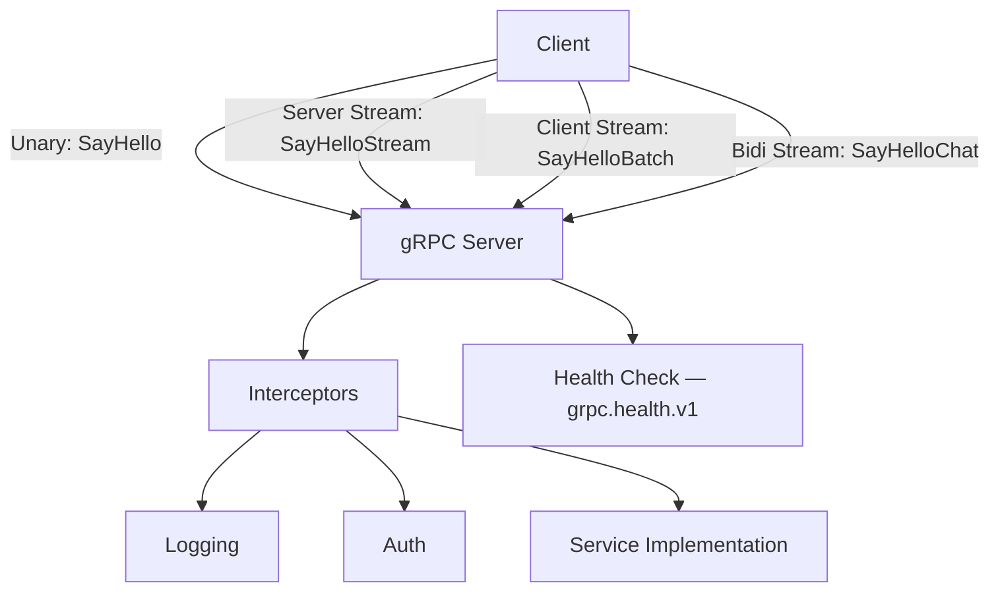

# Project 05: gRPC Greeter Service

A gRPC service with protobuf definitions, a server, a client, server streaming,
client streaming, bidirectional streaming, interceptors, and health checks.
This exercises Part 08 (gRPC & Protobuf) end-to-end.

---

## Learning Goals

- Define `.proto` files and generate Go code with `protoc`
- Implement a gRPC server with multiple RPC methods
- Build a gRPC client
- Use all four streaming modes (unary, server, client, bidirectional)
- Add interceptors (middleware for gRPC) for logging and auth
- Implement the gRPC health check protocol

## Prerequisites

| Part | What you need |
|------|---------------|
| 03   | Interfaces, error handling |
| 04   | Goroutines, channels (for streaming) |
| 05   | `fmt`, `log`, `os` |
| 08   | gRPC, protobuf, `protoc`, service definition, streaming |

---

## Project Structure

```
grpc-greeter/
├── proto/
│   └── greeter.proto        # Service definition
├── pb/
│   └── greeter_grpc.pb.go   # Generated gRPC code (by protoc)
│   └── greeter.pb.go        # Generated message code (by protoc)
├── server/
│   ├── main.go              # Server entry point
│   └── greeter.go           # Service implementation
├── client/
│   └── main.go              # Client entry point
├── interceptors/
│   ├── logging.go           # Logging interceptor
│   └── auth.go              # Auth interceptor
├── go.mod
└── buf.gen.yaml             # (optional) buf config for generation
```



> 🧠 **Memory aid:** gRPC serves four call shapes — unary (one request, one
> response) and three streaming variants. Pick the shape that matches your
> data flow: stream when full data arrives over time, unary for single
> round-trips like `SayHello`.

---

## Part A: Proto Definition

Create `proto/greeter.proto`:

```protobuf
syntax = "proto3";

package greeter;

option go_package = "grpc-greeter/pb";

import "google/protobuf/timestamp.proto";

// GreeterService provides greeting RPCs.
service GreeterService {
  // SayHello — simple unary RPC.
  rpc SayHello (HelloRequest) returns (HelloResponse);

  // SayHelloStream — server streaming RPC.
  // Sends multiple greetings over time.
  rpc SayHelloStream (HelloStreamRequest) returns (stream HelloResponse);

  // SayHelloBatch — client streaming RPC.
  // Client sends multiple names, server responds once.
  rpc SayHelloBatch (stream HelloRequest) returns (HelloBatchResponse);

  // SayHelloChat — bidirectional streaming RPC.
  // Both sides send and receive simultaneously.
  rpc SayHelloChat (stream HelloRequest) returns (stream HelloResponse);
}

// HelloRequest is sent by the client.
message HelloRequest {
  string name = 1;
}

// HelloResponse is sent by the server.
message HelloResponse {
  string message = 1;
  string server_id = 2;
  google.protobuf.Timestamp timestamp = 3;
}

// HelloStreamRequest includes how many greetings to send.
message HelloStreamRequest {
  string name = 1;
  int32  count = 2; // How many times to greet.
}

// HelloBatchResponse aggregates multiple greetings.
message HelloBatchResponse {
  repeated string messages = 1;
  int32 total = 2;
}
```

### Generate Code

```bash
# Install protoc plugins (one-time)
go install google.golang.org/protobuf/cmd/protoc-gen-go@latest
go install google.golang.org/grpc/cmd/protoc-gen-go-grpc@latest

# Generate Go code
protoc --go_out=. --go_opt=paths=source_relative \
       --go-grpc_out=. --go-grpc_opt=paths=source_relative \
       proto/greeter.proto

# Or use buf (recommended — handles imports and plugins automatically):
# buf generate
```

> ⚠️ **Watch out:** Generated code is a contract you commit to the repo.
> Re-run `protoc`/`buf generate` whenever the `.proto` changes — forgetting
> to regenerate is the #1 gRPC "works locally, breaks in CI" bug.

---

## Part B: Interceptors (Middleware)

Create `interceptors/logging.go`:

```go
package interceptors

import (
	"context"
	"log"
	"time"

	"google.golang.org/grpc"
	"google.golang.org/grpc/codes"
	"google.golang.org/grpc/status"
)

// UnaryServerLogging logs every unary RPC call with duration.
func UnaryServerLogging() grpc.UnaryServerInterceptor {
	return func(
		ctx context.Context,
		req any,
		info *grpc.UnaryServerInfo,
		handler grpc.UnaryHandler,
	) (any, error) {
		start := time.Now()

		resp, err := handler(ctx, req)

		duration := time.Since(start)
		code := codes.OK
		if err != nil {
			code = status.Code(err)
		}

		log.Printf("[gRPC] %s code=%s duration=%v",
			info.FullMethod, code, duration)

		return resp, err
	}
}

// StreamServerLogging logs every streaming RPC call.
func StreamServerLogging() grpc.StreamServerInterceptor {
	return func(
		srv any,
		ss grpc.ServerStream,
		info *grpc.StreamServerInfo,
		handler grpc.StreamHandler,
	) error {
		start := time.Now()

		err := handler(srv, ss)

		duration := time.Since(start)
		code := codes.OK
		if err != nil {
			code = status.Code(err)
		}

		log.Printf("[gRPC STREAM] %s code=%s duration=%v",
			info.FullMethod, code, duration)

		return err
	}
}
```

Create `interceptors/auth.go`:

```go
package interceptors

import (
	"context"
	"strings"

	"google.golang.org/grpc"
	"google.golang.org/grpc/codes"
	"google.golang.org/grpc/metadata"
	"google.golang.org/grpc/status"
)

type contextKey string

const userIDKey contextKey = "user_id"

// UnaryServerAuth validates a Bearer token in metadata.
func UnaryServerAuth(validToken string) grpc.UnaryServerInterceptor {
	return func(
		ctx context.Context,
		req any,
		info *grpc.UnaryServerInfo,
		handler grpc.UnaryHandler,
	) (any, error) {
		// Skip auth for health checks.
		if info.FullMethod == "/grpc.health.v1.Health/Check" {
			return handler(ctx, req)
		}

		token, err := extractToken(ctx)
		if err != nil {
			return nil, err
		}

		if token != validToken {
			return nil, status.Error(codes.Unauthenticated, "invalid token")
		}

		// Add user ID to context.
		ctx = context.WithValue(ctx, userIDKey, "authenticated-user")
		return handler(ctx, req)
	}
}

func extractToken(ctx context.Context) (string, error) {
	md, ok := metadata.FromIncomingContext(ctx)
	if !ok {
		return "", status.Error(codes.Unauthenticated, "missing metadata")
	}

	values := md.Get("authorization")
	if len(values) == 0 {
		return "", status.Error(codes.Unauthenticated, "missing authorization")
	}

	token := strings.TrimPrefix(values[0], "Bearer ")
	return token, nil
}
```

### Key Points

- **Interceptor pattern** — gRPC interceptors are identical in concept to
  HTTP middleware. `UnaryServerInterceptor` wraps unary calls; `StreamServerInterceptor`
  wraps streaming calls.
- **`info.FullMethod`** — the fully-qualified method name like
  `/greeter.GreeterService/SameHello`. Use it to selectively skip auth
  for health checks.
- **`metadata.FromIncomingContext`** — gRPC uses HTTP/2 headers (metadata)
  instead of HTTP headers. The `authorization` key is the standard way to
  pass tokens.

> ⚠️ **Watch out:** gRPC stores auth in *metadata*, not HTTP headers — and
> interceptors must call `grpc.UnaryServerInterceptor` separately from the
> stream variant. Skip auth for `/grpc.health.v1.*` or health checks break.

---

## Part C: Server Implementation

Create `server/greeter.go`:

```go
package server

import (
	"fmt"
	"io"
	"log"
	"sync"
	"time"

	pb "grpc-greeter/pb"

	"google.golang.org/grpc/codes"
	"google.golang.org/grpc/status"
	"google.golang.org/protobuf/types/known/timestamppb"
)

// GreeterServer implements the GreeterService.
type GreeterServer struct {
	pb.UnimplementedGreeterServiceServer
	mu       sync.Mutex
	serverID string
	count    int
}

// NewGreeterServer creates a new server.
func NewGreeterServer(id string) *GreeterServer {
	return &GreeterServer{serverID: id}
}

// SayHello — unary RPC.
func (s *GreeterServer) SayHello(ctx context.Context, req *pb.HelloRequest) (*pb.HelloResponse, error) {
	if req.Name == "" {
		return nil, status.Error(codes.InvalidArgument, "name is required")
	}

	s.mu.Lock()
	s.count++
	s.mu.Unlock()

	log.Printf("SayHello called: name=%s (total=%d)", req.Name, s.count)

	return &pb.HelloResponse{
		Message:  fmt.Sprintf("Hello, %s!", req.Name),
		ServerId: s.serverID,
		Timestamp: timestamppb.Now(),
	}, nil
}
```

Wait — `context.Context` is needed. Let me add the proper import. The full
file should be:

```go
package server

import (
	"context"
	"fmt"
	"io"
	"log"
	"sync"
	"time"

	pb "grpc-greeter/pb"

	"google.golang.org/grpc/codes"
	"google.golang.org/grpc/status"
	"google.golang.org/protobuf/types/known/timestamppb"
)

// GreeterServer implements the GreeterService.
type GreeterServer struct {
	pb.UnimplementedGreeterServiceServer
	mu       sync.Mutex
	serverID string
	count    int
}

// NewGreeterServer creates a new server.
func NewGreeterServer(id string) *GreeterServer {
	return &GreeterServer{serverID: id}
}

// SayHello — unary RPC.
func (s *GreeterServer) SayHello(ctx context.Context, req *pb.HelloRequest) (*pb.HelloResponse, error) {
	if req.Name == "" {
		return nil, status.Error(codes.InvalidArgument, "name is required")
	}

	s.mu.Lock()
	s.count++
	s.mu.Unlock()

	log.Printf("SayHello called: name=%s (total=%d)", req.Name, s.count)

	return &pb.HelloResponse{
		Message:   fmt.Sprintf("Hello, %s!", req.Name),
		ServerId:  s.serverID,
		Timestamp: timestamppb.Now(),
	}, nil
}

// SayHelloStream — server streaming RPC.
// Sends `count` greetings at 1-second intervals.
func (s *GreeterServer) SayHelloStream(req *pb.HelloStreamRequest, stream pb.GreeterService_SayHelloStreamServer) error {
	if req.Name == "" {
		return status.Error(codes.InvalidArgument, "name is required")
	}
	if req.Count <= 0 {
		req.Count = 5 // Default to 5.
	}
	if req.Count > 20 {
		req.Count = 20 // Cap at 20.
	}

	log.Printf("SayHelloStream: name=%s count=%d", req.Name, req.Count)

	for i := int32(0); i < req.Count; i++ {
		resp := &pb.HelloResponse{
			Message:   fmt.Sprintf("Hello #%d, %s!", i+1, req.Name),
			ServerId:  s.serverID,
			Timestamp: timestamppb.Now(),
		}

		if err := stream.Send(resp); err != nil {
			return fmt.Errorf("sending stream message: %w", err)
		}

		time.Sleep(1 * time.Second)
	}

	return nil
}

// SayHelloBatch — client streaming RPC.
// Receives multiple names and returns a batch response.
func (s *GreeterServer) SayHelloBatch(stream pb.GreeterService_SayHelloBatchServer) error {
	var messages []string

	for {
		req, err := stream.Recv()
		if err == io.EOF {
			// Client finished sending. Send response.
			break
		}
		if err != nil {
			return fmt.Errorf("receiving batch: %w", err)
		}

		log.Printf("SayHelloBatch received: %s", req.Name)
		messages = append(messages, fmt.Sprintf("Hello, %s!", req.Name))
	}

	return stream.SendAndClose(&pb.HelloBatchResponse{
		Messages: messages,
		Total:    int32(len(messages)),
	})
}

// SayHelloChat — bidirectional streaming RPC.
// Echoes back each name as a greeting immediately.
func (s *GreeterServer) SayHelloChat(stream pb.GreeterService_SayHelloChatServer) error {
	for {
		req, err := stream.Recv()
		if err == io.EOF {
			return nil
		}
		if err != nil {
			return fmt.Errorf("receiving chat: %w", err)
		}

		log.Printf("SayHelloChat received: %s", req.Name)

		resp := &pb.HelloResponse{
			Message:   fmt.Sprintf("Hello, %s!", req.Name),
			ServerId:  s.serverID,
			Timestamp: timestamppb.Now(),
		}

		if err := stream.Send(resp); err != nil {
			return fmt.Errorf("sending chat: %w", err)
		}
	}
}
```

### Key Points

- **`UnimplementedGreeterServiceServer`** — embedding this struct ensures
  your server compiles even if you don't implement every RPC. Useful for
  forward compatibility.
- **Server streaming** — `stream.Send()` in a loop. The client receives each
  message as it arrives. Return `nil` when done.
- **Client streaming** — `stream.Recv()` in a loop until `io.EOF`. Then
  `stream.SendAndClose()` to send one final response.
- **Bidirectional streaming** — both sides send and receive independently.
  The server can process and respond to each message as it arrives.
- **`status.Error`** — the proper way to return gRPC errors. Includes
  status code and message that the client can inspect.

> 🔑 **Checkpoint:** `UnimplementedGreeterServiceServer` means new RPCs added
> to the proto won't break your build — but they return `UNIMPLEMENTED` at
> runtime until you write them. Rebuild after every proto change: stubs and
> types are generated, never hand-written.

---

## Part D: Server Entry Point

Create `server/main.go`:

```go
package main

import (
	"flag"
	"log"
	"net"

	"grpc-greeter/interceptors"
	pb "grpc-greeter/pb"
	"grpc-greeter/server"

	"google.golang.org/grpc"
	"google.golang.org/grpc/health"
	healthpb "google.golang.org/grpc/health/grpc_health_v1"
	"google.golang.org/grpc/reflection"
)

func main() {
	addr := flag.String("addr", ":50051", "listen address")
	id := flag.String("id", "greeter-1", "server ID")
	token := flag.String("token", "my-secret-token", "auth token for testing")
	flag.Parse()

	lis, err := net.Listen("tcp", *addr)
	if err != nil {
		log.Fatalf("failed to listen: %v", err)
	}

	// Create gRPC server with interceptors.
	srv := grpc.NewServer(
		grpc.ChainUnaryInterceptor(
			interceptors.UnaryServerLogging(),
			interceptors.UnaryServerAuth(*token),
		),
		grpc.ChainStreamInterceptor(
			interceptors.StreamServerLogging(),
		),
	)

	// Register service.
	greeter := server.NewGreeterServer(*id)
	pb.RegisterGreeterServiceServer(srv, greeter)

	// Register health check service.
	healthSrv := health.NewServer()
	healthpb.RegisterHealthServer(srv, healthSrv)
	healthSrv.SetServingStatus("greeter.GreeterService",
		healthpb.HealthCheckResponse_SERVING)

	// Register reflection (for grpcurl and grpc-health-probe).
	reflection.Register(srv)

	log.Printf("gRPC server listening on %s (id=%s)", *addr, *id)
	if err := srv.Serve(lis); err != nil {
		log.Fatalf("failed to serve: %v", err)
	}
}
```

> 💡 **Tip:** `reflection.Register(srv)` enables `grpcurl` and gRPC UI
> tools to introspect your services live — no proto file needed on the
> client side. Enable it on servers used for debugging/development.

---

## Part E: Client

Create `client/main.go`:

```go
package main

import (
	"context"
	"flag"
	"fmt"
	"io"
	"log"
	"time"

	pb "grpc-greeter/pb"

	"google.golang.org/grpc"
	"google.golang.org/grpc/credentials/insecure"
	"google.golang.org/grpc/metadata"
)

func main() {
	addr := flag.String("addr", "localhost:50051", "server address")
	token := flag.String("token", "my-secret-token", "auth token")
	flag.Parse()

	// Connect without TLS (for local development).
	conn, err := grpc.NewClient(*addr,
		grpc.WithTransportCredentials(insecure.NewCredentials()),
	)
	if err != nil {
		log.Fatalf("dial: %v", err)
	}
	defer conn.Close()

	client := pb.NewGreeterServiceClient(conn)

	// Add auth metadata to all requests.
	ctx := metadata.AppendToOutgoingContext(context.Background(),
		"authorization", "Bearer "+*token)

	// --- Unary RPC ---
	fmt.Println("=== Unary RPC ===")
	resp, err := client.SayHello(ctx, &pb.HelloRequest{Name: "Alice"})
	if err != nil {
		log.Printf("SayHello error: %v", err)
	} else {
		fmt.Printf("Response: %s (server=%s)\n", resp.Message, resp.ServerId)
	}

	// --- Server Streaming RPC ---
	fmt.Println("\n=== Server Streaming ===")
	stream, err := client.SayHelloStream(ctx, &pb.HelloStreamRequest{
		Name:  "Bob",
		Count: 3,
	})
	if err != nil {
		log.Printf("SayHelloStream error: %v", err)
	} else {
		for {
			resp, err := stream.Recv()
			if err == io.EOF {
				break
			}
			if err != nil {
				log.Printf("stream recv error: %v", err)
				break
			}
			fmt.Printf("  %s\n", resp.Message)
		}
	}

	// --- Client Streaming RPC ---
	fmt.Println("\n=== Client Streaming ===")
	batchStream, err := client.SayHelloBatch(ctx)
	if err != nil {
		log.Printf("SayHelloBatch error: %v", err)
	} else {
		names := []string{"Charlie", "Diana", "Eve"}
		for _, name := range names {
			if err := batchStream.Send(&pb.HelloRequest{Name: name}); err != nil {
				log.Printf("batch send error: %v", err)
				break
			}
			fmt.Printf("  Sent: %s\n", name)
		}
		batchResp, err := batchStream.CloseAndRecv()
		if err != nil {
			log.Printf("batch close error: %v", err)
		} else {
			fmt.Printf("  Received %d greetings\n", batchResp.Total)
			for _, msg := range batchResp.Messages {
				fmt.Printf("    %s\n", msg)
			}
		}
	}

	// --- Bidirectional Streaming ---
	fmt.Println("\n=== Bidirectional Streaming ===")
	chatStream, err := client.SayHelloChat(ctx)
	if err != nil {
		log.Printf("SayHelloChat error: %v", err)
	} else {
		names := []string{"Frank", "Grace", "Heidi"}
		go func() {
			for _, name := range names {
				chatStream.Send(&pb.HelloRequest{Name: name})
				time.Sleep(200 * time.Millisecond)
			}
			chatStream.CloseSend()
		}()

		for {
			resp, err := chatStream.Recv()
			if err == io.EOF {
				break
			}
			if err != nil {
				log.Printf("chat recv error: %v", err)
				break
			}
			fmt.Printf("  %s\n", resp.Message)
		}
	}
}
```

### Running It

```bash
# Terminal 1 — Start the server
go run ./server/ -addr :50051 -id "greeter-1"

# Terminal 2 — Run the client
go run ./client/ -addr localhost:50051

# Expected output:
# === Unary RPC ===
# Response: Hello, Alice! (server=greeter-1)
#
# === Server Streaming ===
#   Hello #1, Bob!
#   Hello #2, Bob!
#   Hello #3, Bob!
#
# === Client Streaming ===
#   Sent: Charlie
#   Sent: Diana
#   Sent: Eve
#   Received 3 greetings
#     Hello, Charlie!
#     Hello, Diana!
#     Hello, Eve!
#
# === Bidirectional Streaming ===
#   Hello, Frank!
#   Hello, Grace!
#   Hello, Heidi!
```

> 🧠 **Memory aid:** Unary is a single "ping/pong"; the three streaming modes
> are "server pushes", "client pushes", and "both push simultaneously". The
> output above shows all four in one run — watch how the print order
> differs.

### Testing with grpcurl

```bash
# Install grpcurl
go install github.com/fullstorydev/grpcurl/cmd/grpcurl@latest

# List services
grpcurl -plaintext localhost:50051 list

# Call unary RPC (with auth metadata)
grpcurl -plaintext -H "authorization: Bearer my-secret-token" \
  -d '{"name": "World"}' \
  localhost:50051 greeter.GreeterService/SayHello

# Health check
grpcurl -plaintext localhost:50051 grpc.health.v1.Health/Check
```

---

## Part F: Tests

Create `server/greeter_test.go` (and the tests for the full server):

```go
package server

import (
	"context"
	"io"
	"testing"
	"time"

	pb "grpc-greeter/pb"

	"google.golang.org/grpc"
	"google.golang.org/grpc/credentials/insecure"
	"google.golang.org/grpc/test/bufconn"
)

const bufSize = 1024 * 1024

var lis *bufconn.Listener

func init() {
	lis = bufconn.Listen(bufSize)
}

func startTestServer(t *testing.T) *grpc.ClientConn {
	t.Helper()

	srv := grpc.NewServer()
	greeter := NewGreeterServer("test-server")
	pb.RegisterGreeterServiceServer(srv, greeter)

	go func() {
		if err := srv.Serve(lis); err != nil {
			t.Errorf("server error: %v", err)
		}
	}()
	t.Cleanup(func() { srv.Stop() })

	conn, err := grpc.NewClient("bufnet",
		grpc.WithContextDialer(func(ctx context.Context, _ string) (any, error) {
			return lis.DialContext(ctx)
		}),
		grpc.WithTransportCredentials(insecure.NewCredentials()),
	)
	if err != nil {
		t.Fatalf("dial: %v", err)
	}
	t.Cleanup(func() { conn.Close() })

	return conn
}

func TestSayHello(t *testing.T) {
	conn := startTestServer(t)
	client := pb.NewGreeterServiceClient(conn)

	resp, err := client.SayHello(context.Background(), &pb.HelloRequest{Name: "Test"})
	if err != nil {
		t.Fatalf("SayHello: %v", err)
	}

	if resp.Message != "Hello, Test!" {
		t.Errorf("expected 'Hello, Test!', got %q", resp.Message)
	}
	if resp.ServerId != "test-server" {
		t.Errorf("expected server ID 'test-server', got %q", resp.ServerId)
	}
}

func TestSayHello_EmptyName(t *testing.T) {
	conn := startTestServer(t)
	client := pb.NewGreeterServiceClient(conn)

	_, err := client.SayHello(context.Background(), &pb.HelloRequest{Name: ""})
	if err == nil {
		t.Error("expected error for empty name")
	}
}

func TestSayHelloStream(t *testing.T) {
	conn := startTestServer(t)
	client := pb.NewGreeterServiceClient(conn)

	stream, err := client.SayHelloStream(context.Background(),
		&pb.HelloStreamRequest{Name: "Stream", Count: 3})
	if err != nil {
		t.Fatalf("SayHelloStream: %v", err)
	}

	count := 0
	for {
		resp, err := stream.Recv()
		if err == io.EOF {
			break
		}
		if err != nil {
			t.Fatalf("recv: %v", err)
		}
		count++
		if resp.ServerId != "test-server" {
			t.Errorf("unexpected server ID: %s", resp.ServerId)
		}
	}

	if count != 3 {
		t.Errorf("expected 3 messages, got %d", count)
	}
}
```

> 💡 **Tip:** `bufconn` runs the full gRPC stack over in-memory sockets — no
> ports, no external server. The same client code you'd use against a real
> server works unchanged against the test server.

```go
func TestSayHelloBatch(t *testing.T) {
	conn := startTestServer(t)
	client := pb.NewGreeterServiceClient(conn)

	stream, err := client.SayHelloBatch(context.Background())
	if err != nil {
		t.Fatalf("SayHelloBatch: %v", err)
	}

	names := []string{"A", "B", "C"}
	for _, name := range names {
		if err := stream.Send(&pb.HelloRequest{Name: name}); err != nil {
			t.Fatalf("send: %v", err)
		}
	}

	resp, err := stream.CloseAndRecv()
	if err != nil {
		t.Fatalf("CloseAndRecv: %v", err)
	}

	if resp.Total != 3 {
		t.Errorf("expected 3, got %d", resp.Total)
	}
	if len(resp.Messages) != 3 {
		t.Errorf("expected 3 messages, got %d", len(resp.Messages))
	}
}

func TestSayHelloChat(t *testing.T) {
	conn := startTestServer(t)
	client := pb.NewGreeterServiceClient(conn)

	stream, err := client.SayHelloChat(context.Background())
	if err != nil {
		t.Fatalf("SayHelloChat: %v", err)
	}

	// Send in a goroutine.
	names := []string{"X", "Y", "Z"}
	go func() {
		for _, name := range names {
			stream.Send(&pb.HelloRequest{Name: name})
		}
		stream.CloseSend()
	}()

	// Receive all responses.
	count := 0
	for {
		resp, err := stream.Recv()
		if err == io.EOF {
			break
		}
		if err != nil {
			t.Fatalf("recv: %v", err)
		}
		count++
		if resp.ServerId != "test-server" {
			t.Errorf("unexpected server ID: %s", resp.ServerId)
		}
	}

	if count != 3 {
		t.Errorf("expected 3 responses, got %d", count)
	}
}

func TestSayHelloStream_CapsAt20(t *testing.T) {
	conn := startTestServer(t)
	client := pb.NewGreeterServiceClient(conn)

	stream, err := client.SayHelloStream(context.Background(),
		&pb.HelloStreamRequest{Name: "Big", Count: 100})
	if err != nil {
		t.Fatalf("SayHelloStream: %v", err)
	}

	count := 0
	for {
		_, err := stream.Recv()
		if err == io.EOF {
			break
		}
		if err != nil {
			t.Fatalf("recv: %v", err)
		}
		count++
	}

	if count != 20 {
		t.Errorf("expected cap at 20, got %d", count)
	}
}
```

### Running the Tests

```bash
go test -v -count=1 ./server/...
```

The `bufconn` package creates an in-memory gRPC connection — no real network
needed. This makes tests fast and deterministic.

> 🔑 **Checkpoint:** Every streaming mode gets its own test (unary, server
> stream, client stream, bidi, plus cap behavior) — together they lock down
> the whole transport layer. If a proto field changes, the generated types
> change the test signatures too, which is a good thing.

---

## Modern Practices

- **`bufconn` for testing** — in-memory gRPC transport. No ports, no
  network, no cleanup issues. The standard way to test gRPC servers.
- **Interceptors over in-handler logic** — logging and auth belong in
  interceptors, not in each handler. This is the DRY principle for gRPC.
- **Health check protocol** — all gRPC servers should implement
  `grpc.health.v1`. It's used by load balancers, Kubernetes, and `grpcurl`.
- **Reflection** — `reflection.Register(srv)` lets tools like `grpcurl`
  discover your service schema at runtime. Enable in development, disable
  in production.
- **`google.golang.org/grpc/credentials/insecure`** — for local development
  only. Production servers MUST use TLS.
- **`UnimplementedGreeterServiceServer`** — always embed this. When you add
  new RPCs to the proto, your existing server still compiles.

---

## Common Mistakes

- **Forgetting `protoc-gen-go-grpc`** — `protoc-gen-go` only generates
  messages. You need `protoc-gen-go-grpc` for the service interfaces.
- **Not importing `google.golang.org/protobuf/types/known/timestamppb`** —
  protobuf well-known types need their own import. The `Timestamp` field
  won't compile without it.
- **Forgetting `stream.CloseSend()`** — in client streaming and bidi
  streaming, the client must call `CloseSend()` to signal it's done. Without
  this, the server hangs forever waiting for more data.
- **Reading after `io.EOF`** — once `Recv()` returns `io.EOF`, the stream is
  done. Don't try to read more.
- **Not checking `stream.Send()` errors** — if the client disconnects, `Send`
  returns an error. Always check it.
- **Using `grpc.WithBlock`** — deprecated and misleading. Use
  `grpc.NewClient` instead of `grpc.Dial` in newer versions.
- **Blocking the main goroutine** — `stream.Send` and `stream.Recv` are
  synchronous. In bidi streaming, use a goroutine for one direction.

---

## Stretch Goals / Extensions

1. **TLS** — generate self-signed certs and use `credentials.NewServerTLSFromFile`.
2. **Load balancing** — run multiple server instances and use gRPC's built-in
   load balancing (round-robin).
3. **Deadlines and cancellation** — add `ctx, cancel := context.WithTimeout`
   on the client and test what happens when deadlines expire.
4. **Error details** — use `status.Errorf` with `errdetails` for rich error
   responses (e.g., field validation errors).
5. **gRPC gateway** — expose the gRPC service as REST using
   `grpc-ecosystem/grpc-gateway`.
6. **Compression** — enable gzip compression on both client and server.
7. **Custom codec** — implement a custom serialization format for special
   use cases.

---

## Next

Continue to [06-go-zero-microservice.md](06-go-zero-microservice.md) for a
microservice built with the go-zero framework — API definition, codegen,
configuration, and built-in observability.
