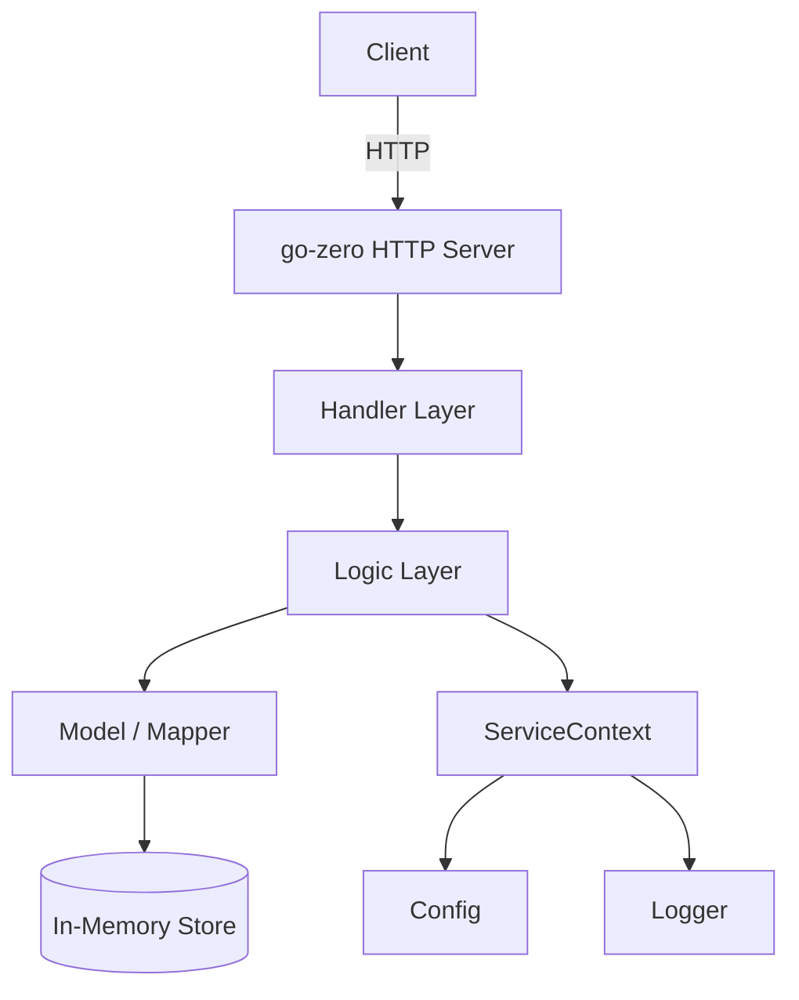

# Project 06: go-zero Microservice

A CRUD API built with the [go-zero](https://go-zero.dev) framework — a
cloud-native Go microservice framework with built-in resilience, observability,
and code generation. This exercises Part 11 (go-zero).

---

## Learning Goals

- Define APIs with go-zero's `.api` DSL
- Generate controller and types code with `goctl`
- Build a CRUD service with proper configuration
- Use go-zero's built-in HTTP and gRPC server capabilities
- Understand go-zero's config, logging, and middleware patterns
- Apply the go-zero project structure conventions

## Prerequisites

| Part | What you need |
|------|---------------|
| 03   | Structs, interfaces |
| 05   | `os`, `fmt`, `log` |
| 07   | HTTP basics (helps understand what go-zero does for you) |
| 09   | Gin (helps compare framework approaches) |
| 11   | go-zero fundamentals, `goctl`, API definitions, service config |
| 10   | Basic database concepts |

---

## Project Structure

After running `goctl`, the project follows go-zero's conventions:

```
bookstore/
├── etc/
│   └── bookstore.yaml        # Service configuration
├── internal/
│   ├── config/
│   │   └── config.go         # Configuration struct
│   ├── handler/
│   │   ├── book_add_handler.go
│   │   ├── book_delete_handler.go
│   │   ├── book_get_handler.go
│   │   ├── book_list_handler.go
│   │   └── book_update_handler.go
│   ├── logic/
│   │   ├── book_add_logic.go
│   │   ├── book_delete_logic.go
│   │   ├── book_get_logic.go
│   │   ├── book_list_logic.go
│   │   └── book_update_logic.go
│   ├── mapper/
│   │   └── book_model.go     # Data model (in-memory store for demo)
│   ├── svc/
│   │   └── service_context.go # Dependency injection container
│   └── types/
│       └── types.go          # Request/response types (generated)
├── bookstore.api             # API definition file
├── main.go                   # Entry point
└── go.mod
```



> 🧠 **Memory aid:** go-zero's layering is HTTP → handler → logic → model.
> Handlers parse the request, logic holds real business rules, and the model
> owns data. The ServiceContext is the shared box of dependencies passed to
> both handlers and logic.

---

## Part A: API Definition

Create `bookstore.api`:

```go
// bookstore.api
// Book Store — a CRUD microservice for managing books.

info(
    title: "Book Store API"
    desc: "A simple book management microservice"
    version: "1.0.0"
)

type (
    // Book represents a book in the store.
    Book {
        ID     int64  `json:"id"`
        Title  string `json:"title"`
        Author string `json:"author"`
        Price  float64 `json:"price"`
        Stock  int    `json:"stock"`
    }

    // AddBookRequest is the request body for adding a book.
    AddBookRequest {
        Title  string `json:"title" validate:"required"`
        Author string `json:"author" validate:"required"`
        Price  float64 `json:"price" validate:"gt=0"`
        Stock  int    `json:"stock" validate:"gte=0"`
    }

    // UpdateBookRequest is the request body for updating a book.
    UpdateBookRequest {
        Title  string `json:"title"`
        Author string `json:"author"`
        Price  float64 `json:"price"`
        Stock  int    `json:"stock"`
    }

    // BookListResponse returns a list of books.
    BookListResponse {
        Books []Book `json:"books"`
        Total int64  `json:"total"`
    }

    // BookResponse returns a single book.
    BookResponse {
        Book Book `json:"book"`
    }

    // MessageResponse returns a simple message.
    MessageResponse {
        Message string `json:"message"`
    }
)

service bookstore-api {
    @server(
        group: book
        handler: BookAdd
    )
    post /api/books (AddBookRequest) returns (BookResponse)

    @server(
        group: book
        handler: BookGet
    )
    get /api/books/:id returns (BookResponse)

    @server(
        group: book
        handler: BookList
    )
    get /api/books returns (BookListResponse)

    @server(
        group: book
        handler: BookUpdate
    )
    put /api/books/:id (UpdateBookRequest) returns (BookResponse)

    @server(
        group: book
        handler: BookDelete
    )
    delete /api/books/:id returns (MessageResponse)

    @server(
        group: health
        handler: HealthCheck
    )
    get /api/health returns (MessageResponse)
}
```

### Generate Code

```bash
# Install goctl (one-time)
go install github.com/zeromicro/go-zero/tools/goctl@latest

# Generate Go code from the API definition
goctl api go bookstore.api -dir ./bookstore

# This creates the entire internal/ structure, types, handler stubs,
# and the main.go entry point.
```

> 🔑 **Checkpoint:** `goctl` scaffolds the whole app in one command — but
> both this generated project and your neat `internal/` structure live in a
> single repo. Configuration, dependencies, and handlers all flow from this
> one generation step; re-run it after editing `bookstore.api`.

---

## Part B: Configuration

Create `etc/bookstore.yaml`:

```yaml
Name: bookstore-api
Host: 0.0.0.0
Port: 8080

# Logging
Log:
  Mode: console
  Level: info

# Telemetry (optional)
Telemetry:
  Name: bookstore-api
  Endpoint: http://localhost:14268/api/traces
  Batcher: jaeger
```

The generated `internal/config/config.go`:

```go
package config

import "github.com/zeromicro/go-zero/rest"

// Config holds all service configuration.
type Config struct {
	rest.RestConf

	// Add custom config fields here:
	// Database DatabaseConf
	// Redis    RedisConf
}
```

---

## Part C: Service Context (Dependency Injection)

Create `internal/svc/service_context.go`:

```go
package svc

import (
	"bookstore/internal/config"
	"bookstore/internal/mapper"
)

// ServiceContext holds shared dependencies for all handlers.
type ServiceContext struct {
	Config config.Config
	BookModel mapper.BookModel
}

// NewServiceContext creates a ServiceContext with all dependencies wired.
func NewServiceContext(c config.Config) *ServiceContext {
	return &ServiceContext{
		Config:    c,
		BookModel: mapper.NewInMemoryBookModel(),
	}
}
```

### Key Point

go-zero uses a **service context** for dependency injection. Instead of
creating dependencies inside handlers (which makes testing impossible),
you wire them up once and pass them through. This is the same principle
as a DI container in Spring or ASP.NET.

> 💡 **Tip:** For go-zero, wire all concrete deps once in `NewServiceContext`
> and let handlers + logic take the context. Swapping the in-memory store
> for Postgres later is a one-line change in this file.

---

## Part D: Model (Data Layer)

Create `internal/mapper/book_model.go`:

```go
package mapper

import (
	"fmt"
	"sync"
	"sync/atomic"
)

// Book is the data model.
type Book struct {
	ID     int64   `json:"id"`
	Title  string  `json:"title"`
	Author string  `json:"author"`
	Price  float64 `json:"price"`
	Stock  int     `json:"stock"`
}

// BookModel defines the data access interface.
type BookModel interface {
	Insert(book *Book) error
	GetByID(id int64) (*Book, error)
	GetAll() ([]Book, int64)
	Update(id int64, book *Book) error
	Delete(id int64) error
}

// InMemoryBookModel is a thread-safe in-memory implementation.
type InMemoryBookModel struct {
	mu     sync.RWMutex
	books  map[int64]*Book
	nextID atomic.Int64
}

// NewInMemoryBookModel creates a new in-memory book store.
func NewInMemoryBookModel() *InMemoryBookModel {
	return &InMemoryBookModel{
		books: make(map[int64]*Book),
	}
}

// Insert adds a book and assigns an ID.
func (m *InMemoryBookModel) Insert(book *Book) error {
	m.mu.Lock()
	defer m.mu.Unlock()

	book.ID = m.nextID.Add(1)
	m.books[book.ID] = book
	return nil
}

// GetByID returns a book by ID.
func (m *InMemoryBookModel) GetByID(id int64) (*Book, error) {
	m.mu.RLock()
	defer m.mu.RUnlock()

	book, ok := m.books[id]
	if !ok {
		return nil, fmt.Errorf("book %d not found", id)
	}
	return book, nil
}

// GetAll returns all books and the count.
func (m *InMemoryBookModel) GetAll() ([]Book, int64) {
	m.mu.RLock()
	defer m.mu.RUnlock()

	books := make([]Book, 0, len(m.books))
	for _, b := range m.books {
		books = append(books, *b)
	}
	return books, int64(len(books))
}

// Update modifies an existing book.
func (m *InMemoryBookModel) Update(id int64, book *Book) error {
	m.mu.Lock()
	defer m.mu.Unlock()

	existing, ok := m.books[id]
	if !ok {
		return fmt.Errorf("book %d not found", id)
	}

	if book.Title != "" {
		existing.Title = book.Title
	}
	if book.Author != "" {
		existing.Author = book.Author
	}
	if book.Price > 0 {
		existing.Price = book.Price
	}
	if book.Stock >= 0 {
		existing.Stock = book.Stock
	}

	return nil
}

// Delete removes a book by ID.
func (m *InMemoryBookModel) Delete(id int64) error {
	m.mu.Lock()
	defer m.mu.Unlock()

	if _, ok := m.books[id]; !ok {
		return fmt.Errorf("book %d not found", id)
	}
	delete(m.books, id)
	return nil
}
```

> 🔑 **Checkpoint:** The `BookModel` is an interface, so handlers/logic are
> written against the contract, not the store — same pattern as the
> repository layers in earlier projects. `sync.Mutex` keeps the in-memory
> map safe across concurrent requests.

---

## Part E: Handlers

After `goctl` generates the handler stubs, you fill in the logic files.

Create `internal/handler/book_add_handler.go`:

```go
package handler

import (
	"net/http"

	"bookstore/internal/logic"
	"bookstore/internal/svc"
	"bookstore/internal/types"

	"github.com/zeromicro/go-zero/rest/httpx"
)

func BookAddHandler(svcCtx *svc.ServiceContext) http.HandlerFunc {
	return func(w http.ResponseWriter, r *http.Request) {
		var req types.AddBookRequest
		if err := httpx.Parse(r, &req); err != nil {
			httpx.ErrorCtx(r.Context(), w, err)
			return
		}

		l := logic.NewBookAddLogic(r.Context(), svcCtx)
		resp, err := l.BookAdd(req)
		if err != nil {
			httpx.ErrorCtx(r.Context(), w, err)
		} else {
			httpx.OkJsonCtx(r.Context(), w, resp)
		}
	}
}
```

Create `internal/handler/book_get_handler.go`:

```go
package handler

import (
	"net/http"

	"bookstore/internal/logic"
	"bookstore/internal/svc"
	"bookstore/internal/types"

	"github.com/zeromicro/go-zero/rest/httpx"
)

func BookGetHandler(svcCtx *svc.ServiceContext) http.HandlerFunc {
	return func(w http.ResponseWriter, r *http.Request) {
		var req types.BookGetRequest
		if err := httpx.Parse(r, &req); err != nil {
			httpx.ErrorCtx(r.Context(), w, err)
			return
		}

		l := logic.NewBookGetLogic(r.Context(), svcCtx)
		resp, err := l.BookGet(req)
		if err != nil {
			httpx.ErrorCtx(r.Context(), w, err)
		} else {
			httpx.OkJsonCtx(r.Context(), w, resp)
		}
	}
}
```

Create `internal/handler/book_list_handler.go`:

```go
package handler

import (
	"net/http"

	"bookstore/internal/logic"
	"bookstore/internal/svc"

	"github.com/zeromicro/go-zero/rest/httpx"
)

func BookListHandler(svcCtx *svc.ServiceContext) http.HandlerFunc {
	return func(w http.ResponseWriter, r *http.Request) {
		l := logic.NewBookListLogic(r.Context(), svcCtx)
		resp, err := l.BookList()
		if err != nil {
			httpx.ErrorCtx(r.Context(), w, err)
		} else {
			httpx.OkJsonCtx(r.Context(), w, resp)
		}
	}
}
```

Create `internal/handler/book_update_handler.go`:

```go
package handler

import (
	"net/http"

	"bookstore/internal/logic"
	"bookstore/internal/svc"
	"bookstore/internal/types"

	"github.com/zeromicro/go-zero/rest/httpx"
)

func BookUpdateHandler(svcCtx *svc.ServiceContext) http.HandlerFunc {
	return func(w http.ResponseWriter, r *http.Request) {
		var req types.BookUpdateRequest
		if err := httpx.Parse(r, &req); err != nil {
			httpx.ErrorCtx(r.Context(), w, err)
			return
		}

		l := logic.NewBookUpdateLogic(r.Context(), svcCtx)
		resp, err := l.BookUpdate(req)
		if err != nil {
			httpx.ErrorCtx(r.Context(), w, err)
		} else {
			httpx.OkJsonCtx(r.Context(), w, resp)
		}
	}
}
```

Create `internal/handler/book_delete_handler.go`:

```go
package handler

import (
	"net/http"

	"bookstore/internal/logic"
	"bookstore/internal/svc"
	"bookstore/internal/types"

	"github.com/zeromicro/go-zero/rest/httpx"
)

func BookDeleteHandler(svcCtx *svc.ServiceContext) http.HandlerFunc {
	return func(w http.ResponseWriter, r *http.Request) {
		var req types.BookDeleteRequest
		if err := httpx.Parse(r, &req); err != nil {
			httpx.ErrorCtx(r.Context(), w, err)
			return
		}

		l := logic.NewBookDeleteLogic(r.Context(), svcCtx)
		resp, err := l.BookDelete(req)
		if err != nil {
			httpx.ErrorCtx(r.Context(), w, err)
		} else {
			httpx.OkJsonCtx(r.Context(), w, resp)
		}
	}
}
```

> 🧠 **Memory aid:** Handlers are thin adapters — parse request, call logic,
> write response. The weight lives in `logic/`, keeping handlers identical
> across all five books (add, get, list, update, delete).

---

## Part F: Logic Layer

The logic files contain your business rules. Create them in `internal/logic/`.

Create `internal/logic/book_add_logic.go`:

```go
package logic

import (
	"context"

	"bookstore/internal/mapper"
	"bookstore/internal/svc"
	"bookstore/internal/types"

	"github.com/zeromicro/go-zero/core/logx"
)

type BookAddLogic struct {
	logx.Logger
	ctx    context.Context
	svcCtx *svc.ServiceContext
}

func NewBookAddLogic(ctx context.Context, svcCtx *svc.ServiceContext) *BookAddLogic {
	return &BookAddLogic{
		Logger: logx.WithContext(ctx),
		ctx:    ctx,
		svcCtx: svcCtx,
	}
}

func (l *BookAddLogic) BookAdd(req types.AddBookRequest) (*types.BookResponse, error) {
	book := &mapper.Book{
		Title:  req.Title,
		Author: req.Author,
		Price:  req.Price,
		Stock:  req.Stock,
	}

	if err := l.svcCtx.BookModel.Insert(book); err != nil {
		return nil, err
	}

	l.Infof("book added: id=%d title=%q", book.ID, book.Title)

	return &types.BookResponse{
		Book: types.Book{
			ID:     book.ID,
			Title:  book.Title,
			Author: book.Author,
			Price:  book.Price,
			Stock:  book.Stock,
		},
	}, nil
}
```

Create `internal/logic/book_get_logic.go`:

```go
package logic

import (
	"context"
	"fmt"

	"bookstore/internal/svc"
	"bookstore/internal/types"

	"github.com/zeromicro/go-zero/core/logx"
)

type BookGetLogic struct {
	logx.Logger
	ctx    context.Context
	svcCtx *svc.ServiceContext
}

func NewBookGetLogic(ctx context.Context, svcCtx *svc.ServiceContext) *BookGetLogic {
	return &BookGetLogic{
		Logger: logx.WithContext(ctx),
		ctx:    ctx,
		svcCtx: svcCtx,
	}
}

func (l *BookGetLogic) BookGet(req types.BookGetRequest) (*types.BookResponse, error) {
	book, err := l.svcCtx.BookModel.GetByID(req.Id)
	if err != nil {
		return nil, fmt.Errorf("book not found: %w", err)
	}

	return &types.BookResponse{
		Book: types.Book{
			ID:     book.ID,
			Title:  book.Title,
			Author: book.Author,
			Price:  book.Price,
			Stock:  book.Stock,
		},
	}, nil
}
```

Create `internal/logic/book_list_logic.go`:

```go
package logic

import (
	"context"

	"bookstore/internal/svc"
	"bookstore/internal/types"

	"github.com/zeromicro/go-zero/core/logx"
)

type BookListLogic struct {
	logx.Logger
	ctx    context.Context
	svcCtx *svc.ServiceContext
}

func NewBookListLogic(ctx context.Context, svcCtx *svc.ServiceContext) *BookListLogic {
	return &BookListLogic{
		Logger: logx.WithContext(ctx),
		ctx:    ctx,
		svcCtx: svcCtx,
	}
}

func (l *BookListLogic) BookList() (*types.BookListResponse, error) {
	books, total := l.svcCtx.BookModel.GetAll()

	result := make([]types.Book, 0, len(books))
	for _, b := range books {
		result = append(result, types.Book{
			ID:     b.ID,
			Title:  b.Title,
			Author: b.Author,
			Price:  b.Price,
			Stock:  b.Stock,
		})
	}

	return &types.BookListResponse{
		Books: result,
		Total: total,
	}, nil
}
```

Create `internal/logic/book_update_logic.go`:

```go
package logic

import (
	"context"
	"fmt"

	"bookstore/internal/mapper"
	"bookstore/internal/svc"
	"bookstore/internal/types"

	"github.com/zeromicro/go-zero/core/logx"
)

type BookUpdateLogic struct {
	logx.Logger
	ctx    context.Context
	svcCtx *svc.ServiceContext
}

func NewBookUpdateLogic(ctx context.Context, svcCtx *svc.ServiceContext) *BookUpdateLogic {
	return &BookUpdateLogic{
		Logger: logx.WithContext(ctx),
		ctx:    ctx,
		svcCtx: svcCtx,
	}
}

func (l *BookUpdateLogic) BookUpdate(req types.BookUpdateRequest) (*types.BookResponse, error) {
	book := &mapper.Book{
		Title:  req.Title,
		Author: req.Author,
		Price:  req.Price,
		Stock:  req.Stock,
	}

	if err := l.svcCtx.BookModel.Update(req.Id, book); err != nil {
		return nil, fmt.Errorf("update failed: %w", err)
	}

	updated, err := l.svcCtx.BookModel.GetByID(req.Id)
	if err != nil {
		return nil, err
	}

	return &types.BookResponse{
		Book: types.Book{
			ID:     updated.ID,
			Title:  updated.Title,
			Author: updated.Author,
			Price:  updated.Price,
			Stock:  updated.Stock,
		},
	}, nil
}
```

Create `internal/logic/book_delete_logic.go`:

```go
package logic

import (
	"context"
	"fmt"

	"bookstore/internal/svc"
	"bookstore/internal/types"

	"github.com/zeromicro/go-zero/core/logx"
)

type BookDeleteLogic struct {
	logx.Logger
	ctx    context.Context
	svcCtx *svc.ServiceContext
}

func NewBookDeleteLogic(ctx context.Context, svcCtx *svc.ServiceContext) *BookDeleteLogic {
	return &BookDeleteLogic{
		Logger: logx.WithContext(ctx),
		ctx:    ctx,
		svcCtx: svcCtx,
	}
}

func (l *BookDeleteLogic) BookDelete(req types.BookDeleteRequest) (*types.MessageResponse, error) {
	if err := l.svcCtx.BookModel.Delete(req.Id); err != nil {
		return nil, fmt.Errorf("delete failed: %w", err)
	}

	l.Infof("book deleted: id=%d", req.Id)

	return &types.MessageResponse{
		Message: fmt.Sprintf("book %d deleted", req.Id),
	}, nil
}
```

> ⚠️ **Watch out:** Handlers log success/failure via `logx`, but they never
> log request bodies or `book` structs wholesale — error-wrapped messages
> like `"%w"` preserve the error chain for debugging without leaking data.

---

## Part G: Entry Point

Create `main.go`:

```go
package main

import (
	"flag"
	"fmt"

	"bookstore/internal/config"
	"bookstore/internal/handler"
	"bookstore/internal/svc"

	"github.com/zeromicro/go-zero/core/conf"
	"github.com/zeromicro/go-zero/rest"
)

var configFile = flag.String("f", "etc/bookstore.yaml", "the config file")

func main() {
	flag.Parse()

	var c config.Config
	conf.MustLoad(*configFile, &c)

	server := rest.MustNewServer(c.RestConf)
	defer server.Stop()

	ctx := svc.NewServiceContext(c)
	handler.RegisterHandlers(server, ctx)

	fmt.Printf("Starting bookstore API at %s:%d\n", c.Host, c.Port)
	server.Start()
}
```

### RegisterHandlers

The `goctl`-generated `RegisterHandlers` function registers all routes:

```go
// internal/handler/routes.go (generated by goctl)

package handler

import (
	"net/http"

	"bookstore/internal/svc"

	"github.com/zeromicro/go-zero/rest"
)

func RegisterHandlers(server *rest.Server, svcCtx *svc.ServiceContext) {
	server.AddRoutes([]rest.Route{
		{
			Method:  http.MethodPost,
			Path:    "/api/books",
			Handler: BookAddHandler(svcCtx),
		},
		{
			Method:  http.MethodGet,
			Path:    "/api/books/:id",
			Handler: BookGetHandler(svcCtx),
		},
		{
			Method:  http.MethodGet,
			Path:    "/api/books",
			Handler: BookListHandler(svcCtx),
		},
		{
			Method:  http.MethodPut,
			Path:    "/api/books/:id",
			Handler: BookUpdateHandler(svcCtx),
		},
		{
			Method:  http.MethodDelete,
			Path:    "/api/books/:id",
			Handler: BookDeleteHandler(svcCtx),
		},
	})
}
```

### Running It

```bash
# Initialize module
go mod init bookstore
go mod tidy

# Run the server
go run main.go -f etc/bookstore.yaml

# Test with curl
# Add a book
curl -X POST http://localhost:8080/api/books \
  -H "Content-Type: application/json" \
  -d '{"title":"The Go Programming Language","author":"Donovan & Kernighan","price":49.99,"stock":10}'
# {"book":{"id":1,"title":"The Go Programming Language","author":"Donovan & Kernighan","price":49.99,"stock":10}}

# List books
curl http://localhost:8080/api/books
# {"books":[{"id":1,"title":"The Go Programming Language",...}],"total":1}

# Get book by ID
curl http://localhost:8080/api/books/1
# {"book":{"id":1,"title":"The Go Programming Language",...}}

# Update book
curl -X PUT http://localhost:8080/api/books/1 \
  -H "Content-Type: application/json" \
  -d '{"price":39.99,"stock":5}'
# {"book":{"id":1,"title":"The Go Programming Language","price":39.99,"stock":5,...}}

# Delete book
curl -X DELETE http://localhost:8080/api/books/1
# {"message":"book 1 deleted"}
```

> 🧠 **Memory aid:** The API surface is generated from `bookstore.api` — so
> the URL shape (`/api/books/:id`) comes from the spec, not the handlers.
> Read the `.api` file to understand the whole service contract at a glance.

---

## Part H: Tests

Create `internal/mapper/book_model_test.go`:

```go
package mapper

import (
	"testing"
)

func TestInMemoryBookModel_Insert(t *testing.T) {
	m := NewInMemoryBookModel()

	book := &Book{Title: "Go Book", Author: "Author", Price: 29.99, Stock: 5}
	if err := m.Insert(book); err != nil {
		t.Fatalf("Insert: %v", err)
	}
	if book.ID != 1 {
		t.Errorf("expected ID 1, got %d", book.ID)
	}
}

func TestInMemoryBookModel_GetByID(t *testing.T) {
	m := NewInMemoryBookModel()

	book := &Book{Title: "Go", Author: "A", Price: 10, Stock: 1}
	m.Insert(book)

	got, err := m.GetByID(1)
	if err != nil {
		t.Fatalf("GetByID: %v", err)
	}
	if got.Title != "Go" {
		t.Errorf("expected title 'Go', got %q", got.Title)
	}
}

func TestInMemoryBookModel_GetByID_NotFound(t *testing.T) {
	m := NewInMemoryBookModel()

	_, err := m.GetByID(999)
	if err == nil {
		t.Error("expected error for non-existent book")
	}
}

func TestInMemoryBookModel_GetAll(t *testing.T) {
	m := NewInMemoryBookModel()

	m.Insert(&Book{Title: "A", Author: "X", Price: 10, Stock: 1})
	m.Insert(&Book{Title: "B", Author: "Y", Price: 20, Stock: 2})

	books, total := m.GetAll()
	if total != 2 {
		t.Errorf("expected 2, got %d", total)
	}
	if len(books) != 2 {
		t.Errorf("expected 2 books, got %d", len(books))
	}
}

func TestInMemoryBookModel_Update(t *testing.T) {
	m := NewInMemoryBookModel()

	book := &Book{Title: "Old", Author: "A", Price: 10, Stock: 1}
	m.Insert(book)

	updated := &Book{Title: "New"}
	if err := m.Update(1, updated); err != nil {
		t.Fatalf("Update: %v", err)
	}

	got, _ := m.GetByID(1)
	if got.Title != "New" {
		t.Errorf("expected title 'New', got %q", got.Title)
	}
	if got.Author != "A" {
		t.Error("expected author to remain unchanged")
	}
}

func TestInMemoryBookModel_Delete(t *testing.T) {
	m := NewInMemoryBookModel()

	book := &Book{Title: "Delete Me", Author: "A", Price: 10, Stock: 1}
	m.Insert(book)

	if err := m.Delete(1); err != nil {
		t.Fatalf("Delete: %v", err)
	}

	_, err := m.GetByID(1)
	if err == nil {
		t.Error("expected error after deletion")
	}
}

func TestInMemoryBookModel_Delete_NotFound(t *testing.T) {
	m := NewInMemoryBookModel()

	err := m.Delete(999)
	if err == nil {
		t.Error("expected error for non-existent book")
	}
}

// Table-driven test
func TestBookModel_TableDriven(t *testing.T) {
	tests := []struct {
		name    string
		price   float64
		stock   int
		wantErr bool
	}{
		{"valid book", 29.99, 10, false},
		{"zero stock", 5.00, 0, false},
		{"expensive book", 999.99, 1, false},
	}

	for _, tt := range tests {
		t.Run(tt.name, func(t *testing.T) {
			m := NewInMemoryBookModel()
			book := &Book{
				Title:  tt.name,
				Author: "Test",
				Price:  tt.price,
				Stock:  tt.stock,
			}
			if err := m.Insert(book); err != nil {
				t.Fatalf("Insert: %v", err)
			}
			if book.ID == 0 {
				t.Error("expected non-zero ID")
			}
		})
	}
}
```

> 💡 **Tip:** Table-driven tests at the model layer run without HTTP or a
> real database — fast feedback, and they pin down the store's behavior
> (auto-ID, update, delete) before any handler touches it.

---

## go-zero Architecture Diagram

```
┌────────────────────────────────────────────────────┐
│                  go-zero Application                │
│                                                    │
│  ┌──────────┐  ┌──────────┐  ┌──────────────────┐ │
│  │   etc/    │  │  main.go │  │ internal/         │ │
│  │ config    │→ │  loads   │→ │  config/          │ │
│  │ (.yaml)   │  │  config  │  │  svc/ (DI container)│ │
│  └──────────┘  └──────────┘  │  handler/ (HTTP)  │ │
│                               │  logic/ (business)│ │
│                               │  mapper/ (data)   │ │
│                               │  types/ (schemas) │ │
│                               └──────────────────┘ │
│                                                    │
│  Built-in features:                                │
│  ✓ Rate limiting       ✓ Circuit breaking          │
│  ✓ Prometheus metrics  ✓ JWT auth middleware       │
│  ✓ Zerolog integration ✓ Graceful shutdown         │
│  ✓ Config hot-reload   ✓ Service discovery         │
└────────────────────────────────────────────────────┘
```

---

## Modern Practices

- **API-first design** — the `.api` file is the contract. Generate code from
  it, don't hand-write handlers. This ensures consistency and makes changes
  mechanical.
- **Three-layer architecture** — `handler` → `logic` → `mapper`. Each layer
  has a single responsibility. Handlers parse requests, logic contains business
  rules, mappers handle data.
- **`goctl` code generation** — don't fight the framework. Use `goctl` to
  generate boilerplate, then fill in the logic. This is similar to `openapi-generator`
  or `aspnet-codegenerator`.
- **`logx` structured logging** — go-zero uses zerolog under the hood. All
  logs are JSON-formatted with trace IDs, making distributed tracing easy.
- **Configuration via YAML** — externalize all config. Never hard-code ports,
  secrets, or URLs.
- **Service context pattern** — the `ServiceContext` struct is a poor man's
  DI container. It's simple, explicit, and testable.

---

## Common Mistakes

- **Filling business logic in handlers.** Handlers should parse input and
  call logic. If your handler has database queries, you've skipped a layer.
- **Not using `goctl`** — hand-writing the boilerplate defeats the purpose
  of the framework. Let `goctl` generate routes, types, and handler stubs.
- **Ignoring `httpx.Error`** — always return errors through `httpx.ErrorCtx`.
  Never write raw `w.WriteHeader(500)` in a go-zero handler.
- **Hard-coding configuration** — use the YAML config file and command-line
  flags. Different environments (dev, staging, prod) need different settings.
- **Forgetting `defer server.Stop()`** — ensures graceful shutdown. Without
  it, in-flight requests are killed on SIGTERM.
- **Not validating input** — go-zero's `httpx.Parse` does basic validation.
  For complex rules, validate in the logic layer.
- **Creating dependencies in handlers** — always wire dependencies in the
  `ServiceContext`. This makes testing possible.

---

## Stretch Goals / Extensions

1. **Add PostgreSQL** — replace `InMemoryBookModel` with a real database model
   using `sqlx` or go-zero's `sqlx` wrapper.
2. **Add Redis cache** — use go-zero's built-in Redis support for caching
   frequently-read books.
3. **JWT authentication** — add `rest.WithJWT` to the server config with
   a secret key. Protect write endpoints.
4. **Rate limiting** — use go-zero's built-in rate limiter middleware.
5. **gRPC service** — create a second service that calls the bookstore via
   gRPC. Use go-zero's `zrpc` package.
6. **Docker + K8s** — write a `Dockerfile` and Kubernetes deployment manifest.
7. **Metrics dashboard** — expose Prometheus metrics and build a Grafana
   dashboard.
8. **Load test** — use `hey` or `wrk` to benchmark the API and tune
   configuration.

---

## Next

Continue to [07-fullstack-backend-notes-app.md](07-fullstack-backend-notes-app.md)
for the capstone project — a full-stack notes API with auth, PostgreSQL, Redis
caching, Docker, health checks, and monitoring.
