# Cloudflare Workers — Deep Dive Reference

> [!abstract] Purpose
> Comprehensive reference for Cloudflare Workers ecosystem. Covers architecture internals, advanced patterns, performance optimization, debugging, and production hardening. Designed for engineers building latency-critical, globally-distributed systems.

---

## 1. Architecture Internals

### 1.1 Theoretical Foundation: Isolate-Based Edge Computing

**Traditional Serverless (Container-Based)** vs **Cloudflare Workers (Isolate-Based)**

The fundamental innovation of Cloudflare Workers is the use of **V8 Isolates** instead of containers. This architectural choice has profound implications for latency, density, and cost.

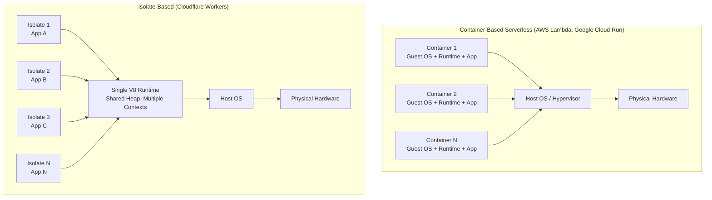

**Key Theoretical Implications:**

| Dimension | Container Model | Isolate Model |
|-----------|-----------------|---------------|
| **Startup Latency** | 100ms–2s (OS boot + runtime init) | 0–5ms (context creation only) |
| **Memory Overhead** | 50–100MB base per container | ~3MB base per isolate |
| **Density** | ~50–100 containers/node | ~1,000–5,000 isolates/node |
| **Scaling Granularity** | Per-container | Per-request |
| **Cold Start** | Significant | Near-zero |
| **Isolation Boundary** | Process/OS-level | V8 Context (software-enforced) |

**Why V8 Isolates Work for Edge:**

1. **Single Runtime, Multiple Contexts**: V8 allows creating multiple *contexts* within a single runtime. Each context has its own global object, built-ins, and heap, providing JavaScript-level isolation without OS-level overhead.

2. **Software Fault Isolation (SFI)**: V8 uses compiler-based sandboxing (bounds checking, type verification) rather than hardware page tables. This is safe for JavaScript/WASM but not for arbitrary native code.

3. **Shared Heap Benefits**: Common code (stdlib, framework) exists once in memory. Isolates share read-only heap pages via copy-on-write.

4. **Deterministic Scheduling**: The V8 event loop is single-threaded and cooperative. No preemption means no context-switch overhead.

**Trade-offs to Understand:**

```mermaid
graph LR
    subgraph "Strengths"
        S1[Sub-millisecond cold start]
        S2[High density = low cost]
        S3[Global deployment by default]
        S4[Automatic scaling per request]
    end
    
    subgraph "Constraints"
        C1[No Node.js APIs<br/>process, fs, net, cluster]
        C2[CPU limit: 10ms/50ms/30s]
        C3[Memory limit: 128MB]
        C4[No raw TCP/UDP sockets]
        C5[No filesystem access]
        C6[Single-threaded event loop]
    end
    
    subgraph "Workarounds"
        W1[Node.js compat flag<br/>polyfills for Buffer, process]
        W2[Offload to Queues/DOs]
        W3[Stream processing]
        W4[HTTP/WebSocket only]
        W5[KV/R2/D1 for storage]
        W6[Async patterns, no blocking]
    end
    
    Strengths --> Constraints
    Constraints --> Workarounds
```

### 1.2 Request Flow Theory

**The Edge Request Lifecycle**

Every request to a Worker follows a deterministic path through Cloudflare's edge network:

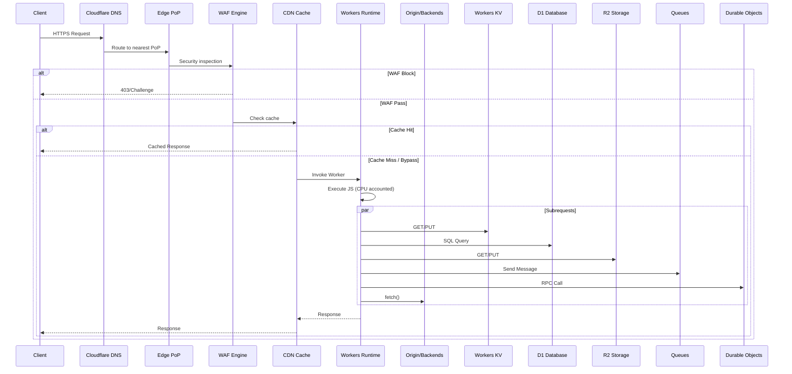

**Request Flow Stages:**

1. **TLS Termination**: Handled by Cloudflare's edge SSL (automatic, free certs via Universal SSL)
2. **WAF Evaluation**: Managed rulesets (OWASP, Cloudflare) + custom rules execute before Worker
3. **Cache Check**: Respects `Cache-Control`, `CF-Cache-Status` headers; Workers can bypass via `cf` fetch options
4. **Worker Invocation**: Isolate retrieved/created, `fetch` handler executed
5. **Subrequest Phase**: All I/O (KV, D1, R2, fetch, DO) happens here — **does not count against CPU limit**
6. **Response Construction**: Worker returns `Response` object
7. **Cache Store**: Response cached if headers allow
8. **Response Delivery**: Streamed back to client

### 1.3 CPU Time Accounting Theory

**Critical Concept: CPU Time ≠ Wall Time**

This is the most misunderstood aspect of Workers pricing and limits.

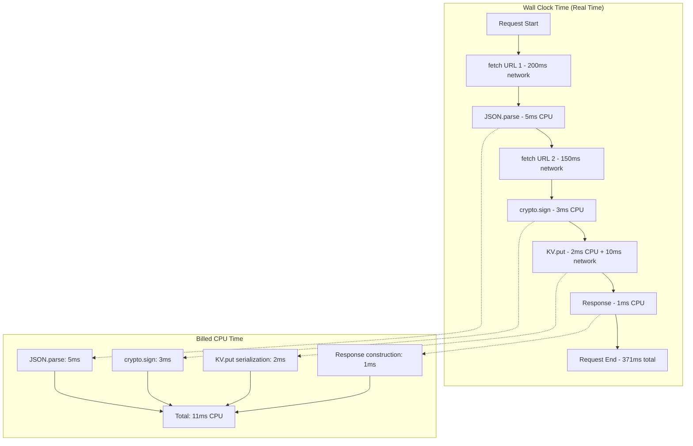

**What Counts as CPU Time:**
- JavaScript execution (parsing, loops, computations)
- `JSON.parse()` / `JSON.stringify()`
- Cryptographic operations (`crypto.subtle`)
- Regular expression execution
- WASM execution
- Protbuf serialization/deserialization

**What Does NOT Count:**
- All `await` time (network I/O, timers, `setTimeout`)
- `fetch()` to origins, KV, D1, R2, Queues, DOs
- `crypto.subtle` key generation (async)
- `ReadableStream` piping (handled by runtime)
- `Response` body streaming to client

**Practical Implication**: A request taking 2 seconds wall-time may only use 15ms CPU if it's I/O bound. This enables high-throughput APIs that spend most time waiting on backends.

---

## 2. Advanced Patterns — Theory & Implementation

### 2.1 Request Coalescing (Cache Stampede Protection)

**Theory**: When a popular cache key expires, multiple concurrent requests may all miss the cache and execute the expensive origin fetch simultaneously ("thundering herd"). Request coalescing ensures only one fetch executes; others wait for its result.

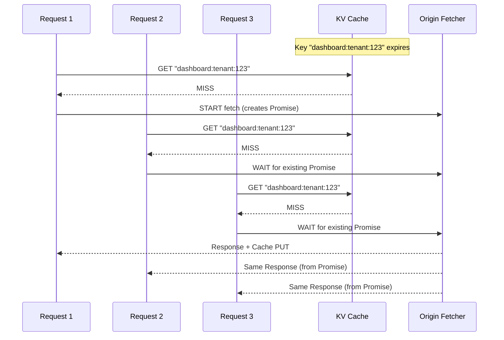

**Implementation Pattern:**

```typescript
// In-memory coalescing (per-isolate, survives only during request)
const inflight = new Map<string, Promise<Response>>();

export async function coalescedFetch(
  key: string,
  fetcher: () => Promise<Response>,
  env: Env
): Promise<Response> {
  // L1: Check KV cache (persistent across isolates)
  const cached = await env.CACHE.get(key, "json");
  if (cached) return new Response(JSON.stringify(cached), {
    headers: { "X-Cache": "HIT", "Content-Type": "application/json" }
  });

  // L2: Check in-flight map (coalesce within this isolate)
  if (inflight.has(key)) {
    const response = await inflight.get(key)!;
    return new Response(response.body, {
      ...response,
      headers: { ...Object.fromEntries(response.headers), "X-Cache": "COALESCED" }
    });
  }

  // L3: Start new fetch, store promise
  const promise = fetcher().then(async (response) => {
    inflight.delete(key);
    if (response.ok) {
      const data = await response.clone().json();
      // Fire-and-forget cache write
      ctx.waitUntil(env.CACHE.put(key, JSON.stringify(data), { expirationTtl: 300 }));
    }
    return response;
  });

  inflight.set(key, promise);
  const response = await promise;
  return new Response(response.body, {
    ...response,
    headers: { ...Object.fromEntries(response.headers), "X-Cache": "MISS" }
  });
}
```

### 2.2 Streaming Architecture Theory

**Why Streaming Matters at Edge:**

Traditional servers buffer entire responses in memory. At edge with 128MB limit, this breaks for large files. Streaming keeps memory O(1) regardless of response size.

```mermaid
graph LR
    subgraph "Buffered Response (Bad)"
        B1[Origin: 500MB File]
        B2[Worker: Buffer 500MB in RAM]
        B3[OOM Crash / Eviction]
        B1 --> B2 --> B3
    end
    
    subgraph "Streamed Response (Good)"
        S1[Origin: 500MB File]
        S2[Worker: Stream Chunk 1]
        S3[Worker: Stream Chunk 2]
        S4[Worker: Stream Chunk N]
        S5[Client receives incrementally]
        S1 --> S2 --> S3 --> S4 --> S5
    end
    
    subgraph "Memory Profile"
        M1[Buffered: O(N) memory]
        M2[Streamed: O(1) memory]
    end
```

**Transform Streams Pipeline:**

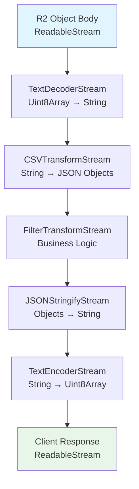

### 2.3 WebSocket over Durable Objects — Theory

**Why Durable Objects for WebSockets?**

Regular Workers are stateless and ephemeral. WebSockets require:
- Persistent connection state
- Message routing to specific connections
- Horizontal scaling with session affinity
- Server-initiated messages (push)

Durable Objects provide **strong consistency** and **global uniqueness** per identity — perfect for WebSocket session management.

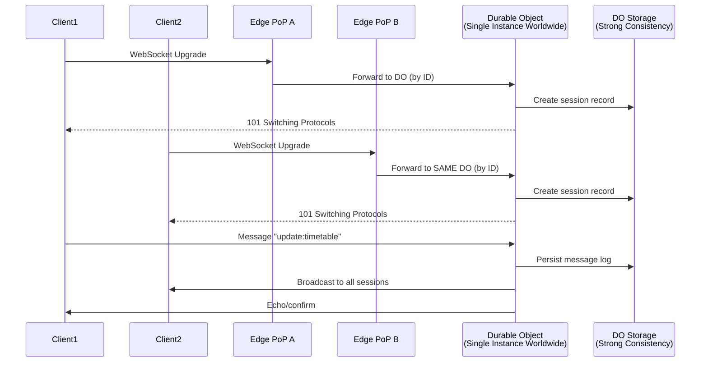

**Key Guarantee**: A Durable Object ID maps to **exactly one instance globally**. No matter which PoP the request hits, it routes to the same DO instance. This eliminates the need for sticky sessions or external coordination.

### 2.4 Cron with Jitter — Distributed Systems Theory

**Thundering Herd Problem**: When thousands of Workers have the same cron schedule (e.g., `0 * * * *`), they all wake up simultaneously, overwhelming downstream services.

**Jitter Solution**: Add random delay to spread load over time window.

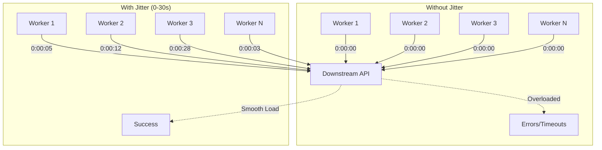

**Optimal Jitter Formula:**
```typescript
// Exponential jitter for retries, uniform for cron
function cronJitter(windowMs: number): number {
  return Math.random() * windowMs;
}

function retryJitter(attempt: number, baseMs: number, maxMs: number): number {
  const exponential = baseMs * Math.pow(2, attempt);
  const capped = Math.min(exponential, maxMs);
  // Add jitter: random value between 0 and capped
  return Math.random() * capped;
}
```

---

## 3. Storage Deep Dives — Theory & Patterns

### 3.1 Workers KV — Theoretical Model

**KV is an Eventually Consistent, Global Key-Value Store**

```mermaid
graph TB
    subgraph "Write Path (Async Replication)"
        W1[Worker Write<br/>PoP: LAX] --> W2[Local Write<br/>(Immediate)]
        W2 --> W3[Async Replication<br/>to other PoPs]
        W3 --> W4[Eventual Consistency<br/>< 60s globally]
    end
    
    subgraph "Read Path (Read-Your-Writes)"
        R1[Worker Read<br/>PoP: LAX] --> R2{Local Write?}
        R2 -->|Yes| R3[Read Local<br/>(Strong Consistency)]
        R2 -->|No| R4[Read Local<br/>(Eventually Consistent)]
    end
    
    subgraph "Consistency Model"
        C1[Write: Async replication]
        C2[Read: Read-your-writes in same PoP]
        C3[Cross-PoP: Eventual ~60s]
        C4[No transactions, no compare-and-swap]
    end
```

**Data Model Implications:**

| Operation | Consistency | Latency | Use Case |
|-----------|-------------|---------|----------|
| `put()` | Async global | ~10ms local | Cache writes, session creation |
| `get()` | Read-your-writes | ~5ms | Session lookup, config |
| `list()` | Eventual | ~50ms | Admin/debug only |
| `delete()` | Async global | ~10ms | Cache invalidation |

**Key Design Patterns:**

```mermaid
graph TD
    subgraph "Key Design Patterns"
        P1[Namespacing<br/>prefix:type:id]
        P2[Composite Keys<br/>tenant:service:feature]
        P3[Versioned Keys<br/>timetable:v5:batch:3]
        P4[TTL Strategy<br/>Short for dynamic, long for static]
    end
    
    subgraph "Access Patterns"
        A1[Session: session:{sid} → 30m TTL]
        A2[Entitlement: ent:{tenant}:{svc}:{feat} → 60s TTL + event invalidation]
        A3[Cache: cache:{resource}:{id} → 5m-24h TTL]
        A4[Rate Limit: rl:{scope}:{id} → window TTL]
        A5[Idempotency: idem:{service}:{key} → 48h TTL]
    end
    
    P1 --> A1 & A2 & A3 & A4 & A5
    P2 --> A2
    P3 --> A3
    P4 --> A1 & A2 & A3 & A4 & A5
```

### 3.2 D1 — SQLite at Edge Theory

**D1 Architecture**: SQLite compiled to WASM, running in a separate isolate per database. Each query executes in a transaction.

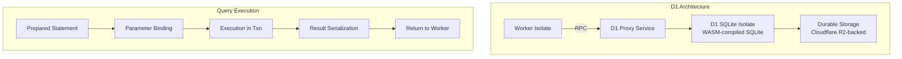

**Why Prepared Statements Are Mandatory:**

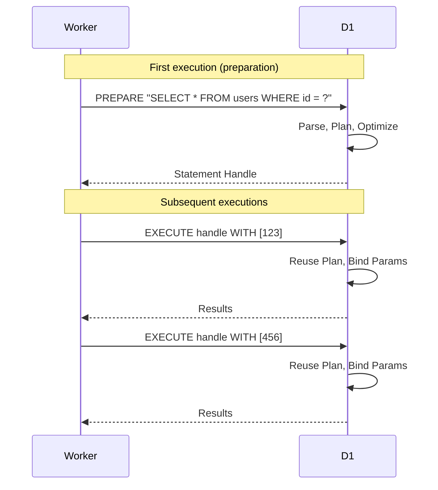

**Batch API = Implicit Transactions:**

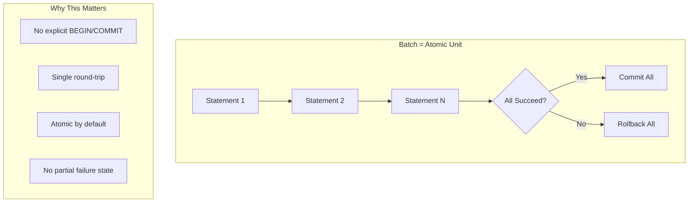

### 3.3 R2 — Object Storage Theory

**R2 = S3-Compatible, Zero Egress Fees, Edge-Integrated**

```mermaid
graph TB
    subgraph "R2 Architecture"
        Client[Client/Worker] -->|HTTPS| Edge[Cloudflare Edge]
        Edge -->|Internal Network| R2[R2 Control Plane]
        R2 -->|Metadata| Metadata[(Metadata Store)]
        R2 -->|Data| Objects[(Object Storage<br/>Multi-AZ, Erasure Coded)]
    end
    
    subgraph "Worker Integration"
        W1[env.R2_BUCKET.get(key)] --> W2[Streaming Read]
        W3[env.R2_BUCKET.put(key, stream)] --> W4[Streaming Write]
        W5[env.R2_BUCKET.delete(key)] --> W6[Async Delete]
    end
```

**Multipart Upload Flow (for >100MB):**

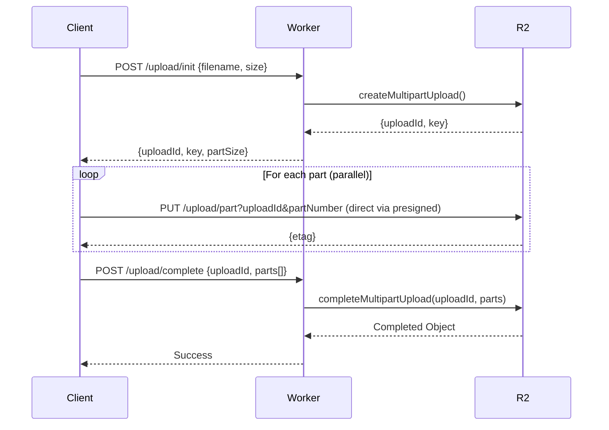

### 3.4 Queues — Delivery Semantics Theory

**Cloudflare Queues: At-Least-Once Delivery with Consumer-Controlled Acknowledgment**

```mermaid
graph TD
    subgraph "Producer"
        P1[queue.send(msg)] --> P2[Persisted to Queue<br/>(Durable, Replicated)]
    end
    
    subgraph "Consumer (Pull-Based)"
        C1[Consumer Polls] --> C2[Batch Delivered]
        C2 --> C3[Process Messages]
        C3 --> C4{Success?}
        C4 -->|Yes| C5[message.ack()]
        C4 -->|No| C6[message.retry()]
        C5 --> C7[Offset Advanced]
        C6 --> C8[Backoff + Redeliver]
    end
    
    subgraph "Exactly-Once Pattern"
        E1[Process] --> E2[Idempotency Check<br/>KV/DB]
        E2 -->|New| E3[Apply + Record ID]
        E2 -->|Duplicate| E4[Ack Only]
        E3 --> E5[message.ack()]
        E4 --> E5
    end
```

**Delivery Guarantees:**

| Scenario | Behavior |
|----------|----------|
| Consumer crashes before ack | Message redelivered (at-least-once) |
| Consumer acks, then crashes | Message not redelivered |
| Queue infrastructure failure | Messages persisted, redelivered on recovery |
| Max retries exceeded | Message sent to Dead Letter Queue |
| Idempotency key provided | Duplicate sends deduplicated at producer |

---

## 4. Durable Objects — Advanced Theory

### 4.1 Consistency Model

**Durable Objects Provide Strong Consistency Per Identity**

```mermaid
graph TB
    subgraph "Global Uniqueness"
        G1[DO ID: "counter:tenant-123"]
        G2[Exactly ONE instance worldwide]
        G3[All requests route to same instance]
    end
    
    subgraph "Strong Consistency"
        S1[Write → Storage (synchronous)]
        S2[Read → Storage (synchronous)]
        S3[Linearizable: reads see latest write]
    end
    
    subgraph "Concurrency Control"
        C1[Single-threaded execution per DO]
        C2[No race conditions within DO]
        C3[Transactions via storage.transaction()]
    end
    
    G1 --> G2 --> G3
    G2 --> S1 & S2 & S3
    G2 --> C1 & C2 & C3
```

**Why This Matters**: Unlike KV (eventual) or external databases (network latency), DOs give you **single-threaded, strongly-consistent state** with **sub-millisecond** storage access.

### 4.2 State Machine Pattern — Formal Theory

**Finite State Machine (FSM) Implementation in DOs**

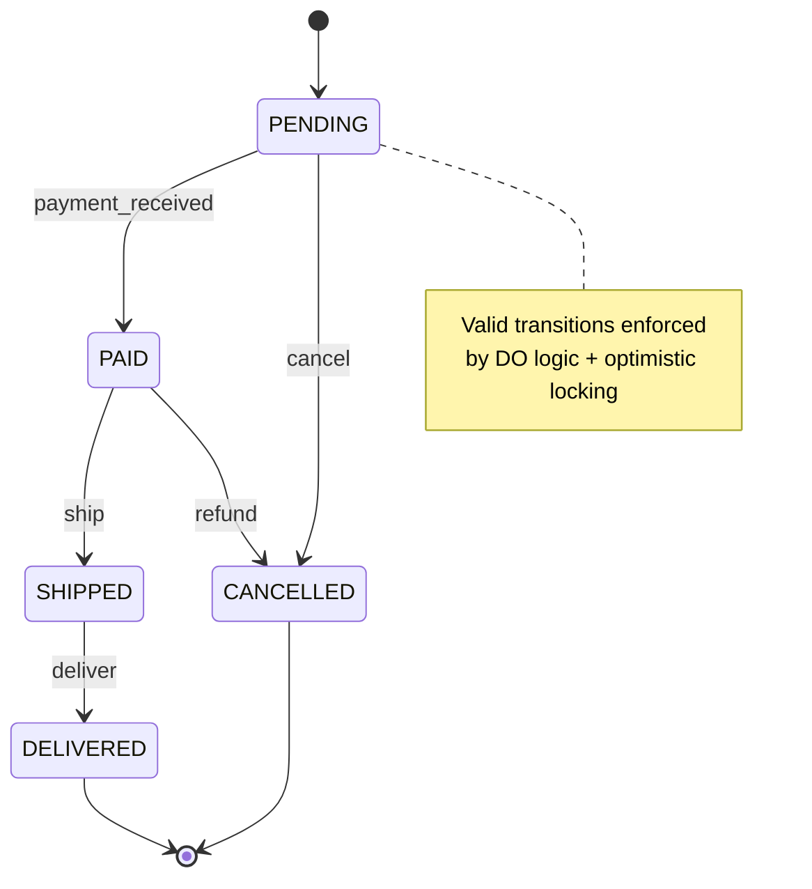

**Optimistic Locking with Version Vectors:**

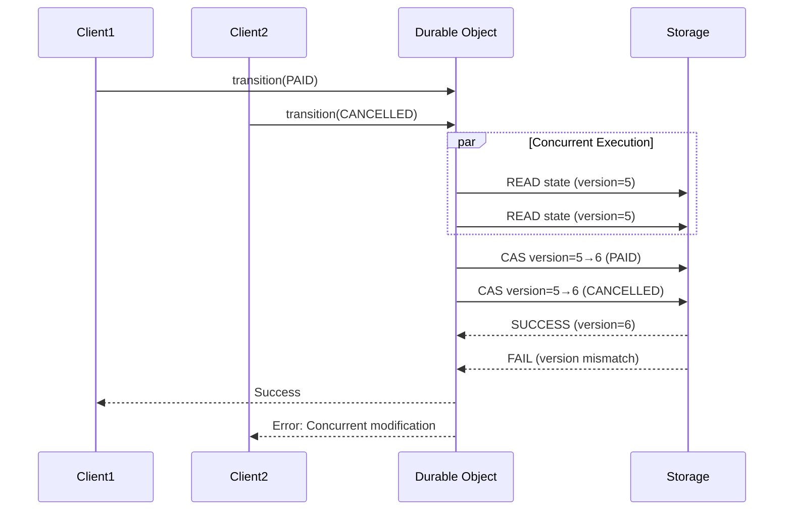

### 4.3 Alarm API — Distributed Timer Theory

**Alarms = Reliable, Persistent Timers Bound to DO Lifetime**

```mermaid
graph TD
    subgraph "Alarm Guarantees"
        A1[Survives DO eviction/restart]
        A2[Fires at-most-once (best effort)]
        A3[Precision: ~1 second]
        A4[Can wake hibernated DO]
    end
    
    subgraph "Use Cases"
        U1[Scheduled reminders]
        U2[Cleanup expired sessions]
        U3[Periodic aggregation]
        U4[Timeout enforcement]
    end
    
    A1 --> U1 & U2 & U3 & U4
    A2 --> U1 & U2 & U3 & U4
    A3 --> U1 & U2 & U3 & U4
    A4 --> U1 & U2 & U3 & U4
```

---

## 5. Performance Optimization — Theoretical Foundation

### 5.1 Cold Start Theory

**Cold Start Components:**

```mermaid
graph LR
    subgraph "Cold Start Timeline"
        CS1[Isolate Creation<br/>~0-2ms]
        CS2[Module Compilation<br/>~1-5ms]
        CS3[Top-Level Code<br/>~0-10ms]
        CS4[First Request Handler<br/>~1-3ms]
    end
    
    subgraph "Optimization Targets"
        OT1[Minimize top-level await]
        OT2[Lazy initialization]
        OT3[Code splitting]
        OT4[Pre-warming]
    end
    
    CS1 --> OT1
    CS2 --> OT3
    CS3 --> OT2
    CS4 --> OT4
```

**V8 Compilation Pipeline:**

```mermaid
graph TD
    Source[TypeScript Source] --> TSC[tsc: TypeScript → JS]
    TSC --> Bundle[Rollup/esbuild: Bundle]
    Bundle --> Minify[Minify]
    Minify --> Deploy[Deploy to Edge]
    Deploy --> Parse[V8 Parse]
    Parse --> Compile[V8 Ignition: Bytecode]
    Compile --> Optimize[V8 TurboFan: Optimized Machine Code]
    
    Note1[First execution: Ignition interpreter]
    Note2[Hot functions: TurboFan JIT]
    Note3[Code cached in isolate]
    
    Parse --> Note1
    Compile --> Note2
    Optimize --> Note3
```

### 5.2 Memory Management Theory

**V8 Heap Structure in Workers:**

```mermaid
graph TB
    subgraph "V8 Heap (128MB Limit)"
        Young[Young Generation<br/>~1-16MB<br/>Frequent GC]
        Old[Old Generation<br/>~100MB<br/>Infrequent GC]
        Large[Large Object Space<br/>>1MB objects]
        Code[Code Space<br/>JIT Compiled Code]
        Map[Map Space<br/>Hidden Classes]
    end
    
    subgraph "GC Types"
        Scavenge[Scavenge GC<br/>Young Gen<br/>~1ms]
        MarkCompact[Mark-Compact GC<br/>Old Gen<br/>~10-50ms]
        Incremental[Incremental Marking<br/>Background]
    end
    
    Young -->|Promotion| Old
    Large -.-> Old
    Scavenge --> Young
    MarkCompact --> Old
    Incremental --> Old
```

**LRU Cache Eviction Policy Visualization:**

```mermaid
graph LR
    subgraph "LRU Cache (Max 3)"
        A[Access: A] --> B[Cache: A]
        B --> C[Access: B] --> D[Cache: A, B]
        D --> E[Access: C] --> F[Cache: A, B, C]
        F --> G[Access: D] --> H[Evict A<br/>Cache: B, C, D]
        H --> I[Access: B] --> J[Cache: C, D, B<br/>B moved to MRU]
    end
```

### 5.3 CPU Optimization Theory

**Parallel vs Sequential Subrequests:**

```mermaid
graph TD
    subgraph "Sequential (Bad)"
        S1[fetch A: 200ms] --> S2[fetch B: 150ms]
        S2 --> S3[fetch C: 100ms]
        S3 --> S4[Total: 450ms wall<br/>~5ms CPU]
    end
    
    subgraph "Parallel (Good)"
        P1[fetch A: 200ms]
        P2[fetch B: 150ms]
        P3[fetch C: 100ms]
        P1 & P2 & P3 --> P4[Total: 200ms wall<br/>~5ms CPU]
    end
    
    subgraph "CPU Impact"
        C1[Same CPU time]
        C2[3x better latency]
        C3[Better user experience]
    end
```

---

## 6. Debugging & Testing — Theory

### 6.1 Miniflare Architecture

**Miniflare = Local Workers Runtime Simulation**

```mermaid
graph TB
    subgraph "Production"
        P1[Cloudflare Edge] --> P2[Workers Runtime]
        P2 --> P3[KV/D1/R2/DO/Queues]
    end
    
    subgraph "Miniflare (Local)"
        M1[Node.js Process] --> M2[Workers Runtime<br/>(workerd)]
        M2 --> M3[In-Memory KV]
        M2 --> M4[SQLite (D1)]
        M2 --> M5[File System (R2)]
        M2 --> M6[In-Memory DO]
        M2 --> M7[In-Memory Queues]
    end
    
    P1 -.->|API Compatible| M1
    P3 -.->|Behavior Compatible| M3 & M4 & M5 & M6 & M7
```

### 6.2 Testing Pyramid for Workers

```mermaid
graph TD
    subgraph "Unit Tests (Fast, Isolated)"
        U1[Pure Functions]
        U2[Middleware Logic]
        U3[Validation]
        U4[Transformers]
    end
    
    subgraph "Integration Tests (Miniflare)"
        I1[Route Handlers]
        I2[KV/D1 Operations]
        I3[DO Interactions]
        I4[Queue Consumers]
    end
    
    subgraph "E2E Tests (Remote)"
        E1[Full Request Flow]
        E2[Auth + Rate Limit]
        E3[Upstream Integration]
    end
    
    U1 & U2 & U3 & U4 --> I1 & I2 & I3 & I4
    I1 & I2 & I3 & I4 --> E1 & E2 & E3
```

---

## 7. Security Hardening — Theory

### 7.1 Defense in Depth at Edge

```mermaid
graph TB
    subgraph "Layer 1: Network (Cloudflare)"
        L1[DDoS Protection]
        L2[WAF Managed Rules]
        L3[Bot Management]
        L4[Rate Limiting (IP)]
    end
    
    subgraph "Layer 2: Worker Code"
        L5[Input Validation (Zod)]
        L6[Authentication (JWT)]
        L7[Authorization (RBAC)]
        L8[Rate Limiting (User/Tenant)]
    end
    
    subgraph "Layer 3: Application"
        L9[Business Logic Checks]
        L10[Tenant Isolation]
        L11[Data Encryption]
        L12[Audit Logging]
    end
    
    subgraph "Layer 4: Infrastructure"
        L13[Secrets Management]
        L14[mTLS to Origins]
        L15[Network Policies]
        L16[Immutable Deploys]
    end
    
    L1 & L2 & L3 & L4 --> L5 & L6 & L7 & L8
    L5 & L6 & L7 & L8 --> L9 & L10 & L11 & L12
    L9 & L10 & L11 & L12 --> L13 & L14 & L15 & L16
```

### 7.2 CSP Theory — Content Security Policy

**CSP Directives Explained:**

```mermaid
graph TD
    CSP[Content-Security-Policy] --> D1[default-src: Fallback]
    CSP --> D2[script-src: JS Sources]
    CSP --> D3[style-src: CSS Sources]
    CSP --> D4[img-src: Image Sources]
    CSP --> D5[font-src: Font Sources]
    CSP --> D6[connect-src: Fetch/WebSocket]
    CSP --> D7[frame-ancestors: Embedding]
    CSP --> D8[base-uri: Base Tag]
    CSP --> D9[form-action: Form Submit]
    CSP --> D10[object-src: Plugins]
    
    D2 --> S1['self' = Same Origin]
    D2 --> S2['wasm-unsafe-eval' = WASM]
    D2 --> S3[Nonce/Hash = Inline Scripts]
    
    D6 --> C1[API Origins]
    D6 --> C2[WebSocket Origins]
```

---

## 8. Migration Theory — Strangler Fig Pattern

### 8.1 Incremental Migration Strategy

**Strangler Fig Pattern Applied to Edge Migration:**

```mermaid
graph TD
    subgraph "Phase 0: Current"
        C1[Client] --> C2[Envoy Gateway]
        C2 --> C3[Next.js BFF]
        C3 --> C4[Go Services]
    end
    
    subgraph "Phase 1: Edge Auth"
        P1[Client] --> P2[Worker: Auth/RateLimit]
        P2 --> P3[Envoy Gateway]
        P3 --> P4[Next.js BFF]
        P4 --> P5[Go Services]
    end
    
    subgraph "Phase 2: Edge Cache"
        P21[Client] --> P22[Worker: Auth/RateLimit/Cache]
        P22 --> P23[Envoy Gateway]
        P23 --> P24[Next.js BFF]
        P24 --> P25[Go Services]
    end
    
    subgraph "Phase 3: Edge SSR"
        P31[Client] --> P32[Worker: Full SSR]
        P32 --> P33[Go Services (gRPC)]
    end
    
    subgraph "Phase 4: Complete"
        P41[Client] --> P42[Worker: All REST]
        P42 --> P43[Go Services (Internal gRPC)]
    end
```

---

## 9. Cost Theory — Economic Model

### 9.1 Cost Components Breakdown

```mermaid
pie title Monthly Cost Breakdown (10K MAU)
    "Workers Plan" : 5
    "Requests" : 1
    "CPU Time" : 0.72
    "KV Reads" : 2.5
    "KV Writes" : 1
    "KV Storage" : 0.1
    "D1 Reads" : 0.05
    "D1 Writes" : 2
    "D1 Storage" : 0.08
    "R2" : 1.5
    "Queues" : 0.2
    "Durable Objects" : 0.5
```

### 9.2 Cost vs Traditional Architecture

```mermaid
graph LR
    subgraph "Traditional (AWS)"
        T1[ALB: $25/mo]
        T2[ECS Fargate: $150/mo]
        T3[ElastiCache: $80/mo]
        T4[RDS: $100/mo]
        T5[CloudWatch: $20/mo]
        T6[Data Transfer: $50/mo]
        TTotal[Total: ~$425/mo]
    end
    
    subgraph "Workers"
        W1[Workers: $5/mo]
        W2[KV: $3.60/mo]
        W3[D1: $2.13/mo]
        W4[R2: $1.50/mo]
        W5[Queues: $0.20/mo]
        W6[DOs: $0.50/mo]
        WTotal[Total: ~$14.65/mo]
    end
    
    TTotal -.->|29x cheaper| WTotal
```

---

## 10. Operational Excellence — Theory

### 10.1 Observability Pillars

```mermaid
graph TB
    subgraph "Metrics (Prometheus/Grafana)"
        M1[RED Metrics<br/>Rate, Errors, Duration]
        M2[CPU Time Distribution]
        M3[Cache Hit Ratios]
        M4[Queue Lag]
        M5[DO Load Distribution]
    end
    
    subgraph "Logs (Loki/Cloudflare)"
        L1[Structured JSON]
        L2[Request/Response]
        L3[Error Stack Traces]
        L4[Audit Events]
    end
    
    subgraph "Traces (OpenTelemetry)"
        T1[Distributed Tracing]
        T2[Subrequest Spans]
        T3[Cross-Service Correlation]
    end
    
    subgraph "Alerts"
        A1[Error Rate > 1%]
        A2[P99 Latency > 5s]
        A3[CPU > 40ms avg]
        A4[Queue Lag > 1000]
    end
    
    M1 & M2 & M3 & M4 & M5 --> A1 & A2 & A3 & A4
    L1 & L2 & L3 & L4 --> A1 & A2 & A3 & A4
    T1 & T2 & T3 --> A1 & A2 & A3 & A4
```

### 10.2 Deployment Safety

```mermaid
graph LR
    subgraph "Progressive Delivery"
        D1[Canary: 1%]
        D2[Canary: 5%]
        D3[Canary: 25%]
        D4[Canary: 50%]
        D5[Full: 100%]
    end
    
    subgraph "Validation Gates"
        G1[Health Checks]
        G2[Error Rate]
        G3[Latency P99]
        G4[Business Metrics]
    end
    
    D1 --> G1 & G2 & G3 & G4 --> D2
    D2 --> G1 & G2 & G3 & G4 --> D3
    D3 --> G1 & G2 & G3 & G4 --> D4
    D4 --> G1 & G2 & G3 & G4 --> D5
```

---

## 11. EduPlatform-Specific Architecture

### 11.1 Request Flow for EduPlatform

```mermaid
sequenceDiagram
    participant Browser
    participant Worker as Cloudflare Worker
    participant KV as KV Cache
    participant GoCore as Core Service (gRPC)
    participant GoFees as Fees Service (gRPC)
    participant GoTT as Timetable Service
    participant Queue as Attendance Queue
    participant DO as TimetableSolver DO
    
    Browser->>Worker: GET /api/dashboard
    Worker->>Worker: Validate JWT (Zitadel JWKS)
    Worker->>KV: Check entitlements (60s TTL)
    Worker->>KV: Get cached timetable (versioned)
    par Parallel Data Fetch
        Worker->>GoCore: GetStudentContext
        Worker->>GoFees: GetFeeSummary
        Worker->>GoTT: GetTimetable
    end
    Worker-->>Browser: Aggregated Dashboard JSON
    
    Note over Browser,Worker: Attendance Punch Flow
    Browser->>Worker: POST /api/attendance/punch
    Worker->>Worker: Validate HMAC
    Worker->>Queue: Send punch event
    Queue->>DO: Process via consumer
    DO->>GoCore: Update attendance
```

### 11.2 Caching Strategy Matrix

```mermaid
graph TD
    subgraph "Cache Layer Assignment"
        C1[Timetable Published] -->|KV<br/>Write-through<br/>Immutable until republish| C2[Key: tt:{tenant}:{batch}:{div}:v{ver}]
        C3[Student Briefs] -->|KV<br/>24h TTL<br/>Event invalidation| C4[Key: stu:{tenant}:{id}]
        C5[Entitlements] -->|KV<br/>60s TTL<br/>Compacted topic| C6[Key: ent:{tenant}:{svc}:{feat}]
        C7[Fee Summaries] -->|KV<br/>10m TTL<br/>Event invalidation| C8[Key: fee:sum:{tenant}:{term}]
        C9[Dashboard Aggregates] -->|KV<br/>5m TTL<br/>TTL-only| C10[Key: dash:{tenant}:{scope}:{date}]
        C11[Session Store] -->|KV<br/>30m sliding<br/>Logout = DEL| C12[Key: session:{sid}]
        C13[Rate Limits] -->|KV<br/>Window TTL<br/>Atomic counters| C14[Key: rl:{principal}:{route}]
        C15[Idempotency] -->|KV<br/>48h TTL<br/>SETNX| C16[Key: idem:{svc}:{key}]
    end
```

---

## 12. Appendix: Mermaid Diagram Reference

### 12.1 Diagram Types Used

| Diagram Type | Purpose | Example Location |
|--------------|---------|------------------|
| `graph` | Architecture, flow, relationships | §1.1, §3.1, §4.1 |
| `sequenceDiagram` | Request/response flows | §1.2, §2.1, §2.3, §3.3 |
| `stateDiagram-v2` | State machines | §4.2 |
| `pie` | Cost breakdown | §9.1 |

### 12.2 Rendering in Obsidian

Mermaid diagrams render natively in Obsidian. Ensure:
1. Mermaid plugin is enabled (Core Plugin → Mermaid)
2. Code blocks use ```mermaid fence
3. For complex diagrams, use `mermaid` code blocks not ASCII

---

## 13. References & Further Reading

### Official Documentation
- [Workers Runtime API](https://developers.cloudflare.com/workers/runtime-apis/)
- [Wrangler Configuration](https://developers.cloudflare.com/workers/wrangler/configuration/)
- [KV API](https://developers.cloudflare.com/kv/api/)
- [D1 Worker API](https://developers.cloudflare.com/d1/worker-api/)
- [R2 Workers API](https://developers.cloudflare.com/r2/api/workers/)
- [Queues](https://developers.cloudflare.com/queues/)
- [Durable Objects](https://developers.cloudflare.com/durable-objects/)
- [Limits](https://developers.cloudflare.com/workers/platform/limits/)

### Theoretical Foundations
- [V8 Isolates Design](https://v8.dev/blog/fast-foreground)
- [Software Fault Isolation](https://en.wikipedia.org/wiki/Software_fault_isolation)
- [Eventual Consistency](https://www.allthingsdistributed.com/2008/12/eventually_consistent.html)
- [CAP Theorem](https://github.com/henryr/cap-theorem)
- [Strangler Fig Pattern](https://martinfowler.com/bliki/StranglerFigApplication.html)

### Advanced Topics
- [Workers AI](https://developers.cloudflare.com/workers-ai/) — ML inference at edge
- [Vectorize](https://developers.cloudflare.com/vectorize/) — Vector database
- [Hyperdrive](https://developers.cloudflare.com/hyperdrive/) — Accelerated database access
- [Workflows](https://developers.cloudflare.com/workflows/) — Multi-step orchestration (beta)

### Tools
- [Miniflare](https://github.com/cloudflare/miniflare) — Local simulator
- [Wrangler](https://github.com/cloudflare/wrangler) — CLI
- [@cloudflare/next-on-pages](https://github.com/cloudflare/next-on-pages) — Next.js on Workers

---

*Last updated: 2026-09-11. Part of `technologies/` vault folder. Cross-references: `EduPlatform-V1-Design.md` §2, §4, §6, §7, §13, §15.*